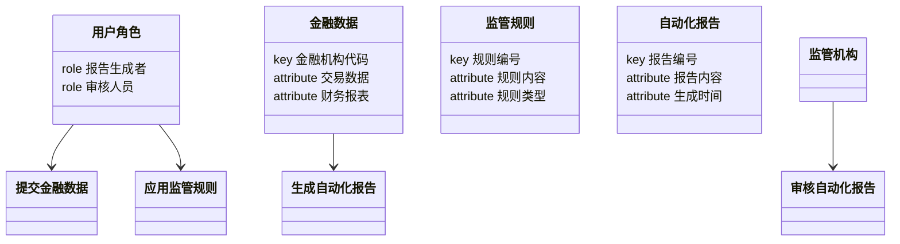
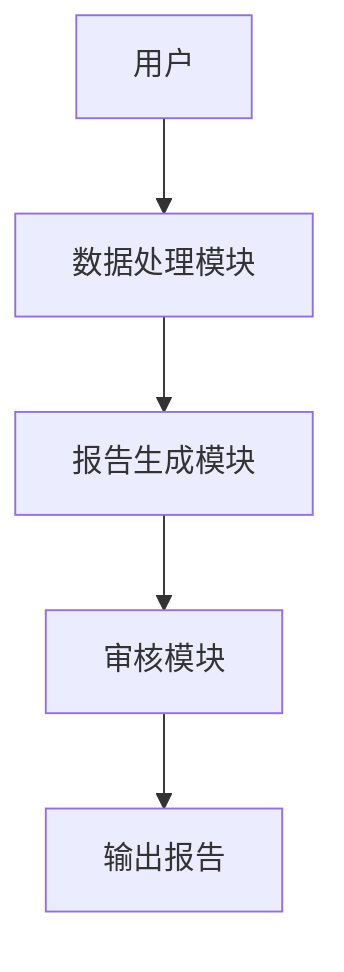
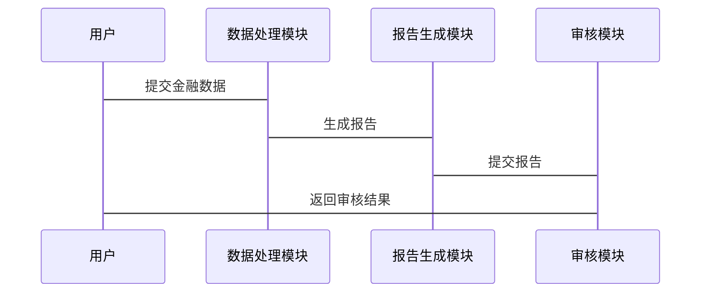

                 


```markdown
# 第3章: 自动化报告生成算法原理

## 3.1 自然语言处理（NLP）在报告生成中的应用

### 3.1.1 NLP的基本原理
自然语言处理是人工智能的一个分支，旨在让计算机能够理解、处理和生成人类语言。在金融监管报告生成中，NLP主要用于从结构化数据中提取信息并转化为自然语言描述。

#### 3.1.1.1 分词与实体识别
分词是将连续的文本分割成有意义的词语或短语的过程。在金融数据处理中，分词能够帮助我们识别出关键的交易信息、财务指标等。

实体识别（NER）则是从文本中识别出命名实体，如机构名称、交易类型、金额等。这些实体信息是生成监管报告的基础。

#### 3.1.1.2 语义理解
语义理解是基于上下文理解文本含义的阶段。在金融报告生成中，我们需要将结构化的数据转化为符合监管要求的自然语言描述。例如，将“某银行2023年第三季度的贷款业务增长了10%”转化为“本季度贷款业务增长显著，增幅达10%”。

### 3.1.2 机器学习在金融监管报告中的应用
机器学习通过训练模型来识别数据中的模式和特征，从而能够自动生成符合监管要求的报告内容。以下是机器学习在金融监管报告生成中的几个关键步骤：

#### 3.1.2.1 数据预处理
数据预处理是机器学习模型训练的关键步骤，包括数据清洗、特征提取和数据标准化等。例如，将非结构化的文本数据转化为可供模型处理的向量形式。

#### 3.1.2.2 模型训练
使用训练数据训练机器学习模型，使其能够理解金融数据的结构和内容。常用算法包括支持向量机（SVM）、随机森林（Random Forest）和深度学习模型（如LSTM）。

#### 3.1.2.3 模型优化
通过调整模型参数、选择合适的评估指标和进行交叉验证，优化模型的性能，确保生成的报告内容准确、符合监管要求。

## 3.2 自动化报告生成的数学模型

### 3.2.1 NLP模型
在NLP中，常用的模型包括词袋模型（Bag of Words）、TF-IDF和词嵌入模型（如Word2Vec、GloVe）。以下是词袋模型的基本公式：

$$
\text{词袋模型} = \{x_1, x_2, ..., x_n\}
$$

其中，\( x_i \) 表示第i个词的出现次数。

### 3.2.2 机器学习模型
在机器学习中，常用的支持向量机（SVM）模型如下：

$$
y = \text{sign}(\sum_{i=1}^{n} w_i x_i + b)
$$

其中，\( w_i \) 是权重，\( x_i \) 是输入特征，\( b \) 是偏置项。

## 3.3 算法实现流程

### 3.3.1 数据预处理
```python
import pandas as pd
from sklearn.feature_extraction.text import TfidfVectorizer

# 加载数据
data = pd.read_csv('financial_data.csv')

# 文本分词
from nltk.tokenize import word_tokenize
data['tokenized'] = data['content'].apply(lambda x: word_tokenize(x))

# 实体识别
from spacy.lang.zh import Chinese
nlp = Chinese()
data['entities'] = data['content'].apply(lambda x: [(ent.text, ent.label_) for ent in nlp(x).ents])
```

### 3.3.2 模型训练与优化
```python
from sklearn.model_selection import train_test_split
from sklearn.svm import SVC

# 划分训练集和测试集
X_train, X_test, y_train, y_test = train_test_split(data['tfidf'], data['label'], test_size=0.2)

# 训练SVM模型
model = SVC()
model.fit(X_train, y_train)

# 模型评估
print("Accuracy:", model.score(X_test, y_test))
```

## 3.4 本章小结

# 第4章: 系统架构设计

## 4.1 系统功能设计

### 4.1.1 领域模型设计
领域模型是系统功能实现的基础，以下是领域模型的类图：



### 4.1.2 系统架构设计
系统架构设计是整个系统的核心，以下是系统架构图：



## 4.2 系统接口设计

### 4.2.1 系统接口
系统接口是模块之间的通信桥梁，以下是主要接口：

- 数据处理模块接口：接收金融数据，返回结构化数据
- 报告生成模块接口：接收结构化数据，返回自然语言报告
- 审核模块接口：接收报告内容，返回审核结果

### 4.2.2 系统交互流程
以下是系统交互流程图：



## 4.3 本章小结

# 第5章: 项目实战

## 5.1 环境配置

### 5.1.1 技术选型
- 编程语言：Python
- 框架：Django或Flask
- 数据库：MySQL或MongoDB
- NLP库：spaCy或NLTK
- 机器学习库：scikit-learn或TensorFlow

### 5.1.2 安装依赖
```bash
pip install python-mysql
pip install spacy
pip install scikit-learn
```

## 5.2 核心实现

### 5.2.1 数据处理模块实现
```python
import pymysql

# 数据库连接
db = pymysql.connect(host='localhost', user='root', password='password', db='financial_db')
cursor = db.cursor()

# 查询数据
cursor.execute("SELECT * FROM financial_data")
data = cursor.fetchall()

# 数据预处理
from spacy.lang.zh import Chinese
nlp = Chinese()
processed_data = []
for row in data:
    content = row[1]
    doc = nlp(content)
    processed_data.append([(ent.text, ent.label_) for ent in doc.ents])
```

### 5.2.2 报告生成模块实现
```python
from sklearn.feature_extraction.text import TfidfVectorizer
from sklearn.svm import SVC

# 特征提取
vectorizer = TfidfVectorizer()
X = vectorizer.fit_transform([row[2] for row in processed_data])

# 模型训练
model = SVC()
model.fit(X, [row[3] for row in processed_data])

# 生成报告
def generate_report(data_point):
    X_new = vectorizer.transform([data_point])
    prediction = model.predict(X_new)
    return "报告生成成功，预测结果为：" + prediction[0]
```

### 5.2.3 审核模块实现
```python
from datetime import datetime

# 审核流程
def review_report(report):
    timestamp = datetime.now().strftime("%Y-%m-%d %H:%M:%S")
    return f"报告编号：{timestamp}\n审核结果：成功"
```

## 5.3 案例分析

### 5.3.1 数据来源与处理
假设我们有一个金融机构的交易数据，如下所示：

| 交易日期 | 交易金额 | 交易类型 |
|----------|----------|----------|
| 2023-01-01 | 100000 | 贷款发放 |
| 2023-01-02 | 50000 | 投资支出 |

### 5.3.2 报告生成
根据上述数据，系统生成如下监管报告：

**报告内容：**
- 2023年1月1日，发放贷款100,000元。
- 2023年1月2日，投资支出50,000元。

### 5.3.3 审核结果
审核模块对生成的报告进行检查，确认内容无误后，返回审核通过的结果。

## 5.4 本章小结

# 第6章: 系统优化与扩展

## 6.1 性能优化

### 6.1.1 数据处理优化
- 使用分布式计算框架（如Spark）处理大规模数据
- 优化数据库查询性能，减少I/O时间

### 6.1.2 模型优化
- 使用更复杂的深度学习模型（如BERT）提高生成报告的准确性
- 调整模型超参数，提高分类准确率

## 6.2 功能扩展

### 6.2.1 多语言支持
- 支持多种语言的报告生成，满足国际化需求
- 使用多语言NLP库（如langdetect）实现语言识别

### 6.2.2 实时监控
- 实现实时数据处理和报告生成，满足监管机构的实时监控需求
- 使用流处理框架（如Kafka）实现实时数据处理

## 6.3 本章小结

# 第7章: 扩展与展望

## 7.1 未来研究方向

### 7.1.1 新技术应用
- 探索生成式AI（如GPT）在金融报告生成中的应用
- 研究大语言模型（如PaLM）在金融监管中的潜力

### 7.1.2 系统优化
- 深入研究分布式系统架构，提升系统扩展性
- 探索边缘计算在金融监管中的应用

## 7.2 本章小结

# 参考文献

1. 《机器学习实战》
2. 《自然语言处理入门》
3. 《金融监管框架与实践》
4. 《Python数据处理与分析》

# 作者

作者：AI天才研究院/AI Genius Institute & 禅与计算机程序设计艺术 /Zen And The Art of Computer Programming
```

