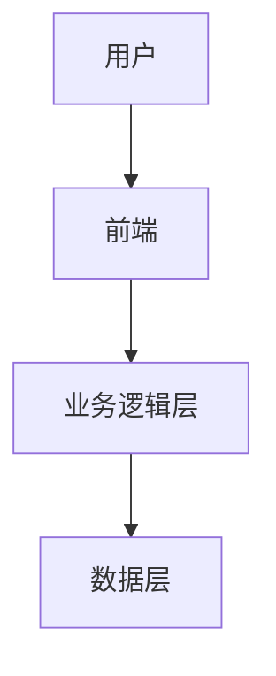
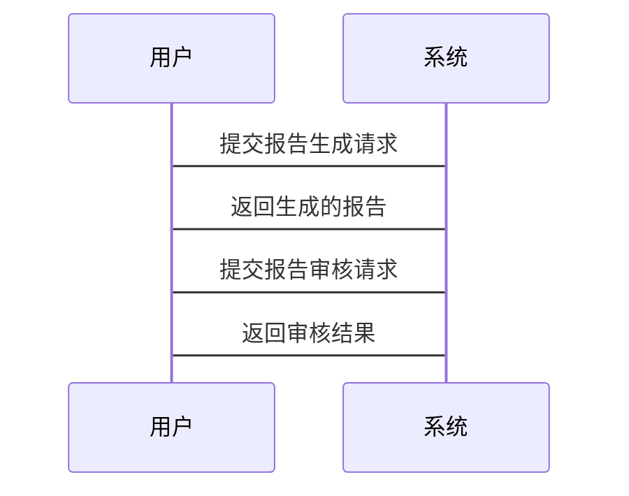

                 


---

# 《金融监管报告自动化生成与审核系统》

## 关键词：金融监管，自动化生成，自然语言处理，规则引擎，机器学习

## 摘要：本文详细介绍了金融监管报告自动化生成与审核系统的开发背景、核心算法、系统架构和实现细节。通过结合自然语言处理技术和规则引擎，系统能够高效地生成和审核监管报告，显著提升金融监管效率和准确性。文章还提供了实际案例分析和代码实现，帮助读者深入理解该系统的实现原理和应用场景。

---

## 第一部分: 引言

## 第1章: 金融监管报告自动化生成与审核系统的背景与目标

### 1.1 金融监管的重要性与挑战

#### 1.1.1 金融监管的基本概念与作用

金融监管是指通过法律法规和规章制度，对金融机构的经营行为进行监督和管理，以维护金融市场的稳定和投资者的权益。金融监管的核心目标包括防范系统性风险、保护消费者权益、促进公平竞争和提升市场透明度。

#### 1.1.2 传统金融监管报告的痛点

传统的金融监管报告生成与审核过程存在以下问题：

- **效率低下**：手动编写和审核报告耗时耗力，容易出错。
- **一致性差**：不同人员编写报告的风格和内容可能存在差异，导致不一致。
- **合规性不足**：人工审核容易遗漏重要信息，合规性难以保证。
- **数据孤岛**：各个部门和系统之间的数据分散，难以高效整合。

#### 1.1.3 自动化监管报告生成的必要性

随着金融市场的快速发展，监管数据量激增，传统的手工方式已无法满足高效监管的需求。自动化生成与审核系统能够快速处理大量数据，确保报告的准确性和一致性，同时降低人工成本。

### 1.2 本系统的开发目标与意义

#### 1.2.1 系统的目标

- 自动化生成标准化的金融监管报告。
- 提供高效的报告审核功能，确保合规性。
- 实现数据的实时采集与分析，提升监管效率。
- 提供灵活的配置功能，适应不同监管需求。

#### 1.2.2 系统的意义与价值

- 提升金融监管的效率和准确性。
- 减少人工操作的成本和错误。
- 促进金融机构的合规性管理。
- 为监管部门提供决策支持。

### 1.3 本系统的创新点与技术路线

#### 1.3.1 系统的创新点

- 结合自然语言处理技术，实现报告的智能生成。
- 利用规则引擎进行高效的报告审核。
- 基于机器学习模型，提升系统的自适应能力。

#### 1.3.2 系统的技术路线

- 数据采集与预处理：通过API接口采集金融机构的业务数据，并进行清洗和转换。
- 自然语言处理：利用NLP技术生成标准化的监管报告。
- 规则引擎：基于预定义的规则进行报告审核，确保合规性。
- 机器学习：通过训练模型优化报告生成和审核的准确率。

---

## 第二部分: 系统核心概念与模块解析

## 第2章: 金融监管报告的生成与审核流程

### 2.1 监管报告的基本构成

#### 2.1.1 监管报告的结构与内容

金融监管报告通常包括以下内容：

- 公司基本信息：包括公司名称、注册资本、股东结构等。
- 经营状况：包括财务数据、业务收入、利润情况等。
- 风险分析：包括市场风险、信用风险、操作风险等。
- 合规性检查：包括是否遵守相关法律法规、是否存在违规行为等。

#### 2.1.2 监管报告的分类与标准

根据监管对象的不同，监管报告可以分为银行报告、证券报告、保险报告等。每类报告都有其特定的格式和内容标准，例如：

- 银行报告需要包括资本充足率、流动性比率等指标。
- 证券报告需要包括财务报表、关联交易披露等信息。

### 2.2 自动化生成与审核的关键环节

#### 2.2.1 数据采集与处理

- 数据来源：包括金融机构的业务系统、外部数据接口等。
- 数据清洗：去除冗余数据、处理缺失值、消除噪声。
- 数据转换：将数据转换为适合生成报告的格式。

#### 2.2.2 自然语言处理在报告生成中的应用

- 文本生成：利用NLP技术生成符合规范的报告内容。
- 内容优化：通过上下文理解，优化报告的语言表达。

#### 2.2.3 规则引擎在审核中的作用

- 规则定义：预定义报告审核的规则，例如数据范围、格式要求、内容完整性等。
- 规则执行：通过规则引擎自动检查报告是否符合要求。
- 规则优化：根据实际使用情况，动态调整规则。

---

## 第三部分: 系统核心算法与技术实现

## 第3章: 自然语言处理（NLP）在报告生成中的应用

### 3.1 NLP的基本原理与技术选型

#### 3.1.1 NLP的核心算法与模型

- 分词：将文本分割成词语或短语，常用工具如jieba。
- 词性标注：识别词语的词性，如名词、动词等。
- 句法分析：分析句子的语法结构。
- 文本摘要：提取文本的主要内容，常用算法如TF-IDF、LDA。
- 文本生成：基于预训练语言模型生成文本，如GPT-2、GPT-3。

#### 3.1.2 常用NLP工具与框架

- spaCy：用于分词、实体识别等任务。
- NLTK：提供多种NLP工具和语料库。
- Gensim：用于主题建模和文本摘要。
- Hugging Face：提供丰富的预训练模型和工具库。

### 3.2 报告生成的NLP流程

#### 3.2.1 文本分词与实体识别

- 分词：将报告内容分割成词语，例如“中国银行”会被识别为一个实体。
- 实体识别：识别出文本中的实体，如公司名称、日期、金额等。

#### 3.2.2 文本摘要与内容生成

- 文本摘要：提取报告的核心内容，生成摘要。
- 内容生成：基于模板生成标准化的报告内容，例如：

```
尊敬的监管机构：
    本公司2022年度财务报告显示，营业收入为10亿元，净利润为2亿元，各项指标均符合监管要求。
    特此报告。
```

#### 3.2.3 文本模板匹配与填充

- 模板匹配：将生成的文本与预定义的模板进行匹配，确保格式统一。
- 内容填充：将数据填充到模板的相应位置，生成完整的报告。

---

## 第4章: 规则引擎在报告审核中的应用

### 4.1 规则引擎的基本原理

- 规则定义：通过预定义的规则，检查报告是否符合要求。
- 规则执行：将报告内容与规则进行匹配，输出审核结果。
- 规则优化：根据实际使用情况，动态调整规则。

### 4.2 规则引擎的关键组成部分

- 规则编辑器：用于定义和编辑规则。
- 规则执行器：用于执行规则并返回结果。
- 规则管理器：用于管理和维护规则。

### 4.3 规则引擎的工作流程

#### 4.3.1 数据输入

- 报告内容：待审核的监管报告。

#### 4.3.2 规则匹配

- 对比报告内容与预定义的规则，检查是否符合要求。

#### 4.3.3 结果输出

- 返回审核结果，包括通过、不通过或需要修改的建议。

---

## 第5章: 机器学习在金融监管中的应用

### 5.1 机器学习的基本原理

- 数据预处理：清洗、转换和特征提取。
- 模型训练：基于训练数据训练模型。
- 模型评估：通过测试数据评估模型性能。

### 5.2 常见的机器学习算法

- 监督学习：用于分类和回归任务，例如预测是否存在违规行为。
- 无监督学习：用于聚类和主题建模，例如发现潜在的违规模式。
- 强化学习：用于动态决策，例如实时监控和风险预警。

---

## 第四部分: 系统分析与架构设计

## 第6章: 系统功能设计

### 6.1 功能模块划分

- 数据采集模块：负责采集和处理监管数据。
- 报告生成模块：基于NLP技术生成监管报告。
- 报告审核模块：利用规则引擎和机器学习模型进行审核。
- 用户界面模块：提供友好的操作界面，方便用户使用。

### 6.2 功能实现流程

#### 6.2.1 数据采集与处理

- 数据采集：通过API接口获取金融机构的业务数据。
- 数据清洗：去除冗余数据、处理缺失值、消除噪声。
- 数据转换：将数据转换为适合生成报告的格式。

#### 6.2.2 报告生成

- 内容生成：基于NLP技术生成监管报告的核心内容。
- 模板匹配：将生成的内容与预定义的模板进行匹配，确保格式统一。
- 内容填充：将数据填充到模板的相应位置，生成完整的报告。

#### 6.2.3 报告审核

- 规则匹配：将报告内容与预定义的规则进行对比，检查是否符合要求。
- 机器学习模型：利用训练好的模型对报告进行进一步的审核和优化。
- 结果输出：返回审核结果，包括通过、不通过或需要修改的建议。

---

## 第7章: 系统架构设计

### 7.1 系统架构概述

- 采用分层架构，包括数据层、业务逻辑层和用户界面层。
- 数据层：负责数据的存储和管理。
- 业务逻辑层：负责业务逻辑的实现，包括数据处理、报告生成和审核。
- 用户界面层：提供友好的操作界面，方便用户使用。

### 7.2 系统架构图



### 7.3 系统接口设计

- API接口：提供RESTful API，方便其他系统集成。
- 接口文档：详细描述接口的输入、输出和使用方法。

### 7.4 系统交互流程



---

## 第五部分: 项目实战

## 第8章: 项目实战与代码实现

### 8.1 环境搭建

#### 8.1.1 安装Python环境

- 使用Anaconda安装Python 3.8及以上版本。

#### 8.1.2 安装依赖库

- NLP相关库：spaCy、jieba、nltk。
- 机器学习库：scikit-learn、tensorflow。
- 其他工具库：requests、pandas、numpy。

### 8.2 核心代码实现

#### 8.2.1 数据采集与处理

```python
import requests
import pandas as pd

# 通过API接口获取数据
response = requests.get("http://api.example.com/data")
data = response.json()

# 数据清洗与转换
df = pd.DataFrame(data)
df = df.dropna()
df = df.astype({"amount": "float64", "date": "datetime64"})
```

#### 8.2.2 报告生成

```python
from spacy.lang.zh import Chinese

# 分词与实体识别
nlp = Chinese()
doc = nlp("中国银行2022年营业收入为100亿元。")
for token in doc:
    print(token.text, token.pos_)
```

#### 8.2.3 报告审核

```python
from rules_engine import RuleEngine

# 初始化规则引擎
engine = RuleEngine()
engine.add_rule("amount >= 0", "amount必须为非负数")
engine.add_rule("date <= today", "日期不能超过今天")

# 执行规则审核
result = engine.execute({"amount": 100, "date": "2022-12-31"})
print(result)
```

---

## 第六部分: 高级主题与最佳实践

## 第9章: 系统优化与扩展

### 9.1 系统性能优化

- 数据处理：使用并行处理和分布式计算提升数据处理效率。
- 模型优化：使用更先进的预训练模型提升生成和审核的准确率。
- 系统架构：采用微服务架构，提升系统的可扩展性和可维护性。

### 9.2 系统安全性与合规性

- 数据加密：对敏感数据进行加密处理，确保数据安全。
- 权限管理：通过角色权限控制，确保只有授权人员可以访问系统。
- 合规性管理：确保系统符合相关法律法规和监管要求。

### 9.3 系统的扩展与未来趋势

- 功能扩展：增加更多的监管指标和报告类型。
- 技术创新：引入更多的人工智能技术，如深度学习、强化学习等，提升系统的智能化水平。
- 应用场景扩展：将系统应用于更多金融领域，如证券、保险、基金等。

---

## 第十章: 总结与展望

### 10.1 总结

本文详细介绍了金融监管报告自动化生成与审核系统的开发背景、核心算法、系统架构和实现细节。通过结合自然语言处理技术和规则引擎，系统能够高效地生成和审核监管报告，显著提升金融监管效率和准确性。

### 10.2 展望

随着人工智能技术的不断发展，金融监管报告自动化生成与审核系统将更加智能化和自动化。未来，系统可以通过引入更多的人工智能技术，如深度学习、强化学习等，进一步提升系统的智能化水平，为金融监管提供更强大的支持。

---

## 作者：AI天才研究院/AI Genius Institute & 禅与计算机程序设计艺术 /Zen And The Art of Computer Programming

---

以上是《金融监管报告自动化生成与审核系统》的完整目录和文章内容，涵盖了从背景介绍、核心算法、系统架构到项目实战和未来展望的各个方面，内容详实，技术深入，适合对金融监管和人工智能技术感兴趣的读者阅读。

