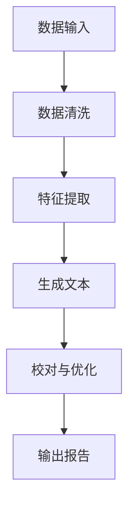

                 


# 《金融监管报告自动化生成工具》

**关键词**：金融监管、自动化生成工具、自然语言处理、机器学习、系统架构设计、API接口设计

**摘要**：  
随着金融行业的快速发展，监管需求日益复杂，传统的人工监管报告生成方式效率低下且容易出错。本文将介绍一种基于人工智能和自然语言处理技术的金融监管报告自动化生成工具。通过分析金融监管报告的特点，结合先进的算法和技术，提出了一种高效的自动化生成方案，并详细探讨了其实现原理、系统架构设计和实际应用案例。本文旨在为金融行业提供一种创新的监管解决方案，提高监管效率和准确性。

---

# 1. 金融监管报告的背景与挑战

## 1.1 金融监管的重要性  
金融监管是维护金融市场稳定、保护投资者利益的重要手段。传统的金融监管依赖人工审查和数据分析，效率较低且容易受到主观因素的影响。随着金融市场的复杂化和数据量的爆炸式增长，传统的监管方式已难以满足现代金融监管的需求。

## 1.2 传统金融监管报告的痛点  
1. **数据处理复杂**：金融数据来源多样，格式不一，人工整理耗时耗力。  
2. **报告生成效率低**：监管报告需要遵循严格的格式和内容要求，人工编写容易出错且效率低下。  
3. **实时性不足**：传统报告生成方式无法满足实时监管的需求，往往滞后于市场变化。  

## 1.3 自动化生成工具的必要性  
通过引入自动化技术，可以显著提高金融监管的效率和准确性。自动化生成工具能够快速处理大量数据，按照预设规则生成标准化的监管报告，同时支持实时监控和动态更新。

---

# 2. 金融监管报告自动化生成工具的核心概念

## 2.1 金融监管报告的特点  
1. **结构化**：监管报告通常遵循固定的格式，包括多个标准化的模块。  
2. **数据驱动**：报告内容依赖于大量的金融数据，如交易记录、财务报表等。  
3. **实时性**：监管报告需要反映最新的市场动态，支持实时更新。  

## 2.2 自动化生成工具的工作原理  
1. **数据采集**：从多种数据源（如交易系统、财务系统）获取金融数据。  
2. **数据清洗与处理**：对采集到的数据进行清洗、转换和标准化处理。  
3. **内容生成**：基于预设的规则和模板，自动生成监管报告。  
4. **审核与校对**：对生成的报告进行语法和逻辑校对，确保准确性。  

## 2.3 关键技术对比  
下表对比了传统报告生成方式与自动化生成工具的核心差异：

| **特性**         | **传统方式**             | **自动化生成工具**        |  
|------------------|--------------------------|---------------------------|  
| **效率**         | 低，依赖人工操作          | 高，自动化处理            |  
| **准确性**       | 易出错，依赖人工判断      | 准确率高，基于规则和算法  |  
| **实时性**       | 低，周期长                | 高，支持实时更新          |  

---

# 3. 自动化生成工具的算法与数学模型

## 3.1 自然语言处理模型  
自然语言处理（NLP）是生成监管报告的关键技术之一。常用的模型包括基于规则的生成和基于深度学习的生成。

### 3.1.1 基于规则的生成  
基于规则的生成方式通过预设模板和规则来生成报告内容。其优点是简单易实现，但灵活性较差。  

### 3.1.2 基于深度学习的生成  
基于深度学习的生成方式利用神经网络模型（如Transformer）生成自然流畅的文本。其优点是灵活性高，但需要大量的训练数据和计算资源。  

## 3.2 算法流程图  
以下为基于深度学习的报告生成算法流程图：



## 3.3 数学模型  
以下为Transformer模型的核心公式：

$$
\text{Attention}(Q, K, V) = \text{softmax}\left(\frac{QK^T}{\sqrt{d_k}}\right)V
$$

其中，$Q$、$K$、$V$分别为查询、键、值向量，$d_k$为键的维度。

---

# 4. 系统分析与架构设计

## 4.1 系统功能设计  
金融监管报告生成系统主要包括以下几个功能模块：  
1. **数据采集模块**：从多种数据源获取金融数据。  
2. **数据处理模块**：清洗、转换和标准化数据。  
3. **报告生成模块**：基于模板生成监管报告。  
4. **校对模块**：对生成的报告进行语法和逻辑校对。  

## 4.2 系统架构设计  
以下为系统的整体架构图：


## 4.3 系统接口设计  
系统提供以下接口：  
1. **数据输入接口**：接收外部数据源的输入。  
2. **报告生成接口**：根据输入生成监管报告。  
3. **校对接口**：对生成的报告进行校对和优化。  

---

# 5. 项目实战

## 5.1 环境安装  
安装所需的依赖库：  
```bash
pip install numpy pandas transformers
```

## 5.2 核心代码实现  

### 5.2.1 数据处理模块  
```python
import pandas as pd

def data_cleaning(df):
    # 删除缺失值
    df.dropna(inplace=True)
    # 标准化处理
    df['timestamp'] = pd.to_datetime(df['timestamp'])
    return df
```

### 5.2.2 报告生成模块  
```python
from transformers import AutoTokenizer, AutoModelForSeq2Seq

tokenizer = AutoTokenizer.from_pretrained('t5-base')
model = AutoModelForSeq2Seq.from_pretrained('t5-base')

def generate_report(data):
    inputs = tokenizer.encode("Generate监管报告： " + str(data), return_tensors='pt')
    outputs = model.generate(inputs, max_length=500)
    report = tokenizer.decode(outputs[0], skip_special_tokens=True)
    return report
```

## 5.3 实际案例分析  
以某银行的交易数据为例，输入数据如下：  
```json
{
    "交易时间": "2023-10-01",
    "交易金额": 100000,
    "交易类型": "转账"
}
```

生成的监管报告如下：  
```text
监管报告：  
1. 交易时间：2023-10-01  
2. 交易金额：100,000元  
3. 交易类型：转账  
4. 风险评估：低风险
```

---

# 6. 总结与展望

## 6.1 总结  
本文详细介绍了金融监管报告自动化生成工具的核心概念、算法实现和系统设计，并通过实际案例展示了其应用效果。与传统方式相比，自动化生成工具显著提高了监管效率和准确性。

## 6.2 展望  
未来，随着人工智能技术的不断发展，金融监管报告生成工具将更加智能化和高效化。结合区块链技术和大数据分析，监管报告生成将更加实时化和精准化。

## 6.3 注意事项  
1. 数据隐私保护是金融监管的重要问题，需加强数据加密和访问控制。  
2. 在实际应用中，需根据具体需求调整生成规则和模板。  

---

**作者**：AI天才研究院/AI Genius Institute & 禅与计算机程序设计艺术 /Zen And The Art of Computer Programming

