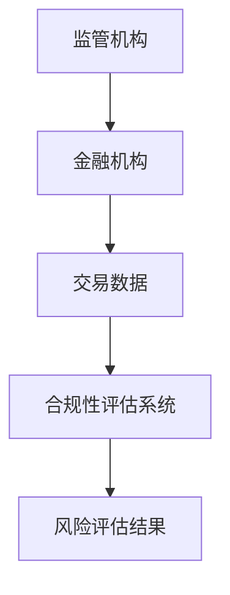
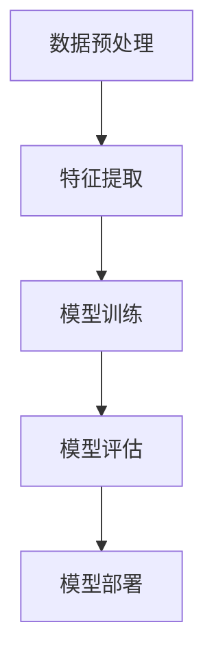
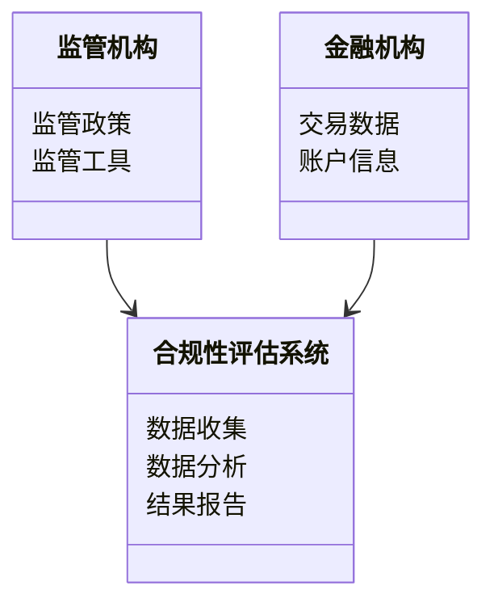
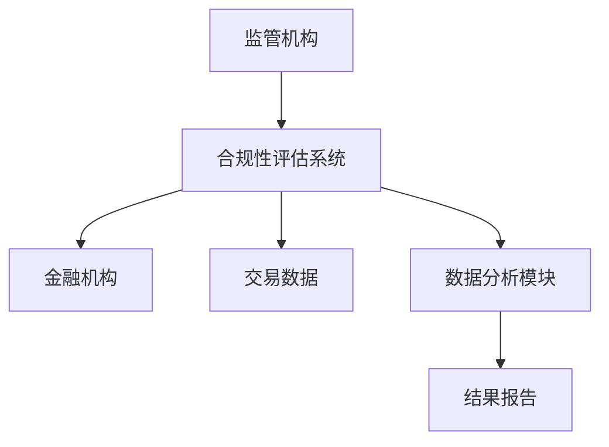

                 


# 《金融监管科技合规性评估》

**关键词**：金融监管科技、合规性评估、人工智能、区块链、大数据、监管合规、风险管理

**摘要**：本文系统性地探讨了金融监管科技（RegTech）在合规性评估中的应用，分析了其核心概念、技术原理、系统架构，并通过具体案例展示了其在实际中的应用。文章结合算法原理、数学模型和系统设计，深入剖析了RegTech在金融监管中的重要性，并提供了最佳实践和未来展望。

---

## 第一章: 金融监管科技合规性评估的背景与概念

### 1.1 金融监管科技的定义与核心概念

#### 1.1.1 金融监管科技（RegTech）的定义
金融监管科技（RegTech）是指利用技术创新来优化和提升金融监管效率的一系列技术手段。它结合了大数据、人工智能、区块链等技术，旨在帮助金融机构和监管机构更好地满足合规要求。

#### 1.1.2 合规性评估的核心概念
合规性评估是指通过技术手段对金融机构的业务行为进行监控和分析，确保其符合相关法律法规和监管要求。RegTech通过自动化和智能化的方式，提高了合规性评估的效率和准确性。

#### 1.1.3 金融监管科技与传统监管的区别
与传统监管方式相比，RegTech具有以下特点：
- **自动化**：通过技术手段自动完成数据收集、分析和报告。
- **智能化**：利用人工智能技术进行预测和风险评估。
- **实时性**：能够实时监控交易行为，及时发现违规行为。

### 1.2 金融监管科技的发展背景

#### 1.2.1 金融科技（FinTech）的兴起与影响
FinTech的快速发展推动了金融行业的创新，但也带来了新的监管挑战。监管机构需要更高效的技术手段来应对这些挑战，RegTech应运而生。

#### 1.2.2 监管机构对技术创新的响应
监管机构逐渐意识到技术的重要性，开始采用RegTech工具来提高监管效率。例如，通过区块链技术实现交易的透明化和可追溯性。

#### 1.2.3 金融合规性评估的挑战与机遇
传统合规性评估依赖人工审核，效率低且容易出错。RegTech通过自动化和智能化的方式，不仅提高了效率，还降低了成本。

### 1.3 金融监管科技合规性评估的重要性

#### 1.3.1 合规性评估在金融监管中的作用
合规性评估是确保金融机构行为合法合规的重要手段，是金融稳定的重要保障。

#### 1.3.2 金融监管科技对合规性评估的推动
RegTech通过技术创新，显著提升了合规性评估的效率和准确性。

#### 1.3.3 合规性评估的边界与外延
合规性评估不仅包括对金融机构的监管，还涉及数据隐私、网络安全等多个方面。

---

## 第二章: 金融监管科技合规性评估的核心概念与联系

### 2.1 核心概念原理

#### 2.1.1 数据驱动的合规性评估
数据驱动的合规性评估通过收集和分析大量数据，识别潜在的合规风险。

#### 2.1.2 人工智能在合规性评估中的应用
人工智能技术，如机器学习和自然语言处理，被广泛应用于合规性评估中。

#### 2.1.3 区块链技术在监管中的作用
区块链技术通过去中心化和不可篡改的特点，提高了交易的透明性和可追溯性。

### 2.2 核心概念属性特征对比

#### 2.2.1 不同技术的属性对比（表格形式）

| 技术         | 数据驱动 | 人工智能 | 区块链技术 |
|--------------|----------|----------|------------|
| 数据来源     | 结构化数据 | 文本数据 | 区块链数据 |
| 数据处理     | 数据清洗 | 特征提取 | 区块链验证 |
| 应用场景     | 风险评估 | 预测分析 | 交易记录 |
| 优势         | 高效性   | 智能性   | 可靠性     |

#### 2.2.2 技术特征与合规需求的匹配度分析
- 数据驱动技术在合规性评估中的应用需要大量高质量的数据支持。
- 人工智能技术能够通过模型训练提高评估的准确性。
- 区块链技术通过去中心化和不可篡改的特点，确保数据的安全性。

### 2.3 ER实体关系图架构



---

## 第三章: 金融监管科技合规性评估的算法原理

### 3.1 算法原理概述

#### 3.1.1 机器学习在合规性评估中的应用
机器学习通过训练模型，识别潜在的合规风险。例如，使用监督学习算法对交易数据进行分类，识别异常交易。

#### 3.1.2 监督学习与无监督学习的对比
- **监督学习**：需要标记的数据进行训练，适用于已知类别的情况。
- **无监督学习**：适用于未知类别的情况，能够发现数据中的潜在模式。

#### 3.1.3 算法流程图



### 3.2 机器学习在合规性评估中的具体应用

#### 3.2.1 线性回归模型
线性回归模型用于预测目标变量与多个特征变量之间的关系。例如，预测某类交易的合规性。

#### 3.2.2 支持向量机（SVM）
支持向量机适用于分类问题，能够处理高维数据。

#### 3.2.3 随机森林
随机森林是一种基于决策树的集成学习方法，适用于分类和回归问题。

### 3.3 机器学习算法的优缺点对比

| 算法       | 优点                     | 缺点                     |
|------------|--------------------------|--------------------------|
| 线性回归    | 简单，计算速度快         | 适用于线性关系           |
| 支持向量机  | 高维数据表现好           | 参数调整复杂             |
| 随机森林    | 抗过拟合能力强           | 计算复杂度高             |

---

## 第四章: 金融监管科技合规性评估的数学模型与公式

### 4.1 线性回归模型

#### 4.1.1 线性回归的基本公式
线性回归模型的数学表达式为：
$$ y = \beta_0 + \beta_1 x_1 + \beta_2 x_2 + \ldots + \beta_n x_n + \epsilon $$
其中，$y$ 是目标变量，$x_i$ 是特征变量，$\beta_i$ 是回归系数，$\epsilon$ 是误差项。

#### 4.1.2 线性回归的优化目标
最小化均方误差（MSE）：
$$ \text{MSE} = \frac{1}{n}\sum_{i=1}^{n}(y_i - \hat{y}_i)^2 $$

### 4.2 随机森林模型

#### 4.2.1 随机森林的基本原理
随机森林是一种基于决策树的集成学习方法，通过构建多棵决策树并进行投票或平均，提高模型的准确性和鲁棒性。

#### 4.2.2 随机森林的数学表达
随机森林模型的预测结果为各个决策树预测结果的平均值或多数投票结果。

---

## 第五章: 金融监管科技合规性评估的系统分析与架构设计

### 5.1 问题场景介绍

#### 5.1.1 金融机构合规性评估的挑战
金融机构需要面对复杂的监管要求，合规性评估需要高效、准确的技术支持。

#### 5.1.2 监管机构的监管需求
监管机构需要实时监控金融机构的交易行为，确保其合规性。

### 5.2 系统功能设计

#### 5.2.1 领域模型（Mermaid类图）


#### 5.2.2 系统架构设计（Mermaid架构图）


---

## 第六章: 金融监管科技合规性评估的项目实战

### 6.1 环境安装

#### 6.1.1 安装Python环境
建议使用Anaconda作为Python环境管理工具。

#### 6.1.2 安装相关库
安装必要的库，如scikit-learn、pandas、numpy等。

### 6.2 系统核心实现源代码

#### 6.2.1 数据预处理代码
```python
import pandas as pd
import numpy as np

# 读取数据
data = pd.read_csv('transaction.csv')

# 数据清洗
data = data.dropna()
data = pd.get_dummies(data)
```

#### 6.2.2 模型训练代码
```python
from sklearn.model_selection import train_test_split
from sklearn.linear_model import LinearRegression

# 划分数据集
X = data.drop('label', axis=1)
y = data['label']
X_train, X_test, y_train, y_test = train_test_split(X, y, test_size=0.2)

# 训练模型
model = LinearRegression()
model.fit(X_train, y_train)
```

### 6.3 代码应用解读与分析

#### 6.3.1 代码功能解读
- 数据预处理：清洗数据，处理缺失值和分类变量。
- 模型训练：使用线性回归模型对数据进行训练。

#### 6.3.2 案例分析
以某金融机构的交易数据为例，使用上述代码进行合规性评估，识别异常交易。

### 6.4 项目小结
通过项目实战，我们了解了RegTech在合规性评估中的具体应用，掌握了数据预处理和模型训练的基本方法。

---

## 第七章: 金融监管科技合规性评估的最佳实践与总结

### 7.1 最佳实践 tips

#### 7.1.1 数据质量管理
确保数据的准确性和完整性，是合规性评估的关键。

#### 7.1.2 技术选型
根据具体需求选择合适的技术和算法，避免盲目追求技术复杂度。

#### 7.1.3 风险管理
在使用RegTech技术的同时，要注重数据隐私和安全。

### 7.2 小结
RegTech通过技术创新，显著提升了金融监管的效率和准确性。合规性评估是其中的重要组成部分，需要结合多种技术手段进行综合分析。

### 7.3 未来展望
随着人工智能和大数据技术的不断发展，RegTech在金融监管中的应用前景广阔，合规性评估将更加智能化和自动化。

### 7.4 注意事项
- 数据隐私保护
- 技术的可解释性
- 模型的鲁棒性

### 7.5 拓展阅读
建议进一步阅读相关书籍和文献，深入了解RegTech的最新技术和应用案例。

---

## 作者信息

**作者：** AI天才研究院/AI Genius Institute & 禅与计算机程序设计艺术 /Zen And The Art of Computer Programming

---

以上是《金融监管科技合规性评估》的完整目录和内容概要。通过系统性地分析和阐述，本文为读者提供了关于RegTech合规性评估的全面视角，从理论到实践，帮助读者深入了解这一领域的核心技术和应用方法。

