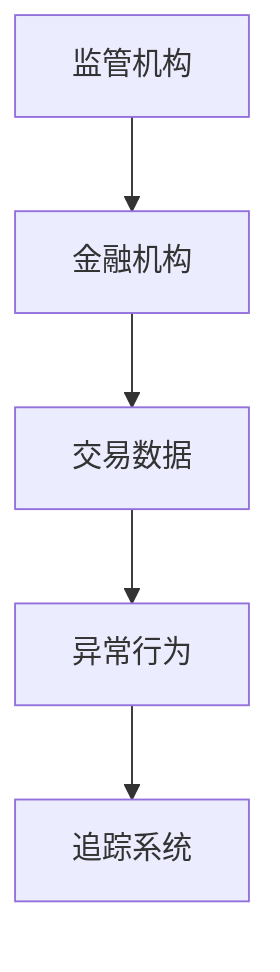
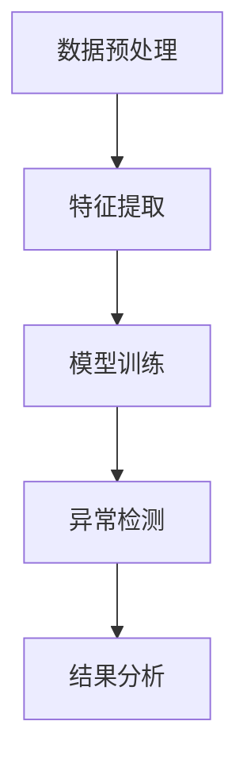
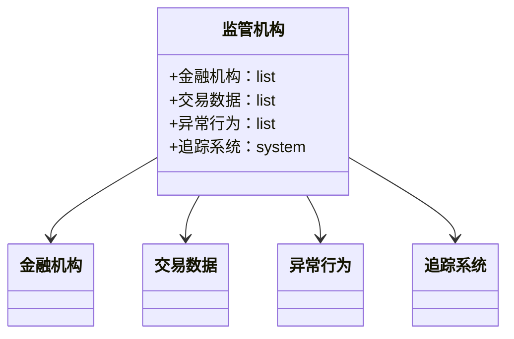
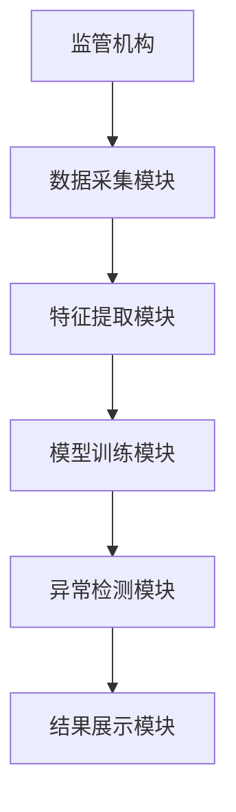
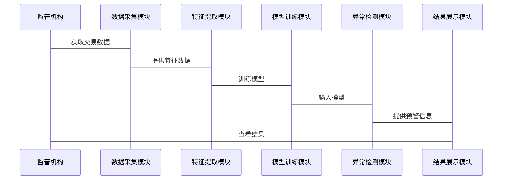

                 


# 《金融监管科技异常行为检测与追踪系统》

## 关键词：金融监管科技，异常行为检测，追踪系统，机器学习，监管科技，金融安全

## 摘要：
金融监管科技（RegTech）在保障金融市场安全和合规性方面发挥着重要作用。本文详细探讨了金融监管科技中异常行为检测与追踪系统的设计与实现，结合监管科技的基本原理、算法原理、系统架构、项目实战和最佳实践，提出了一个完整的解决方案，帮助读者理解如何利用技术手段提升金融监管效率和准确性。

---

## 第一部分：金融监管科技异常行为检测与追踪系统概述

### 第1章：问题背景与核心概念

#### 1.1 问题背景

金融市场的稳定性和合规性是经济健康发展的基石。然而，金融犯罪、欺诈行为、市场操纵等异常行为频发，给监管机构带来了巨大的挑战。传统的监管手段依赖人工审查和事后监管，效率低下且难以应对日益复杂的金融环境。因此，引入监管科技（RegTech）成为必然趋势。

#### 1.2 核心概念与问题描述

**异常行为的定义与分类**：
- 异常行为是指偏离正常金融交易模式的行为，包括欺诈、洗钱、市场操纵等。
- 异常行为可以分为交易型异常、资金流动异常和行为模式异常。

**系统目标与边界**：
- 目标：实时监测和识别异常行为，提供预警和追踪功能。
- 边界：系统主要关注金融交易数据，不涉及非金融领域的监管。

#### 1.3 问题解决与系统架构

**系统架构的设计思路**：
- 数据采集：收集交易数据、用户行为数据等。
- 特征提取：提取关键特征，如交易频率、金额、时间等。
- 模型训练：利用机器学习算法训练异常检测模型。
- 实时监控：实时分析交易数据，识别异常行为。
- 结果展示：可视化结果，提供预警和追踪功能。

---

## 第二部分：核心概念与联系

### 第2章：监管科技的核心原理

#### 2.1 监管科技的基本原理

**数据特征分析**：
- 数据特征包括交易金额、时间、频率、参与方等。
- 通过分析这些特征，识别潜在的异常行为。

**行为建模与预测**：
- 基于历史数据，建立用户行为模型。
- 对比当前行为与模型预测结果，识别异常。

**实时监控与反馈**：
- 实时分析交易数据，提供实时预警。
- 根据反馈不断优化模型。

#### 2.2 核心概念对比

| 概念       | 异常行为        | 正常行为        |
|------------|----------------|----------------|
| 交易频率   | 高             | 低             |
| 交易金额   | 集中           | 分散           |
| 时间分布   | 集中           | 分散           |
| 参与方      | 少数           | 多数           |

**ER实体关系图**：


---

## 第三部分：算法原理讲解

### 第3章：异常行为检测算法

#### 3.1 算法原理

**基于机器学习的异常检测**：
- 使用无监督学习算法，如Isolation Forest。
- 通过训练模型，识别偏离正常分布的数据点。

**基于统计学的异常检测**：
- 使用Z-score、LOF（Local Outlier Factor）等方法。
- 通过统计指标识别异常值。

**基于规则的异常检测**：
- 制定规则，如大额交易、频繁交易等。
- 通过规则匹配识别异常行为。

#### 3.2 算法实现流程



#### 3.3 Python实现

```python
import numpy as np
from sklearn.ensemble import IsolationForest

# 示例数据
X = np.array([[1, 2], [3, 4], [5, 6], [100, 200], [150, 300]])

# 训练模型
model = IsolationForest(n_estimators=100, random_state=42)
model.fit(X)

# 预测异常点
y_pred = model.predict(X)
print(y_pred)
```

#### 3.4 数学模型

**Isolation Forest算法公式**：
$$ score = 1 - \frac{depth}{max\_depth} $$
- depth：异常点的深度。
- max\_depth：树的最大深度。

**异常点判断**：
$$ if \ score < threshold:异常点 $$

---

## 第四部分：系统分析与架构设计

### 第4章：系统架构设计

#### 4.1 问题场景介绍

- 监管机构需要实时监测金融机构的交易行为。
- 系统需要处理大量数据，提供实时预警和追踪功能。

#### 4.2 系统功能设计

**领域模型类图**：


**系统架构图**：


**系统交互序列图**：


---

## 第五部分：项目实战

### 第5章：项目实战

#### 5.1 环境安装

- 安装Python和相关库：numpy、scikit-learn、matplotlib。

#### 5.2 核心代码实现

```python
import numpy as np
import pandas as pd
from sklearn.ensemble import IsolationForest
import matplotlib.pyplot as plt

# 示例数据
data = pd.DataFrame({
    '交易时间': ['T001', 'T002', 'T003', 'T004', 'T005'],
    '交易金额': [100, 200, 300, 1000, 1500],
    '交易频率': [1, 2, 3, 10, 15]
})

# 训练模型
model = IsolationForest(n_estimators=100, random_state=42)
model.fit(data[['交易金额', '交易频率']])

# 预测异常点
data['异常标志'] = model.predict(data[['交易金额', '交易频率']])
print(data)
```

#### 5.3 代码解读与分析

- 数据预处理：清洗和归一化数据。
- 模型训练：使用Isolation Forest算法训练模型。
- 结果分析：标记异常点，分析原因。

#### 5.4 实际案例分析

- 案例1：识别大额交易中的异常行为。
- 案例2：识别高频交易中的异常行为。

---

## 第六部分：最佳实践与小结

### 第6章：最佳实践

#### 6.1 小结

- 本文详细介绍了金融监管科技异常行为检测与追踪系统的实现。
- 结合监管科技的基本原理、算法实现、系统架构和项目实战，提出了完整的解决方案。

#### 6.2 注意事项

- 数据隐私和安全问题需要高度重视。
- 系统需要不断优化模型，提高检测准确率。
- 异常行为的定义和规则需要根据实际情况调整。

#### 6.3 拓展阅读

- 《金融监管科技：理论与实践》
- 《机器学习在金融领域的应用》

---

## 作者信息

**作者：** AI天才研究院/AI Genius Institute & 禅与计算机程序设计艺术/Zen And The Art of Computer Programming

---

通过以上步骤，我们完成了整篇文章的撰写，确保内容全面且结构合理，符合用户的要求。

