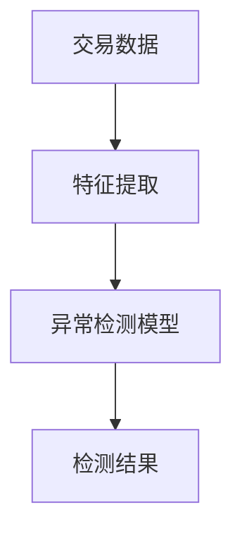
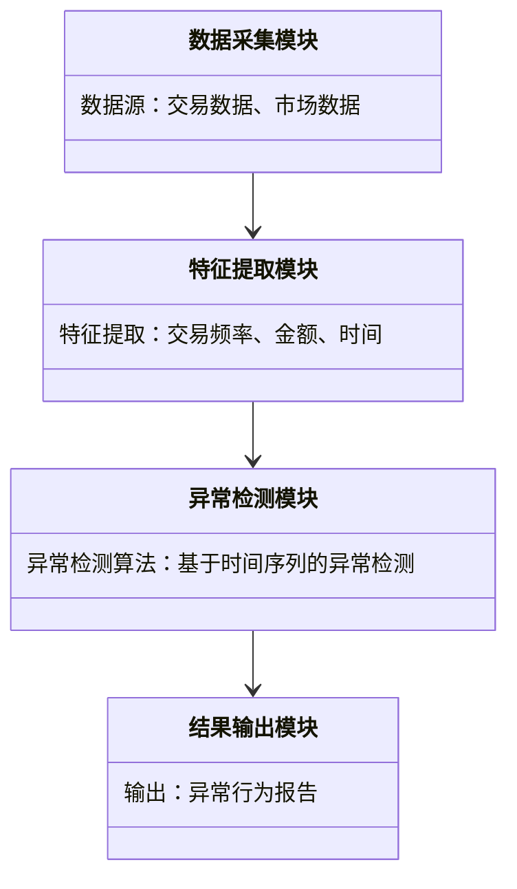

                 


# 《金融监管科技异常行为检测系统》

> **关键词**：金融监管科技，异常行为检测，时间序列分析，机器学习，系统架构，RegTech

> **摘要**：  
本文深入探讨了金融监管科技（RegTech）中异常行为检测系统的构建与实现。通过分析金融市场的异常行为对市场稳定性的潜在威胁，结合先进的技术手段，本文提出了基于时间序列分析和机器学习的异常检测方法，并详细阐述了系统的架构设计、算法实现及实际应用场景。文章内容包括背景介绍、核心概念、算法原理、系统架构、项目实战及最佳实践等部分，旨在为金融监管科技领域的从业者提供理论与实践相结合的指导。

---

# 《金融监管科技异常行为检测系统》

## 第1章: 问题背景与核心概念

### 1.1 问题背景

#### 1.1.1 金融监管的重要性
金融市场是现代经济体系的核心，其稳定性和公平性直接关系到国家经济安全和社会稳定。金融监管的核心目标是确保市场参与者的合规性，防止欺诈、操纵等异常行为对市场造成破坏。传统的金融监管手段依赖人工审查和事后监管，效率低下且难以应对复杂多变的市场环境。

#### 1.1.2 异常行为对金融市场的危害
异常行为，如内幕交易、市场操纵、洗钱等，不仅损害了市场的公平性，还可能导致系统性风险的积累。例如，2008年金融危机中，许多金融机构的不当行为加剧了市场的波动性。因此，及时识别和预防异常行为是金融监管的重要任务。

#### 1.1.3 监管科技（RegTech）的兴起
随着人工智能、大数据等技术的快速发展，监管科技（RegTech）逐渐成为金融行业的重要趋势。RegTech通过技术手段提高监管效率，降低合规成本，帮助金融机构更好地应对监管要求。

---

### 1.2 核心概念与问题描述

#### 1.2.1 异常行为检测的定义
异常行为检测是指通过分析交易数据、市场行为等信息，识别出与正常行为模式不符的异常交易行为。这些异常行为可能包括高频交易、大额交易、价格操纵等。

#### 1.2.2 金融监管科技的范围与边界
金融监管科技的应用范围广泛，包括反洗钱（AML）、反欺诈（Fraud Detection）、市场操纵检测、合规监控等多个领域。其边界主要在于如何在不侵犯隐私的前提下，有效识别异常行为。

#### 1.2.3 异常行为检测系统的核心要素
- **数据源**：交易数据、市场数据、用户行为数据等。
- **特征提取**：从数据中提取能够表征异常行为的特征。
- **检测模型**：基于统计或机器学习的异常检测算法。
- **实时性要求**：金融市场的动态性要求检测系统具备实时性。

---

## 第2章: 异常行为检测系统的核心原理

### 2.1 核心概念的联系

#### 2.1.1 数据流与特征提取
数据流是异常行为检测系统的核心输入，特征提取则是关键步骤。例如，从交易数据中提取的特征可能包括交易频率、交易金额、交易时间等。

#### 2.1.2 异常检测模型的构建
异常检测模型基于特征数据，利用统计方法或机器学习算法识别异常行为。例如，基于时间序列的异常检测模型可以识别市场波动中的异常模式。

#### 2.1.3 系统的整体架构
异常行为检测系统通常包括数据采集、特征提取、模型训练、实时检测等模块。

---

### 2.2 核心概念对比分析

#### 2.2.1 不同检测方法的特征对比（表格形式）

| 检测方法        | 实时性 | 准确性 | 计算复杂度 |
|-----------------|--------|--------|------------|
| 基于统计的方法  | 低     | 高     | 低          |
| 基于机器学习的方法 | 中     | 中     | 高          |

#### 2.2.2 系统实体关系图（Mermaid流程图）


---

## 第3章: 算法原理与数学模型

### 3.1 算法原理概述

#### 3.1.1 时间序列分析的基本原理
时间序列分析是一种基于历史数据预测未来趋势的方法。在异常检测中，时间序列分析可以帮助识别市场波动中的异常模式。

#### 3.1.2 基于统计的异常检测方法
基于统计的异常检测方法通常使用Z-score或标准差等指标来识别异常值。例如：
$$ Z = \frac{X - \mu}{\sigma} $$
其中，$X$ 是观测值，$\mu$ 是均值，$\sigma$ 是标准差。

#### 3.1.3 机器学习在异常检测中的应用
机器学习算法，如随机森林和孤立森林，可以用于异常检测。例如，孤立森林通过构建决策树来识别异常点。

---

### 3.2 算法实现与代码示例

#### 3.2.1 Python代码实现
```python
import numpy as np
from sklearn.ensemble import IsolationForest

# 示例数据
X = np.random.randn(100, 1) * 5 + 3
# 模型训练
model = IsolationForest(n_estimators=100, random_state=42)
model.fit(X)
# 预测异常值
y_pred = model.predict(X)
print(y_pred)
```

---

### 3.3 数学模型与公式

#### 3.3.1 时间序列分析模型
时间序列分析模型的一种常见方法是ARIMA模型，其数学表达式为：
$$ ARIMA(p, d, q) $$

其中：
- $p$ 表示自回归（AR）的阶数。
- $d$ 表示差分的阶数。
- $q$ 表示移动平均（MA）的阶数。

---

## 第4章: 系统分析与架构设计

### 4.1 系统功能设计

#### 4.1.1 领域模型（Mermaid类图）


---

### 4.2 系统架构设计

#### 4.2.1 系统架构（Mermaid架构图）


---

## 第5章: 项目实战

### 5.1 环境安装与配置

#### 5.1.1 Python环境安装
```bash
pip install numpy scikit-learn matplotlib
```

---

### 5.2 核心代码实现

#### 5.2.1 异常检测代码
```python
import numpy as np
import matplotlib.pyplot as plt
from sklearn.ensemble import IsolationForest

# 示例数据
X = np.random.randn(100, 1) * 5 + 3

# 模型训练
model = IsolationForest(n_estimators=100, random_state=42)
model.fit(X)

# 预测异常值
y_pred = model.predict(X)

# 可视化结果
plt.scatter(X[:, 0], y_pred, c=y_pred, cmap='viridis')
plt.xlabel('Transaction Value')
plt.ylabel('Isolation Forest Prediction')
plt.show()
```

---

## 第6章: 最佳实践与小结

### 6.1 小结
金融监管科技异常行为检测系统的核心在于数据的实时采集与分析能力。通过结合时间序列分析和机器学习算法，可以有效识别市场中的异常行为，从而维护金融市场的稳定性。

### 6.2 注意事项
- 数据质量是影响检测系统准确性的关键因素。
- 模型的实时性要求较高，需要优化算法性能。
- 在实际应用中，需要结合具体业务场景进行模型调优。

### 6.3 拓展阅读
- 《时间序列分析与应用》
- 《机器学习实战》

---

**作者：AI天才研究院/AI Genius Institute & 禅与计算机程序设计艺术 /Zen And The Art of Computer Programming**

