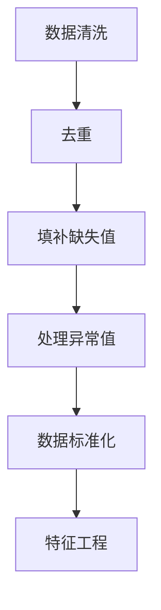
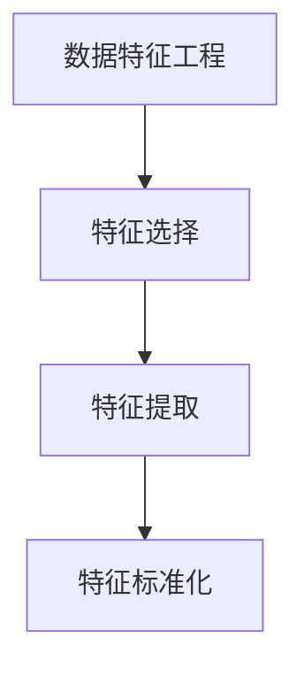
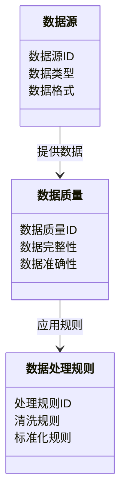

                 


# 《金融监管科技数据质量控制》

> 关键词：金融监管科技，数据质量控制，数据清洗，数据标准化，数据特征工程，金融数据分析

> 摘要：金融监管科技（RegTech）作为金融行业数字化转型的重要组成部分，其核心在于通过技术手段提升金融监管的效率和准确性。数据质量控制是金融监管科技中的关键环节，直接关系到监管决策的可靠性和有效性。本文将从数据质量控制的核心概念、算法原理、系统架构设计、项目实战等多个方面进行详细阐述，深入分析数据质量控制在金融监管科技中的重要性及其实现方法。

---

## 第1章: 金融监管科技与数据质量控制概述

### 1.1 金融监管科技的背景与发展趋势

#### 1.1.1 金融监管科技的定义与特点
金融监管科技（RegTech）是指利用新兴技术手段（如人工智能、大数据、区块链等）来优化和增强金融监管流程的新兴领域。其特点是通过技术手段提高监管效率、降低监管成本、提升监管透明度。RegTech的核心目标是帮助金融机构和监管机构更好地遵守法规，同时优化业务流程。

#### 1.1.2 数据质量控制在金融监管中的重要性
在金融监管中，数据是决策的基础。如果数据质量不高，监管机构可能会做出错误的判断，导致监管失效或风险失控。因此，数据质量控制是金融监管科技中的基石。高质量的数据能够确保监管决策的准确性和可靠性，同时也有助于金融机构降低合规风险。

#### 1.1.3 金融监管科技的发展趋势
随着人工智能、大数据和区块链等技术的快速发展，金融监管科技正朝着智能化、自动化和实时化的方向发展。数据质量控制作为RegTech的重要组成部分，其技术手段也在不断创新，包括自动化数据清洗、智能数据标注和实时数据监控等。

---

### 1.2 数据质量控制的核心概念

#### 1.2.1 数据质量的定义与维度
数据质量是指数据的准确性、完整性、一致性、及时性和安全性等方面的综合表现。在金融监管中，数据质量的五个核心维度包括：
1. **准确性**：数据是否真实反映实际情况。
2. **完整性**：数据是否包含所有必要信息。
3. **一致性**：数据是否在不同系统中保持一致。
4. **及时性**：数据是否能够及时更新和传输。
5. **安全性**：数据是否受到充分保护，防止未经授权的访问或篡改。

#### 1.2.2 数据质量控制的目标与原则
数据质量控制的目标是通过技术和管理手段，确保数据的高质量。其核心原则包括：
1. **明确数据标准**：制定统一的数据标准，确保数据的一致性和可比性。
2. **自动化处理**：利用自动化工具提高数据清洗和处理的效率。
3. **实时监控**：建立实时数据监控机制，及时发现和解决数据质量问题。
4. **风险管理**：将数据质量问题与风险管理体系相结合，降低数据质量问题对业务的影响。

#### 1.2.3 数据质量控制的边界与外延
数据质量控制的边界在于数据本身，不涉及数据的使用和分析过程。其外延则涵盖数据全生命周期管理，包括数据生成、存储、传输和销毁等环节。数据质量控制不仅关注技术手段，还需要结合业务需求和监管要求。

---

### 1.3 金融监管科技中的数据质量挑战

#### 1.3.1 数据源的多样性与复杂性
金融机构的数据来源广泛，包括交易数据、客户数据、市场数据等，数据格式和结构差异大，增加了数据清洗和整合的难度。

#### 1.3.2 数据孤岛与信息不对称问题
由于不同部门或机构之间的数据孤岛问题，导致数据难以有效整合和共享，影响了监管决策的全面性。

#### 1.3.3 数据安全与隐私保护的挑战
金融数据涉及大量敏感信息，数据质量控制过程中需要确保数据的安全性和隐私性，防止数据泄露和滥用。

---

## 第2章: 数据质量控制的核心概念与联系

### 2.1 数据质量控制的原理

#### 2.1.1 数据清洗与预处理的基本原理
数据清洗是数据质量控制的核心步骤，主要包括去重、去噪、填补缺失值和处理异常值等操作。预处理阶段则包括数据格式转换、字段标准化和数据分组等。

#### 2.1.2 数据标准化与规范化的处理方法
数据标准化是指将数据转换为统一的格式或范围，例如将日期格式统一化，将数值标准化到0-1范围。数据规范化则是指根据业务规则对数据进行重新定义和分类。

#### 2.1.3 数据特征工程的核心思想
特征工程是指通过提取和构造特征，提升数据的表达能力和模型的性能。在金融监管中，特征工程可以帮助监管机构更好地识别风险和异常行为。

---

### 2.2 核心概念对比分析

#### 2.2.1 数据清洗与数据增强的对比
数据清洗主要是去除噪声和错误数据，而数据增强则是通过添加或修改数据来提升数据的质量和多样性。

#### 2.2.2 数据标准化与数据归一化的区别
数据标准化是对数据进行比例缩放，使其具有相同的量纲，而数据归一化则是将数据映射到0-1范围。

#### 2.2.3 数据特征选择与特征提取的联系
特征选择是根据业务需求选择重要的特征，而特征提取则是通过算法自动提取潜在的特征，两者相辅相成，共同提升数据的质量和模型的性能。

---

### 2.3 数据质量控制的ER实体关系图

```mermaid
er
    entity 数据源 {
        key: 数据源ID
        attribute: 数据类型, 数据格式, 数据时间戳
    }
    entity 数据质量 {
        key: 数据质量ID
        attribute: 数据完整性, 数据准确性, 数据一致性
    }
    entity 数据处理规则 {
        key: 处理规则ID
        attribute: 清洗规则, 标准化规则, 特征提取规则
    }
    数据源 --> 数据质量: 提供数据
    数据质量 --> 数据处理规则: 应用规则
```

---

## 第3章: 数据质量控制的算法原理

### 3.1 数据清洗算法的流程



#### 3.1.1 数据清洗的Python实现
```python
import pandas as pd

# 示例数据
data = {
    '交易日期': ['2023-01-01', '2023-01-02', '2023-01-03', '2023-01-03'],
    '交易金额': [100, 200, None, 150],
    '交易状态': ['完成', '失败', '完成', '异常']
}

df = pd.DataFrame(data)

# 去重
df.drop_duplicates(subset='交易日期', inplace=True)

# 填补缺失值
df['交易金额'].fillna(df['交易金额'].mean(), inplace=True)

# 处理异常值
z_scores = (df['交易金额'] - df['交易金额'].mean()) / df['交易金额'].std()
df = df[(z_scores <= 3) & (z_scores >= -3)]
```

#### 3.1.2 数据清洗的数学模型
异常检测的常用方法之一是Z-score模型：
$$ Z = \frac{X - \mu}{\sigma} $$
其中，$\mu$ 是均值，$\sigma$ 是标准差，$X$ 是观测值。

---

### 3.2 数据特征工程的实现

#### 3.2.1 数据特征工程的流程


#### 3.2.2 特征工程的Python实现
```python
from sklearn.preprocessing import StandardScaler
from sklearn.decomposition import PCA

# 特征选择
selected_features = ['交易金额', '交易时间']

# 特征提取
pca = PCA(n_components=2)
pca_features = pca.fit_transform(df[selected_features])

# 特征标准化
scaler = StandardScaler()
normalized_features = scaler.fit_transform(pca_features)
```

---

## 第4章: 系统分析与架构设计

### 4.1 问题场景介绍

#### 4.1.1 问题背景
金融机构需要处理大量异构数据，数据质量问题严重影响监管效率和准确性。

#### 4.1.2 问题描述
数据源多样、格式不统一、存在缺失值和异常值，导致数据难以有效利用。

#### 4.1.3 解决方案
通过构建数据质量控制系统，实现数据清洗、标准化和特征工程的自动化。

---

### 4.2 系统功能设计

#### 4.2.1 领域模型


#### 4.2.2 系统架构设计


---

## 第5章: 项目实战

### 5.1 环境安装

#### 5.1.1 安装Python和相关库
```bash
pip install pandas scikit-learn mermaid
```

#### 5.1.2 安装Jupyter Notebook
```bash
pip install jupyter
```

---

### 5.2 核心代码实现

#### 5.2.1 数据清洗与预处理
```python
import pandas as pd

# 读取数据
df = pd.read_csv('data.csv')

# 去重
df.drop_duplicates(subset='交易日期', inplace=True)

# 填补缺失值
df['交易金额'].fillna(df['交易金额'].mean(), inplace=True)

# 处理异常值
z_scores = (df['交易金额'] - df['交易金额'].mean()) / df['交易金额'].std()
df = df[(z_scores <= 3) & (z_scores >= -3)]
```

#### 5.2.2 特征工程实现
```python
from sklearn.preprocessing import StandardScaler
from sklearn.decomposition import PCA

# 特征选择
selected_features = ['交易金额', '交易时间']

# 特征提取
pca = PCA(n_components=2)
pca_features = pca.fit_transform(df[selected_features])

# 特征标准化
scaler = StandardScaler()
normalized_features = scaler.fit_transform(pca_features)
```

---

### 5.3 代码解读与分析

#### 5.3.1 数据清洗代码解读
- `drop_duplicates`：去除重复数据。
- `fillna`：填补缺失值。
- `z_scores`：计算Z-score，识别异常值。

#### 5.3.2 特征工程代码解读
- `PCA`：主成分分析，提取特征。
- `StandardScaler`：标准化处理，使特征具有相同的尺度。

---

## 第6章: 总结与展望

### 6.1 总结
数据质量控制是金融监管科技中的核心环节，其重要性体现在数据的准确性、完整性和一致性上。通过自动化数据清洗、标准化和特征工程，可以有效提升数据质量，支持更精准的监管决策。

### 6.2 注意事项
- 数据质量控制需要结合业务需求和监管要求。
- 数据安全和隐私保护是数据质量控制的重要组成部分。
- 数据质量控制是一个持续优化的过程，需要不断监控和调整。

### 6.3 未来展望
随着人工智能和大数据技术的进一步发展，数据质量控制将更加智能化和自动化。未来的RegTech将更加注重数据的实时监控和动态调整，以应对金融市场的复杂性和不确定性。

---

## 作者信息
作者：AI天才研究院/AI Genius Institute  
联系邮箱：contact@ait Genius.com  

---

通过以上内容，我们可以看到数据质量控制在金融监管科技中的重要性及其具体实现方法。希望本文能为金融监管科技领域的从业者提供有价值的参考和启发。

