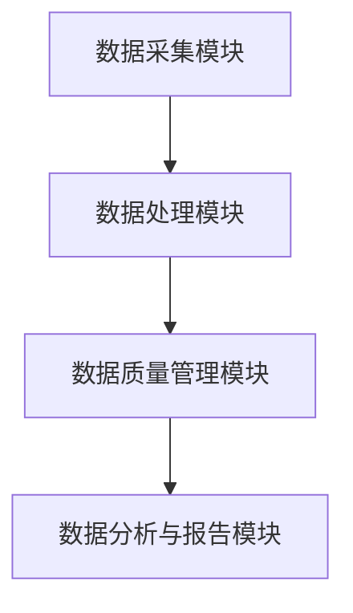

                 


# 《金融监管科技数据质量控制平台》

## 关键词：金融监管科技，数据质量控制，数据清洗，机器学习，系统架构

## 摘要：本文系统地探讨了金融监管科技数据质量控制平台的设计与实现，从背景、核心概念、算法原理、系统架构到项目实战，全面分析了平台的构建过程，为金融领域的数据质量管理提供了理论与实践的双重指导。

---

# 第1章: 金融监管科技与数据质量控制概述

## 1.1 金融监管科技的背景与意义

### 1.1.1 金融监管科技的定义
金融监管科技（FinTech）指的是利用技术手段提升金融服务效率和监管能力的创新应用。在数字化转型的背景下，金融监管科技已成为推动金融行业发展的关键力量。

### 1.1.2 数据质量控制的重要性
数据质量直接关系到金融决策的准确性。低质量的数据可能导致错误的监管结论和经济损失，因此数据质量控制在金融监管中至关重要。

### 1.1.3 金融监管科技与数据质量控制的关系
数据质量控制是金融监管科技的重要组成部分，通过确保数据的准确性和完整性，为监管机构提供可靠的数据支持。

## 1.2 数据质量控制的核心概念

### 1.2.1 数据质量的定义与维度
数据质量指数据的准确性、完整性、一致性、及时性、唯一性和可追溯性。这些维度共同决定了数据的价值和可用性。

### 1.2.2 数据质量控制的目标与原则
目标包括提高数据准确性、减少数据冗余、确保数据一致性等。原则包括预防为主、动态调整、用户参与等。

### 1.2.3 金融监管中的数据质量挑战
金融数据来源多样、格式复杂，容易出现重复、缺失等问题。此外，数据安全和隐私保护也是重要挑战。

## 1.3 本章小结
本章介绍了金融监管科技的背景及其与数据质量控制的关系，明确了数据质量的核心概念和挑战。

---

# 第2章: 金融监管科技数据质量控制平台的功能与架构

## 2.1 平台的功能模块

### 2.1.1 数据采集与处理模块
负责从多种数据源采集数据，并进行初步处理，确保数据格式统一。

### 2.1.2 数据清洗与标准化模块
应用规则和算法清洗数据，去除噪音，标准化处理，确保数据一致性。

### 2.1.3 数据质量管理模块
通过设定指标评估数据质量，并自动修复或标记问题数据。

### 2.1.4 数据分析与报告模块
生成质量报告，提供可视化分析，辅助决策。

## 2.2 平台的系统架构设计

### 2.2.1 分层架构设计
将系统分为数据采集层、数据处理层、数据管理层和用户交互层，各层职责分明。

### 2.2.2 组件间的关系与依赖
数据采集层依赖数据源，处理层依赖清洗算法，管理层依赖质量评估模型，交互层依赖用户界面。

### 2.2.3 系统的可扩展性与灵活性
模块化设计便于功能扩展，支持多种数据源和算法的接入。

## 2.3 本章小结
本章详细介绍了平台的功能模块和系统架构，强调了架构设计的灵活性和扩展性。

---

# 第3章: 数据质量管理的核心算法与实现

## 3.1 数据清洗算法

### 3.1.1 基于规则的清洗算法
通过预定义规则检测和修复数据错误，如重复值、空值等。

### 3.1.2 基于统计的清洗算法
利用统计方法识别异常值和 outliers，如Z-score和IQR方法。

### 3.1.3 基于机器学习的清洗算法
应用聚类、分类算法自动识别数据偏差，如使用Isolation Forest检测异常值。

## 3.2 数据特征工程与增强

### 3.2.1 数据特征的选择与提取
通过PCA或特征重要性分析选择关键特征。

### 3.2.2 数据特征的变换与标准化
使用归一化或标准化处理，确保不同特征具有可比性。

### 3.2.3 数据增强技术的应用
通过数据增广技术，如随机噪声添加，提升模型鲁棒性。

## 3.3 数据质量评估的数学模型

### 3.3.1 数据完整性评估模型
使用缺失值比例和相关性分析评估数据完整性。

$$完整性 = 1 - \frac{\text{缺失值数量}}{\text{总数据量}}$$

### 3.3.2 数据一致性评估模型
通过统计显著性检验，评估数据的一致性。

$$一致性 = \frac{\text{一致数据量}}{\text{总数据量}}$$

### 3.3.3 数据准确性评估模型
利用回归模型预测真实值，计算预测误差。

$$准确性 = 1 - \frac{\text{平均绝对误差}}{\text{真实值范围}}$$

## 3.4 本章小结
本章探讨了数据清洗算法和质量评估模型，展示了机器学习在数据质量管理中的应用。

---

# 第4章: 平台系统分析与架构设计方案

## 4.1 问题场景介绍

### 4.1.1 数据来源的多样性
平台需处理银行、证券等多源数据。

### 4.1.2 数据格式的不统一性
不同数据源格式差异大，需进行转换处理。

### 4.1.3 数据质量的动态变化
数据质量受市场波动影响，需实时监控。

## 4.2 系统功能设计

### 4.2.1 数据采集模块的设计
支持多种数据接口，自动采集数据。

### 4.2.2 数据处理模块的设计
集成多种清洗算法，支持规则和机器学习方法。

### 4.2.3 数据质量管理模块的设计
基于指标模型评估数据，提供修复建议。

### 4.2.4 数据分析与报告模块的设计
生成动态报告，提供可视化界面。

## 4.3 系统架构设计

### 4.3.1 分层架构设计图（Mermaid）


## 4.4 系统接口设计

### 4.4.1 数据接口的设计
定义API接口，支持RESTful协议。

### 4.4.2 API接口的设计
提供GET、POST方法，确保数据传输安全。

### 4.4.3 接口的安全性设计
采用JWT认证和HTTPS传输，保障数据安全。

## 4.5 系统交互流程设计

### 4.5.1 用户操作流程
用户提交数据请求，系统处理并返回结果。

### 4.5.2 数据处理流程
数据采集、清洗、质检、分析，生成报告。

### 4.5.3 报告生成流程
根据质检结果生成报告，支持导出和分享。

## 4.6 本章小结
本章详细设计了系统的架构和接口，确保平台高效稳定运行。

---

# 第5章: 项目实战——金融监管科技数据质量控制平台的实现

## 5.1 环境安装与配置

### 5.1.1 安装Python环境
使用Anaconda安装Python 3.8以上版本。

### 5.1.2 安装依赖库
安装Pandas、NumPy、Scikit-learn、Flask等库。

## 5.2 核心代码实现

### 5.2.1 数据采集模块
```python
import requests

def fetch_data(api_url):
    response = requests.get(api_url)
    return response.json()
```

### 5.2.2 数据清洗模块
```python
from sklearn.ensemble import IsolationForest

def clean_data(data):
    clf = IsolationForest(random_state=42)
    clf.fit(data)
    outliers = clf.predict(data) == -1
    cleaned_data = data[~outliers]
    return cleaned_data
```

### 5.2.3 数据质量管理模块
```python
def assess_quality(data):
    completeness = 1 - data.isnull().sum() / len(data)
    consistency = data.drop_duplicates().shape[0] / data.shape[0]
    return completeness * consistency
```

## 5.3 项目实战案例分析

### 5.3.1 数据来源与预处理
从银行交易数据中提取特征，进行标准化处理。

### 5.3.2 数据清洗与修复
使用Isolation Forest算法识别并剔除异常交易记录。

### 5.3.3 数据质量评估与报告
生成数据质量报告，评估各项指标，提出改进建议。

## 5.4 本章小结
本章通过实际案例展示了平台的实现过程，验证了其有效性和实用性。

---

# 作者：AI天才研究院 & 禅与计算机程序设计艺术

