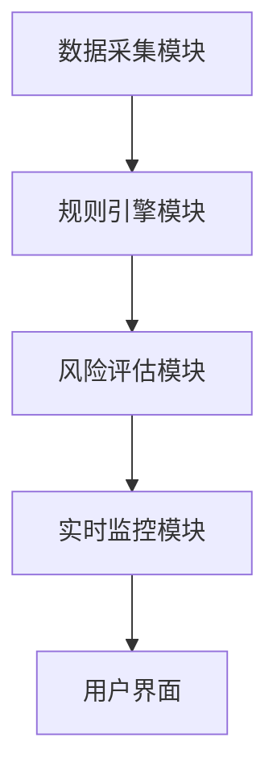

                 


# 《金融监管科技解决方案设计》

---

## 关键词：  
金融监管、监管科技、人工智能、大数据、区块链、风险管理、实时监控

---

## 摘要：  
随着金融行业的快速发展，监管科技（RegTech）成为提升金融监管效率和精准性的重要手段。本文从金融监管的痛点出发，结合人工智能、大数据和区块链等技术，系统地分析了监管科技的核心概念、算法原理、系统架构及解决方案。通过具体案例的实战分析，本文为读者提供了从理论到实践的全面指导，帮助监管机构和金融机构更好地应对数字化时代的监管挑战。

---

## 第一部分: 金融监管科技解决方案设计概述

---

### 第1章: 金融监管科技的背景与挑战

#### 1.1 金融监管科技的定义与内涵
监管科技（RegTech）是指利用新兴技术手段（如人工智能、大数据、区块链等）来优化和增强金融监管的效率和效果。  
**核心要素**包括：  
- **数据驱动**：基于实时数据进行监管分析。  
- **自动化**：通过技术手段实现监管流程的自动化。  
- **智能化**：利用AI技术实现风险预测和决策支持。  

**与传统监管的区别**：传统监管依赖人工审核和事后监管，而监管科技注重事前预警和实时监控。

---

#### 1.2 金融监管科技的发展现状
- **全球趋势**：RegTech在欧美市场发展迅速，尤其是在反洗钱（AML）和合规管理领域。  
- **中国市场**：中国RegTech市场增长迅速，主要集中在支付监管、信贷风控和区块链合规领域。  
- **技术手段**：人工智能、大数据和区块链是当前监管科技的核心技术。

---

#### 1.3 金融监管中的痛点与挑战
- **传统监管模式的局限性**：效率低、成本高、覆盖面窄。  
- **数据隐私与安全**：如何在监管的同时保护数据隐私。  
- **技术与监管的融合**：如何平衡技术创新与监管合规。

---

#### 1.4 监管科技的技术手段
- **人工智能**：用于风险识别和预测。  
- **大数据**：用于海量数据的处理和分析。  
- **区块链**：用于数据溯源和透明化。

---

### 第2章: 金融监管科技的核心概念与联系

#### 2.1 监管数据的定义与分类
- **定义**：监管数据是指用于监管目的的所有数据，包括交易数据、身份信息、行为数据等。  
- **分类**：  
  1. **交易数据**：如交易金额、时间、地点等。  
  2. **身份数据**：如客户ID、身份证号等。  
  3. **行为数据**：如登录记录、交易频率等。  

#### 2.2 监管规则的构建与执行
- **构建方法**：基于监管法规制定规则模型。  
- **执行机制**：通过技术手段实时监控数据是否符合规则。

---

#### 2.3 风险评估与预警
- **风险评估**：基于历史数据和模型预测潜在风险。  
- **预警机制**：通过实时监控触发预警信号。

---

#### 2.4 监管科技的核心概念对比表

| 概念        | 定义与属性                              |
|-------------|----------------------------------------|
| 监管数据    | 用于监管目的的数据，需符合合规要求。    |
| 监管规则    | 基于法规制定的规则，用于判断合规性。    |
| 风险评估    | 通过模型预测潜在风险，提供预警信号。    |

---

#### 2.5 监管科技的ER实体关系图
```mermaid
erDiagram
    customer[客户] {
        id : int
        name : string
        account : string
    }
    transaction[交易] {
        id : int
        amount : float
        time : datetime
        customer_id : int
    }
    rule[监管规则] {
        id : int
        description : string
        threshold : float
    }
    risk_assessment[风险评估] {
        id : int
        score : float
        timestamp : datetime
    }
    customer --> transaction : 发起
    transaction --> rule : 遵守
    risk_assessment --> transaction : 基于
```

---

### 第3章: 监管科技中的算法原理与实现

#### 3.1 监管数据的预处理
- **数据清洗**：去除无效数据，处理缺失值。  
- **特征提取**：从原始数据中提取有用特征。  
- **数据标注**：根据监管规则对数据进行标注。

#### 3.2 监管规则的机器学习建模
- **线性回归模型**：用于预测监管指标。  
- **决策树模型**：用于分类和规则提取。  
- **随机森林模型**：用于高精度的分类与预测。

#### 3.3 风险评估的算法实现
- **数学模型**：如逻辑回归、支持向量机（SVM）。  
- **代码实现**：以下是一个简单的风险评估示例代码：
  ```python
  import pandas as pd
  from sklearn.linear_model import LogisticRegression

  # 加载数据
  df = pd.read_csv('risk_data.csv')
  X = df.drop('label', axis=1)
  y = df['label']

  # 训练模型
  model = LogisticRegression()
  model.fit(X, y)

  # 预测
  print(model.predict(X))
  ```

---

### 第4章: 金融监管科技的系统架构设计

#### 4.1 问题场景介绍
- **目标**：设计一个实时交易监控系统，用于检测异常交易行为。

#### 4.2 系统功能设计
- **数据采集模块**：实时采集交易数据。  
- **规则引擎模块**：根据监管规则进行判断。  
- **风险评估模块**：基于模型预测风险。  
- **实时监控模块**：展示实时监控结果。

#### 4.3 系统架构设计


---

### 第5章: 项目实战：基于监管科技的实时交易监控系统

#### 5.1 项目背景
- **目标**：实时监控交易数据，识别异常交易行为。

#### 5.2 环境配置
- **工具**：Python、Pandas、Scikit-learn、Flask。

#### 5.3 系统核心实现
- **数据采集**：从数据库中实时读取交易数据。  
- **规则引擎**：根据监管规则过滤数据。  
- **风险评估**：使用机器学习模型预测风险。  

#### 5.4 系统测试
- **测试用例**：验证系统是否能准确识别异常交易。

#### 5.5 案例分析
- **案例1**：识别一笔大额交易，触发预警。

---

### 第6章: 金融监管科技的最佳实践与未来展望

#### 6.1 小结
- 监管科技通过技术手段提升监管效率，降低成本。

#### 6.2 注意事项
- 数据隐私保护是重中之重。  
- 系统的实时性和稳定性需要重点关注。

#### 6.3 拓展阅读
- 推荐书籍：《FinTech与监管创新》、《区块链技术与金融监管》。

---

## 作者：  
AI天才研究院/AI Genius Institute  
禅与计算机程序设计艺术/Zen And The Art of Computer Programming

