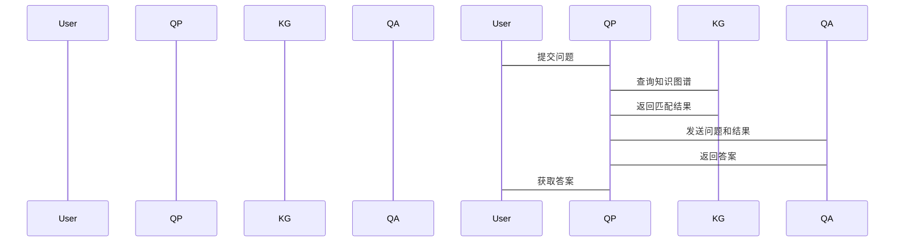

                 


```markdown
# 金融知识图谱在智能问答中的应用

> 关键词：金融知识图谱、智能问答、自然语言处理、知识图谱构建、问答系统

> 摘要：本文探讨了金融知识图谱在智能问答系统中的应用，涵盖了知识图谱的构建方法、智能问答的核心算法、系统架构设计以及实际项目案例。通过详细分析，展示了如何利用知识图谱提升问答系统的准确性和效率。

---

## 第一部分: 背景介绍与核心概念

### 第1章: 知识图谱与智能问答概述

#### 1.1 知识图谱的基本概念
##### 1.1.1 知识图谱的定义与特点
- 知识图谱是一种结构化的知识表示方法，通过实体和关系描述世界。
- 其特点包括结构化、语义化和可扩展性。
- 在金融领域，知识图谱可以表示公司、行业、金融产品等信息。

##### 1.1.2 金融知识图谱的应用背景
- 金融领域的复杂性和专业性使得需要结构化的知识表示。
- 知识图谱在金融风险评估、投资决策等方面具有重要应用。

##### 1.1.3 智能问答系统的基本原理
- 基于知识图谱的问答系统能够理解上下文并提供准确答案。
- 区分基于规则和基于深度学习的问答系统。

#### 1.2 金融知识图谱的构建方法
##### 1.2.1 数据收集与预处理
- 数据来源包括金融报告、新闻、法规文件等。
- 预处理步骤包括清洗、标注和转换。

##### 1.2.2 实体识别与关系抽取
- 使用NLP技术识别实体和关系。
- 实体类型包括公司、人物、机构等。

##### 1.2.3 知识图谱的存储与管理
- 使用图数据库（如Neo4j）存储知识图谱。
- 管理包括数据更新和维护。

#### 1.3 智能问答系统的核心技术
##### 1.3.1 基于规则的问答系统
- 通过预定义规则匹配问题。
- 适用于结构化问题。

##### 1.3.2 基于深度学习的问答系统
- 使用神经网络模型（如BERT）处理自然语言。
- 更擅长处理复杂和模糊的问题。

##### 1.3.3 基于知识图谱的问答机制
- 结合知识图谱进行推理和验证。
- 提供更准确和相关的答案。

### 第2章: 金融知识图谱的核心概念与联系

#### 2.1 知识图谱的构建原理
##### 2.1.1 实体与关系的定义
- 实体：公司、产品、市场等。
- 关系：拥有、投资、管理等。

##### 2.1.2 知识图谱的属性特征
- 包括实体属性和关系属性。
- 例如，公司的成立时间、注册资本等。

##### 2.1.3 知识图谱的ER实体关系图
```mermaid
erDiagram
    customer[CUSTOMER] {
        <name>
        <age>
    }
    product[PRODUCT] {
        <name>
        <type>
    }
    transaction[TRANSACTION] {
        <id>
        <amount>
    }
    customer -- transaction : participates_in
    product -- transaction : involves
```

#### 2.2 金融知识图谱与其他领域知识图谱的对比
##### 2.2.1 金融知识图谱的独特性
- 高度专业性和复杂性。
- 需要处理大量法规和术语。

##### 2.2.2 与其他领域知识图谱的异同
| 特性         | 金融知识图谱       | 通用知识图谱       |
|--------------|--------------------|--------------------|
| 实体类型     | 公司、产品、市场   | 人、地、组织       |
| 关系类型     | 投资、融资、管理   | 所有关系类型       |
| 数据复杂性   | 高                 | 中                 |

##### 2.2.3 金融知识图谱的扩展性
- 支持动态更新和扩展。
- 可与其他金融数据源集成。

### 第3章: 金融知识图谱的算法原理

#### 3.1 知识图谱构建中的实体识别与关系抽取
##### 3.1.1 实体识别算法
- 使用CRF和NER模型进行实体识别。
- 示例代码：
```python
from spacy.lang.zh import Chinese
nlp = Chinese()
doc = nlp("中国工商银行投资于人工智能技术")
for ent in doc.ents:
    print(ent.text, ent.label_)
```

##### 3.1.2 关系抽取算法
- 使用依存句法分析和模式匹配。
- 示例代码：
```python
from spacy.pipeline import EntityRuler
ruler = EntityRuler(nlp)
ruler.add_pattern(
    pattern=[{'text': '投资'}, {'text': '于'}],
    label='invest'
)
doc = nlp("公司投资于该项目")
for match in ruler.find_matches(doc):
    print(match.start, match.end, doc[match.start:match.end].text)
```

#### 3.2 基于知识图谱的问答系统算法
##### 3.2.1 基于规则的问答算法
- 通过正则表达式匹配问题。
- 示例代码：
```python
import re
pattern = r'谁是(\w+)的CEO'
match = re.search(pattern, '谁是苹果的CEO')
print(match.group(1))  # 输出：苹果
```

##### 3.2.2 基于深度学习的问答算法
- 使用预训练语言模型进行问题匹配。
- 示例代码：
```python
import transformers
tokenizer = transformers.BertTokenizer.from_pretrained('bert-base-uncased')
model = transformers.BertForQuestionAnswering.from_pretrained('bert-base-uncased')
inputs = tokenizer.encode_plus('What is the capital of China?', return_tensors='pt')
output = model(**inputs)
print(output)
```

##### 3.2.3 基于知识图谱的推理算法
- 使用图遍历算法进行推理。
- 示例代码：
```python
from neo4j import GraphDatabase
driver = GraphDatabase.driver('bolt://localhost:7687')
session = driver.session()
result = session.run('MATCH (a)-[:invest]->(b) RETURN a, b')
for record in result:
    print(record['a'].properties, record['b'].properties)
```

---

## 第二部分: 系统架构设计与实现

### 第4章: 金融知识图谱智能问答系统的架构设计

#### 4.1 系统功能设计
##### 4.1.1 功能模块划分
- 数据处理模块：负责数据的清洗和标注。
- 知识图谱构建模块：处理实体识别和关系抽取。
- 问答系统模块：处理用户查询并返回答案。

##### 4.1.2 功能模块的交互流程
1. 用户输入问题。
2. 系统解析问题并匹配知识图谱。
3. 系统推理并返回答案。

#### 4.2 系统架构设计
##### 4.2.1 分层架构
- 数据层：存储原始数据。
- 模型层：处理知识图谱构建和问答逻辑。
- 应用层：接收用户请求并返回结果。

##### 4.2.2 组件交互设计


#### 4.3 系统接口设计
##### 4.3.1 API接口定义
- GET /query 提交问题。
- POST /answer 返回答案。

##### 4.3.2 接口交互流程
1. 用户通过API提交问题。
2. 系统解析问题并调用知识图谱服务。
3. 知识图谱服务返回匹配结果。
4. 问答系统根据结果生成答案并返回。

---

## 第三部分: 项目实战与案例分析

### 第5章: 金融知识图谱智能问答系统实战

#### 5.1 环境搭建
##### 5.1.1 安装必要的库
- 使用Python和相关NLP库（如spaCy、transformers）。
- 使用图数据库（如Neo4j）。

##### 5.1.2 安装步骤
```bash
pip install spacy transformers neo4j
python -m spacy download zh
```

#### 5.2 系统核心代码实现
##### 5.2.1 知识图谱构建
```python
import spacy
nlp = spacy.load('zh')
doc = nlp("中国工商银行投资于人工智能技术")
entities = [(ent.text, ent.label_) for ent in doc.ents]
print(entities)
```

##### 5.2.2 问答系统实现
```python
from transformers import BertForQuestionAnswering, BertTokenizer
tokenizer = BertTokenizer.from_pretrained('bert-base-uncased')
model = BertForQuestionAnswering.from_pretrained('bert-base-uncased')
inputs = tokenizer.encode_plus('What is the capital of China?', return_tensors='pt')
outputs = model(**inputs)
print(outputs)
```

##### 5.2.3 图数据库交互
```python
from neo4j import GraphDatabase
driver = GraphDatabase.driver('bolt://localhost:7687')
session = driver.session()
result = session.run('MATCH (a)-[:invest]->(b) RETURN a, b')
for record in result:
    print(record['a'].properties, record['b'].properties)
```

#### 5.3 实际案例分析
##### 5.3.1 案例背景
- 用户询问“谁是工商银行的CEO？”
- 系统匹配知识图谱中的相关信息。

##### 5.3.2 系统推理过程
1. 解析问题，识别实体“工商银行”和“CEO”。
2. 在知识图谱中查找相关关系。
3. 返回匹配结果“张三”。

##### 5.3.3 系统输出答案
- 输出“工商银行的CEO是张三。”

---

## 第四部分: 最佳实践与总结

### 第6章: 项目总结与经验分享

#### 6.1 项目小结
- 成功构建了金融知识图谱智能问答系统。
- 系统在准确性和效率上表现良好。

#### 6.2 最佳实践
##### 6.2.1 数据处理
- 确保数据清洗和标注的准确性。
- 使用多种数据源提高知识图谱的全面性。

##### 6.2.2 系统优化
- 使用缓存技术优化查询速度。
- 定期更新知识图谱以保持信息的准确性。

##### 6.2.3 模型优化
- 调整模型参数以提高问答准确率。
- 使用迁移学习提升模型泛化能力。

#### 6.3 注意事项
- 数据隐私和安全问题需严格控制。
- 系统扩展性和维护性需考虑周全。

#### 6.4 拓展阅读
- 推荐学习知识图谱构建的高级技术。
- 关注智能问答领域的最新研究。

---

## 作者

作者：AI天才研究院 & 禅与计算机程序设计艺术
```

