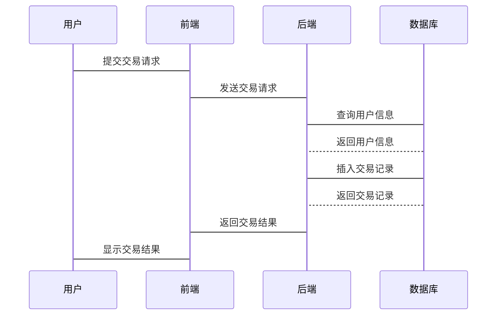

                 


# 《金融科技创新孵化平台》

---

## 关键词
- 金融科技
- 创新平台
- 区块链
- 人工智能
- 系统架构

---

## 摘要
《金融科技创新孵化平台》一文深入探讨了金融科技创新的背景、核心概念、技术原理及其在实际应用中的表现。文章通过分析区块链、人工智能和大数据等技术在金融领域的应用，揭示了金融科技创新平台的系统架构设计、功能模块及其对传统金融生态的颠覆性影响。通过具体的算法实现和项目实战，文章展示了如何构建高效、安全且可持续的金融科技创新平台，为金融机构和开发者提供了实践指导。

---

# 第1章: 金融科技创新的背景与意义

## 1.1 金融科技的定义与内涵
### 1.1.1 金融科技的定义
金融科技（FinTech）是通过技术手段创新金融产品、优化业务流程、提升效率并降低风险的新兴领域。其核心在于利用大数据、人工智能、区块链等技术，重构传统金融体系。

### 1.1.2 金融科技的核心特征
1. **数字化**：从传统纸质业务向线上化、自动化转变。
2. **智能化**：利用AI技术实现精准营销、智能风控。
3. **去中心化**：区块链技术的应用打破了传统金融的中心化模式。
4. **实时性**：高频交易、实时数据分析要求系统具备极高的响应速度。

### 1.1.3 金融科技对传统金融的变革作用
- **提升效率**：通过技术手段减少人工干预，降低运营成本。
- **增强体验**：个性化服务、实时反馈提升了用户体验。
- **降低风险**：智能风控系统能够提前预警并规避潜在风险。

## 1.2 金融科技创新的背景
### 1.2.1 数字化浪潮的推动
互联网、大数据、云计算等技术的快速发展为金融科技创新提供了技术基础。

### 1.2.2 技术进步与金融需求的结合
金融机构对技术的需求日益增长，而技术的进步为金融行业提供了新的解决方案。

### 1.2.3 金融监管与创新的平衡
在鼓励创新的同时，监管机构需要确保金融系统的稳定性和安全性。

## 1.3 金融科技创新平台的重要性
### 1.3.1 平台在金融创新中的角色
- **技术赋能**：提供先进的技术工具和解决方案。
- **资源整合**：连接金融机构、科技公司和用户。
- **生态构建**：打造开放、协作的金融创新生态系统。

### 1.3.2 平台如何促进金融生态的优化
- **数据共享**：打破信息孤岛，提高资源利用率。
- **服务创新**：推动金融产品和服务模式的创新。
- **风险控制**：通过技术手段降低金融风险。

### 1.3.3 平台对金融机构的赋能作用
- **技术支撑**：帮助金融机构快速实现数字化转型。
- **业务创新**：提供新的业务模式和盈利点。
- **成本降低**：通过技术手段降低运营成本。

---

# 第2章: 金融科技创新平台的核心概念与联系

## 2.1 金融科技创新平台的概念
### 2.1.1 平台的定义
金融科技创新平台是一个基于先进 technologies 的开放平台，旨在为金融机构、科技公司和用户提供创新的金融解决方案。

### 2.1.2 平台的核心要素
1. **技术基础设施**：包括云平台、大数据平台、AI平台等。
2. **金融服务模块**：如支付、借贷、投资等。
3. **数据共享机制**：实现数据的安全共享与分析。
4. **生态系统**：连接多方参与者，形成协同效应。

### 2.1.3 平台的功能模块
- **用户身份验证**：确保用户信息的安全性。
- **金融服务提供**：提供多样化的金融产品。
- **数据分析与风控**：通过大数据和AI技术进行风险评估。
- **智能合约**：基于区块链技术实现自动化的金融合约。

## 2.2 核心概念的原理
### 2.2.1 金融科技创新的驱动因素
- **技术进步**：如区块链、人工智能的发展。
- **市场需求**：用户对个性化、便捷金融服务的需求。
- **政策支持**：政府对金融科技的鼓励与规范。

### 2.2.2 平台的生态系统构建
- **参与者**：金融机构、科技公司、用户。
- **协作机制**：通过平台实现资源整合和协同创新。
- **价值传递**：平台为各方提供价值，实现共赢。

### 2.2.3 平台的可持续发展机制
- **盈利模式**：通过服务收费、数据变现等方式实现盈利。
- **技术创新**：持续投入研发，保持技术领先。
- **生态扩展**：吸引更多参与者加入平台，扩大影响力。

## 2.3 核心概念的对比分析
### 2.3.1 传统金融与金融科技的对比
| **维度** | **传统金融** | **金融科技** |
|----------|--------------|--------------|
| 服务方式 | 线下为主      | 线上为主      |
| 交易效率 | 低            | 高            |
| 成本     | 高            | 低            |
| 风险控制 | 依赖人工      | 依赖技术      |

### 2.3.2 不同金融创新平台的对比
| **平台类型** | **区块链平台** | **AI风控平台** | **大数据分析平台** |
|--------------|----------------|----------------|--------------------|
| 核心技术     | 区块链          | 人工智能        | 大数据            |
| 应用场景     | 数字货币、智能合约 | 风险控制       | 金融数据分析       |
| 优势         | 去中心化、不可篡改 | 高精度、高效率 | 数据全面性         |

### 2.3.3 平台与金融机构的关系
- **平台为金融机构提供技术支持**：帮助金融机构实现数字化转型。
- **金融机构为平台提供应用场景**：通过实际业务需求推动平台功能完善。
- **双方共同促进金融创新**：平台与金融机构合作，推出创新金融产品。

---

# 第3章: 金融科技创新平台的算法原理

## 3.1 区块链技术在金融平台中的应用
### 3.1.1 区块链的工作原理
区块链通过分布式账本、共识机制和智能合约实现去中心化的信任机制。

### 3.1.2 区块链在金融交易中的应用
- **跨境支付**：降低交易成本，提高效率。
- **智能合约**：自动执行合同条款，减少人为干预。
- **数据存储**：确保数据的安全性和不可篡改性。

### 3.1.3 区块链的共识机制
- **工作量证明（PoW）**：比特币采用的共识机制。
- **权益证明（PoS）**：以太坊采用的共识机制。
- **实用拜占庭容错（PBFT）**：适用于企业级区块链。

## 3.2 人工智能在金融风控中的应用
### 3.2.1 人工智能的基本原理
人工智能通过机器学习、深度学习等技术，从数据中提取特征并进行预测。

### 3.2.2 人工智能在金融风控中的具体应用
- **信用评估**：通过机器学习模型评估客户的信用风险。
- **欺诈检测**：利用异常检测技术识别 fraudulent transactions。
- **风险预警**：通过实时数据分析预测潜在风险。

### 3.2.3 人工智能算法的优缺点
- **优点**：高精度、自动化、适应性强。
- **缺点**：需要大量数据支持、模型易受攻击、解释性差。

## 3.3 大数据技术在金融分析中的应用
### 3.3.1 大数据的定义与特点
大数据指的是海量、高增长率、多样化特征的数据集合。

### 3.3.2 大数据在金融分析中的应用场景
- **市场预测**：通过分析历史数据预测市场趋势。
- **客户画像**：利用大数据构建客户画像，进行精准营销。
- **风险评估**：通过大数据分析评估客户的信用风险。

### 3.3.3 大数据分析的挑战与解决方案
- **挑战**：数据量大、数据类型多样、数据来源复杂。
- **解决方案**：分布式计算、数据清洗、特征工程。

---

# 第4章: 金融科技创新平台的系统架构设计

## 4.1 问题场景分析
### 4.1.1 金融交易中的痛点
- **交易效率低**：传统交易流程繁琐，耗时长。
- **交易成本高**：中间环节多，增加了交易成本。
- **交易风险高**：信息不对称导致欺诈行为频发。

### 4.1.2 金融机构的数字化转型需求
- **提升效率**：通过技术手段优化业务流程。
- **降低成本**：减少人工干预，降低运营成本。
- **提高安全性**：通过技术手段增强交易安全性。

### 4.1.3 用户对金融服务的新要求
- **便捷性**：用户希望获得快速、便捷的金融服务。
- **个性化**：用户需要个性化的金融产品和服务。
- **安全性**：用户关注数据安全和隐私保护。

## 4.2 系统功能设计
### 4.2.1 用户模块
- **用户注册与登录**：实现用户身份验证。
- **用户信息管理**：包括个人信息维护、账户管理等。
- **用户服务请求**：用户提交金融需求，如借贷、投资等。

### 4.2.2 交易模块
- **订单创建**：用户提交交易订单。
- **订单处理**：系统自动处理订单，包括审核、执行等步骤。
- **订单状态查询**：用户可以实时查询订单状态。

### 4.2.3 风控模块
- **风险评估**：通过大数据和AI技术评估交易风险。
- **风险预警**：系统实时监控交易行为，发现异常及时预警。
- **风险控制**：根据风险评估结果，采取相应的控制措施。

### 4.2.4 数据分析模块
- **数据采集**：采集交易数据、用户行为数据等。
- **数据分析**：对数据进行清洗、建模、分析，生成分析报告。
- **数据可视化**：通过图表等方式直观展示数据分析结果。

## 4.3 系统架构设计
### 4.3.1 分层架构设计
系统分为前端、业务逻辑层和数据存储层，各层之间通过API进行通信。

### 4.3.2 微服务架构设计
将系统功能模块化，每个模块作为一个独立的服务，通过服务调用实现功能组合。

### 4.3.3 高可用性设计
通过负载均衡、容灾备份等技术确保系统的高可用性。

## 4.4 系统接口设计
### 4.4.1 API设计原则
- **RESTful API**：遵循RESTful原则，确保API的简洁性和可扩展性。
- **版本控制**：为API制定版本控制策略，确保兼容性和稳定性。
- **安全设计**：通过HTTPS、JWT等技术确保API的安全性。

### 4.4.2 API实现
- **身份验证API**：实现用户身份验证功能。
- **交易API**：实现交易订单的创建、查询等功能。
- **风控API**：实现风险评估、预警等功能。

## 4.5 系统交互设计
### 4.5.1 用户与系统交互流程
用户通过前端界面提交请求，系统通过后端逻辑处理请求并返回响应。

### 4.5.2 系统交互序列图


---

# 第5章: 项目实战

## 5.1 环境搭建
### 5.1.1 技术选型
- **前端**：React或Vue.js
- **后端**：Node.js或Python（Django/Flask）
- **数据库**：MySQL或MongoDB
- **开发工具**：VS Code或IntelliJ IDEA

### 5.1.2 环境安装
1. 安装Node.js和npm：
   ```bash
   curl -o- https://raw.githubusercontent.com/nvm-sh/nvm/v0.39.5/install.sh | bash
   nvm install --lts
   ```
2. 安装Python：
   ```bash
   apt-get install python3
   ```
3. 安装数据库：
   ```bash
   sudo apt-get install mysql-server
   ```

## 5.2 系统核心实现
### 5.2.1 核心代码实现
#### 后端代码示例（Python）
```python
from flask import Flask, request, jsonify

app = Flask(__name__)

@app.route('/api/transaction', methods=['POST'])
def process_transaction():
    data = request.json
    # 处理交易逻辑
    return jsonify({'status': 'success', 'message': 'Transaction processed'})

if __name__ == '__main__':
    app.run(debug=True)
```

#### 前端代码示例（React）
```javascript
import React from 'react';
import axios from 'axios';

function TransactionForm() {
  const handleSubmit = async (e) => {
    e.preventDefault();
    try {
      const response = await axios.post('/api/transaction', {
        amount: amount,
        fromAccount: fromAccount,
        toAccount: toAccount
      });
      console.log('Transaction successful:', response.data);
    } catch (error) {
      console.error('Transaction failed:', error);
    }
  };

  return (
    <form onSubmit={handleSubmit}>
      <input type="number" name="amount" />
      <input type="text" name="fromAccount" />
      <input type="text" name="toAccount" />
      <button type="submit">Submit</button>
    </form>
  );
}

export default TransactionForm;
```

### 5.2.2 代码应用解读与分析
- **后端逻辑**：处理交易请求，与数据库交互。
- **前端逻辑**：收集用户输入，发送交易请求，显示交易结果。
- **数据库交互**：记录交易信息，确保数据一致性。

### 5.2.3 实际案例分析
以一个简单的支付场景为例，展示如何通过前端、后端和数据库实现一次支付交易。

### 5.2.4 详细讲解剖析
- **交易流程**：用户提交支付请求，系统处理请求并更新数据库。
- **异常处理**：系统检测交易失败并通知用户。
- **日志记录**：记录交易日志，便于后续排查问题。

## 5.3 项目小结
### 5.3.1 核心代码实现总结
- **后端代码**：实现了交易处理逻辑，确保交易请求的正确处理。
- **前端代码**：实现了用户界面，收集用户输入并提交交易请求。
- **数据库设计**：设计了合理的数据库结构，确保数据的完整性和一致性。

### 5.3.2 项目实战中的注意事项
- **安全性**：确保交易过程中的数据安全，防止数据泄露。
- **性能优化**：优化系统性能，确保高并发情况下的系统稳定性。
- **用户体验**：注重用户体验设计，提升用户的使用感受。

---

# 第6章: 最佳实践 tips、小结、注意事项、拓展阅读

## 6.1 小结
金融科技创新平台的构建需要综合运用多种技术手段，包括区块链、人工智能和大数据等。通过合理的系统架构设计和功能模块划分，可以实现高效、安全且可持续的金融科技创新平台。

## 6.2 注意事项
- **数据安全**：确保用户数据的安全性和隐私性。
- **系统稳定性**：通过高可用性设计确保系统的稳定运行。
- **技术选型**：根据实际需求选择合适的技术方案，避免盲目跟风。

## 6.3 拓展阅读
- **区块链技术**：深入学习区块链的工作原理及其在金融领域的应用。
- **人工智能**：研究机器学习、深度学习在金融风控中的应用。
- **系统架构设计**：学习分布式系统、微服务架构等设计模式。

---

## 作者：AI天才研究院/AI Genius Institute & 禅与计算机程序设计艺术 /Zen And The Art of Computer Programming

