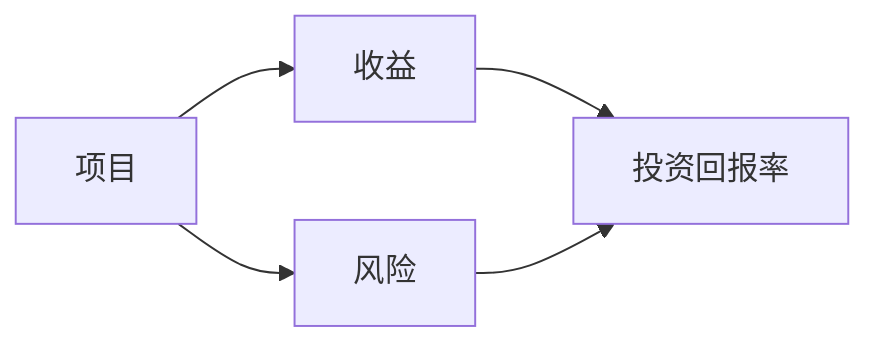

                 


# 《金融科技创新项目ROI预测与风险评估》

> 关键词：金融科技创新，ROI预测，风险评估，数学模型，算法原理，系统架构

> 摘要：本文探讨了金融科技创新项目中的投资回报预测与风险评估的重要性，通过分析核心概念、数学模型和系统设计，提供了一种系统的方法来优化项目 ROI 并降低风险。文章详细讲解了线性回归、贝叶斯网络和蒙特卡洛模拟等算法，并结合实际案例展示了如何在金融项目中应用这些方法。

---

# 第一部分: 金融科技创新项目背景与概述

# 第1章: 金融科技创新项目背景

## 1.1 金融科技创新的基本概念

### 1.1.1 金融科技创新的定义
金融科技创新是指利用新技术（如区块链、人工智能、大数据等）对金融服务和产品进行创新和优化。这些技术能够提高效率、降低成本、增强客户体验并创造新的业务模式。

### 1.1.2 金融科技创新的核心特征
金融科技创新的核心特征包括：
1. **技术驱动**：依赖于新兴技术的创新。
2. **场景化**：针对特定金融场景（如支付、借贷、投资）提供解决方案。
3. **数据驱动**：利用大数据和人工智能进行决策优化。
4. **合规性**：必须符合金融监管要求。

### 1.1.3 金融科技创新的边界与外延
金融科技创新的边界在于技术创新必须服务于金融业务，而外延则涉及技术在金融领域的广泛应用，如智能投顾、区块链金融等。

## 1.2 金融科技创新项目的现状与趋势

### 1.2.1 全球金融科技创新的现状
全球范围内，金融科技创新正在快速发展。例如，区块链技术被广泛应用于跨境支付和智能合约；人工智能被用于信用评估和欺诈检测。

### 1.2.2 中国金融科技创新的发展阶段
中国金融科技创新正处于快速发展阶段，政府政策支持、资本投入增加以及技术进步推动了金融科技创新的广泛应用。

### 1.2.3 金融科技创新的未来趋势
未来的金融科技创新将更加注重数据驱动、智能化和合规性，同时区块链、人工智能和大数据技术将在金融领域发挥更重要的作用。

## 1.3 ROI预测与风险评估的重要性

### 1.3.1 项目 ROI 的核心意义
ROI（投资回报率）是衡量金融科技创新项目成功与否的重要指标。通过预测 ROI，可以评估项目的经济效益，优化资源配置。

### 1.3.2 风险评估在金融项目中的作用
金融科技创新项目往往伴随着高风险，风险评估能够帮助项目方识别潜在风险，制定应对策略，降低项目失败的可能性。

### 1.3.3 ROI与风险评估的相互关系
ROI预测和风险评估相辅相成。高 ROI 的项目可能伴随着高风险，而低风险的项目可能 ROI 较低。因此，在项目决策中需要在 ROI 和风险之间找到平衡点。

## 1.4 本章小结
本章介绍了金融科技创新的基本概念、现状与趋势，并重点阐述了 ROI 预测与风险评估的重要性。这些内容为后续章节的深入分析奠定了基础。

---

# 第二部分: ROI预测与风险评估的核心概念

# 第2章: ROI预测与风险评估的核心概念

## 2.1 ROI预测的基本原理

### 2.1.1 ROI的计算公式
ROI 的计算公式为：
$$ ROI = \frac{净收益}{投资成本} \times 100\% $$

### 2.1.2 ROI预测的关键因素
ROI 预测的关键因素包括市场需求、技术可行性、竞争环境、政策法规和项目周期。

### 2.1.3 ROI预测的数学模型
常用的 ROI 预测模型包括线性回归模型和时间序列模型。线性回归模型用于分析变量之间的关系，时间序列模型用于预测未来的 ROI 值。

## 2.2 风险评估的核心要素

### 2.2.1 风险的定义与分类
风险是指在金融项目中可能发生的损失或偏离预期目标的情况。常见的风险类型包括市场风险、信用风险、操作风险和合规风险。

### 2.2.2 风险评估的关键指标
风险评估的关键指标包括风险概率、风险影响、风险值和风险应对策略。

### 2.2.3 风险与收益的平衡关系
在金融项目中，风险与收益呈正相关关系。高风险的项目可能带来高 ROI，但也可能带来更大的损失。

## 2.3 ROI与风险评估的关联性分析

### 2.3.1 ROI预测中的风险因素
ROI 预测需要考虑市场风险、技术风险和政策风险等因素。

### 2.3.2 风险评估对 ROI 的影响
风险评估可以帮助项目方识别潜在风险，制定应对策略，从而优化 ROI 预测。

### 2.3.3 ROI与风险评估的协同优化
通过 ROI 预测和风险评估的协同优化，可以在项目决策中找到最佳平衡点，实现风险可控下的最大 ROI。

## 2.4 核心概念对比分析

### 2.4.1 ROI与风险评估的特征对比（表格形式）
| 特性 | ROI预测 | 风险评估 |
|------|---------|----------|
| 目标 | 最大化收益 | 最小化风险 |
| 方法 | 统计模型、机器学习 | 风险矩阵、蒙特卡洛模拟 |
| 输入 | 市场数据、技术参数 | 风险事件、概率分布 |

## 2.5 实体关系图（ER图）展示


## 2.6 本章小结
本章详细分析了 ROI 预测和风险评估的核心概念及其关联性，通过对比分析和 ER 图展示了它们之间的关系，为后续的数学模型分析奠定了基础。

---

# 第三部分: ROI预测与风险评估的数学模型与算法

# 第3章: ROI预测的数学模型

## 3.1 ROI预测的线性回归模型

### 3.1.1 线性回归的基本原理
线性回归是一种统计学方法，用于分析变量之间的线性关系。在 ROI 预测中，可以使用多个自变量（如市场需求、成本）来预测 ROI。

### 3.1.2 ROI预测的线性回归公式
$$ ROI = \beta_0 + \beta_1 X_1 + \beta_2 X_2 + \epsilon $$
其中，$X_1$ 和 $X_2$ 是影响 ROI 的自变量，$\beta_0$ 是截距，$\beta_1$ 和 $\beta_2$ 是回归系数，$\epsilon$ 是误差项。

### 3.1.3 算法流程图


### 3.1.4 Python代码实现
```python
import pandas as pd
import numpy as np
from sklearn.linear_model import LinearRegression

# 数据准备
data = pd.DataFrame({
    'X1': [1, 2, 3, 4, 5],
    'X2': [2, 3, 5, 7, 11],
    'ROI': [10, 15, 20, 25, 30]
})

# 模型训练
model = LinearRegression()
model.fit(data[['X1', 'X2']], data['ROI'])

# 模型预测
new_data = pd.DataFrame({
    'X1': [6],
    'X2': [13]
})
predicted ROI = model.predict(new_data[['X1', 'X2']])
print(predicted ROI)
```

## 3.2 基于贝叶斯网络的风险评估模型

### 3.2.1 贝叶斯网络的基本原理
贝叶斯网络是一种概率图模型，用于表示变量之间的依赖关系。在风险评估中，贝叶斯网络可以用于计算不同风险事件发生的概率。

### 3.2.2 贝叶斯网络的风险评估公式
$$ P(R|E) = \frac{P(E|R) \cdot P(R)}{P(E)} $$
其中，$R$ 表示风险事件，$E$ 表示证据。

### 3.2.3 贝叶斯网络的应用场景
贝叶斯网络适用于处理复杂的风险因素，如多个风险事件之间的相互影响。

## 3.3 基于蒙特卡洛模拟的 ROI 预测

### 3.3.1 蒙特卡洛模拟的基本原理
蒙特卡洛模拟是一种通过随机采样来估计复杂问题的方法。在 ROI 预测中，可以模拟不同的市场情景，估计 ROI 的分布。

### 3.3.2 蒙特卡洛模拟的实现步骤
1. 确定 ROI 的影响因素及其概率分布。
2. 生成随机样本。
3. 计算每个样本的 ROI。
4. 统计 ROI 的分布情况。

### 3.3.3 Python代码实现
```python
import numpy as np

# 参数设置
n_samples = 10000
mean_return = 0.1
std_return = 0.2

# 生成 ROI 样本
roi_samples = np.random.normal(mean_return, std_return, n_samples)

# 计算 ROI 的分布
import matplotlib.pyplot as plt
plt.hist(roi_samples, bins=50)
plt.xlabel('ROI')
plt.ylabel('Frequency')
plt.title('ROI Distribution')
plt.show()
```

## 3.4 本章小结
本章介绍了 ROI 预测和风险评估的数学模型，包括线性回归、贝叶斯网络和蒙特卡洛模拟，并通过代码示例展示了它们的应用。

---

# 第四部分: 系统分析与架构设计

## 4.1 系统分析与需求分析

### 4.1.1 项目背景介绍
金融科技创新项目需要结合 ROI 预测和风险评估来优化决策。

### 4.1.2 系统功能需求
系统需要实现 ROI 预测、风险评估、风险预警和决策支持等功能。

### 4.1.3 系统功能模块划分
系统功能模块包括数据采集模块、数据分析模块、风险评估模块和决策支持模块。

## 4.2 系统架构设计

### 4.2.1 系统架构图


### 4.2.2 数据流图


### 4.2.3 接口设计
系统需要提供 API 接口，用于与其他系统的集成。

## 4.3 系统实现与优化

### 4.3.1 系统实现步骤
1. 数据采集与预处理。
2. 数据分析与建模。
3. 风险评估与预警。
4. 决策支持与优化。

### 4.3.2 系统优化建议
1. 使用分布式计算优化数据分析效率。
2. 定期更新模型参数以适应市场变化。

---

# 第五部分: 项目实战

## 5.1 项目环境安装与配置

### 5.1.1 环境需求
需要安装 Python、Jupyter Notebook、Pandas、NumPy 和 Scikit-learn 等工具。

### 5.1.2 环境配置代码
```bash
pip install numpy pandas scikit-learn matplotlib
```

## 5.2 核心代码实现

### 5.2.1 ROI预测模型实现
```python
import pandas as pd
from sklearn.linear_model import LinearRegression
from sklearn.metrics import mean_squared_error

# 数据加载
data = pd.read_csv('project_data.csv')

# 模型训练
model = LinearRegression()
model.fit(data[['X1', 'X2']], data['ROI'])

# 模型预测
new_data = pd.DataFrame({
    'X1': [6],
    'X2': [13]
})
predicted ROI = model.predict(new_data)
print(predicted ROI)

# 模型评估
actual ROI = [35]
print(mean_squared_error(actual ROI, predicted ROI))
```

### 5.2.2 风险评估模型实现
```python
import numpy as np
from sklearn.naive_bayes import GaussianNB

# 数据加载
data = pd.read_csv('risk_data.csv')

# 模型训练
model = GaussianNB()
model.fit(data[['X1', 'X2']], data['Risk'])

# 风险预测
new_data = pd.DataFrame({
    'X1': [7],
    'X2': [14]
})
predicted_risk = model.predict(new_data)
print(predicted_risk)
```

## 5.3 实际案例分析

### 5.3.1 案例背景介绍
以某金融科技公司开发的智能投顾系统为例，分析 ROI 预测和风险评估的应用。

### 5.3.2 数据分析与建模
使用历史数据训练 ROI 预测模型和风险评估模型，评估模型的准确性和可靠性。

### 5.3.3 模型优化与验证
通过交叉验证优化模型参数，提高预测精度。

## 5.4 项目总结与经验分享

### 5.4.1 项目成果
成功实现了 ROI 预测和风险评估系统，提高了项目决策的科学性和准确性。

### 5.4.2 实践经验
1. 数据质量和完整性对模型性能影响重大。
2. 模型需要定期更新以适应市场变化。
3. 风险评估需要结合定量分析和定性判断。

---

# 第六部分: 总结与展望

## 6.1 本章总结

### 6.1.1 核心内容回顾
本文系统地探讨了金融科技创新项目中的 ROI 预测与风险评估问题，介绍了多种数学模型和算法，并结合实际案例展示了它们的应用。

### 6.1.2 方法总结
通过 ROI 预测和风险评估的协同优化，可以在金融科技创新项目中实现风险可控下的最大 ROI。

## 6.2 未来展望

### 6.2.1 技术展望
随着人工智能和大数据技术的不断发展，金融科技创新项目中的 ROI 预测和风险评估将更加智能化和精准化。

### 6.2.2 应用展望
未来，金融科技创新将更加注重数据驱动和智能化， ROI 预测和风险评估将在更多金融场景中得到广泛应用。

---

# 作者：AI天才研究院/AI Genius Institute & 禅与计算机程序设计艺术 /Zen And The Art of Computer Programming

---

通过以上内容，我们详细探讨了金融科技创新项目中的 ROI 预测与风险评估问题，从理论到实践，为读者提供了一个全面的解决方案。

