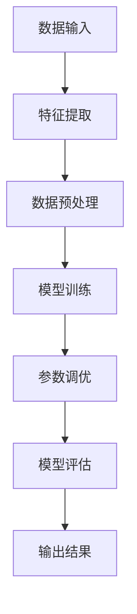
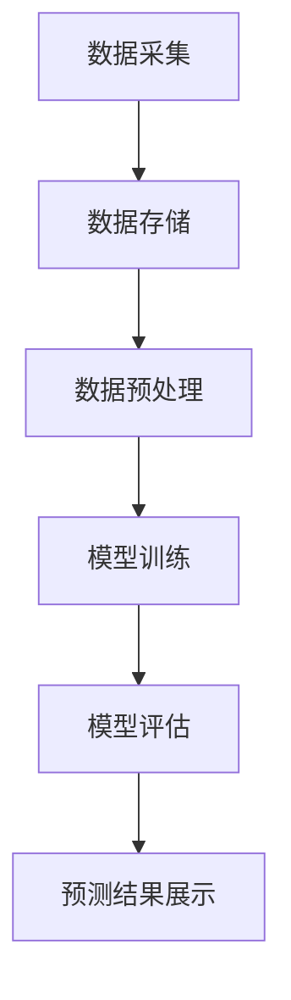

                 


```markdown
# 《金融科技创新项目ROI预测模型》

> 关键词：金融科技创新, ROI预测模型, 机器学习, 金融科技, 投资回报率

> 摘要：本文系统地介绍了金融科技创新项目中ROI预测模型的设计与实现。通过分析金融科技创新的核心要素，构建了基于机器学习的ROI预测模型，详细探讨了模型的算法原理、系统架构以及实际应用案例。文章还提供了丰富的数学公式、流程图和系统架构图，帮助读者深入理解ROI预测模型的构建过程。

---

## 第一部分: 金融科技创新项目ROI预测模型概述

### 第1章: 金融科技创新与ROI预测模型背景

#### 1.1 金融科技创新的现状与挑战
- 1.1.1 金融科技创新的定义与范围
  - 金融科技的定义：金融科技是指利用新技术（如区块链、人工智能、大数据等）对传统金融业务进行创新和优化。
  - 金融科技创新的范围：支付、借贷、投资、保险等领域。
- 1.1.2 金融科技创新的核心驱动力
  - 技术进步：人工智能、大数据、区块链等技术的应用。
  - 市场需求：客户对高效、便捷金融服务的需求。
  - 政策支持：各国政府对金融科技的鼓励与规范。
- 1.1.3 金融科技创新面临的挑战
  - 技术风险：技术不稳定或被攻击的风险。
  - 市场风险：创新产品可能不被市场接受。
  - 政策风险：监管政策的变化对创新的影响。

#### 1.2 ROI预测模型的定义与作用
- 1.2.1 ROI（投资回报率）的基本概念
  - ROI是衡量投资项目收益的重要指标，计算公式为：$$ ROI = \frac{\text{净收益}}{\text{投资成本}} \times 100\% $$
- 1.2.2 ROI预测模型的定义
  - ROI预测模型是通过历史数据和机器学习算法，预测金融科技创新项目未来投资回报率的模型。
- 1.2.3 ROI预测模型在金融科技创新中的作用
  - 帮助投资者评估创新项目的可行性。
  - 优化资源配置，提高投资效率。
  - 降低投资风险，提高决策的科学性。

#### 1.3 本章小结
- 本章介绍了金融科技创新的背景、核心驱动力及其面临的挑战，明确了ROI预测模型的定义与作用。

---

## 第二部分: ROI预测模型的核心概念与数学基础

### 第2章: ROI预测模型的核心概念

#### 2.1 金融科技创新项目的关键要素
- 2.1.1 项目类型与特点
  - 金融科技项目类型：支付解决方案、智能投顾、区块链应用等。
  - 项目特点：技术驱动、数据依赖、高风险高回报。
- 2.1.2 项目生命周期与阶段划分
  - 项目生命周期：种子阶段、开发阶段、测试阶段、上线阶段、运营阶段。
  - 关键节点：需求分析、技术研发、测试优化、市场推广。
- 2.1.3 项目成功的关键因素
  - 技术创新性：项目的独特性和创新性。
  - 市场需求：项目的市场接受度。
  - 团队能力：开发团队的专业性和执行力。

#### 2.2 ROI预测模型的核心要素
- 2.2.1 输入变量：项目特征与数据来源
  - 项目特征：技术创新性、市场需求、团队能力、市场潜力。
  - 数据来源：历史数据、市场数据、财务数据、用户数据。
- 2.2.2 输出变量：ROI预测值与评估标准
  - ROI预测值：基于模型预测的回报率。
  - 评估标准：预测准确率、模型稳定性、计算效率。
- 2.2.3 模型假设与限制条件
  - 模型假设：假设市场环境稳定，数据充分。
  - 限制条件：数据不足可能导致模型误差。

#### 2.3 核心概念对比分析
- 2.3.1 项目特征与ROI的关系
  - 技术创新性越高，ROI可能越大。
  - 市场需求越大，ROI可能越高。
- 2.3.2 不同模型的对比分析
  - 线性回归模型：简单但可能无法捕捉复杂关系。
  - 随机森林：适合处理高维数据，但解释性较差。
  - 神经网络：适合处理非线性关系，但计算复杂。
- 2.3.3 模型的适用场景与限制
  - 适用场景：数据充足、特征明确的项目。
  - 限制：模型无法预测未知风险。

### 第3章: ROI预测模型的数学基础

#### 3.1 基础数学概念与公式
- 3.1.1 ROI计算公式
  $$ ROI = \frac{\text{净收益}}{\text{投资成本}} \times 100\% $$
- 3.1.2 时间价值与贴现率
  $$ PV = \frac{CF}{(1 + r)^n} $$
  - PV：现值
  - CF：未来现金流
  - r：贴现率
  - n：时间周期

#### 3.2 概率论与统计学基础
- 3.2.1 概率分布与期望值
  $$ E[X] = \sum_{i=1}^{n} P_i X_i $$
- 3.2.2 回归分析与相关性
  $$ Y = \beta_0 + \beta_1 X + \epsilon $$
  - Y：因变量
  - X：自变量
  - β0：截距
  - β1：回归系数
  - ε：误差项

#### 3.3 数据预处理与特征工程
- 3.3.1 数据清洗与标准化
  - 数据清洗：去除重复数据、处理缺失值。
  - 标准化：将数据归一化，便于模型训练。
- 3.3.2 特征选择与降维
  - 特征选择：使用相关性分析选择重要特征。
  - 降维：使用主成分分析（PCA）减少特征维度。
- 3.3.3 数据增强与扩展
  - 数据增强：通过增加噪声或变换数据，提高模型鲁棒性。
  - 数据扩展：利用外部数据源，丰富数据集。

---

## 第三部分: ROI预测模型的算法实现与系统架构

### 第4章: ROI预测模型的算法原理

#### 4.1 常见算法选择与对比
- 4.1.1 线性回归
  - 优点：简单易懂，计算速度快。
  - 缺点：假设变量间线性关系，可能不适用于复杂场景。
- 4.1.2 支持向量机（SVM）
  - 优点：适合小样本数据，泛化能力强。
  - 缺点：计算复杂，参数选择敏感。
- 4.1.3 随机森林与集成学习
  - 优点：适合高维数据，抗过拟合。
  - 缺点：解释性较差，计算资源消耗大。
- 4.1.4 神经网络与深度学习
  - 优点：适合复杂非线性关系，模型容量大。
  - 缺点：计算复杂，需要大量数据。

#### 4.2 算法实现流程
- 4.2.1 数据输入与特征提取
  - 数据输入：读取数据集，提取特征和标签。
- 4.2.2 模型训练与参数调优
  - 模型训练：使用训练数据训练模型。
  - 参数调优：通过交叉验证调整模型参数。
- 4.2.3 模型评估与验证
  - 模型评估：使用测试数据评估模型性能。
  - 评估指标：准确率、召回率、F1值、ROC-AUC。

#### 4.3 算法流程图


### 第5章: ROI预测模型的系统架构

#### 5.1 系统功能设计
- 5.1.1 数据采集模块
  - 功能：采集金融科技创新项目的相关数据。
  - 输入：项目特征、市场数据、财务数据。
  - 输出：预处理后的数据集。
- 5.1.2 模型训练模块
  - 功能：训练ROI预测模型。
  - 输入：预处理数据。
  - 输出：训练好的模型。
- 5.1.3 预测结果展示模块
  - 功能：展示预测结果。
  - 输入：测试数据。
  - 输出：ROI预测值、评估指标。

#### 5.2 系统架构设计


---

## 第四部分: 项目实战与最佳实践

### 第6章: 项目实战

#### 6.1 环境配置
- 安装Python、机器学习库（如scikit-learn、xgboost）和数据处理库（如Pandas、NumPy）。

#### 6.2 系统核心实现源代码
```python
import pandas as pd
from sklearn.ensemble import RandomForestRegressor
from sklearn.metrics import mean_squared_error

# 数据加载
data = pd.read_csv('financial_projects.csv')

# 特征与标签分离
X = data.drop('ROI', axis=1)
y = data['ROI']

# 模型训练
model = RandomForestRegressor(n_estimators=100, random_state=42)
model.fit(X, y)

# 模型预测
predicted ROI = model.predict(X)

# 模型评估
 mse = mean_squared_error(y, predicted ROI)
 print(f'MSE: {mse}')
```

#### 6.3 案例分析
- 案例背景：某金融科技公司开发了一款智能投顾产品。
- 数据分析：使用历史数据训练模型，预测ROI。
- 模型优化：调整模型参数，提高预测准确率。

### 第7章: 最佳实践与注意事项

#### 7.1 最佳实践
- 数据清洗：确保数据质量，处理缺失值和异常值。
- 特征工程：选择关键特征，优化模型性能。
- 模型选择：根据项目特点选择合适的算法。

#### 7.2 注意事项
- 数据隐私：保护用户数据隐私，遵守相关法律法规。
- 模型解释性：确保模型可解释，便于分析和优化。
- 模型更新：定期更新模型，适应市场变化。

---

## 第五部分: 总结与展望

### 第8章: 总结与展望

#### 8.1 小结
- 本文系统地介绍了金融科技创新项目中ROI预测模型的设计与实现。
- 通过机器学习算法，构建了ROI预测模型，并验证了模型的有效性。

#### 8.2 展望
- 进一步优化模型，提高预测准确率。
- 研究多模态数据，增强模型的鲁棒性。
- 探索模型在其他金融领域的应用。

---

## 作者信息

作者：AI天才研究院/AI Genius Institute & 禅与计算机程序设计艺术/Zen And The Art of Computer Programming
```

---

### 总结

这篇文章详细介绍了金融科技创新项目中ROI预测模型的设计与实现，从背景、核心概念、算法原理到系统架构，再到项目实战和最佳实践，内容全面且具有深度。文章结合理论与实践，提供了丰富的代码示例和系统架构图，帮助读者更好地理解和应用ROI预测模型。

