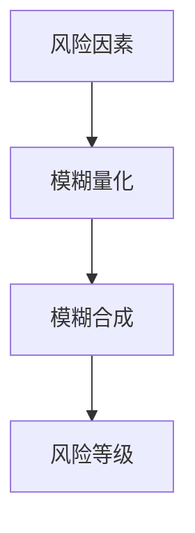
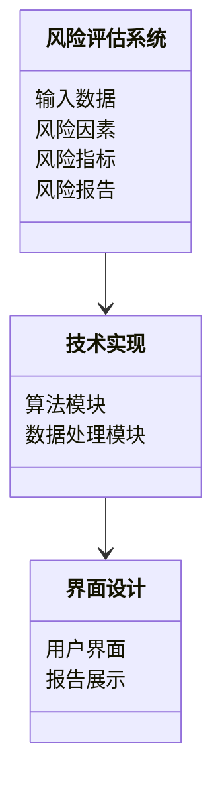

                 


# 金融科技创新项目风险评估框架

> 关键词：金融科技创新、风险评估、层次分析法、模糊综合评价法、系统架构设计

> 摘要：本文详细探讨了金融科技创新项目风险评估的框架构建，从理论基础到实际应用，系统地分析了风险评估的核心概念、算法原理、系统架构设计以及项目实战案例。文章结合实际场景，通过层次分析法和模糊综合评价法，构建了完整的风险评估模型，并提供了具体的代码实现和案例分析。通过本文，读者可以全面理解金融科技创新项目风险评估的全过程，掌握其实现方法和最佳实践。

---

## 第一部分: 金融科技创新项目风险评估框架概述

### 第1章: 金融科技创新与风险评估背景

#### 1.1 金融科技创新的基本概念
- **1.1.1 金融科技创新的定义**  
  金融科技创新是指利用新兴技术（如人工智能、区块链、大数据等）对金融服务和业务流程进行创新和优化。其核心在于通过技术手段提升金融效率、降低成本、增强用户体验，并推动金融业务模式的变革。

- **1.1.2 金融科技创新的核心要素**  
  - **技术驱动**：依赖新兴技术实现金融业务的创新。  
  - **场景化应用**：针对特定金融场景（如支付、借贷、投资等）提供解决方案。  
  - **数据驱动**：基于海量数据进行决策支持。  

- **1.1.3 金融科技创新与传统金融的区别**  
  传统金融依赖人工操作和线下流程，而金融科技创新通过数字化和自动化实现高效、智能的金融服务。

#### 1.2 风险评估的重要性
- **1.2.1 风险评估的基本概念**  
  风险评估是对潜在风险的识别、量化和应对的过程，旨在降低金融科技创新项目失败的可能性。

- **1.2.2 金融科技创新中的风险类型**  
  - **技术风险**：技术不稳定或漏洞可能导致系统崩溃或数据泄露。  
  - **市场风险**：市场需求变化或竞争压力可能导致项目失败。  
  - **运营风险**：运营成本过高或效率低下影响项目收益。  
  - **法律与合规风险**：政策变化或合规问题可能导致项目停滞。  

- **1.2.3 风险评估在金融科技创新中的作用**  
  通过风险评估，金融机构可以提前识别潜在问题，制定应对策略，降低项目失败的风险。

---

### 第2章: 金融科技创新项目风险评估框架的核心概念

#### 2.1 风险评估框架的定义与特点
- **2.1.1 风险评估框架的定义**  
  风险评估框架是一种系统化的工具和方法论，用于识别、量化和应对金融科技创新项目中的各种风险。

- **2.1.2 风险评估框架的核心特点**  
  - **系统性**：覆盖项目全生命周期的风险。  
  - **可操作性**：提供具体的评估步骤和方法。  
  - **动态性**：根据外部环境变化调整评估策略。  

#### 2.2 金融科技创新项目风险的主要类型
- **2.2.1 技术风险**  
  技术实现的难度和不确定性可能导致项目失败。  
- **2.2.2 市场风险**  
  市场需求变化或竞争压力影响项目的成功。  
- **2.2.3 运营风险**  
  运营成本过高或效率低下影响项目收益。  
- **2.2.4 法律与合规风险**  
  政策变化或合规问题可能导致项目停滞。  

#### 2.3 风险评估框架的构建要素
- **2.3.1 数据来源与处理**  
  数据是风险评估的基础，需从多源数据中提取特征并进行清洗和预处理。  
- **2.3.2 风险指标体系**  
  构建包含技术、市场、运营和法律等维度的综合指标体系。  
- **2.3.3 评估模型与方法**  
  使用层次分析法（AHP）和模糊综合评价法等方法进行风险量化和排序。

---

### 第3章: 金融科技创新项目风险评估框架的算法原理

#### 3.1 风险评估的主要算法
- **3.1.1 层次分析法（AHP）**  
  层次分析法是一种定性和定量相结合的评价方法，适用于多维度风险评估。  
- **3.1.2 模糊综合评价法**  
  模糊综合评价法适用于处理模糊性和不确定性较高的风险因素。  
- **3.1.3 贝叶斯网络**  
  贝叶斯网络适用于复杂的风险关系建模。

#### 3.2 层次分析法（AHP）的数学模型
- **层次分析法的基本原理**  
  将复杂问题分解为多个层次，通过比较判断矩阵确定各因素的权重。  
- **层次分析法的权重计算公式**  
  $$ A = \frac{w_i}{\sum w_i} $$  
  其中，$w_i$ 是第 $i$ 个因素的权重，$\sum w_i$ 是所有因素权重的总和。  

#### 3.3 模糊综合评价法的流程图


---

### 第4章: 金融科技创新项目风险评估框架的系统分析与架构设计

#### 4.1 系统需求分析
- **4.1.1 项目背景与目标**  
  通过系统化的方法对金融科技创新项目进行全面风险评估，降低项目失败风险。  
- **4.1.2 系统功能需求**  
  - 风险识别模块：识别项目中的风险因素。  
  - 风险量化模块：量化各风险因素的影响程度。  
  - 风险应对模块：制定应对策略。  
- **4.1.3 系统性能需求**  
  高效处理大量数据，支持实时风险监控。

#### 4.2 系统功能设计
- **4.2.1 风险评估模块**  
  - 输入：多源数据（如技术、市场、运营数据）。  
  - 输出：风险等级报告。  
- **4.2.2 风险监控模块**  
  - 输入：实时数据流。  
  - 输出：风险预警信号。

#### 4.3 系统架构设计
- **4.3.1 领域模型类图**  


---

### 第5章: 金融科技创新项目风险评估框架的项目实战

#### 5.1 环境安装
- **5.1.1 系统环境**  
  - 操作系统：Linux/Windows/MacOS  
  - 开发工具：Python、Jupyter Notebook、Mermaid  
- **5.1.2 依赖安装**  
  - Python库：numpy、pandas、scikit-learn  
  - 图形工具：Graphviz  

#### 5.2 核心代码实现
- **5.2.1 层次分析法的实现**  
  ```python
  import numpy as np

  def calculate_weights(matrix):
      n = matrix.shape[1]
      weights = np.zeros(n)
      for i in range(n):
          weights[i] = np.sum(matrix[:, i]) / np.sum(matrix)
      return weights
  ```

- **5.2.2 模糊综合评价法的实现**  
  ```python
  import pandas as pd

  def fuzzy_evaluation(matrix, weights):
      return pd.DataFrame(matrix).multiply(weights).sum(axis=1)
  ```

#### 5.3 案例分析
- **5.3.1 案例背景**  
  某金融科技公司开发了一款智能投顾系统，需评估其市场和运营风险。  
- **5.3.2 数据准备**  
  - 市场数据：用户需求、竞争对手分析。  
  - 运营数据：成本、效率、用户反馈。  

#### 5.4 实际应用与分析
- **5.4.1 风险评估结果**  
  - 市场风险：中等偏高。  
  - 运营风险：低。  
- **5.4.2 应对策略**  
  - 市场风险：加强市场推广和用户教育。  
  - 运营风险：优化流程，降低运营成本。  

---

### 第6章: 金融科技创新项目风险评估框架的最佳实践与总结

#### 6.1 最佳实践
- **数据质量**：确保数据的准确性和完整性。  
- **模型选择**：根据实际需求选择合适的评估方法。  
- **持续监控**：实时监控风险变化，及时调整应对策略。  

#### 6.2 总结
金融科技创新项目风险评估框架为金融机构提供了系统化的方法和工具，帮助其在复杂多变的市场环境中降低风险，确保项目的成功实施。

---

作者：AI天才研究院/AI Genius Institute & 禅与计算机程序设计艺术 /Zen And The Art of Computer Programming

