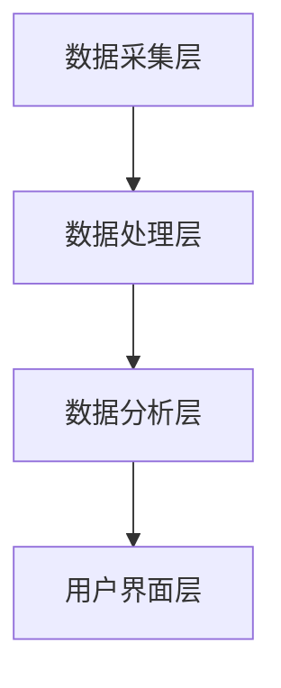
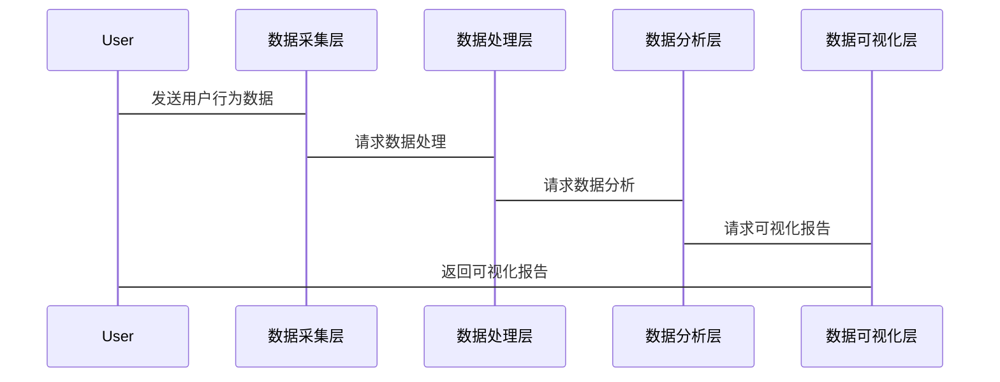

                 


# 金融科技用户行为分析平台

## 关键词：金融科技，用户行为分析，数据挖掘，机器学习，数据可视化

## 摘要：金融科技用户行为分析平台旨在通过数据分析和挖掘技术，深入理解用户在金融场景中的行为模式，从而为金融机构提供个性化服务和风险控制的支持。本文从平台背景、核心概念、算法原理、系统架构等多个维度进行详细阐述，帮助读者全面理解该平台的设计与实现。

---

# 第一部分: 金融科技用户行为分析平台概述

## 第1章: 平台背景与目标

### 1.1 金融科技的发展现状
随着人工智能和大数据技术的快速发展，金融科技（FinTech）正逐步改变传统金融行业的运作模式。金融机构通过数字化转型，利用数据挖掘、机器学习等技术，提升用户体验、优化业务流程并降低运营成本。

### 1.2 用户行为分析的重要性
用户行为分析是理解用户需求、改进产品和服务的重要手段。在金融领域，用户行为分析可以帮助机构识别高风险交易、优化投资策略、提升客户满意度，并实现精准营销。

### 1.3 平台目标与核心功能
金融科技用户行为分析平台的目标是通过实时采集和分析用户行为数据，挖掘潜在规律，支持决策者制定个性化策略。其核心功能包括：
- 数据采集与预处理
- 用户画像构建
- 行为模式识别
- 风险评估与预警
- 数据可视化与报告生成

---

# 第二部分: 核心概念与技术原理

## 第2章: 核心概念解析

### 2.1 用户行为分析的定义与方法
用户行为分析是指通过对用户在系统中的操作数据进行采集、处理和分析，挖掘用户行为模式的过程。常用方法包括：
1. **数据挖掘**：通过关联规则挖掘、聚类分析等方法发现用户行为的关联性。
2. **机器学习**：利用分类、回归等算法预测用户行为。
3. **自然语言处理**：分析用户评论、反馈等文本数据，提取情感倾向。

### 2.2 金融科技中的用户行为分析场景
在金融领域，用户行为分析可以应用于以下场景：
- **风险管理**：识别异常交易行为，防范欺诈。
- **精准营销**：根据用户行为数据，推送个性化理财产品。
- **用户体验优化**：通过分析用户操作路径，优化界面设计。

### 2.3 数据采集与处理
用户行为数据的采集可以通过以下方式实现：
- **日志采集**：记录用户的操作日志，如点击、输入、提交等行为。
- **API接口**：通过API实时获取用户行为数据。
- **埋点技术**：在前端或后端代码中嵌入监测点，记录用户行为。

### 2.4 数据分析与挖掘
数据分析与挖掘是用户行为分析的核心步骤，常用技术包括：
- **聚类分析**：将用户分为不同的群体，识别相似行为模式。
- **关联规则挖掘**：发现用户行为之间的关联性。
- **时间序列分析**：分析用户行为的时间特征，预测未来行为趋势。

---

# 第三部分: 算法原理与实现

## 第3章: 算法原理与实现

### 3.1 聚类算法
聚类算法用于将用户分为不同的群体，识别行为模式的相似性。

#### 3.1.1 K-means算法
K-means是一种常用的聚类算法，步骤如下：
1. 初始化K个质心。
2. 计算每个数据点到质心的距离，将数据点分配到最近的质心所在簇。
3. 重新计算每个簇的质心。
4. 重复步骤2和3，直到质心不再变化或达到预设迭代次数。

#### 3.1.2 聚类算法的实现代码
```python
from sklearn.cluster import KMeans
import numpy as np

# 示例数据
X = np.array([[1, 2], [3, 4], [5, 6], [7, 8], [9, 10]])

# 初始化K-means模型
kmeans = KMeans(n_clusters=2, random_state=0)

# 训练模型
kmeans.fit(X)

# 获取聚类结果
labels = kmeans.labels_
print("聚类结果:", labels)
```

### 3.2 分类算法
分类算法用于预测用户的行为类别，如预测用户是否会在某段时间内进行某类交易。

#### 3.2.1 决策树算法
决策树是一种常用的分类算法，通过构建树状结构对用户行为进行分类。

#### 3.2.2 决策树算法的实现代码
```python
from sklearn.tree import DecisionTreeClassifier
from sklearn.model_selection import train_test_split

# 示例数据
X = [[1, 2], [3, 4], [5, 6], [7, 8], [9, 10]]
y = [0, 1, 0, 1, 0]

# 划分训练集和测试集
X_train, X_test, y_train, y_test = train_test_split(X, y, test_size=0.2, random_state=0)

# 初始化决策树模型
dtc = DecisionTreeClassifier(random_state=0)

# 训练模型
dtc.fit(X_train, y_train)

# 预测结果
y_pred = dtc.predict(X_test)
print("预测结果:", y_pred)
```

### 3.3 时间序列分析
时间序列分析用于分析用户行为的时间特征，预测未来行为趋势。

#### 3.3.1 ARIMA模型
ARIMA（Autoregressive Integrated Moving Average）是一种常用的时间序列分析模型。

#### 3.3.2 ARIMA模型的实现代码
```python
from statsmodels.tsa.arima_model import ARIMA
import numpy as np

# 示例数据
data = np.array([1.2, 1.5, 1.3, 1.4, 1.6])

# 初始化ARIMA模型
model = ARIMA(data, order=(1, 1, 1))

# 训练模型
model_fit = model.fit()

# 预测未来值
forecast = model_fit.forecast(steps=2)
print("预测结果:", forecast)
```

---

# 第四部分: 系统架构与实现

## 第4章: 系统架构与实现

### 4.1 系统功能设计
平台的主要功能包括：
- 数据采集与预处理
- 数据存储与管理
- 数据分析与挖掘
- 数据可视化与报告生成

### 4.2 系统架构设计
系统架构采用分层设计，包括数据采集层、数据处理层、数据分析层和用户界面层。

#### 4.2.1 系统架构图


### 4.3 接口设计
系统提供以下接口：
- 数据采集接口：用于实时采集用户行为数据。
- 数据分析接口：用于调用数据分析算法。
- 数据可视化接口：用于生成可视化报告。

### 4.4 交互流程设计


---

# 第五部分: 项目实战与应用

## 第5章: 项目实战与应用

### 5.1 环境安装与配置
- **Python环境**：建议使用Python 3.6及以上版本。
- **依赖库安装**：`pip install numpy, pandas, scikit-learn, statsmodels`

### 5.2 核心代码实现
#### 5.2.1 数据采集与预处理
```python
import pandas as pd
import requests

# 采集用户行为数据
def fetch_user_data():
    url = "https://api.example.com/users"
    response = requests.get(url)
    data = response.json()
    return pd.DataFrame(data)

# 数据预处理
def preprocess_data(df):
    # 假设df包含columns: 'user_id', 'action_time', 'action_type'
    df['action_time'] = pd.to_datetime(df['action_time'])
    return df

df = fetch_user_data()
df_processed = preprocess_data(df)
print("数据预处理完成:", df_processed.head())
```

#### 5.2.2 用户画像构建
```python
from sklearn.cluster import KMeans

# 示例数据
X = df_processed[['user_id', 'action_type_count']]

# 聚类分析
kmeans = KMeans(n_clusters=3, random_state=0)
kmeans.fit(X)

# 获取聚类结果
df_processed['cluster'] = kmeans.labels_
print("用户画像完成:", df_processed.head())
```

### 5.3 案例分析与解读
通过实际案例分析，展示平台如何帮助金融机构优化用户行为分析流程，提升用户体验和风险控制能力。

---

# 第六部分: 总结与展望

## 第6章: 总结与展望

### 6.1 本章总结
本文详细阐述了金融科技用户行为分析平台的设计与实现，从背景、核心概念、算法原理到系统架构，全面介绍了平台的构建过程。

### 6.2 未来展望
随着人工智能和大数据技术的不断发展，金融科技用户行为分析平台将更加智能化和个性化。未来的研究方向包括：
- 更加精准的用户画像构建
- 高效的实时行为分析算法
- 智能化的决策支持系统

---

# 作者：AI天才研究院 & 禅与计算机程序设计艺术

---

以上是《金融科技用户行为分析平台》的技术博客文章的完整内容。

