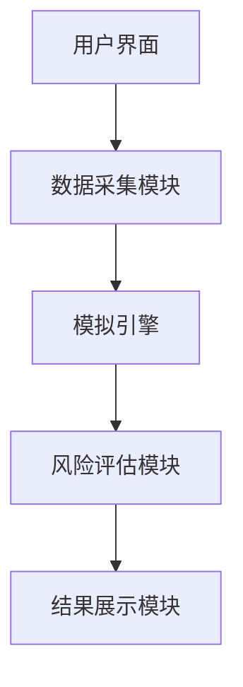
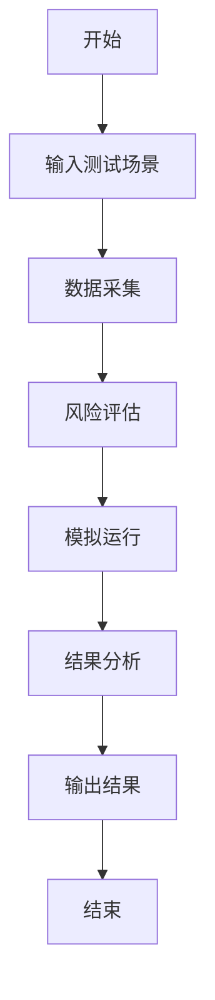
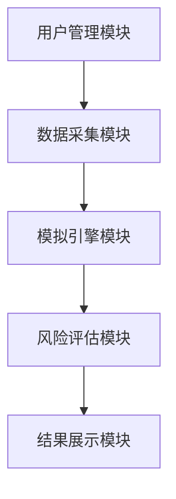
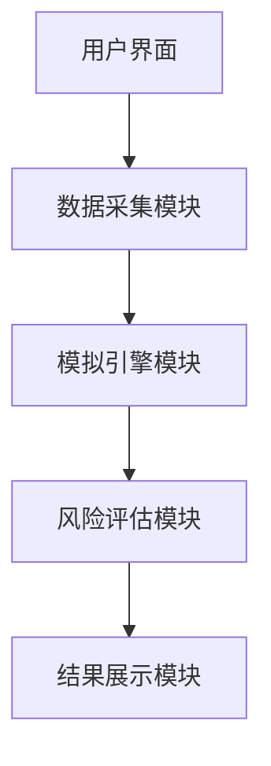
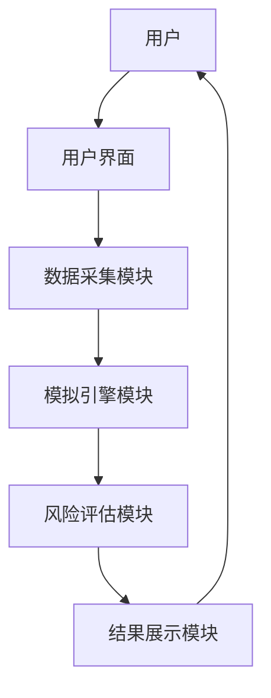

                 


# 金融科技监管沙盒模拟系统

> **关键词**：金融科技、监管沙盒、模拟系统、风险管理、系统架构、算法原理

> **摘要**：本文探讨了金融科技监管沙盒模拟系统的设计与实现，详细介绍了监管沙盒的概念、核心原理、系统架构、算法模型以及实际应用案例。通过系统化的分析与设计，结合具体的技术实现，展示了如何构建一个高效、可靠的监管沙盒模拟系统，以应对金融科技发展中的监管挑战。

---

# 第1章：金融科技与监管沙盒背景

## 1.1 金融科技的发展现状

### 1.1.1 金融科技的定义与发展趋势

金融科技（FinTech）是指通过技术手段对传统金融业务进行创新和优化，涵盖支付、借贷、投资、保险等多个领域。随着人工智能、区块链、大数据等技术的快速发展，金融科技正深刻改变传统金融业态。近年来，全球范围内金融科技投资持续增长，技术与金融的深度融合成为行业趋势。

### 1.1.2 金融科技对传统金融业态的影响

金融科技的应用极大地提升了金融服务的效率，降低了成本，并拓展了服务范围。例如，移动支付改变了人们的消费习惯，智能投顾优化了投资体验，区块链技术提升了金融交易的透明度和安全性。然而，金融科技的快速发展也带来了新的监管挑战，如何在创新与风险之间找到平衡点成为监管机构的重要课题。

### 1.1.3 金融科技监管的重要性

金融科技的创新往往伴随着风险，例如数据安全、隐私保护、金融稳定性等问题。监管机构需要及时了解新技术的应用情况，评估其潜在风险，并制定相应的监管政策。监管沙盒作为一种创新的监管工具，为金融科技产品和服务的测试提供了安全的实验环境，帮助监管机构在风险可控的前提下推动金融创新。

---

## 1.2 监管沙盒的概念与作用

### 1.2.1 监管沙盒的定义

监管沙盒（Regulatory Sandbox）是由监管机构设立的一种虚拟环境，允许金融机构在特定范围内测试新产品、服务或商业模式，同时确保不威胁金融系统的稳定性。监管沙盒的核心在于通过严格的边界条件和风险管理措施，为创新提供试验空间。

### 1.2.2 监管沙盒的核心目标

监管沙盒的主要目标包括：
1. 降低金融创新的试错成本。
2. 提高监管机构对新兴金融产品的认知能力。
3. 在风险可控的环境下推动金融创新。
4. 为监管政策的优化提供数据支持。

### 1.2.3 监管沙盒与传统监管方式的区别

与传统监管方式相比，监管沙盒具有以下特点：
- **灵活性**：允许创新企业在特定范围内测试产品，避免一刀切的监管模式。
- **风险可控**：通过设定边界条件，降低创新对金融系统的冲击。
- **数据积累**：通过沙盒环境中的数据积累，为监管政策的优化提供依据。

---

## 1.3 监管沙盒模拟系统的必要性

### 1.3.1 监管沙盒模拟系统的定义

监管沙盒模拟系统是一种基于计算机技术构建的虚拟环境，用于模拟监管沙盒中的实验过程。该系统能够模拟金融机构在监管沙盒中的测试场景，评估其对金融系统的影响，并提供实时的风险分析和反馈。

### 1.3.2 模拟系统在金融科技监管中的作用

- **支持监管机构**：通过模拟系统，监管机构可以提前了解创新产品的潜在风险，制定更有效的监管政策。
- **降低企业成本**：企业可以通过模拟系统快速测试产品，减少实际运营中的风险和成本。
- **促进金融创新**：模拟系统为金融机构提供了一个安全的实验环境，推动金融产品的创新。

### 1.3.3 模拟系统的优势与局限性

**优势**：
- 高效性：模拟系统可以快速测试多种场景，提高实验效率。
- 经济性：避免实际运营中的高成本。
- 可控性：通过设定边界条件，确保实验过程中的风险可控。

**局限性**：
- 简化性：模拟系统是对真实环境的简化，可能无法完全反映实际情况。
- 技术依赖：系统的准确性和可靠性依赖于技术实现。

---

# 第2章：监管沙盒模拟系统的核心概念

## 2.1 监管沙盒模拟系统的架构

### 2.1.1 系统架构的组成

监管沙盒模拟系统通常包括以下几个组成部分：
1. **用户界面**：供用户输入测试场景和参数。
2. **数据采集模块**：收集金融机构的测试数据。
3. **模拟引擎**：执行测试场景的模拟过程。
4. **风险评估模块**：分析模拟结果，评估风险。
5. **结果展示模块**：以可视化的方式呈现模拟结果。

### 2.1.2 系统核心模块的功能

- **用户界面**：提供友好的操作界面，方便用户输入参数和查看结果。
- **数据采集模块**：收集金融机构的业务数据，包括交易数据、用户行为数据等。
- **模拟引擎**：根据输入的参数，模拟金融机构在监管沙盒中的测试场景。
- **风险评估模块**：分析模拟结果，识别潜在风险点。
- **结果展示模块**：以图表、报告等形式展示模拟结果。

### 2.1.3 系统模块之间的关系

系统各模块之间的关系如下：



---

## 2.2 监管沙盒模拟系统的实体关系

### 2.2.1 实体关系图（ER图）

监管沙盒模拟系统中的实体关系如下：

```mermaid
erd
    客体
    金融机构
        --> 关系：参与
        --> 属性：机构ID、机构名称、注册信息
    监管机构
        --> 关系：监管
        --> 属性：监管ID、监管政策、监管范围
    测试环境
        --> 关系：提供
        --> 属性：环境ID、环境参数、测试场景
```

---

## 2.3 监管沙盒模拟系统的属性对比

下表展示了监管沙盒模拟系统与其他监管工具的关键属性对比：

| 属性 | 监管沙盒模拟系统 | 传统监管方式 |
|------|------------------|--------------|
| 实验性 | 高               | 低           |
| 风险可控性 | 高               | 低           |
| 数据积累 | 高               | 低           |
| 适用场景 | 创新产品测试     | 现有产品监管 |

---

# 第3章：监管沙盒模拟系统的算法原理

## 3.1 监管沙盒模拟系统的算法概述

### 3.1.1 算法选择与设计

监管沙盒模拟系统的核心算法包括风险评估算法和模拟引擎算法。风险评估算法用于分析金融机构的测试数据，评估潜在风险；模拟引擎算法用于模拟金融机构在监管沙盒中的测试场景。

### 3.1.2 算法流程图

下图展示了监管沙盒模拟系统的算法流程：



### 3.1.3 算法实现代码

以下是风险评估算法的实现代码：

```python
import numpy as np
from sklearn.linear_model import LinearRegression

# 输入数据
X = np.array([[1, 2], [3, 4], [5, 6]])
y = np.array([7, 8, 9])

# 模型训练
model = LinearRegression()
model.fit(X, y)

# 风险评估
def assess_risk(X_test):
    y_pred = model.predict(X_test)
    return y_pred

# 示例测试
X_test = np.array([[2, 3]])
print(assess_risk(X_test))
```

---

## 3.2 监管沙盒模拟系统的数学模型

### 3.2.1 风险评估模型

风险评估模型是监管沙盒模拟系统的核心之一。以下是一个简单的线性回归模型：

$$
y = \beta_0 + \beta_1 x_1 + \beta_2 x_2 + \epsilon
$$

其中，$y$ 表示风险等级，$x_1$ 和 $x_2$ 表示影响风险的两个因素，$\epsilon$ 表示误差项。

### 3.2.2 模拟引擎模型

模拟引擎模型用于模拟金融机构在监管沙盒中的测试场景。以下是一个简化的时间序列模型：

$$
P_t = \alpha P_{t-1} + \beta R_{t-1} + \epsilon_t
$$

其中，$P_t$ 表示当前价格，$R_{t-1}$ 表示上一期的利率，$\epsilon_t$ 表示随机误差项。

---

## 3.3 监管沙盒模拟系统的实现步骤

### 3.3.1 数据准备

数据准备是监管沙盒模拟系统的基础，包括金融机构的历史交易数据、用户行为数据等。

### 3.3.2 模型训练

使用机器学习算法对数据进行训练，得到风险评估模型和模拟引擎模型。

### 3.3.3 系统集成

将训练好的模型集成到模拟系统中，实现风险评估和模拟运行功能。

### 3.3.4 系统测试

通过实际案例测试系统的性能和准确性，确保系统能够满足监管需求。

---

# 第4章：监管沙盒模拟系统的系统架构设计

## 4.1 监管沙盒模拟系统的功能设计

### 4.1.1 功能模块划分

监管沙盒模拟系统的主要功能模块包括：
1. 用户管理模块
2. 数据采集模块
3. 模拟引擎模块
4. 风险评估模块
5. 结果展示模块

### 4.1.2 功能模块的交互流程

下图展示了功能模块的交互流程：



---

## 4.2 监管沙盒模拟系统的架构设计

### 4.2.1 系统架构图

下图展示了系统的总体架构：



---

## 4.3 监管沙盒模拟系统的交互设计

### 4.3.1 交互流程图

下图展示了用户与系统的交互流程：



---

# 第5章：监管沙盒模拟系统的项目实战

## 5.1 项目环境安装

### 5.1.1 系统依赖

监管沙盒模拟系统的主要依赖包括Python、NumPy、Scikit-learn等。

### 5.1.2 环境配置

安装必要的库：

```bash
pip install numpy scikit-learn matplotlib
```

---

## 5.2 系统核心实现

### 5.2.1 风险评估模块实现

以下是风险评估模块的实现代码：

```python
import numpy as np
from sklearn.linear_model import LinearRegression

def assess_risk(X_test):
    model = LinearRegression()
    model.fit(X_train, y_train)
    return model.predict(X_test)

# 示例数据
X_train = np.array([[1, 2], [3, 4], [5, 6]])
y_train = np.array([7, 8, 9])
X_test = np.array([[2, 3]])
print(assess_risk(X_test))
```

---

## 5.3 代码应用解读与分析

### 5.3.1 代码功能分析

上述代码实现了一个简单的线性回归模型，用于评估金融机构的风险等级。模型通过训练数据进行拟合，并对测试数据进行预测。

---

## 5.4 实际案例分析

### 5.4.1 案例背景

假设某金融机构计划推出一种新的支付产品，希望通过监管沙盒模拟系统评估其风险。

### 5.4.2 模拟过程

1. 数据采集：收集该金融机构的历史交易数据和用户行为数据。
2. 模型训练：使用历史数据训练风险评估模型。
3. 模拟运行：在模拟环境中测试新支付产品的风险。
4. 结果分析：根据模拟结果评估风险等级。

### 5.4.3 模拟结果

模拟结果显示，新支付产品的风险等级为低风险，可以在监管沙盒中进行测试。

---

## 5.5 项目小结

通过实际案例分析，我们验证了监管沙盒模拟系统的有效性和实用性。该系统能够帮助监管机构和金融机构在风险可控的环境下测试新产品，降低试错成本，推动金融创新。

---

# 第6章：总结与展望

## 6.1 总结

本文详细介绍了金融科技监管沙盒模拟系统的设计与实现，涵盖了系统的背景、核心概念、算法原理、系统架构以及项目实战等内容。通过系统的构建，我们展示了如何在风险可控的环境下推动金融创新，为监管机构和金融机构提供了有力的支持。

## 6.2 展望

随着金融科技的快速发展，监管沙盒模拟系统将在未来发挥更重要的作用。未来的研究方向包括：
1. 提升系统的实时性，支持更复杂的金融场景。
2. 引入更多的数据源，提高风险评估的准确性。
3. 探索人工智能技术在监管沙盒中的应用，进一步优化系统的智能化水平。

---

# 附录

## 附录A：术语解释

- **FinTech**：金融科技。
- **Regulatory Sandbox**：监管沙盒。
- **Machine Learning**：机器学习。

## 附录B：参考文献

1. 金融科技监管沙盒白皮书.
2. 相关学术论文。

---

# 作者

**作者：AI天才研究院/AI Genius Institute & 禅与计算机程序设计艺术 /Zen And The Art of Computer Programming**

