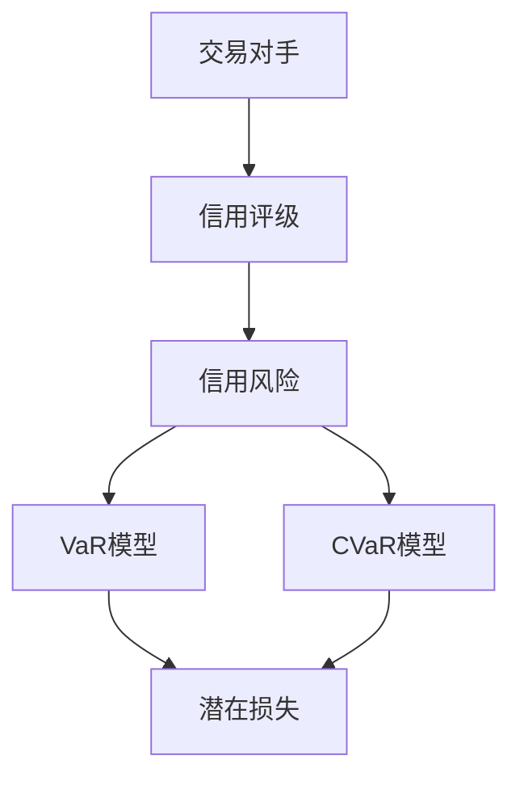
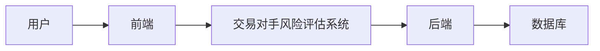

                 


# 《金融衍生品交易对手风险评估》

> 关键词：金融衍生品，交易对手风险，信用风险评估，VaR模型，系统架构设计，风险管理

> 摘要：本文深入探讨了金融衍生品交易对手风险评估的核心概念、数学模型、系统架构设计及实际应用。通过分析交易对手信用风险的定义、分类和评估方法，结合VaR和CVaR模型，本文提供了从理论到实践的全面指导。同时，通过系统架构设计和项目实战，展示了如何将这些理论应用于实际的金融风险管理中。

---

# 第1章: 金融衍生品与交易对手风险概述

## 1.1 金融衍生品的定义与类型

金融衍生品是一种金融合约，其价值取决于基础资产的价格变动。常见的金融衍生品包括期货、期权、掉期和互换等。这些工具广泛应用于风险管理和投机交易。

### 1.1.1 金融衍生品的定义

金融衍生品是基于资产价格波动的合约，其价值取决于基础资产的价格、时间、波动性等因素。

### 1.1.2 金融衍生品的主要类型

- **期货**：约定在未来某一时间以预定价格买卖资产。
- **期权**：买方有权在特定时间内以预定价格购买或出售资产。
- **掉期**：双方约定在未来某一时间交换资产或现金流。
- **互换**：双方约定在未来某一时间交换现金流或资产。

### 1.1.3 金融衍生品的市场现状

金融衍生品市场是全球最大的金融市场之一，交易量巨大，且种类繁多。然而，其复杂性也带来了较高的风险，尤其是交易对手风险。

---

## 1.2 交易对手风险的基本概念

交易对手风险是指交易对手方在履行合约时违约的可能性，可能导致金融机构蒙受损失。

### 1.2.1 交易对手风险的定义

交易对手风险是金融衍生品交易中，由于交易对手无法履行合约义务而产生的风险。

### 1.2.2 交易对手风险的分类

- **信用风险**：交易对手无法履行债务的风险。
- **市场风险**：由于市场波动导致交易对手违约的风险。
- **操作风险**：由于操作失误或系统故障导致的风险。

### 1.2.3 交易对手风险的影响因素

- **信用状况**：交易对手的信用评级和财务状况。
- **市场波动**：市场波动性增加交易对手违约的可能性。
- **法律和监管环境**：法律和监管框架的完善性影响交易对手风险。

---

## 1.3 交易对手风险评估的重要性

交易对手风险评估是金融衍生品交易中的关键环节，直接关系到金融机构的稳健经营。

### 1.3.1 交易对手风险对金融市场的冲击

交易对手违约可能导致连锁反应，引发系统性金融风险。

### 1.3.2 交易对手风险对金融机构的影响

金融机构可能面临巨额损失，影响其资本充足性和流动性。

### 1.3.3 交易对手风险评估的必要性

准确评估交易对手风险，有助于金融机构制定合理的风险管理策略。

---

## 1.4 本章小结

本章介绍了金融衍生品的基本概念和交易对手风险的定义、分类及其影响因素。强调了交易对手风险评估在金融衍生品交易中的重要性。

---

# 第2章: 交易对手信用风险的理论基础

## 2.1 交易对手信用风险的定义与模型

交易对手信用风险是金融衍生品交易中，由于交易对手违约而产生的风险。

### 2.1.1 交易对手信用风险的定义

交易对手信用风险是交易对手无法履行合约义务而产生的风险。

### 2.1.2 交易对手信用风险的主要模型

- **VaR模型**：Value at Risk，衡量在给定置信水平下的潜在损失。
- **CVaR模型**：Conditional Value at Risk，衡量在VaR水平下的平均潜在损失。

### 2.1.3 交易对手信用风险的评估方法

- **信用评级法**：根据交易对手的信用评级评估风险。
- **VaR和CVaR模型**：基于统计模型评估潜在损失。

---

## 2.2 交易对手信用风险与市场风险的对比分析

交易对手信用风险与市场风险既有联系，又有区别。

### 2.2.1 市场风险的定义与特点

市场风险是指由于市场价格波动导致的损失风险。

### 2.2.2 交易对手信用风险与市场风险的异同

| 特性       | 交易对手信用风险               | 市场风险                 |
|------------|--------------------------------|--------------------------|
| 定义       | 交易对手违约风险               | 市场价格波动风险         |
| 计量方法   | VaR, CVaR                     | VaR, 标准差, 波动率       |
| 影响因素   | 信用状况, 市场波动            | 资产价格, 利率, 汇率     |

### 2.2.3 交易对手信用风险的特殊性

交易对手信用风险不仅受市场波动影响，还与交易对手的信用状况密切相关。

---

## 2.3 交易对手信用风险的实体关系图

以下是交易对手信用风险的实体关系图：



---

## 2.4 本章小结

本章介绍了交易对手信用风险的定义、模型和与市场风险的对比分析，通过实体关系图展示了交易对手信用风险的核心要素。

---

# 第3章: 交易对手信用风险评估的数学模型

## 3.1 VaR模型

VaR模型是常用的交易对手信用风险评估工具。

### 3.1.1 VaR模型的定义

VaR模型衡量在给定置信水平下的最大潜在损失。

### 3.1.2 VaR模型的计算公式

$$ VaR = \text{损失金额} $$

### 3.1.3 VaR模型的优缺点

- **优点**：计算简单，易于理解。
- **缺点**：未能充分考虑极端情况。

---

## 3.2 CVaR模型

CVaR模型是对VaR模型的改进。

### 3.2.1 CVaR模型的定义

CVaR模型衡量在VaR水平下的平均潜在损失。

### 3.2.2 CVaR模型的计算公式

$$ CVaR = \text{平均损失金额} $$

### 3.2.3 CVaR模型的优缺点

- **优点**：考虑极端情况，更全面。
- **缺点**：计算复杂。

---

## 3.3 算法实现

以下是VaR和CVaR模型的Python代码示例：

```python
import numpy as np

def calculate VaR(data, confidence_level):
    sorted_data = np.sort(data)
    index = int(len(sorted_data) * (1 - confidence_level))
    VaR = sorted_data[index]
    return VaR

def calculate CVaR(data, confidence_level):
    sorted_data = np.sort(data)
    index = int(len(sorted_data) * (1 - confidence_level))
    CVaR = np.mean(sorted_data[index:])
    return CVaR
```

---

## 3.4 本章小结

本章详细讲解了VaR和CVaR模型的定义、公式和优缺点，并通过Python代码展示了算法实现。

---

# 第4章: 系统分析与架构设计

## 4.1 系统架构设计

交易对手风险评估系统需要高效的架构设计。

### 4.1.1 系统架构图



---

## 4.2 系统功能设计

系统功能包括数据采集、风险评估、结果展示等。

### 4.2.1 功能模块划分

- **数据采集模块**：收集交易数据。
- **风险评估模块**：应用VaR和CVaR模型进行评估。
- **结果展示模块**：显示评估结果。

---

## 4.3 系统接口设计

系统接口包括API接口和数据库接口。

### 4.3.1 API接口设计

- **输入**：交易数据。
- **输出**：VaR和CVaR值。

### 4.3.2 数据库接口设计

- **输入**：交易数据。
- **输出**：存储风险评估结果。

---

## 4.4 本章小结

本章介绍了交易对手风险评估系统的架构设计、功能模块划分和接口设计。

---

# 第5章: 项目实战

## 5.1 环境配置

项目需要以下环境：

- **Python**：3.8及以上版本。
- **库**：numpy, pandas, matplotlib。

---

## 5.2 核心代码实现

以下是交易对手风险评估的Python代码：

```python
import numpy as np
import pandas as pd

# 数据加载
data = pd.read_csv('交易数据.csv')

# VaR计算
def calculate VaR(data, confidence_level):
    sorted_data = np.sort(data)
    index = int(len(sorted_data) * (1 - confidence_level))
    VaR = sorted_data[index]
    return VaR

# CVaR计算
def calculate CVaR(data, confidence_level):
    sorted_data = np.sort(data)
    index = int(len(sorted_data) * (1 - confidence_level))
    CVaR = np.mean(sorted_data[index:])
    return CVaR

# 结果展示
VaR值 = calculate VaR(data, 0.95)
CVaR值 = calculate CVaR(data, 0.95)

print(f"VaR值: {VaR值}")
print(f"CVaR值: {CVaR值}")
```

---

## 5.3 项目小结

本章通过实际案例展示了交易对手风险评估系统的环境配置和核心代码实现，帮助读者理解理论的应用。

---

# 第6章: 最佳实践与小结

## 6.1 最佳实践

- **数据质量**：确保数据的准确性和完整性。
- **模型选择**：根据实际情况选择合适的模型。
- **系统维护**：定期更新模型和数据。

---

## 6.2 本章小结

本文总结了交易对手风险评估的核心概念、数学模型和系统设计，并通过实际案例展示了理论的应用。

---

# 附录

## 附录A: 数据来源

- 数据来源：交易数据.csv

## 附录B: 工具安装指南

- 安装Python和相关库。

## 附录C: 参考文献

- 引用文献1
- 引用文献2

---

# 作者：AI天才研究院/AI Genius Institute & 禅与计算机程序设计艺术 /Zen And The Art of Computer Programming

