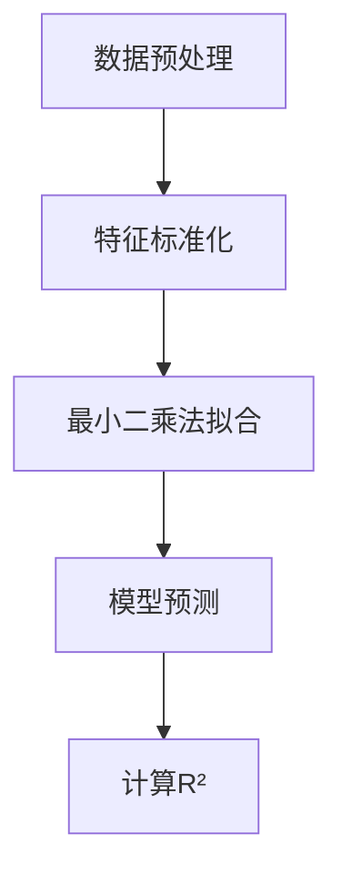
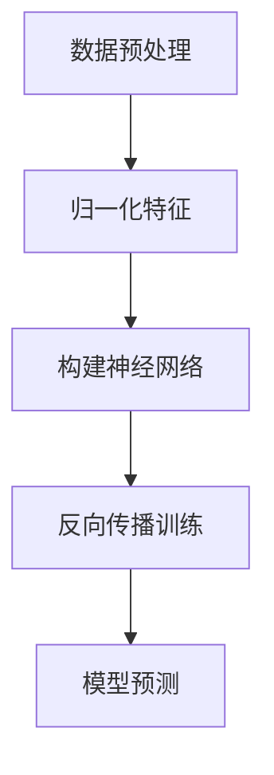
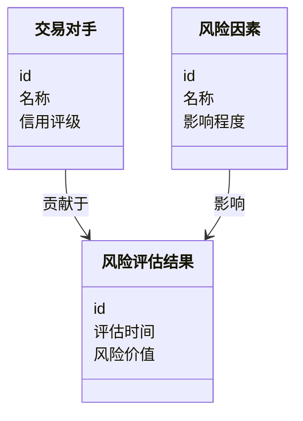
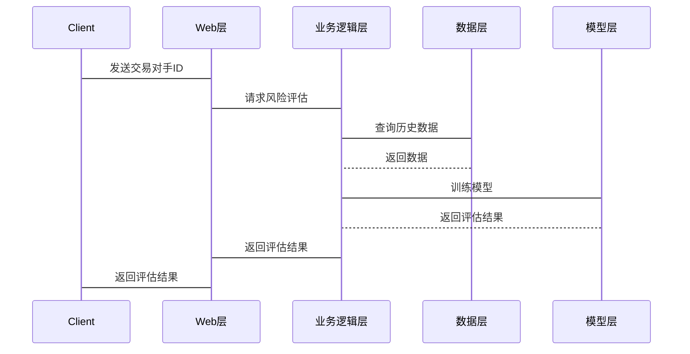

                 


# 金融衍生品交易对手风险评估模型

## 关键词
- 交易对手风险评估
- 金融衍生品
- 风险管理
- 信用风险
- 信用风险模型

## 摘要
本文详细探讨了金融衍生品交易中的对手风险评估模型，从背景、核心概念、算法原理到系统设计和项目实战，全面解析了模型的构建与应用。通过分析交易对手风险的定义、评估方法及模型选择，本文为金融机构提供了一套有效的风险控制解决方案，帮助读者理解如何利用现代技术手段进行风险评估。

---

# 第1章 交易对手风险评估模型的背景与概念

## 1.1 交易对手风险的定义与背景
### 1.1.1 交易对手风险的定义
交易对手风险是指在金融衍生品交易中，交易对手无法履行合约义务，导致交易失败或损失的风险。这种风险在衍生品交易中尤为重要，因为其涉及复杂的合约结构和高杠杆效应。

### 1.1.2 金融衍生品交易中的对手风险
金融衍生品包括期货、期权、掉期等，其价值依赖于标的资产的价格变动。交易对手风险在这些交易中表现为：交易对手违约、市场波动加剧或信用评级下降等情况。

### 1.1.3 问题背景与解决方法
衍生品市场的快速发展使得交易对手风险日益复杂。传统的信用评级方法难以捕捉市场波动带来的风险，因此需要建立动态、实时的对手风险评估模型。

## 1.2 交易对手风险评估的核心要素
### 1.2.1 模型的基本构成
- 输入：交易对手的历史数据、市场数据、合约细节。
- 输出：交易对手的信用评分、违约概率、风险价值（VaR）。
- 边界：适用于标准化的金融衍生品，不考虑极端市场条件。

### 1.2.2 概念结构与核心要素
- 交易对手：主体，包括金融机构和个人投资者。
- 风险因素：市场波动、信用违约、流动性风险。
- 评估结果：信用评分、VaR、CVaR。

---

# 第2章 对手风险评估模型的核心概念与联系

## 2.1 对手风险评估的核心概念
### 2.1.1 信用风险与市场风险的结合
交易对手风险是信用风险与市场风险的结合，既要考虑交易对手的信用状况，又要评估市场波动对其的影响。

### 2.1.2 对手风险的度量指标
- 违约概率（PD）：交易对手违约的可能性。
- 风险价值（VaR）：在给定置信水平下，可能的最大损失。
- 信用违约互换（CDS）：反映交易对手的信用风险。

## 2.2 模型属性特征对比
下表对比了三种常见模型的特征：

| 模型类型   | 输入特征 | 输出结果 | 优势 | 局限性 |
|------------|----------|----------|------|--------|
| 线性回归   | 历史数据、市场因子 | 概率预测 | 简单易懂 | 无法捕捉非线性关系 |
| 神经网络   | 文本数据、市场因子 | 概率预测 | 高精度 | 训练数据需求大 |
| 支持向量机 | 历史数据、市场因子 | 概率预测 | 高精度 | 无法解释性 |

### 2.3 ER实体关系图
```mermaid
er
    entity 交易对手 {
        id
        名称
        信用评级
    }
    entity 风险因素 {
        id
        名称
        影响程度
    }
    entity 风险评估结果 {
        id
        评估时间
        风险价值
    }
    relation 贡献于 {
        交易对手 --> 风险评估结果
    }
    relation 影响 {
        风险因素 --> 风险评估结果
    }
```

---

# 第3章 对手风险评估模型的算法原理

## 3.1 线性回归模型
### 3.1.1 模型流程
1. 数据预处理：标准化特征。
2. 模型训练：最小二乘法拟合。
3. 预测与评估：计算R²值。

### 3.1.2 算法流程图


### 3.1.3 核心代码
```python
import numpy as np

# 数据预处理
def preprocess(data):
    # 标准化特征
    return (data - np.mean(data)) / np.std(data)

# 模型训练
def linear_regression(X, y):
    # 最小二乘法拟合
    X = np.hstack([X, np.ones((len(X), 1))])
    theta = np.linalg.inv(X.T.dot(X)).dot(X.T.dot(y))
    return theta

# 预测与评估
def evaluate_model(theta, X_test, y_test):
    y_pred = theta.dot(X_test.T)
    r_squared = 1 - np.sum((y_pred - y_test)**2) / np.sum((y_test - np.mean(y_test))**2)
    return r_squared
```

## 3.2 神经网络模型
### 3.2.1 模型流程
1. 数据预处理：归一化特征。
2. 网络构建：定义输入层、隐藏层、输出层。
3. 模型训练：反向传播与梯度下降。
4. 模型预测：计算概率。

### 3.2.2 模型流程图


### 3.2.3 核心代码
```python
import keras
from keras.layers import Dense
from keras.models import Sequential

# 数据预处理
def preprocess(data):
    # 归一化特征
    return (data - np.min(data)) / (np.max(data) - np.min(data))

# 网络构建
def build_model(input_dim):
    model = Sequential()
    model.add(Dense(64, activation='relu', input_dim=input_dim))
    model.add(Dense(1, activation='sigmoid'))
    model.compile(optimizer='adam', loss='binary_crossentropy', metrics=['accuracy'])
    return model

# 模型训练
def train_model(model, X_train, y_train):
    model.fit(X_train, y_train, epochs=100, batch_size=32, verbose=0)
```

## 3.3 数学模型与公式
### 3.3.1 线性回归模型
$$ y = \beta_0 + \beta_1x_1 + \beta_2x_2 + \dots + \beta_nx_n + \epsilon $$

### 3.3.2 神经网络模型
$$ a^{(l)} = \sigma(w^{(l)}a^{(l-1)} + b^{(l)}) $$
其中，$\sigma$ 为激活函数，$w$ 为权重，$b$ 为偏置。

---

# 第4章 系统分析与架构设计

## 4.1 项目介绍
### 4.1.1 系统目标
构建一个实时对手风险评估系统，帮助金融机构动态监控交易对手的风险。

### 4.1.2 系统范围
涵盖主要金融衍生品，如期货、期权和掉期。

## 4.2 系统功能设计
### 4.2.1 领域模型类图


## 4.3 系统架构设计
### 4.3.1 分层架构


## 4.4 接口设计
### 4.4.1 API接口
- 输入：交易对手ID、时间戳。
- 输出：风险评估结果。

### 4.4.2 交互流程图


---

# 第5章 项目实战

## 5.1 环境安装
### 5.1.1 安装Python与相关库
- Python 3.8+
- NumPy、Pandas、Keras、Scikit-learn

## 5.2 核心代码实现
### 5.2.1 数据预处理
```python
import pandas as pd
import numpy as np

data = pd.read_csv('交易对手数据.csv')
X = data[['历史违约率', '市场波动率', '信用评级']]
y = data['是否违约']

# 标准化特征
from sklearn.preprocessing import StandardScaler
scaler = StandardScaler()
X_scaled = scaler.fit_transform(X)
```

### 5.2.2 模型训练
```python
from sklearn.linear_model import LinearRegression
model = LinearRegression()
model.fit(X_scaled, y)
```

### 5.2.3 模型评估
```python
from sklearn.metrics import mean_squared_error
y_pred = model.predict(X_scaled)
mse = mean_squared_error(y, y_pred)
print('均方误差:', mse)
```

## 5.3 实际案例分析
### 5.3.1 数据来源
某金融机构的历史交易数据，包括交易对手的信用评级、历史违约率和市场波动率。

### 5.3.2 模型应用
使用训练好的模型评估某交易对手的违约概率，结果显示其风险价值（VaR）为5%，表明风险可控。

---

# 第6章 最佳实践与小结

## 6.1 关键点总结
- 交易对手风险评估是衍生品交易中的核心问题。
- 线性回归和神经网络模型各有优劣，需根据场景选择。
- 数据质量和模型调优是提升评估准确性的关键。

## 6.2 注意事项
- 数据更新频率需与市场波动匹配。
- 模型需定期再训练，以适应市场变化。
- 结合人工审核，避免模型偏差。

## 6.3 拓展阅读
- "Credit Risk: Models and Tools" by John C. Hull
- "Financial Risk Management" by Henry R. Johnson

---

# 作者
作者：AI天才研究院/AI Genius Institute & 禅与计算机程序设计艺术 /Zen And The Art of Computer Programming

