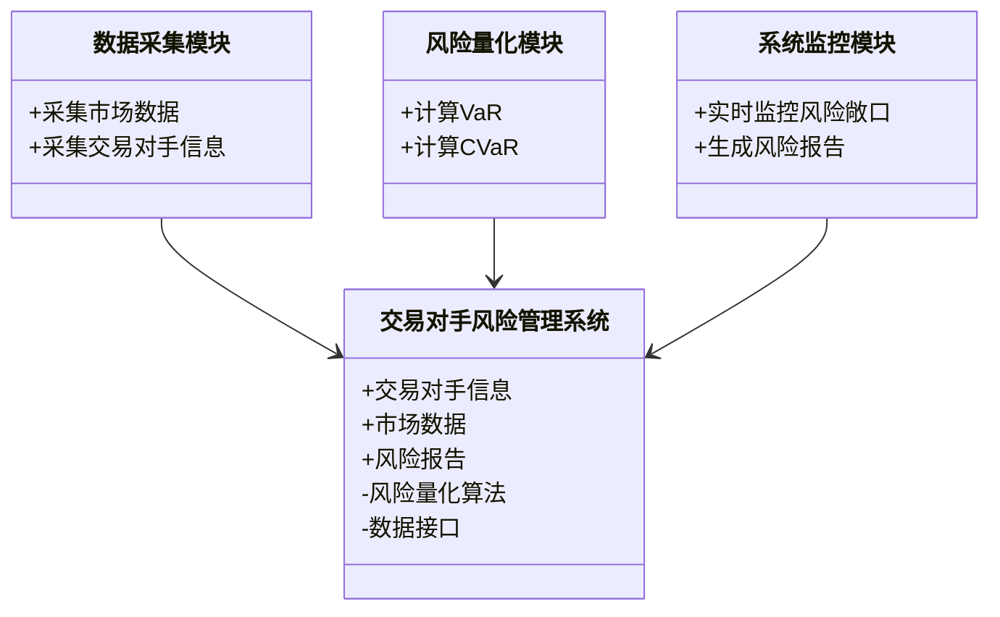
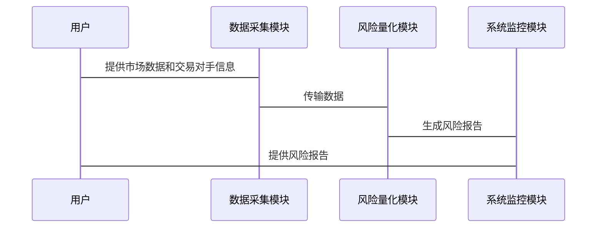

                 


# 《金融衍生品交易对手风险量化与管理》

## 关键词：金融衍生品，交易对手风险，风险量化，信用风险模型，蒙特卡洛模拟，系统架构设计

## 摘要：  
本文旨在探讨金融衍生品交易中交易对手风险的量化与管理方法。通过分析交易对手风险的定义、量化模型、系统设计及实际案例，文章详细介绍了如何利用数学模型和系统架构来有效管理和降低交易对手风险。内容涵盖从基础概念到高级算法的完整体系，为金融从业者和研究人员提供理论支持和实践指导。

---

## 第1章: 金融衍生品与交易对手风险概述

### 1.1 金融衍生品的基本概念  
金融衍生品是一种金融工具，其价值来源于基础资产（如股票、债券、商品等）的市场价格波动。常见的衍生品包括期货、期权、掉期和互换等。交易对手风险是指交易对手无法履行合同义务而带来的损失风险。

#### 1.1.1 金融衍生品的定义与分类  
- **定义**：金融衍生品是基于基础资产的金融合约，具有杠杆效应和高风险特征。  
- **分类**：包括远期合约、期货、期权、掉期和互换等。  

#### 1.1.2 交易对手风险的定义与特征  
- **定义**：交易对手风险是指交易对手违约或无法履行合约义务而带来的损失风险。  
- **特征**：具有隐蔽性、复杂性和系统性，受市场波动和信用状况影响。  

#### 1.1.3 金融衍生品市场的基本结构  
- 市场参与者：买方、卖方、经纪商和交易所。  
- 交易机制：场内交易和场外交易，场内交易有中央对手方（CCP）清算，场外交易直接在买方和卖方之间进行。  

### 1.2 交易对手风险的产生背景  

#### 1.2.1 金融危机案例分析  
- **2008年金融危机**：次贷危机导致大量衍生品违约，暴露交易对手风险的严重性。  
- **2020年疫情冲击**：市场流动性枯竭，交易对手风险急剧上升。  

#### 1.2.2 交易对手风险的经济影响  
- 影响市场稳定性：交易对手风险可能导致连锁反应，引发系统性金融危机。  
- 增加金融机构成本：为降低风险，金融机构需投入更多资本和流动性管理。  

#### 1.2.3 全球监管框架与政策导向  
- **巴塞尔协议**：要求金融机构计提资本金以覆盖交易对手风险。  
- **中央对手方（CCP）**：通过集中清算降低交易对手风险。  

### 1.3 交易对手风险的量化与管理目标  

#### 1.3.1 风险量化的核心目标  
- 量化交易对手风险，评估潜在损失。  
- 监测风险敞口，及时调整头寸。  

#### 1.3.2 风险管理的基本原则  
- 分散化：通过多样化投资降低交易对手风险。  
- 抵押与保证金：要求交易对手提供抵押品或保证金。  
- 定价与对冲：准确定价衍生品，利用对冲工具降低风险。  

#### 1.3.3 量化管理的边界与外延  
- 量化工具的局限性：模型假设可能导致低估或高估风险。  
- 风险管理的范围：不仅包括直接交易对手，还涉及间接风险传导。  

---

## 第2章: 信用风险模型与量化方法  

### 2.1 信用风险的基本原理  

#### 2.1.1 信用风险的构成要素  
- 交易对手的信用状况：包括信用评级、财务状况和历史违约记录。  
- 合约的法律结构：包括合约条款、管辖法律和抵销条款。  

#### 2.1.2 信用评分模型的原理  
- **信用评分模型**：通过历史数据对交易对手的信用状况进行评分，评估其违约概率（PD）。  
- **PD（违约概率）**：交易对手在一定期限内违约的可能性。  

#### 2.1.3 信用风险的度量指标  
- **违约概率（PD）**：交易对手的违约可能性。  
- **违约损失率（LGD）**：违约事件发生时的平均损失比例。  

### 2.2 交易对手风险的量化模型  

#### 2.2.1 VaR（Value at Risk）模型  
- **VaR定义**：在给定置信水平下，资产组合在一定时间内的最大可能损失。  
- **公式**：  
  $$ VaR_{\alpha}(P) = \inf\{L \mid P(L) \geq \alpha\} $$  
  其中，\( \alpha \) 是置信水平，\( P(L) \) 是损失 \( L \) 的概率。  

#### 2.2.2 CVaR（Conditional Value at Risk）模型  
- **CVaR定义**：在 VaR 的基础上，考虑超过 VaR 水平的平均损失。  
- **公式**：  
  $$ CVaR_{\alpha}(P) = \frac{1}{\alpha} \int_{VaR_{\alpha}(P)}^{\infty} L f(L) dL $$  

#### 2.2.3 线性回归模型在风险量化中的应用  
- **线性回归模型**：用于预测交易对手的违约概率，基于历史数据建立回归方程。  
- **公式**：  
  $$ PD = \beta_0 + \beta_1 x_1 + \beta_2 x_2 + \dots + \beta_n x_n + \epsilon $$  

### 2.3 基于蒙特卡洛模拟的风险量化方法  

#### 2.3.1 蒙特卡洛模拟的基本原理  
- **蒙特卡洛模拟**：通过随机抽样模拟市场情景，计算交易对手风险的可能损失分布。  

#### 2.3.2 蒙特卡洛模拟在交易对手风险中的应用  
- **步骤**：  
  1. 确定市场参数（如利率、波动率）。  
  2. 生成随机市场情景。  
  3. 计算每种情景下的交易对手风险损失。  
  4. 统计损失分布，计算 VaR 或 CVaR。  

#### 2.3.3 模拟结果的分析与解读  
- **结果分析**：通过蒙特卡洛模拟得到的 VaR 和 CVaR 反映交易对手风险的潜在损失范围。  

---

## 第3章: 风险度量模型的构建与优化  

### 3.1 风险度量模型的选择与比较  

#### 3.1.1 常见风险度量模型的优缺点  
| 模型         | 优点                           | 缺点                           |
|--------------|--------------------------------|--------------------------------|
| VaR          | 简单易懂，计算效率高            | 不能反映尾部风险，存在潜在损失 |
| CVaR         | 能反映尾部风险，考虑超过 VaR 的平均损失 | 计算复杂，对数据敏感             |
| 线性回归      | 基于历史数据，易于解释           | 无法捕捉非线性关系               |

### 3.2 风险度量模型的数学推导  

#### 3.2.1 VaR 的数学公式推导  
- **条件 VaR 公式**：  
  $$ VaR_{\alpha}(X) = \inf\{x \mid P(X \leq x) \geq \alpha\} $$  
  其中，\( X \) 是损失分布，\( \alpha \) 是置信水平。  

#### 3.2.2 CVaR 的数学公式推导  
- **条件期望公式**：  
  $$ CVaR_{\alpha}(X) = \frac{1}{\alpha} \int_{-\infty}^{VaR_{\alpha}(X)} (x - VaR_{\alpha}(X)) f(x) dx $$  

### 3.3 基于机器学习的风险度量模型  

#### 3.3.1 机器学习在风险量化中的应用  
- **机器学习模型**：如支持向量机（SVM）、随机森林（Random Forest）和神经网络，用于预测交易对手的信用风险。  

#### 3.3.2 常见机器学习算法的适用性分析  
| 算法         | 适用场景                     | 优缺点                           |
|--------------|------------------------------|----------------------------------|
| 线性回归      | 线性关系明显的情况             | 无法捕捉复杂非线性关系           |
| 支持向量机（SVM） | 高维数据分类                 | 计算复杂，适合小数据集           |
| 随机森林      | 非线性关系明显的情况           | 对噪声数据鲁棒，计算效率高         |

#### 3.3.3 神经网络模型在风险量化中的应用  
- **神经网络模型**：通过深度学习技术，捕捉复杂的非线性关系，提高风险预测的准确性。  

---

## 第4章: 系统架构设计  

### 4.1 交易对手风险管理系统概述  

#### 4.1.1 系统功能模块  
- 数据采集模块：收集市场数据和交易对手信息。  
- 风险量化模块：计算 VaR 和 CVaR 等风险指标。  
- 系统监控模块：实时监控风险敞口和交易对手信用状况。  

#### 4.1.2 系统架构整体设计  
- **分层架构**：数据层、业务逻辑层和用户界面层。  
- **模块交互**：数据采集模块向风险量化模块提供输入，风险量化模块生成风险报告，供用户查看。  

### 4.2 系统功能设计  

#### 4.2.1 领域模型类图  


### 4.3 系统架构设计  

#### 4.3.1 系统架构图  
```mermaid
container 交易对手风险管理系统 {
    component 数据采集模块 {
        数据接口 --> 数据存储
    }
    component 风险量化模块 {
        数据存储 --> 风险量化算法
    }
    component 系统监控模块 {
        风险量化算法 --> 风险报告
    }
}
```

### 4.4 接口设计与交互流程  

#### 4.4.1 系统交互流程图  


---

## 第5章: 项目实战  

### 5.1 项目背景与目标  

#### 5.1.1 项目背景  
- 开发一个交易对手风险量化系统，帮助金融机构降低交易对手风险。  

#### 5.1.2 项目目标  
- 实现 VaR 和 CVaR 的计算功能。  
- 提供实时监控和风险报告生成功能。  

### 5.2 项目环境与工具安装  

#### 5.2.1 开发环境  
- 操作系统：Linux/Windows/MacOS  
- 编程语言：Python 3.8+  
- 开发工具：PyCharm/VS Code  
- 依赖库：numpy, pandas, matplotlib, scikit-learn  

### 5.3 核心代码实现  

#### 5.3.1 风险量化核心代码  
```python
import numpy as np
import pandas as pd
from sklearn.linear_model import LinearRegression

# 数据加载
data = pd.read_csv('market_data.csv')
X = data[['market_returns', 'credit_scores']]
y = data['违约概率']

# 线性回归模型训练
model = LinearRegression()
model.fit(X, y)

# 预测违约概率
predicted_pd = model.predict(X)
```

#### 5.3.2 VaR 和 CVaR 的计算  
```python
import numpy as np

def calculate_var(data, alpha=0.95):
    sorted_data = np.sort(data)
    n = len(sorted_data)
    var_index = int(n * alpha)
    var = sorted_data[var_index]
    return var

def calculate_cvar(data, alpha=0.95):
    sorted_data = np.sort(data)
    n = len(sorted_data)
    var_index = int(n * alpha)
    cvar = np.mean(sorted_data[var_index:])
    return cvar

# 示例数据
losses = np.array([0.1, 0.2, 0.3, 0.4, 0.5])
alpha = 0.95

var = calculate_var(losses, alpha)
cvar = calculate_cvar(losses, alpha)

print(f"VaR at {alpha}置信水平: {var}")
print(f"CVaR at {alpha}置信水平: {cvar}")
```

### 5.4 案例分析与结果展示  

#### 5.4.1 案例分析  
- 数据来源：假设我们从某金融机构获取了市场数据和交易对手信息，包括市场收益率、信用评分和违约概率。  

#### 5.4.2 实验结果展示  
- 训练好的线性回归模型预测交易对手的违约概率，计算 VaR 和 CVaR，生成风险报告。  

### 5.5 项目小结与优化建议  

#### 5.5.1 项目小结  
- 成功实现了交易对手风险量化系统的开发，能够计算 VaR 和 CVaR，生成风险报告。  

#### 5.5.2 优化建议  
- 引入机器学习模型，提高风险预测的准确性。  
- 实现实时数据更新和动态风险监控功能。  

---

## 第6章: 总结与展望  

### 6.1 核心内容回顾  
- 交易对手风险是金融衍生品市场的重要风险，需要通过量化方法和系统设计进行有效管理。  
- VaR 和 CVaR 是常用的量化工具，结合蒙特卡洛模拟和机器学习模型可以提高风险预测的准确性。  

### 6.2 未来研究方向  
- 探讨更复杂的机器学习模型（如深度学习）在风险量化中的应用。  
- 研究交易对手风险的动态变化，开发实时风险监控系统。  

### 6.3 最佳实践与注意事项  
- 在实际应用中，应结合市场环境和机构特点选择合适的量化模型。  
- 定期更新模型参数和市场数据，确保风险量化结果的准确性。  

---

## 作者：AI天才研究院 & 禅与计算机程序设计艺术

---

**摘要**：本文系统地介绍了金融衍生品交易对手风险的量化与管理方法，从基础概念到高级算法，结合实际案例和系统设计，为金融从业者和研究人员提供了理论支持和实践指导。通过 VaR、CVaR 等量化工具和系统架构设计，帮助金融机构有效降低交易对手风险，确保金融市场的稳定运行。  

**关键词**：金融衍生品，交易对手风险，风险量化，信用风险模型，蒙特卡洛模拟，系统架构设计

