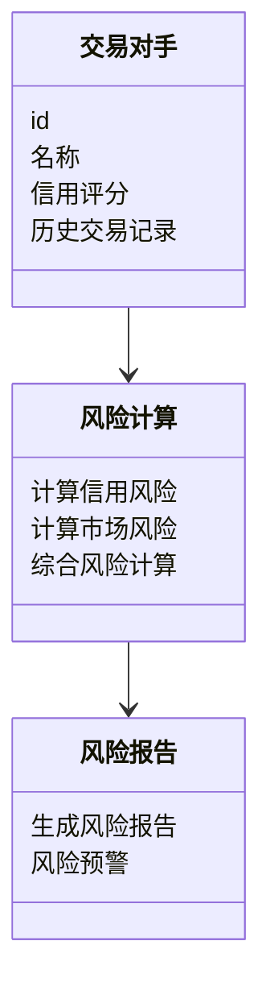
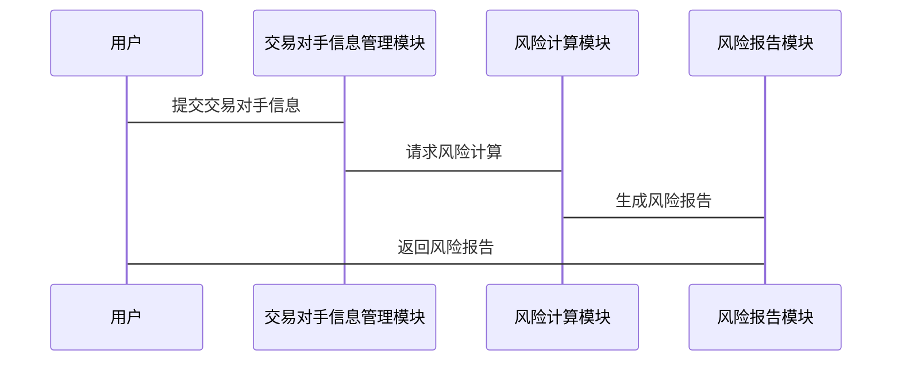

                 


# 《金融衍生品交易对手风险量化模型》

## 关键词：金融衍生品，交易对手风险，量化模型，信用风险，市场风险

## 摘要：  
本文深入探讨了金融衍生品交易中的交易对手风险量化模型，从基本概念、理论基础、核心算法到系统架构和项目实战，全面解析了如何有效量化和管理交易对手风险。通过结合实际案例和数学模型，本文为金融从业者和研究人员提供了理论支持和实践指导。

---

# 第一部分：金融衍生品与交易对手风险概述

## 第1章：金融衍生品与交易对手风险概述

### 1.1 金融衍生品的基本概念

#### 1.1.1 金融衍生品的定义与分类  
金融衍生品（Financial Derivatives）是指其价值依赖于其他基础资产（如股票、债券、商品或指数）的金融工具。常见的衍生品包括期货、期权、互换和远期合约。衍生品可以按交易场所分为场内交易和场外交易，也可以按期限分为短期和长期。

#### 1.1.2 交易对手风险的定义与特征  
交易对手风险（Counterparty Risk）是指交易对手未能履行其合约义务而给交易者带来的风险。其主要特征包括：  
- **信用风险**：交易对手违约的可能性。  
- **市场风险**：市场价格波动对交易对手履约能力的影响。  
- **操作风险**：交易过程中的操作失误或欺诈行为。  

#### 1.1.3 交易对手风险的重要性与影响  
交易对手风险是金融衍生品交易中的核心风险之一，尤其是在场外市场（OTC）交易中更为突出。准确量化交易对手风险可以帮助金融机构有效管理和规避风险，确保交易的稳健性。

### 1.2 交易对手风险的量化背景

#### 1.2.1 金融市场的风险类型  
金融市场中的风险主要包括市场风险、信用风险、流动性风险和操作风险。交易对手风险是信用风险的一种特殊表现形式，通常与市场风险交织在一起。

#### 1.2.2 交易对手风险的量化需求  
随着金融衍生品市场的快速发展，金融机构对交易对手风险的量化需求日益增加。准确量化风险可以帮助机构制定合理的风险对冲策略，优化资本配置，并满足监管要求。

#### 1.2.3 量化模型的发展历程  
从早期的简单信用评分模型到复杂的信用衍生品定价模型，交易对手风险的量化模型经历了从线性回归到非线性模型的演变。现代模型通常结合了信用评分、违约概率和市场因子等多维度信息。

### 1.3 量化模型的核心要素

#### 1.3.1 模型的基本假设  
- 交易对手的行为符合理性假设；  
- 市场价格服从某种概率分布；  
- 交易对手的违约行为可以被建模和预测。  

#### 1.3.2 模型的输入变量  
- 交易对手的信用评分；  
- 违约概率（PD）；  
- 损失给定违约（LGD）；  
- 市场波动率。  

#### 1.3.3 模型的输出结果  
- 交易对手的信用风险敞口；  
- 不同情景下的违约概率和潜在损失；  
- 风险调整后的价值（RAV）。  

### 1.4 本章小结  
本章从金融衍生品的基本概念出发，详细介绍了交易对手风险的定义、特征及其量化的重要性。通过分析量化模型的核心要素，为后续章节的模型构建奠定了基础。

---

# 第二部分：交易对手风险量化模型的理论基础

## 第2章：交易对手风险量化模型的理论基础

### 2.1 信用风险与市场风险的关系

#### 2.1.1 信用风险的定义与度量  
信用风险是指交易对手因信用问题而无法履行合约义务的风险。常见的度量指标包括违约概率（PD）和损失给定违约（LGD）。

#### 2.1.2 市场风险的定义与度量  
市场风险是指由于市场价格波动导致资产价值下降的风险。常用的度量方法包括VaR（Value at Risk）和CVaR（Conditional Value at Risk）。

#### 2.1.3 交易对手风险的综合度量  
交易对手风险是信用风险和市场风险的结合，通常通过信用衍生品（如CDS）的价格波动来反映。

### 2.2 信用评分与违约概率模型

#### 2.2.1 信用评分的定义与作用  
信用评分是对交易对手信用状况的量化评估，通常采用Z-score模型、Altman Z-model等方法。

#### 2.2.2 违约概率的计算方法  
违约概率（PD）是信用评分模型的核心输出，通常通过历史违约数据和统计模型（如Logistic回归）进行估计。

#### 2.2.3 信用评分与违约概率的关系  
信用评分与违约概率呈负相关关系，评分越高，违约概率越低。

### 2.3 信用风险模型的数学基础

#### 2.3.1 概率论与统计学基础  
概率论是信用风险模型的数学基础，常用的方法包括贝叶斯定理和马尔可夫链。

#### 2.3.2 马科维茨投资组合理论  
马科维茨的投资组合理论为信用风险的分散化管理提供了理论基础，强调通过资产配置降低风险。

#### 2.3.3 信用风险模型的数学推导  
以Merton模型为例，其基本假设是：债券的违约风险与发行企业的资产价值相关，资产价值服从几何布朗运动。模型通过求解资产价值的首次通过问题，计算债券的违约概率。

### 2.4 本章小结  
本章从信用风险和市场风险的关系出发，详细介绍了信用评分与违约概率模型的理论基础，为后续的量化模型构建提供了理论支持。

---

# 第三部分：交易对手风险量化模型的核心算法

## 第3章：交易对手风险量化模型的核心算法

### 3.1 信用风险模型的算法原理

#### 3.1.1 Merton信用风险模型  
Merton模型将债券的违约风险与发行企业的资产价值相关联，通过几何布朗运动模拟资产价值的波动，计算债券的违约概率。

#### 3.1.2 KMV模型  
KMV模型将企业的信用风险与市场价值相关联，通过对企业资产价值的波动性进行估计，计算企业的信用风险敞口。

#### 3.1.3 CreditMetrics模型  
CreditMetrics模型是一种基于信用风险转移理论的模型，通过对企业信用状况的动态评估，计算信用组合的风险敞口。

#### 3.1.4 算法实现步骤  
1. 收集交易对手的信用数据和市场数据；  
2. 估计资产价值的波动率和相关参数；  
3. 计算交易对手的违约概率和信用风险敞口；  
4. 结合市场风险模型，计算综合风险敞口。

#### 3.1.5 代码实现  
```python
import numpy as np
from scipy.stats import norm

def merton_model(asset_value, volatility, time_to_maturity):
    # 计算资产价值的波动路径
    np.random.seed(42)
    dw = np.random.standard_normal()
    asset_price = asset_value * np.exp((volatility**2 * time_to_maturity) / 2 + volatility * dw * np.sqrt(time_to_maturity))
    return asset_price

# 示例计算
asset_value = 100
volatility = 0.2
time_to_maturity = 1
print(merton_model(asset_value, volatility, time_to_maturity))
```

### 3.2 市场风险模型的算法原理

#### 3.2.1 VaR模型  
VaR（Value at Risk）是指在给定置信水平下，资产组合在一定时间内的最大可能损失。计算VaR的方法包括历史模拟法、方差-协方差法和蒙特卡罗模拟法。

#### 3.2.2 CVaR模型  
CVaR（Conditional Value at Risk）是VaR的一种扩展，用于度量在VaR超过一定水平时的平均损失。CVaR通常用于优化风险控制。

#### 3.2.3 历史模拟法与蒙特卡罗模拟法  
历史模拟法通过历史数据计算资产组合的损失分布，蒙特卡罗模拟法则通过随机抽样模拟资产价格的波动。

#### 3.2.4 代码实现  
```python
import numpy as np

def compute_var(returns, confidence_level=0.95):
    # 计算VaR
    returns_sorted = np.sort(returns)
    var_index = int(len(returns_sorted) * (1 - confidence_level))
    var = returns_sorted[var_index]
    return var

# 示例计算
returns = np.random.normal(0, 1, 1000)
print(compute_var(returns))
```

### 3.3 混合模型与优化算法

#### 3.3.1 混合模型的定义与优势  
混合模型结合了信用风险和市场风险模型的优势，能够更全面地度量交易对手风险。

#### 3.3.2 遗传算法与模拟退火算法  
遗传算法（GA）和模拟退火算法（SA）常用于优化混合模型的参数估计问题。

#### 3.3.3 混合模型的实现步骤  
1. 确定混合模型的结构和参数；  
2. 通过遗传算法优化模型参数；  
3. 验证模型的有效性和准确性。

### 3.4 本章小结  
本章详细介绍了信用风险和市场风险模型的算法原理，并通过代码实现展示了模型的具体应用。

---

# 第四部分：交易对手风险量化模型的系统架构设计

## 第4章：交易对手风险量化模型的系统架构设计

### 4.1 系统功能设计

#### 4.1.1 领域模型设计  
- 交易对手信息管理模块：包括交易对手的基本信息、信用评分和历史交易记录。  
- 风险计算模块：包括信用风险计算、市场风险计算和综合风险计算。  
- 风险报告模块：生成风险报告和预警信息。  

#### 4.1.2 领域模型的Mermaid类图  


### 4.2 系统架构设计

#### 4.2.1 系统架构的Mermaid架构图  


#### 4.2.2 系统接口设计  
- 数据接口：与交易系统和数据库的接口；  
- 计算接口：与风险计算模块的接口；  
- 报告接口：与用户界面的接口。  

### 4.3 系统交互设计

#### 4.3.1 系统交互的Mermaid序列图  


### 4.4 本章小结  
本章通过系统架构设计，展示了交易对手风险量化模型的实现框架，包括功能模块、系统架构和交互流程。

---

# 第五部分：交易对手风险量化模型的项目实战

## 第5章：交易对手风险量化模型的项目实战

### 5.1 环境安装与配置

#### 5.1.1 安装Python环境  
需要安装Python 3.8及以上版本，并安装必要的库，如NumPy、Pandas、Scipy和Matplotlib。

#### 5.1.2 安装金融数据接口  
可以使用Yahoo Finance API或Quandl API获取金融数据。

### 5.2 核心代码实现

#### 5.2.1 信用风险模型实现  
```python
import numpy as np
from scipy.stats import norm

def merton_model(asset_value, volatility, time_to_maturity):
    dw = norm.rvs(size=1)
    asset_price = asset_value * np.exp((volatility**2 * time_to_maturity) / 2 + volatility * dw * np.sqrt(time_to_maturity))
    return asset_price

# 示例计算
asset_value = 100
volatility = 0.2
time_to_maturity = 1
print(merton_model(asset_value, volatility, time_to_maturity))
```

#### 5.2.2 市场风险模型实现  
```python
import numpy as np

def compute_var(returns, confidence_level=0.95):
    returns_sorted = np.sort(returns)
    var_index = int(len(returns_sorted) * (1 - confidence_level))
    var = returns_sorted[var_index]
    return var

# 示例计算
returns = np.random.normal(0, 1, 1000)
print(compute_var(returns))
```

### 5.3 案例分析与实现解读

#### 5.3.1 案例背景  
假设我们有一家金融机构，需要对交易对手A的信用风险进行量化评估。

#### 5.3.2 数据收集与预处理  
收集交易对手的历史交易数据、信用评分和市场数据。

#### 5.3.3 模型实现与结果分析  
通过Merton模型计算交易对手的违约概率，并结合VaR模型计算综合风险敞口。

### 5.4 本章小结  
本章通过实际案例展示了交易对手风险量化模型的实现过程，包括环境配置、代码实现和结果分析。

---

# 第六部分：交易对手风险量化模型的最佳实践

## 第6章：交易对手风险量化模型的最佳实践

### 6.1 最佳实践与注意事项

#### 6.1.1 数据质量的重要性  
数据的准确性和完整性对模型的准确性至关重要。

#### 6.1.2 模型的选择与优化  
根据具体场景选择合适的模型，并通过回测和验证优化模型的参数。

#### 6.1.3 风险管理的动态性  
金融市场是动态变化的，需要定期更新模型和调整风险管理策略。

### 6.2 小结与总结

#### 6.2.1 小结  
交易对手风险量化模型是金融衍生品交易中的重要工具，通过结合信用风险和市场风险模型，可以有效管理交易对手风险。

#### 6.2.2 总结  
本文从理论到实践，详细介绍了交易对手风险量化模型的构建与应用。通过系统架构设计和项目实战，展示了模型的实际应用价值。

### 6.3 注意事项

#### 6.3.1 模型的局限性  
交易对手风险量化模型通常假设交易对手行为的理性性和市场的有效性，实际中可能存在模型无法捕捉的尾部风险。

#### 6.3.2 模型的适用性  
不同模型适用于不同的市场环境和交易场景，需要根据具体情况选择合适的模型。

### 6.4 拓展阅读

#### 6.4.1 推荐书籍  
- 《信用衍生品定价与风险度量》  
- 《金融市场风险管理》  

#### 6.4.2 推荐论文  
- “A Quantitative Approach to Counterparty Risk Management”  
- “The Credit Risk of Counterparty Portfolios”  

### 6.5 本章小结  
本章总结了交易对手风险量化模型的最佳实践，包括数据质量、模型选择和风险管理的动态性，并提供了进一步学习的建议。

---

# 作者信息

**作者：AI天才研究院/AI Genius Institute & 禅与计算机程序设计艺术 /Zen And The Art of Computer Programming**  
**联系邮箱：[contact@github.com](mailto:contact@github.com)**  
**参考文献**：  
1. Hull, J. C. (2019). *Options, Futures, and Other Derivatives*. Pearson.  
2. Vasicek, O. A. (1973). *A Method for Evaluating the Performance of a Bond Portfolio*.  
3. Jorion, P. (2001). *Value at Risk: The New Basel Accord*. McGraw-Hill.

---

以上是《金融衍生品交易对手风险量化模型》的技术博客文章的完整大纲和内容。

