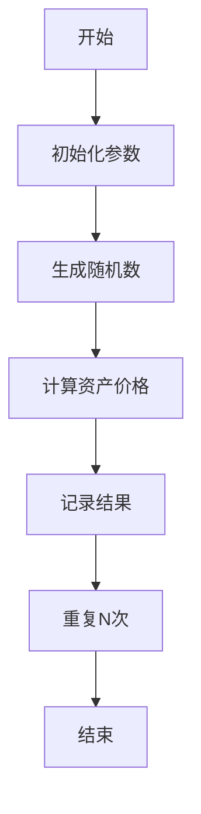
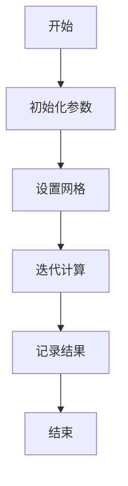
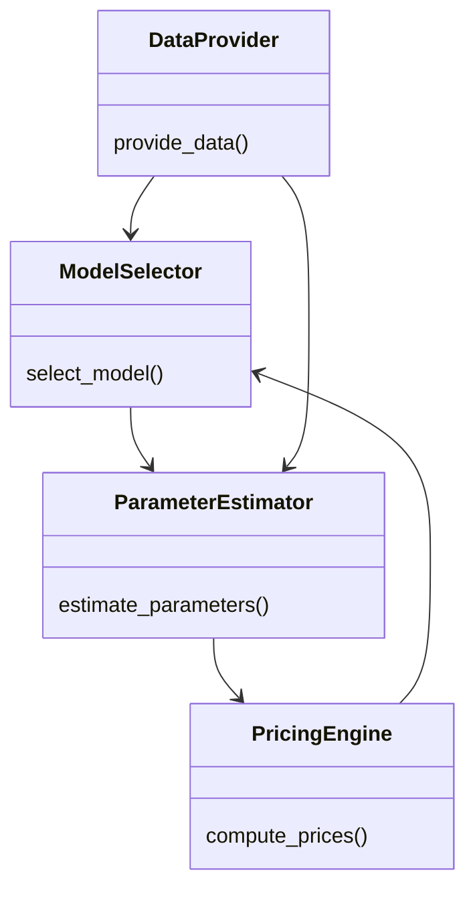
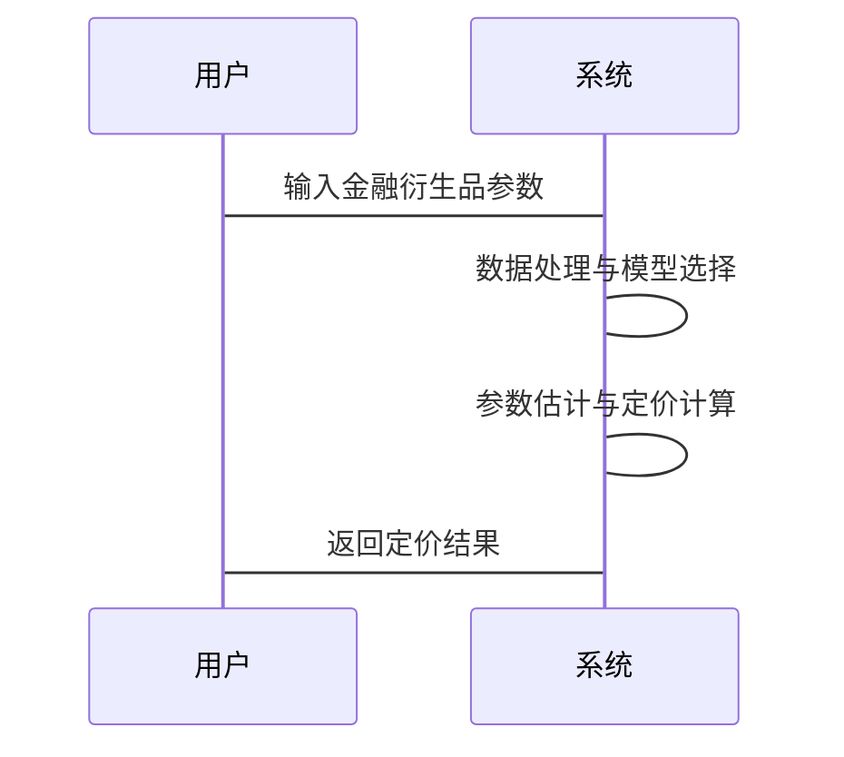

                 


# 金融衍生品定价模型校准

> 关键词：金融衍生品定价模型，校准，蒙特卡洛模拟，数值方法，随机微分方程，金融系统架构，欧式期权

> 摘要：本文将深入探讨金融衍生品定价模型校准的核心概念、算法原理、系统架构及实际应用。通过分析定价模型的数学基础、校准方法、数值算法及系统实现，结合实际案例，为读者提供全面的技术指导。

---

## 正文

### 第一部分: 金融衍生品定价模型校准概述

#### 第1章: 金融衍生品与定价模型概述

##### 1.1 金融衍生品的基本概念
金融衍生品（Financial Derivatives）是以基础资产（如股票、债券、商品等）为标的，通过衍生出的复杂金融工具。其核心特征包括杠杆效应、期限性、风险转移等。衍生品的种类繁多，主要包括期权、期货、掉期、远期合约等。

##### 1.2 定价模型的基本原理
金融衍生品的定价模型是通过数学模型对金融资产的价格进行预测和评估。常见的定价模型包括Black-Scholes模型、蒙特卡洛模拟、有限差分法等。这些模型基于随机微分方程（Stochastic Differential Equations, SDEs），旨在捕捉金融市场的波动性和不确定性。

##### 1.3 校准的基本概念与方法
校准（Calibration）是通过调整模型参数，使得定价模型能够准确反映市场实际价格的过程。校准的关键步骤包括数据收集、参数估计、模型验证等。校准的结果直接影响模型的准确性和可靠性。

---

### 第二部分: 金融衍生品定价模型的核心概念与联系

#### 第2章: 金融衍生品定价模型的核心概念

##### 2.1 定价模型的数学基础
定价模型的数学基础主要包括随机微分方程和马尔可夫过程。以下是一个典型的随机微分方程示例：

$$
dS(t) = \mu S(t)dt + \sigma S(t)dW(t)
$$

其中，$S(t)$是资产价格，$\mu$是期望收益率，$\sigma$是波动率，$dW(t)$是标准布朗运动。

##### 2.2 校准的核心概念
校准的核心在于通过市场数据估计模型参数。例如，在Black-Scholes模型中，波动率$\sigma$是需要通过市场数据进行估计的关键参数。

##### 2.3 核心概念的联系与对比
以下是一个对比表格，展示了不同定价模型的参数特点：

| 模型类型    | 关键参数             | 参数估计方法       |
|-------------|----------------------|---------------------|
| Black-Scholes | $\mu, \sigma$       | 市场隐含波动率       |
| 蒙特卡洛模拟 | $\mu, \sigma$       | 最小二乘法           |
| 有限差分法   | $\mu, \sigma$       | 迭代优化方法         |

---

### 第三部分: 金融衍生品定价模型的算法原理

#### 第3章: 金融衍生品定价模型的算法原理

##### 3.1 蒙特卡洛模拟的原理与实现
蒙特卡洛模拟是一种通过随机采样估计复杂模型的方法。以下是蒙特卡洛模拟的流程图：



以下是蒙特卡洛模拟的Python代码示例：

```python
import numpy as np

def monte_carlo_simulation(S0, mu, sigma, T, N):
    np.random.seed(42)
    W = np.random.standard_normal(N)
    S = S0 * np.exp((mu - 0.5*sigma**2)*T + sigma*W*np.sqrt(T))
    return S

# 示例参数
S0 = 100
mu = 0.05
sigma = 0.2
T = 1
N = 10000

prices = monte_carlo_simulation(S0, mu, sigma, T, N)
print(prices)
```

##### 3.2 数值方法的原理与实现
有限差分法是一种通过离散化时间或空间变量，求解微分方程的方法。以下是有限差分法的流程图：



以下是有限差分法的Python代码示例：

```python
import numpy as np

def finite_difference_method(S0, mu, sigma, T, N):
    dt = T / N
    a = (mu - 0.5*sigma**2) * dt
    b = sigma**2 * dt
    S = np.array([S0])
    for _ in range(N):
        s = S[-1]
        s_new = s + a*s + b*s*np.random.standard_normal()
        S = np.append(S, s_new)
    return S

# 示例参数
S0 = 100
mu = 0.05
sigma = 0.2
T = 1
N = 10000

prices = finite_difference_method(S0, mu, sigma, T, N)
print(prices)
```

---

### 第四部分: 金融衍生品定价系统的架构与实现

#### 第4章: 金融衍生品定价系统架构与实现

##### 4.1 系统功能设计
金融衍生品定价系统的功能模块包括数据输入、模型选择、参数估计、定价计算和结果输出。以下是系统功能设计的类图：



##### 4.2 系统架构设计
以下是系统架构设计的架构图：


##### 4.3 系统交互设计
以下是系统交互设计的序列图：



---

### 第五部分: 项目实战

#### 第5章: 欧式期权定价模型校准

##### 5.1 环境安装
需要安装Python、NumPy、Matplotlib和Scipy库。

##### 5.2 核心代码实现
以下是欧式期权定价模型的Python代码：

```python
import numpy as np
from scipy.stats import norm

def black_scholes(S, K, r, sigma, T, option_type):
    d1 = (np.log(S/K) + (r + 0.5*sigma**2)*T) / (sigma*np.sqrt(T))
    d2 = d1 - sigma*np.sqrt(T)
    if option_type == 'call':
        return S*norm.cdf(d1) - K*np.exp(-r*T)*norm.cdf(d2)
    else:
        return K*np.exp(-r*T)*(norm.cdf(-d2) - S*norm.cdf(-d1))

# 示例参数
S = 100
K = 100
r = 0.05
sigma = 0.2
T = 1
option_type = 'call'

price = black_scholes(S, K, r, sigma, T, option_type)
print(f"期权价格为: {price}")
```

##### 5.3 实际案例分析
假设我们有以下市场数据：

- 标的价格：$S = 100$
- 行权价：$K = 100$
- 无风险利率：$r = 0.05$
- 波动率：$\sigma = 0.2$
- 期限：$T = 1$

通过校准，我们可以得到准确的期权价格。

##### 5.4 结果分析
通过上述代码，我们可以得到欧式期权的理论价格，并与市场实际价格进行对比，验证模型的准确性。

---

### 第六部分: 小结与注意事项

#### 6.1 小结
本文详细介绍了金融衍生品定价模型校准的核心概念、算法原理、系统架构及实际应用。通过理论与实践相结合，帮助读者全面理解金融衍生品定价的复杂性。

#### 6.2 注意事项
在实际应用中，需要注意以下几点：
1. 数据的准确性和完整性；
2. 模型的假设与限制；
3. 校准过程中的计算误差；
4. 系统的稳定性和安全性。

#### 6.3 拓展阅读
建议读者进一步阅读以下内容：
1. 更高级的定价模型（如跳跃扩散模型）；
2. 复杂的校准方法（如非参数估计）；
3. 大数据在金融衍生品定价中的应用。

---

## 作者

作者：AI天才研究院/AI Genius Institute & 禅与计算机程序设计艺术 /Zen And The Art of Computer Programming

