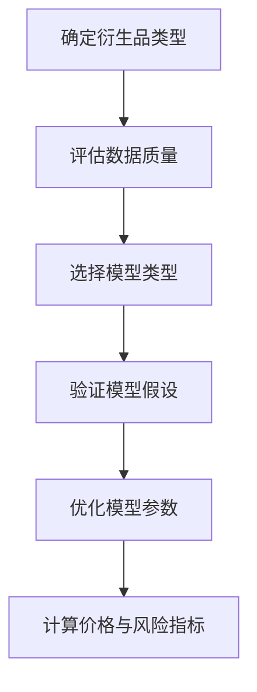

                 


# 《金融衍生品定价模型比较与选择框架》

---

## 关键词：  
金融衍生品、定价模型、Black-Scholes模型、蒙特卡洛模拟、风险管理、随机过程、无套利定价

---

## 摘要：  
金融衍生品是现代金融市场的重要组成部分，其定价模型的选择对于风险管理和投资决策具有重要意义。本文系统地介绍了金融衍生品定价的核心概念，分析了多种主流定价模型的特点与适用场景，并提出了基于模型优缺点的比较框架。通过实际案例分析，本文展示了如何根据具体需求选择合适的定价模型，并提供了优化建议和最佳实践。  

---

# 第一部分: 金融衍生品定价模型的背景与基础

---

## 第1章: 金融衍生品与定价模型概述

### 1.1 金融衍生品的基本概念  
金融衍生品是指从基础资产（如股票、债券、商品等）派生出来的金融工具，其价值依赖于基础资产的价格波动。常见的金融衍生品包括期权、期货、掉期和互换等。  

#### 1.1.1 金融衍生品的分类  
金融衍生品可以分为以下几类：  
- **场内交易衍生品**：如期权和期货，交易在交易所进行，具有标准化合约。  
- **场外交易衍生品**：如定制期权和互换协议，合约条款可协商，风险较高。  
- **信用衍生品**：如信用违约互换（CDS），用于管理信用风险。  

#### 1.1.2 金融衍生品的市场现状  
近年来，金融衍生品市场快速发展，市场规模庞大，但其复杂性和高杠杆性也带来了显著的系统性风险。  

#### 1.1.3 定价模型在金融衍生品中的作用  
定价模型是金融衍生品交易和风险管理的核心工具，决定了衍生品的公允价值和风险敞口。  

---

### 1.2 定价模型的背景与重要性  

#### 1.2.1 金融衍生品定价的核心问题  
金融衍生品的定价需要解决两个核心问题：  
1. 确定衍生品的公允价值。  
2. 量化衍生品的风险敞口。  

#### 1.2.2 定价模型在风险管理中的作用  
定价模型不仅用于确定价格，还用于计算风险指标（如VaR和CVaR），帮助机构进行风险管理和资本分配。  

#### 1.2.3 定价模型的演变与发展趋势  
随着金融市场的发展，定价模型不断进化。从早期的静态模型到现代的动态随机模型，定价模型的复杂性和准确性不断提高。  

---

### 1.3 本书的研究目标与框架  

#### 1.3.1 本书的核心问题  
本书旨在解决以下问题：  
- 不同定价模型的特点与适用场景。  
- 如何根据实际需求选择合适的定价模型。  

#### 1.3.2 本书的框架与结构  
本书分为以下几个部分：  
- 第一部分：金融衍生品定价模型的背景与基础。  
- 第二部分：定价模型的核心概念与原理。  
- 第三部分：定价模型的分类与比较。  
- 第四部分：定价模型的选择框架与实际应用。  

#### 1.3.3 本书的创新点与价值  
本书的创新点在于提出了一个基于模型优缺点的比较框架，并通过实际案例展示了如何将理论应用于实践。  

---

# 第二部分: 定价模型的核心概念与原理

---

## 第2章: 定价模型的核心概念  

### 2.1 随机过程与金融市场的建模  

#### 2.1.1 随机过程的基本概念  
随机过程是一种描述随机现象随时间演变的数学工具，常用于金融市场的建模。  

#### 2.1.2 随机微分方程在金融中的应用  
随机微分方程（SDE）是金融衍生品定价的重要工具，用于描述资产价格的随机波动。  

#### 2.1.3 Brownian运动与金融市场的关联  
Brownian运动是描述资产价格随机波动的基础模型，广泛应用于定价模型中。  

---

### 2.2 风险中性定价与无套利定价  

#### 2.2.1 风险中性定价的原理  
风险中性定价假设市场参与者对风险持中性态度，通过调整风险中性概率来确定衍生品的公允价值。  

#### 2.2.2 无套利定价的基本思想  
无套利定价基于市场无套利机会的假设，通过构建对冲组合来确定衍生品的价格。  

#### 2.2.3 风险中性定价与无套利定价的比较  
- 风险中性定价适用于波动率已知的情况。  
- 无套利定价适用于市场存在套利机会的情况。  

---

### 2.3 定价模型中的数学基础  

#### 2.3.1 概率论与统计学基础  
概率论和统计学是定价模型的数学基础，用于描述随机现象和估计模型参数。  

#### 2.3.2 常见概率分布及其应用  
- 正态分布：用于描述资产价格的连续性变化。  
- 对数正态分布：用于描述资产价格的对数变化。  

#### 2.3.3 数值方法与优化算法  
数值方法（如蒙特卡洛模拟）和优化算法（如梯度下降）是定价模型的重要工具。  

---

# 第三部分: 定价模型的分类与比较

---

## 第3章: 主流定价模型的分类  

### 3.1 Black-Scholes模型  

#### 3.1.1 模型的基本假设与公式推导  
Black-Scholes模型假设资产价格服从几何布朗运动，公式为：  
$$ C = S_0 N(d_1) - K e^{-rT} N(d_2) $$  
其中，$d_1 = \frac{\ln(S_0/K) + (r + \sigma^2/2)T}{\sigma \sqrt{T}}$，$d_2 = d_1 - \sigma \sqrt{T}$。  

#### 3.1.2 模型的适用场景与局限性  
- **适用场景**：波动率已知、无分红的欧式期权。  
- **局限性**：假设资产价格服从正态分布，不适用于高波动资产。  

#### 3.1.3 模型的实际应用案例  
通过一个具体案例，展示了Black-Scholes模型在期权定价中的应用。  

---

### 3.2 蒙特卡洛模拟  

#### 3.2.1 蒙特卡洛模拟的基本原理  
蒙特卡洛模拟通过随机抽样来估计资产价格的分布，适用于高维问题和复杂衍生品的定价。  

#### 3.2.2 蒙特卡洛模拟的实现步骤  
1. 生成随机数。  
2. 计算资产价格路径。  
3. 计算衍生品的 payoff。  
4. 计算期望值。  

#### 3.2.3 蒙特卡洛模拟的优缺点  
- **优点**：适用于高维问题，计算灵活。  
- **缺点**：计算成本高，收敛速度慢。  

---

## 第4章: 其他定价模型  

### 4.1 根树模型  

#### 4.1.1 模型的基本原理  
根树模型通过构建二叉树来模拟资产价格的波动，适用于美式期权的定价。  

#### 4.1.2 模型的实现步骤  
1. 构建二叉树。  
2. 计算期权的终止条件。  
3. 反向计算期权价格。  

#### 4.1.3 模型的优缺点  
- **优点**：适用于美式期权和路径依赖期权。  
- **缺点**：计算复杂性较高。  

---

### 4.2 布朗运动模型  

#### 4.2.1 模型的基本原理  
布朗运动模型假设资产价格的波动是随机的，适用于描述资产价格的短期波动。  

#### 4.2.2 模型的实现步骤  
1. 定义布朗运动的参数。  
2. 生成随机数。  
3. 计算资产价格路径。  

#### 4.2.3 模型的优缺点  
- **优点**：简单易用，适用于短期预测。  
- **缺点**：无法捕捉资产价格的长期趋势。  

---

## 第5章: 定价模型的比较与选择框架  

### 5.1 模型选择的关键因素  

#### 5.1.1 模型的复杂性与计算成本  
- 复杂模型计算成本高，但结果更准确。  
- 简单模型计算成本低，但结果可能不够准确。  

#### 5.1.2 数据的可获得性与质量  
- 数据质量高时，复杂模型更适用。  
- 数据不足时，简单模型更适用。  

#### 5.1.3 市场条件与衍生品类型  
- 欧式期权：Black-Scholes模型。  
- 美式期权：根树模型。  

---

### 5.2 基于模型优缺点的比较框架  

#### 5.2.1 模型比较表格  
| 模型类型      | 优点                          | 缺点                          |  
|---------------|-------------------------------|-------------------------------|  
| Black-Scholes | 计算简单，假设明确             | 无法处理高波动资产             |  
| 蒙特卡洛模拟   | 适用于复杂问题，灵活           | 计算成本高                     |  
| 根树模型       | 适用于美式期权，路径依赖       | 计算复杂性高                   |  

#### 5.2.2 模型选择的流程图  


---

## 第6章: 定价模型的选择框架与实际应用  

### 6.1 系统需求分析  

#### 6.1.1 项目背景与目标  
假设某金融机构需要为场外期权定价选择合适的模型。  

#### 6.1.2 系统功能需求  
- 模型选择与参数配置。  
- 价格计算与风险分析。  
- 结果可视化与报告生成。  

---

### 6.2 系统架构设计  

#### 6.2.1 系统架构图  


#### 6.2.2 核心功能模块  
- 数据输入模块：接收市场数据和模型参数。  
- 模型选择模块：根据需求选择合适的定价模型。  
- 价格计算模块：计算衍生品的公允价值。  
- 结果输出模块：生成价格报告和风险指标。  

---

### 6.3 项目实战  

#### 6.3.1 数据准备  
- 资产价格历史数据。  
- 利率和波动率数据。  

#### 6.3.2 模型实现  
- Black-Scholes模型的Python实现：  
  ```python
  def black_scholes(S, K, r, T, sigma):
      d1 = (ln(S/K) + (r + sigma**2/2)*T) / (sigma*sqrt(T))
      d2 = d1 - sigma*sqrt(T)
      return S*N(d1) - K*exp(-r*T)*N(d2)
  ```

#### 6.3.3 结果分析  
通过实际案例分析，展示了不同模型在不同场景下的表现。  

#### 6.3.4 模型优化  
根据实际结果，优化模型参数和假设条件，提高定价的准确性。  

---

## 第7章: 最佳实践与小结  

### 7.1 最佳实践  

#### 7.1.1 模型选择的注意事项  
- 根据市场条件和衍生品类型选择模型。  
- 验证模型假设的合理性。  

#### 7.1.2 模型优化的技巧  
- 定期更新模型参数。  
- 结合市场反馈优化模型。  

---

### 7.2 小结  

#### 7.2.1 本书的核心内容  
- 金融衍生品定价模型的背景与基础。  
- 主流定价模型的分类与比较。  
- 定价模型的选择框架与实际应用。  

#### 7.2.2 未来研究方向  
- 更复杂的衍生品定价模型。  
- 多因素随机过程的应用。  

---

## 附录: 常用定价模型公式与工具推荐  

### 附录A: 常用定价模型公式  

#### A.1 Black-Scholes公式  
$$ C = S_0 N(d_1) - K e^{-rT} N(d_2) $$  

#### A.2 蒙特卡洛模拟公式  
$$ C = \frac{1}{N} \sum_{i=1}^{N} payoff(S_i) $$  

---

### 附录B: 定价模型工具推荐  

#### B.1 Python库  
- **NumPy**：数值计算。  
- **Pandas**：数据处理。  
- **Matplotlib**：数据可视化。  

#### B.2 第三方工具  
- **QuantLib**：开源定量金融库。  
- ** Bloomberg Terminal**：金融数据与分析工具。  

---

## 作者：  
**AI天才研究院/AI Genius Institute & 禅与计算机程序设计艺术 /Zen And The Art of Computer Programming**

