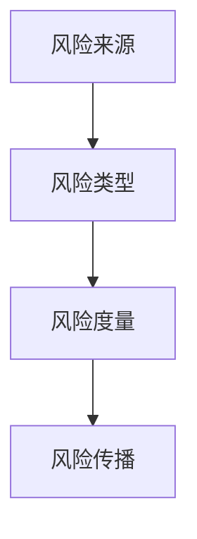
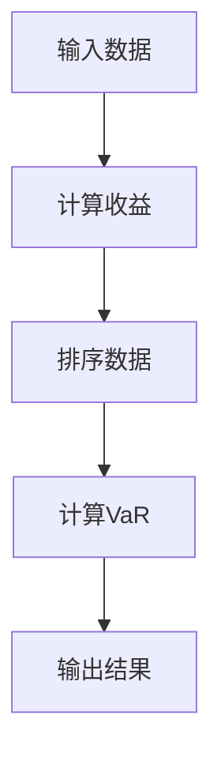
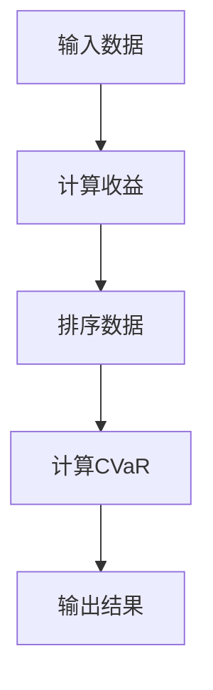
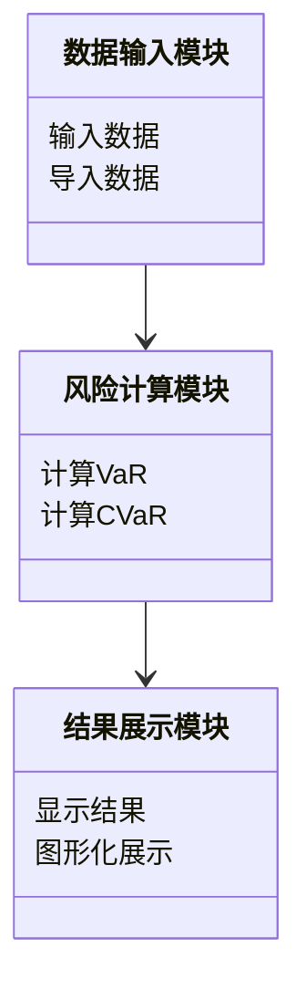
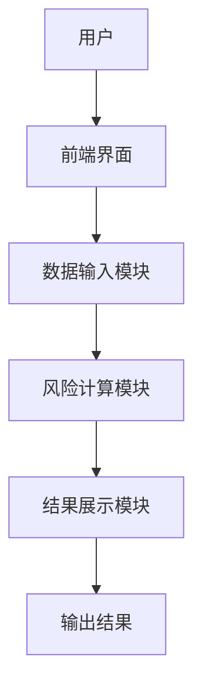

                 


# 金融衍生品组合风险分析工具

## 关键词：金融衍生品，风险分析，组合风险，VaR，CVaR，风险管理

## 摘要：本文详细探讨了金融衍生品组合风险分析工具的设计与实现，从核心概念、数学模型、系统架构到实际案例，全面解析了该工具的构建过程及应用价值。通过理论与实践相结合，展示了如何利用先进的算法和系统架构，有效管理和控制金融衍生品组合风险。

---

# 第一部分: 金融衍生品组合风险分析工具概述

---

# 第1章: 金融衍生品组合风险分析工具的背景与概念

## 1.1 金融衍生品的基本概念

### 1.1.1 金融衍生品的定义
金融衍生品（Financial Derivatives）是指其价值依赖于基础资产（如股票、债券、商品等）的金融工具。常见的衍生品包括期权、期货、互换和掉期等。

### 1.1.2 金融衍生品的主要类型
1. **期权（Options）**：买方有权在特定时间内以固定价格购买或出售资产。
2. **期货（Futures）**：双方约定在未来特定时间以特定价格买卖资产。
3. **互换（Swaps）**：双方定期交换现金流。
4. **掉期（Forwards）**：类似于期货，但通常不在交易所进行。

### 1.1.3 金融衍生品的市场作用
- **风险管理**：用于对冲价格波动风险。
- **投机**：通过价格波动赚取利润。
- **套利**：利用价格差异获利。

## 1.2 组合风险分析的必要性

### 1.2.1 投资组合风险的基本概念
组合风险是指一组金融资产整体的风险，而非单一资产的风险。金融衍生品的非线性特性使其组合风险更加复杂。

### 1.2.2 金融衍生品组合风险分析的目的
- **量化风险**：准确衡量组合的潜在损失。
- **风险对冲**：通过调整组合结构降低风险。
- **优化投资**：在风险可控的前提下，最大化收益。

### 1.2.3 金融衍生品组合风险的独特性
- **非线性**：衍生品的价值通常是非线性函数。
- **杠杆效应**：小的市场波动可能导致较大的损失。
- **尾部风险**：极端事件可能导致巨大损失。

## 1.3 金融衍生品组合风险分析工具的定义与特点

### 1.3.1 工具的定义
金融衍生品组合风险分析工具是一种用于量化和管理金融衍生品组合风险的软件系统，通常结合数学模型和算法。

### 1.3.2 工具的主要特点
- **模块化**：支持多种风险度量模型。
- **高效性**：能够快速计算组合风险。
- **可扩展性**：支持多种金融衍生品类型。

### 1.3.3 工具的适用范围
- **金融机构**：银行、保险公司等。
- **投资公司**：资产管理公司。
- **学术研究**：金融学研究。

## 1.4 本章小结
本章介绍了金融衍生品的基本概念、组合风险分析的必要性以及工具的定义与特点。下一章将深入探讨组合风险的核心概念。

---

# 第2章: 金融衍生品组合风险的核心概念

## 2.1 金融衍生品组合风险的构成要素

### 2.1.1 风险来源的分析
- **市场风险**：价格波动导致的损失。
- **信用风险**：交易对手违约风险。
- **流动性风险**：难以快速变现的风险。

### 2.1.2 风险的度量维度
- **VaR（Value at Risk）**：在给定置信水平下，可能的最大损失。
- **CVaR（Conditional Value at Risk）**：超过VaR的平均损失。

### 2.1.3 风险的传播机制
- **正相关**：资产价格同步波动。
- **负相关**：资产价格逆向波动。

## 2.2 金融衍生品组合风险的分类

### 2.2.1 按风险类型分类
- **市场风险**：由市场波动引起的损失。
- **信用风险**：由交易对手违约引起的损失。
- **操作风险**：由操作错误引起的损失。

### 2.2.2 按衍生品类型分类
- **期权组合风险**：基于期权的风险。
- **期货组合风险**：基于期货的风险。

### 2.2.3 按风险度量方法分类
- **VaR方法**：基于VaR的风险度量。
- **CVaR方法**：基于CVaR的风险度量。

## 2.3 核心概念的联系与对比

### 2.3.1 概念属性特征对比表格
```markdown
| 概念       | 风险来源 | 度量方法 | 传播机制 |
|------------|----------|----------|----------|
| VaR        | 市场波动 | VaR      | 线性传播 |
| CVaR       | 信用风险 | CVaR     | 非线性传播 |
```

### 2.3.2 ER实体关系图架构


## 2.4 本章小结
本章分析了金融衍生品组合风险的核心概念，包括风险来源、度量方法和传播机制。下一章将探讨组合风险的数学模型与算法原理。

---

# 第3章: 金融衍生品组合风险的数学模型与算法原理

## 3.1 常见风险度量模型

### 3.1.1 VaR（Value at Risk）
VaR是金融衍生品组合风险分析中最常用的指标之一，表示在给定置信水平下，可能的最大损失。

### 3.1.2 CVaR（Conditional Value at Risk）
CVaR是VaR的扩展，表示超过VaR的平均损失。

### 3.1.3 波动率风险
波动率风险是金融衍生品组合风险的重要组成部分，通常通过波动率模型（如GARCH模型）进行量化。

## 3.2 风险模型的数学表达

### 3.2.1 VaR的数学公式
$$ VaR_\alpha(P) = \inf\{x | P(L \leq x) \geq \alpha\} $$

### 3.2.2 CVaR的数学公式
$$ CVaR_\alpha(P) = \frac{1}{\alpha} \int_{\alpha}^{1} x dP(x) $$

## 3.3 风险模型的算法流程

### 3.3.1 VaR



### 3.3.2 CVaR



## 3.4 本章小结
本章详细介绍了金融衍生品组合风险的数学模型与算法原理，包括VaR和CVaR的计算方法。下一章将探讨组合风险分析工具的系统架构与实现。

---

# 第4章: 金融衍生品组合风险分析工具的系统架构与实现

## 4.1 系统功能设计

### 4.1.1 功能模块划分
- **数据输入模块**：接收金融衍生品的市场数据。
- **风险计算模块**：计算VaR和CVaR等风险指标。
- **结果展示模块**：以图形化方式展示风险分析结果。

### 4.1.2 功能模块的类图


## 4.2 系统架构设计

### 4.2.1 系统架构图


### 4.2.2 系统接口设计
- **输入接口**：接收市场数据和组合参数。
- **输出接口**：展示风险分析结果。

## 4.3 本章小结
本章详细介绍了金融衍生品组合风险分析工具的系统架构与实现，包括功能模块划分和系统架构设计。下一章将通过实际案例展示工具的应用。

---

# 第5章: 金融衍生品组合风险分析工具的项目实战

## 5.1 实际案例分析

### 5.1.1 案例背景
某金融机构持有多种金融衍生品，需要分析其组合风险。

### 5.1.2 数据准备
- 市场数据：历史价格、波动率等。
- 组合数据：衍生品的持有数量、到期日等。

## 5.2 核心代码实现

### 5.2.1 数据输入
```python
import pandas as pd

# 读取市场数据
market_data = pd.read_csv('market.csv')
# 读取组合数据
portfolio_data = pd.read_csv('portfolio.csv')
```

### 5.2.2 风险计算
```python
def calculate VaR(market_data, portfolio_data, alpha=0.95):
    # 计算收益
    returns = market_data.pct_change().dropna()
    # 计算VaR
    returns_sorted = sorted(returns)
    VaR = returns_sorted[int(alpha * len(returns_sorted))]
    return VaR

def calculate CVaR(market_data, portfolio_data, alpha=0.95):
    # 计算收益
    returns = market_data.pct_change().dropna()
    # 计算CVaR
    returns_sorted = sorted(returns)
    CVaR = returns_sorted[int(alpha * len(returns_sorted))]
    return CVaR
```

### 5.2.3 结果展示
```python
import matplotlib.pyplot as plt

VaR = calculate_VaR(market_data, portfolio_data)
CVaR = calculate_CVaR(market_data, portfolio_data)

plt.figure(figsize=(10, 6))
plt.bar(['VaR', 'CVaR'], [VaR, CVaR])
plt.title('Risk Analysis Results')
plt.show()
```

## 5.3 案例分析与结果解读

### 5.3.1 案例分析
通过上述代码，我们可以计算出VaR和CVaR，从而量化组合风险。

### 5.3.2 结果解读
- VaR表示在给定置信水平下，组合的最大损失。
- CVaR表示超过VaR的平均损失。

## 5.4 本章小结
本章通过实际案例展示了金融衍生品组合风险分析工具的应用，详细讲解了代码实现和结果解读。下一章将总结工具的使用经验和最佳实践。

---

# 第6章: 金融衍生品组合风险分析工具的总结与扩展

## 6.1 工具总结

### 6.1.1 核心内容回顾
- VaR和CVaR的计算方法。
- 系统架构与功能模块设计。
- 实际案例分析与代码实现。

### 6.1.2 工具的优势
- 精准的风险度量。
- 高效的计算能力。
- 可视化的结果展示。

## 6.2 最佳实践 tips

### 6.2.1 代码设计注意事项
- 使用高效的算法。
- 确保数据的准确性。
- 处理异常情况。

### 6.2.2 性能优化技巧
- 并行计算。
- 使用缓存技术。
- 优化数据结构。

## 6.3 拓展阅读

### 6.3.1 推荐书籍
- 《金融风险管理》。
- 《金融衍生品定价与风险分析》。

### 6.3.2 在线资源
- 金融衍生品组合风险分析工具的GitHub仓库。
- 相关技术博客和论坛。

## 6.4 本章小结
本章总结了金融衍生品组合风险分析工具的核心内容，并给出了最佳实践和拓展阅读的方向。

---

# 第7章: 附录

## 7.1 完整的Python代码示例

```python
import pandas as pd
import numpy as np
import matplotlib.pyplot as plt

def calculate VaR(market_data, portfolio_data, alpha=0.95):
    returns = market_data.pct_change().dropna()
    returns_sorted = sorted(returns)
    VaR = returns_sorted[int(alpha * len(returns_sorted))]
    return VaR

def calculate CVaR(market_data, portfolio_data, alpha=0.95):
    returns = market_data.pct_change().dropna()
    returns_sorted = sorted(returns)
    CVaR = returns_sorted[int(alpha * len(returns_sorted))]
    return CVaR

market_data = pd.read_csv('market.csv')
portfolio_data = pd.read_csv('portfolio.csv')

VaR = calculate_VaR(market_data, portfolio_data)
CVaR = calculate_CVaR(market_data, portfolio_data)

plt.figure(figsize=(10, 6))
plt.bar(['VaR', 'CVaR'], [VaR, CVaR])
plt.title('Risk Analysis Results')
plt.show()
```

## 7.2 参考文献
1. Hull, J. C. (2019). *Options, Futures, and Other Derivatives*.
2.风险管理协会. (2020). *金融衍生品组合风险分析*.

---

# 作者：AI天才研究院/AI Genius Institute & 禅与计算机程序设计艺术 /Zen And The Art of Computer Programming

---

这篇文章通过详细分析金融衍生品组合风险分析工具的核心概念、数学模型、系统架构和实际案例，全面展示了该工具的构建与应用过程。希望对读者在金融风险管理领域有所帮助。

