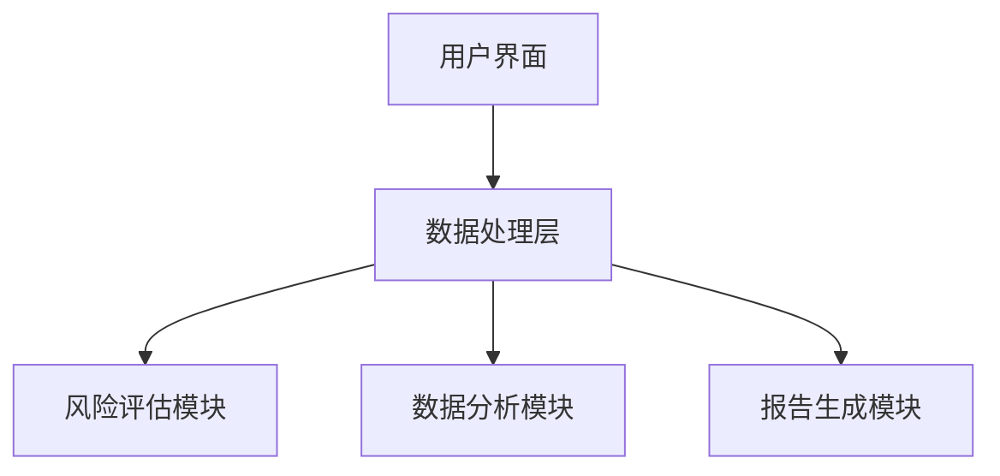

                 


# 《金融衍生品组合风险分解工具》

**关键词：** 金融衍生品，组合风险，风险分解，VaR，CVaR，蒙特卡洛模拟

**摘要：**  
金融衍生品的复杂性和波动性使得其组合风险的评估和管理变得尤为重要。本文旨在介绍一种金融衍生品组合风险分解工具的设计与实现，通过数学模型和算法，将复杂的金融风险分解为可管理的部分，帮助金融机构更好地进行风险控制。本文从金融衍生品的基本概念出发，详细讲解风险分解的核心原理、算法实现、系统架构设计以及实际应用案例，为读者提供一个全面的技术视角。

---

## 第一部分：金融衍生品组合风险分解工具的背景与意义

### 第1章：金融衍生品的基本概念

#### 1.1 金融衍生品的定义与分类
金融衍生品是一种以金融资产或其价格为基础，通过复杂数学模型定价的金融工具。常见的金融衍生品包括期权、期货、掉期和互换等。这些工具具有高杠杆性和非线性收益特征，使得其风险评估变得复杂。

#### 1.2 金融衍生品的风险特征
金融衍生品的风险主要体现在价格波动、信用风险和流动性风险等方面。由于其复杂性，组合风险的评估需要考虑多个因素，如市场波动、相关性以及模型假设等。

#### 1.3 组合风险分解的重要性
在金融衍生品组合中，单一工具的风险可能相互影响，导致整体风险复杂化。通过风险分解，可以将组合风险分解为各个组成部分的风险贡献，从而更精准地进行风险管理和对冲。

---

### 第2章：金融衍生品组合风险分解工具的必要性

#### 2.1 风险管理的核心目标
金融机构的目标是在收益与风险之间找到平衡。通过风险分解工具，可以量化组合风险，帮助机构做出更明智的投资决策。

#### 2.2 风险分解工具的市场需求
随着金融市场的发展，投资者对风险管理工具的需求日益增加。金融衍生品组合风险分解工具能够满足机构对复杂金融工具的风险评估需求。

#### 2.3 工具在金融行业中的应用价值
通过风险分解工具，金融机构可以更高效地进行风险定价、组合优化和情景分析，从而提高风险管理的效率和准确性。

---

## 第二部分：金融衍生品组合风险分解工具的核心概念与联系

### 第3章：风险分解的核心原理

#### 3.1 风险分解的基本原理
风险分解是通过数学模型将组合风险分解为各个组成部分的风险贡献。常用的方法包括线性回归、蒙特卡洛模拟和VaR/CVaR模型。

#### 3.2 风险分解的数学模型
风险分解通常基于统计学和概率论模型。例如，线性回归模型可以用于分解资产组合的收益波动。

#### 3.3 风险分解的步骤与流程
风险分解的流程包括数据收集、模型选择、参数估计和结果解读。

### 第4章：核心概念与联系

#### 4.1 风险分解的核心要素
风险分解的核心要素包括资产价格数据、模型假设和风险度量方法。

#### 4.2 风险分解与金融衍生品的关系
金融衍生品的价格波动是风险分解的核心对象。通过分解这些波动，可以更好地理解组合风险的来源。

#### 4.3 风险分解工具与其他金融工具的对比
与其他金融工具相比，风险分解工具的独特之处在于其能够量化和分解复杂金融工具的风险贡献。

---

## 第三部分：金融衍生品组合风险分解工具的算法原理

### 第5章：算法实现的步骤

#### 5.1 数据预处理
数据预处理包括清洗、标准化和特征选择。例如，使用Python中的Pandas库进行数据清洗和处理。

#### 5.2 模型训练
选择合适的模型进行训练，如线性回归或非线性模型。使用Scikit-learn库中的回归模型进行训练。

#### 5.3 模型评估与优化
通过交叉验证和超参数调优来优化模型性能。例如，使用GridSearchCV进行参数优化。

### 第6章：算法的数学公式

#### 6.1 线性回归公式
$$ y = \beta_0 + \beta_1x + \epsilon $$

#### 6.2 非线性回归公式
$$ y = \beta_0 + \beta_1x + \beta_2x^2 + \epsilon $$

#### 6.3 时间序列模型公式
$$ ARIMA(p, d, q) $$

---

## 第四部分：金融衍生品组合风险分解工具的系统分析与架构设计

### 第7章：系统功能设计

#### 7.1 风险评估模块
风险评估模块负责计算组合风险的各个组成部分。例如，使用蒙特卡洛模拟计算VaR。

#### 7.2 数据分析模块
数据分析模块用于数据清洗和特征工程。例如，使用Pandas进行数据处理。

#### 7.3 报告生成模块
报告生成模块将分析结果以可视化图表和报告的形式呈现。例如，使用Matplotlib生成风险分布图。

### 第8章：系统架构设计

#### 8.1 系统架构图（Mermaid）


#### 8.2 实体关系图（Mermaid）
```mermaid
erd
    User
    has a
    RiskAssessmentTool
    RiskAssessmentTool
    has many
    RiskComponent
```

---

## 第五部分：项目实战

### 第9章：环境配置与代码实现

#### 9.1 环境配置
安装必要的Python库，如NumPy、Pandas、Scikit-learn和Matplotlib。

#### 9.2 代码实现
以下是一个使用Python实现的VaR计算示例代码：
```python
import numpy as np
import pandas as pd
from sklearn.linear_model import LinearRegression
import matplotlib.pyplot as plt

# 数据加载
data = pd.read_csv('derivatives.csv')

# 特征工程
X = data[['spot_price', 'volatility']]
y = data['returns']

# 模型训练
model = LinearRegression()
model.fit(X, y)

# 风险评估
predicted_returns = model.predict(X)
errors = y - predicted_returns
VaR = np.percentile(errors, 5)

print(f"VaR at 5% confidence level: {VaR}")
```

#### 9.3 代码解读与分析
上述代码通过线性回归模型预测资产回报，并计算5%置信水平下的VaR值。这可以帮助投资者理解潜在损失的范围。

---

## 第六部分：最佳实践与小结

### 第10章：最佳实践

#### 10.1 工具的优缺点
优点：能够量化组合风险，帮助机构进行风险管理。缺点：模型假设可能影响结果的准确性。

#### 10.2 使用建议
在实际应用中，建议结合多种风险度量方法，如VaR和CVaR，以全面评估组合风险。

#### 10.3 未来发展方向
未来可以探索更复杂的模型，如深度学习和强化学习，以提高风险分解的精度。

---

## 结语

通过本文的介绍，读者可以全面了解金融衍生品组合风险分解工具的设计与实现。从理论到实践，我们详细讲解了风险分解的核心原理、算法实现和系统架构设计。希望这些内容能够为金融机构的风险管理提供有价值的参考。

---

**作者：AI天才研究院/AI Genius Institute & 禅与计算机程序设计艺术 /Zen And The Art of Computer Programming**

