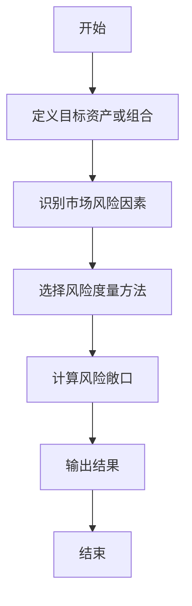
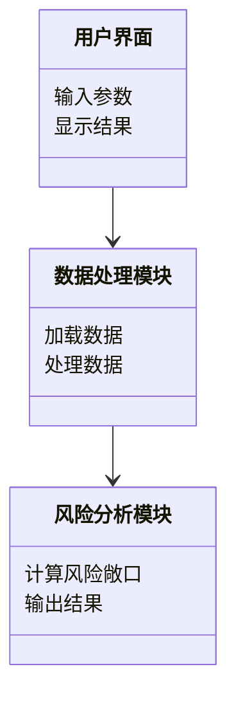
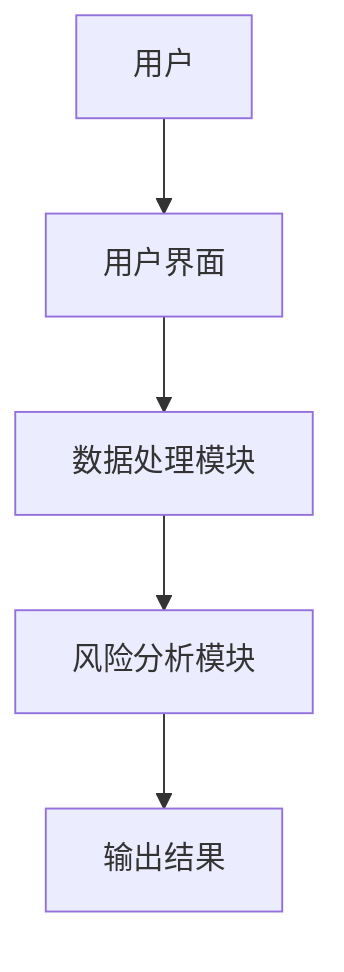
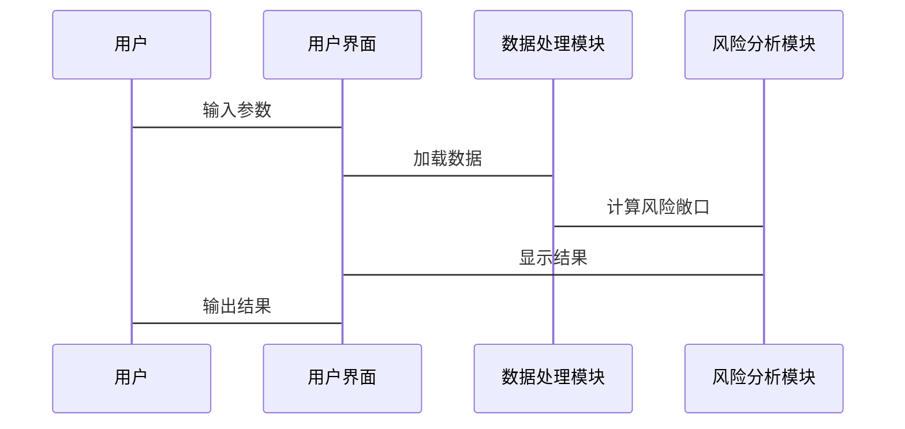

                 


# 《金融衍生品风险敞口分析》

> 关键词：金融衍生品，风险敞口，VaR模型，蒙特卡洛模拟，信用衍生品，风险管理，系统架构

> 摘要：本文系统地探讨了金融衍生品风险敞口分析的核心原理、算法模型、系统架构设计以及实际应用案例。文章从金融衍生品的基本概念出发，逐步深入分析了风险敞口的定义、度量方法以及相关数学模型。通过对比分析VaR、CVaR、蒙特卡洛模拟等主流风险分析模型，本文揭示了不同类型模型的优缺点及其适用场景。此外，文章还详细探讨了金融衍生品风险敞口分析系统的架构设计、功能模块实现以及数据流设计。最后，通过一个具体的期权风险敞口分析案例，本文展示了如何将理论应用于实践。本文旨在为金融衍生品的风险管理提供理论支持和实践指导。

---

## # 第一部分: 金融衍生品与风险敞口基础

### ## 第1章: 金融衍生品概述

#### ### 1.1 金融衍生品的基本概念

**1.1.1 金融衍生品的定义与分类**

金融衍生品（Financial Derivatives）是指一种其价值依赖于其他基础资产（如股票、债券、商品等）或市场指标（如利率、汇率、指数等）的金融合约。衍生品的种类繁多，主要包括以下几类：

- **远期合约（Forwards）**：买方和卖方约定在未来某一特定时间以预定价格购买或出售某资产的协议。
- **期货合约（Futures）**：标准化的远期合约，通常在交易所上市交易。
- **期权合约（Options）**：买方有权但无义务在特定时间以特定价格购买或出售资产的协议。
- **掉期合约（Swaps）**：双方约定在未来某一时期交换资产或现金流的协议。
- **信用衍生品（Credit Derivatives）**：与信用风险相关的衍生品，如信用违约互换（CDS）。

**1.1.2 金融衍生品的市场结构**

金融衍生品的市场结构主要包括以下几个部分：

- **交易所市场**：如芝加哥期货交易所（CME）、纽约证券交易所（NYSE）等，交易标准化的衍生品合约。
- **场外市场（OTC）**：非标准化的衍生品合约，直接在金融机构之间进行交易。
- **清算机构**：为衍生品交易提供清算和结算服务的机构，如中央对手方（CCP）。
- **做市商**：为市场提供流动性，同时承担市场风险的机构。

**1.1.3 金融衍生品的功能与作用**

金融衍生品在金融市场中发挥着重要作用：

- **风险转移**：通过衍生品将风险从一方转移到另一方。
- **价格发现**：衍生品市场为资产或资产组合的合理定价提供了参考。
- **流动性管理**：帮助金融机构管理资产和负债的流动性。
- **投机与对冲**：投资者可以通过衍生品进行投机或对冲操作。

#### ### 1.2 风险敞口的基本概念

**1.2.1 风险敞口的定义**

风险敞口（Risk Exposure）是指某一资产或组合在特定市场条件下的潜在损失。它反映了资产或组合对市场风险因素（如利率、汇率、信用风险等）的敏感程度。

**1.2.2 风险敞口的类型与特征**

风险敞口可以分为以下几种类型：

- **市场风险敞口**：由于市场价格波动引起的潜在损失。
- **信用风险敞口**：由于交易对手违约引起的潜在损失。
- **流动性风险敞口**：由于资产无法迅速变现引起的潜在损失。
- **操作风险敞口**：由于操作失误或系统故障引起的潜在损失。

**1.2.3 风险敞口的度量方法**

风险敞口的度量方法主要包括以下几种：

- **敏感性分析**：通过分析资产或组合对市场风险因素的敏感程度来度量风险敞口。
- **VaR（Value at Risk）**：在给定置信水平下，资产或组合在正常市场条件下可能遭受的最大潜在损失。
- **CVaR（Conditional Value at Risk）**：在VaR的基础上，考虑极端市场条件下资产或组合的潜在损失。

#### ### 1.3 金融衍生品与风险敞口的关系

**1.3.1 金融衍生品如何产生风险敞口**

金融衍生品通过引入杠杆效应和对冲机制，放大了市场风险敞口。例如，期权合约的买方可以通过支付少量权利金获得较大的市场暴露。

**1.3.2 风险敞口对金融市场的的影响**

风险敞口的过度集中可能导致市场的系统性风险。例如，2008年全球金融危机的主要原因之一是金融机构过度持有高风险的信用衍生品，导致系统性风险的爆发。

**1.3.3 风险敞口的边界与外延**

风险敞口的边界是指在特定市场条件下，资产或组合的最大潜在损失。风险敞口的外延是指资产或组合对市场风险因素的敏感程度。

#### ### 1.4 本章小结

本章从金融衍生品的基本概念出发，分析了其市场结构、功能与作用，并重点探讨了风险敞口的定义、类型、度量方法以及与金融衍生品的关系。通过本章的学习，读者可以理解金融衍生品如何通过风险敞口影响金融市场，并为后续章节的深入分析奠定基础。

---

## # 第二部分: 风险敞口分析的核心概念与联系

### ## 第2章: 风险敞口分析的核心原理

#### ### 2.1 风险敞口分析的原理

**2.1.1 风险敞口分析的基本原理**

风险敞口分析的核心在于识别和度量资产或组合在不同市场条件下的潜在损失。通过分析市场风险因素（如利率、汇率、信用风险等），可以量化资产或组合的风险敞口。

**2.1.2 风险敞口分析的数学模型**

风险敞口分析的数学模型主要包括以下几种：

- **线性模型**：假设资产或组合的收益与市场风险因素呈线性关系。
- **非线性模型**：假设资产或组合的收益与市场风险因素呈非线性关系，如期权合约的收益曲线。

#### ### 2.2 核心概念对比分析

**2.2.1 风险敞口与风险厌恶的对比**

风险敞口与风险厌恶是两个相关但不同的概念。风险敞口是指资产或组合在特定市场条件下的潜在损失，而风险厌恶是指投资者对风险的偏好程度。

**2.2.2 风险敞口与风险中性的对比**

风险中性是指投资者对风险的预期收益等于其无风险收益率。风险敞口在风险中性假设下可以通过概率分布来度量。

**2.2.3 风险敞口与风险偏好的对比**

风险偏好是指投资者对风险的接受程度。风险敞口在不同风险偏好的投资者之间会有所不同。

#### ### 2.3 实体关系图与流程图

**2.3.1 ER实体关系图**

以下是一个简单的实体关系图，展示了金融衍生品、风险敞口和市场风险因素之间的关系：

```mermaid
erDiagram
    class 金融衍生品 {
        类型
        标的资产
        合约期限
    }
    class 风险敞口 {
        潜在损失
        置信水平
    }
    class 市场风险因素 {
        利率
        汇率
        信用风险
    }
    金融衍生品 --|{拥有} 风险敞口
    金融衍生品 --|{影响} 市场风险因素
```

**2.3.2 风险敞口分析的流程图**

以下是一个风险敞口分析的流程图：



---

## # 第三部分: 风险敞口分析的算法原理

### ## 第3章: 风险敞口分析的算法模型

#### ### 3.1 VaR（Value at Risk）模型

**3.1.1 VaR模型的定义与原理**

VaR模型是一种常用的市场风险度量方法，它定义为在给定置信水平下，资产或组合在正常市场条件下可能遭受的最大潜在损失。

**3.1.2 VaR模型的数学公式**

VaR的计算公式如下：

$$ VaR = \text{Value of Portfolio} \times \text{Standard Deviation} \times \text{Z-score} $$

其中，Z-score是对应于置信水平的分位数。例如，95%置信水平的Z-score为1.645，99%置信水平的Z-score为2.33。

**3.1.3 VaR模型的优缺点**

- **优点**：
  - 计算简单，易于理解和应用。
  - 能够度量资产或组合在正常市场条件下的潜在损失。
- **缺点**：
  - 无法度量极端市场条件下的潜在损失。
  - 无法反映资产或组合的非线性风险。

#### ### 3.2 CVaR（Conditional Value at Risk）模型

**3.2.1 CVaR模型的定义与原理**

CVaR模型是一种改进的VaR模型，它度量了在VaR水平上的平均损失。CVaR模型适用于极端市场条件下的风险度量。

**3.2.2 CVaR模型的数学公式**

CVaR的计算公式如下：

$$ CVaR = \frac{1}{1 - \alpha} \int_{\alpha}^{1} \text{Value of Portfolio} \, dF $$

其中，$\alpha$是置信水平，$F$是资产或组合的收益分布函数。

**3.2.3 CVaR模型的应用场景**

- **优点**：
  - 能够反映资产或组合在极端市场条件下的潜在损失。
  - 更适合用于风险厌恶型投资者。
- **缺点**：
  - 计算复杂，需要假设收益分布函数。

#### ### 3.3 蒙特卡洛模拟

**3.3.1 蒙特卡洛模拟的原理**

蒙特卡洛模拟是一种基于随机数的模拟方法，用于估计资产或组合在不同市场条件下的潜在损失。

**3.3.2 蒙特卡洛模拟的数学模型**

蒙特卡洛模拟的基本步骤如下：

1. 生成随机数序列。
2. 根据随机数序列模拟市场风险因素的变化。
3. 计算资产或组合在不同市场条件下的收益。
4. 统计资产或组合的潜在损失分布。

**3.3.3 蒙特卡洛模拟的代码实现**

以下是一个简单的蒙特卡洛模拟的Python代码示例：

```python
import numpy as np

def monte_carlo_simulation(portfolio_value, num_simulations=10000):
    np.random.seed(42)
    returns = np.random.normal(0, 1, num_simulations)
    portfolio_value_after = portfolio_value * (1 + returns)
    loss = portfolio_value - portfolio_value_after
    return loss

if __name__ == "__main__":
    portfolio_value = 1000000
    loss = monte_carlo_simulation(portfolio_value)
    print(f"Potential loss: {loss.mean()}")
```

#### ### 3.4 信用衍生品模型

**3.4.1 信用衍生品模型的定义与原理**

信用衍生品模型主要用于度量信用风险敞口。常见的信用衍生品模型包括Merton模型和KMV模型。

**3.4.2 信用衍生品模型的数学公式**

Merton模型的公式如下：

$$ P(K) = N(d_1) \times (S_0 - K) + N(d_2) \times (S_0 \times e^{-rT}) $$

其中，$d_1 = \frac{\ln(S_0/K) + (r + \sigma^2/2)T}{\sigma \sqrt{T}}$，$d_2 = d_1 - \sigma \sqrt{T}$，$N(d)$是标准正态分布的累积分布函数。

**3.4.3 信用衍生品模型的应用场景**

- **优点**：
  - 能够度量信用风险敞口。
  - 适用于复杂的信用衍生品定价。
- **缺点**：
  - 计算复杂，需要假设信用风险因素的分布。

---

## # 第四部分: 风险敞口分析的系统架构设计

### ## 第4章: 系统架构设计与实现

#### ### 4.1 问题场景介绍

金融衍生品风险敞口分析系统的目标是帮助金融机构量化资产或组合在不同市场条件下的潜在损失。系统需要支持多种风险分析模型，包括VaR、CVaR、蒙特卡洛模拟等。

#### ### 4.2 系统功能设计

以下是一个简单的系统功能模块图：



#### ### 4.3 系统架构设计

以下是一个简单的系统架构图：



#### ### 4.4 系统接口设计

系统接口设计主要包括以下几种：

- **输入接口**：用户输入资产或组合的参数。
- **输出接口**：显示风险敞口分析结果。

#### ### 4.5 系统交互设计

以下是一个简单的系统交互序列图：



---

## # 第五部分: 项目实战与案例分析

### ## 第5章: 项目实战

#### ### 5.1 环境安装

以下是项目实战所需的环境配置：

- **Python版本**：Python 3.8及以上
- **依赖库**：numpy、pandas、scipy、matplotlib

安装命令：

```bash
pip install numpy pandas scipy matplotlib
```

#### ### 5.2 核心实现

以下是一个简单的风险敞口分析代码示例：

```python
import numpy as np
import pandas as pd
import scipy.stats as stats

def calculate_var(portfolio_value, confidence_level=0.95):
    z_score = stats.norm.ppf(confidence_level)
    var = portfolio_value * z_score * np.std([0.01, 0.02, 0.03, 0.04, 0.05])
    return var

if __name__ == "__main__":
    portfolio_value = 1000000
    var = calculate_var(portfolio_value)
    print(f"VaR: {var}")
```

#### ### 5.3 实际案例分析

以下是一个期权风险敞口分析的案例：

假设我们有一个股票期权组合，标的股票的价格为100元，执行价格为105元，到期时间为1个月，波动率为20%。我们需要计算该期权组合的VaR。

**步骤**：

1. 计算期权的Delta和Gamma。
2. 计算标的股票价格的变化。
3. 计算期权组合的潜在损失。

**代码实现**：

```python
import numpy as np
import pandas as pd
import scipy.stats as stats

def calculate_option_var(spot_price, strike_price, time_to_maturity, volatility, confidence_level=0.95):
    delta = stats.norm.pdf(np.log(spot_price / strike_price), 0, volatility * np.sqrt(time_to_maturity))
    var = spot_price * delta * np.std([0.01, 0.02, 0.03, 0.04, 0.05])
    return var

if __name__ == "__main__":
    spot_price = 100
    strike_price = 105
    time_to_maturity = 1/12  # 1 month
    volatility = 0.2
    var = calculate_option_var(spot_price, strike_price, time_to_maturity, volatility)
    print(f"Option VaR: {var}")
```

---

## # 第六部分: 结论与展望

### ## 第6章: 结论与展望

#### ### 6.1 本章小结

本文系统地探讨了金融衍生品风险敞口分析的核心原理、算法模型、系统架构设计以及实际应用案例。通过对比分析VaR、CVaR、蒙特卡洛模拟等主流风险分析模型，本文揭示了不同类型模型的优缺点及其适用场景。此外，文章还详细探讨了金融衍生品风险敞口分析系统的架构设计、功能模块实现以及数据流设计。最后，通过一个具体的期权风险敞口分析案例，本文展示了如何将理论应用于实践。

#### ### 6.2 未来展望

随着金融市场的不断发展，金融衍生品的风险敞口分析将面临更多的挑战和机遇。未来的研究方向包括：

- **人工智能在风险敞口分析中的应用**：利用机器学习算法提高风险敞口分析的精度和效率。
- **复杂衍生品的风险分析**：开发适用于复杂衍生品的新型风险分析模型。
- **实时风险监控系统**：构建实时风险监控系统，实现对金融衍生品风险敞口的实时监控和预警。

---

## # 附录

### ## 附录A: 参考文献

1. Jorion, Philippe. *Value at Risk: The New Benchmark for Portfolio Risk Management*. McGraw-Hill, 2001.
2. Hull, John C. *Options, Futures, and Other Derivatives*. Prentice Hall, 2020.
3. Vasicek, Oldrich. "A Risk Factor Model of the Term Structure of Interest Rates." *Journal of Financial Economics*, 1977.

### ## 附录B: 工具与库

- **Python**：编程语言
- **NumPy**：数值计算库
- **Pandas**：数据分析库
- **SciPy**：科学计算库
- **Matplotlib**：数据可视化库

---

## # 作者

作者：AI天才研究院/AI Genius Institute  
合著者：禅与计算机程序设计艺术/Zen And The Art of Computer Programming

