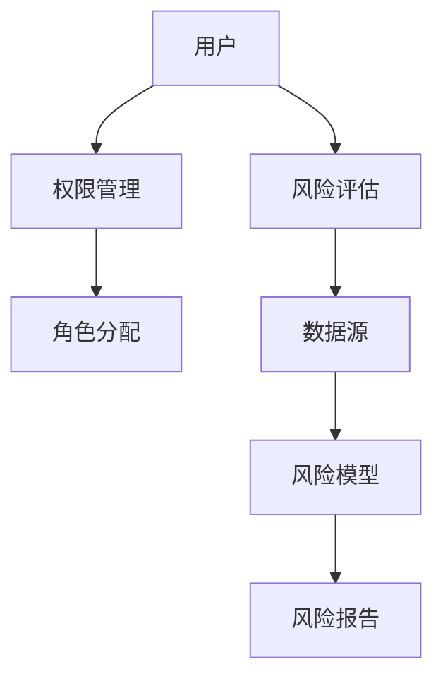

                 

# 《金融衍生品风险管理平台》

---

## 关键词：
- 金融衍生品
- 风险管理
- 平台架构
- 风险评估
- 系统设计

---

## 摘要：
《金融衍生品风险管理平台》一书深入探讨了金融衍生品及其风险管理的核心概念、算法原理、系统架构设计和实际应用。本书首先介绍了金融衍生品的基本概念及其风险管理的重要性，然后详细讲解了风险管理平台的必要性、核心功能模块和用户角色。接着，通过Mermaid图表和Python代码示例，分析了蒙特卡洛模拟的算法原理，展示了如何量化和评估金融衍生品的风险。随后，设计了系统的功能模块、数据流和信息交互架构，并通过实战案例展示了如何实现风险管理平台。最后，总结了最佳实践和注意事项，为读者提供了全面的指导。

---

# 第一部分: 金融衍生品风险管理平台背景与核心概念

## 第1章: 金融衍生品风险管理平台概述

### 1.1 金融衍生品的基本概念

#### 1.1.1 金融衍生品的定义与分类
金融衍生品（Financial Derivatives）是指从基础金融工具（如股票、债券、货币和商品）派生出来的金融合约。它们的价值依赖于基础资产的价格波动。衍生品的主要类型包括：
- **远期合约**：约定在未来某个日期以预定价格买卖资产。
- **期货合约**：在交易所上市的标准化远期合约。
- **期权合约**：赋予买方在特定时间内以预定价格买入或卖出资产的权利。
- **互换合约**：约定在未来某个日期交换现金流。

衍生品具有高杠杆性、高风险性和复杂性，因此需要有效的风险管理工具。

#### 1.1.2 金融衍生品的市场现状
金融衍生品市场是全球最大的金融市场之一，市场规模远超基础资产市场。衍生品广泛用于对冲风险、投机和套利。然而，其复杂性也导致了2008年金融危机等重大事件的发生。

#### 1.1.3 金融衍生品的风险特性
衍生品的风险主要包括市场风险、信用风险、流动性风险和操作风险。这些风险可能在短时间内迅速放大，导致巨大损失。

---

### 1.2 风险管理的重要性

#### 1.2.1 风险管理的核心概念
风险管理是指识别、评估和应对潜在风险的过程，旨在最小化损失并确保目标的实现。在金融领域，风险管理是确保资产安全的关键。

#### 1.2.2 金融衍生品风险管理的必要性
衍生品的高风险性使其成为风险管理的重点对象。有效的风险管理可以降低损失，确保金融机构的稳健运营。

#### 1.2.3 平台在风险管理中的作用
风险管理平台通过自动化数据处理和实时监控，提高了风险管理的效率和准确性，帮助金融机构及时应对风险。

---

### 1.3 金融衍生品风险管理平台的必要性

#### 1.3.1 传统风险管理的局限性
传统风险管理依赖人工操作，效率低、误差大，难以应对复杂多变的金融市场。

#### 1.3.2 平台化管理的优势
风险管理平台能够快速处理大量数据，实时监控风险，提供精准的风险评估和对冲策略。

#### 1.3.3 平台的功能与目标
- 数据采集与处理
- 风险评估与预警
- 风险对冲与控制
- 报告生成与分析

---

## 第2章: 金融衍生品风险管理的核心概念

### 2.1 金融衍生品的主要类型

#### 2.1.1 远期合约
远期合约是双方约定在未来以预定价格买卖资产的协议。其优点是灵活性高，缺点是信用风险较大。

#### 2.1.2 期货合约
期货合约是在交易所上市的标准化远期合约，具有高流动性和透明度。期货合约常用于对冲价格波动风险。

#### 2.1.3 期权合约
期权赋予买方在特定时间内以预定价格买入或卖出资产的权利。期权的风险管理复杂，需考虑波动率和时间价值。

#### 2.1.4 货币市场工具
货币市场工具包括短期债券和大额存单，用于管理流动性风险。

---

### 2.2 风险管理的关键要素

#### 2.2.1 风险识别
风险识别是发现潜在风险的第一步，包括分析市场、信用和操作风险。

#### 2.2.2 风险量化
风险量化通过数学模型将风险转化为数值，常用波动率、VaR（在险值）和CVaR（条件在险值）等指标。

#### 2.2.3 风险评估
风险评估结合历史数据和市场预测，评估风险的影响程度和可能性。

#### 2.2.4 风险控制
风险控制通过对冲、限额和压力测试等方法，降低风险敞口。

---

### 2.3 金融衍生品风险管理平台的架构

#### 2.3.1 平台的核心功能模块
- 数据采集与处理
- 风险评估与预警
- 风险对冲与控制
- 报告生成与分析

#### 2.3.2 平台的用户角色与权限
- 管理员：负责平台维护和权限管理。
- 风险经理：负责风险评估和对冲策略。
- 交易员：负责交易执行和风险监控。

#### 2.3.3 平台的数据流与信息交互
数据从市场、交易系统和外部数据源流向平台，经过处理和分析后生成风险报告。

---

## 第3章: 金融衍生品风险管理平台的核心概念与联系

### 3.1 核心概念原理

#### 3.1.1 风险评估的数学模型
VaR模型计算在给定置信水平下的潜在损失。公式为：
$$ VaR = \mu + z \cdot \sigma $$
其中，$\mu$是均值，$z$是标准正态分布的分位数，$\sigma$是标准差。

#### 3.1.2 金融衍生品定价的理论基础
Black-Scholes模型用于期权定价，公式为：
$$ C = S_0 e^{r t} N(d_1) - K e^{r T} N(d_2) $$
其中，$S_0$是标的资产价格，$r$是无风险利率，$T$是到期时间，$K$是执行价格，$N$是标准正态分布的累积分布函数，$d_1$和$d_2$是参数。

#### 3.1.3 风险对冲的策略分析
对冲策略通过同时买入和卖出相关资产，抵消价格波动带来的风险。

---

### 3.2 核心概念属性特征对比

| **风险类型** | **定义** | **主要影响** | **管理策略** |
|--------------|----------|--------------|--------------|
| 市场风险     | 价格波动带来的损失 | 资产价格波动 | 多样化、对冲 |
| 信用风险     | 对方违约带来的损失 | 交易对手信用 | 信用评估、限额 |
| 流动性风险     | 无法快速变现带来的损失 | 市场深度和流动性 | 现金储备、短期投资 |
| 操作风险     | 内部操作失误带来的损失 | 人员、系统失误 | 内部控制、培训 |

---

### 3.3 ER实体关系图

---

## 总结
通过以上内容，我们介绍了金融衍生品及其风险管理的核心概念、算法原理和平台架构。后续章节将深入分析算法实现和系统设计，并通过实战案例展示风险管理平台的应用。希望本书能够帮助读者全面理解金融衍生品风险管理，并能够实际应用相关技术。

---

**作者：AI天才研究院/AI Genius Institute & 禅与计算机程序设计艺术 /Zen And The Art of Computer Programming**

