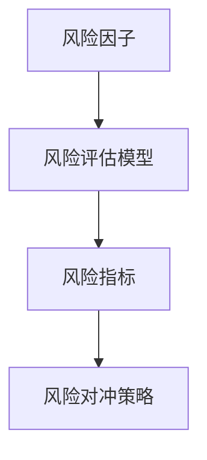
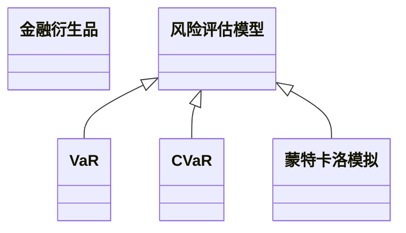
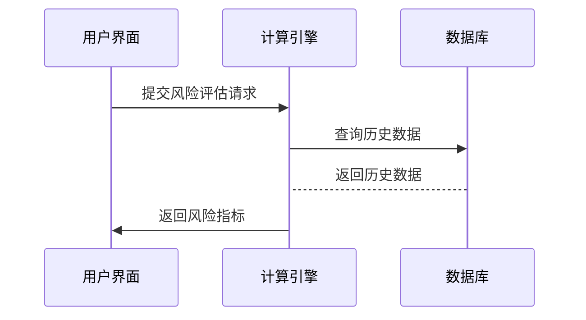

                 


# 金融衍生品风险评估模型

> 关键词：金融衍生品、风险评估、VaR、CVaR、蒙特卡洛模拟

> 摘要：本文详细探讨了金融衍生品风险评估模型的核心概念、算法原理、系统架构设计及项目实战。通过对历史模拟法、方差-协方差法、蒙特卡洛模拟等算法的深入分析，结合VaR和CVaR等风险指标，帮助读者构建一个高效的风险评估系统。文章还提供了详细的系统设计和代码实现，帮助读者理解如何在实际场景中应用这些模型。

---

## 第一部分: 金融衍生品风险评估模型概述

### 第1章: 金融衍生品与风险评估概述

#### 1.1 金融衍生品的基本概念

##### 1.1.1 金融衍生品的定义与分类

金融衍生品（Financial Derivatives）是一种以金融资产或其价格变动为基础，通过契约形式约定在未来的某一特定日期以约定价格买卖金融资产或基于其价格变动结算的金融工具。常见的金融衍生品包括期货、期权、掉期（Swap）和远期合约等。

| 分类维度 | 分类 | 描述 |
|----------|------|------|
| 合约类型 | 期货 | 标准化合约，通常在交易所交易 |
|          | 期权 | 给买方在特定时间内以特定价格买入或卖出标的资产的权利 |
| 价格基础 | 外汇衍生品 | 以汇率为基础的衍生品 |
|          | 利率衍生品 | 以利率为基础的衍生品 |
|          | 股权衍生品 | 以股票或股票指数为基础的衍生品 |

##### 1.1.2 金融衍生品的市场现状

近年来，金融衍生品市场规模迅速增长，已成为全球金融市场的重要组成部分。根据国际清算银行（BIS）的数据，全球衍生品市场的规模已超过100万亿美元。衍生品的广泛使用使得金融市场的风险管理和定价问题变得尤为重要。

##### 1.1.3 金融衍生品的风险特征

衍生品的风险主要体现在以下几个方面：

1. **价格波动风险**：衍生品的价格受标的资产价格波动的影响较大。
2. **信用风险**：交易对手可能无法履行合约义务。
3. **流动性风险**：某些衍生品的流动性较差，可能导致无法及时变现。
4. **操作风险**：操作失误可能导致重大损失。

#### 1.2 风险评估模型的背景与意义

##### 1.2.1 金融衍生品风险的来源

衍生品的风险来源主要包括：

1. **市场风险**：由于市场波动导致的损失。
2. **信用风险**：交易对手违约的风险。
3. **操作风险**：由于操作失误或系统故障导致的损失。
4. **模型风险**：由于模型假设或参数选择不当导致的误差。

##### 1.2.2 风险评估模型的重要性

在金融衍生品交易中，准确评估风险是确保交易安全、控制风险敞口的关键。通过建立风险评估模型，金融机构可以量化风险，制定合理的风险对冲策略。

##### 1.2.3 模型在金融决策中的作用

风险评估模型不仅用于风险量化，还可以用于：

1. **定价**：确定衍生品的合理市场价格。
2. **对冲**：制定套期保值策略。
3. **监管**：满足监管机构的风险披露要求。

#### 1.3 本书的核心内容与目标

##### 1.3.1 本书的研究目标

本文旨在探讨金融衍生品风险评估模型的核心原理、算法实现及系统设计。通过对多种风险评估方法的分析，为读者提供一个全面的理论框架和实践指南。

##### 1.3.2 本书的主要内容

本文将从金融衍生品的基本概念出发，逐步深入探讨风险评估模型的构建过程。主要内容包括：

- 常见风险评估算法（如VaR、CVaR）的原理与实现。
- 系统架构设计与实现。
- 项目实战与案例分析。

##### 1.3.3 本书的读者群体

本书适合以下读者阅读：

- 对金融衍生品感兴趣的学生和研究人员。
- 金融行业从业者，特别是风险管理部门的人员。
- 对风险评估模型感兴趣的程序员和数据科学家。

#### 1.4 本章小结

本章通过对金融衍生品的基本概念、市场现状及风险特征的介绍，阐述了风险评估模型的重要性与应用价值。接下来的章节将深入探讨风险评估的核心概念、算法原理及系统设计。

---

## 第二部分: 金融衍生品风险评估模型的核心概念与联系

### 第2章: 金融衍生品风险评估的核心概念

#### 2.1 风险因子与模型假设

##### 2.1.1 风险因子的定义与分类

风险因子（Risk Factor）是指影响衍生品价格的各种因素，常见的风险因子包括：

1. **利率**：影响债券和固定收益类衍生品的价格。
2. **汇率**：影响外汇衍生品的价格。
3. **股票价格**：影响股权类衍生品的价格。
4. **波动率**：反映资产价格波动程度，影响期权定价。

##### 2.1.2 模型假设的合理性分析

在构建风险评估模型时，通常需要做一些假设，例如：

1. 市场流动性充足，可以假设标的资产价格服从几何布朗运动。
2. 交易对手信用风险可以通过评级模型进行量化。

##### 2.1.3 风险因子与模型假设的关联

通过将风险因子与模型假设相结合，可以构建一个完整的风险评估框架。例如，使用历史数据模拟利率波动，进而评估债券期权的风险敞口。

##### 2.1.4 风险因子与模型假设的对比表格

| 风险因子 | 模型假设 |
|----------|----------|
| 利率     | 利率服从几何布朗运动 |
| 汇率     | 汇率波动符合对数正态分布 |
| 股票价格 | 股票价格符合几何布朗运动 |
| 波动率   | 波动率是时间相关的 |

##### 2.1.5 实体关系图



#### 2.2 风险评估模型的输入与输出

##### 2.2.1 模型输入的定义与特征

风险评估模型的主要输入包括：

- 标的资产价格历史数据。
- 合约期限。
- 风险因子假设。
- 模型参数（如波动率、相关性系数）。

##### 2.2.2 模型输出的解释与应用

模型输出主要包括：

- 风险价值（VaR）：在给定置信水平下，可能的最大损失。
- 期望损失（Expected Loss）：模型预测的平均损失。
- 压力测试结果：在极端市场条件下的风险敞口。

##### 2.2.3 输入与输出之间的关系

通过输入风险因子和模型假设，模型输出风险指标，帮助交易员制定对冲策略。

#### 2.3 风险评估模型的数学基础

##### 2.3.1 概率论与统计学基础

概率论是风险评估的基础，特别是在蒙特卡洛模拟中，概率分布的假设至关重要。

##### 2.3.2 金融数学模型的简要回顾

常见的金融数学模型包括Black-Scholes模型、CAPM模型等。

##### 2.3.3 风险评估模型的数学框架

以VaR为例，其数学表达式为：

$$ VaR = \text{Value at Risk} = \text{分位数}(P \times L) $$

其中，P是置信水平，L是损失分布。

#### 2.4 本章小结

本章通过对风险因子和模型假设的分析，构建了风险评估模型的数学框架。接下来的章节将详细探讨具体的风险评估算法。

---

## 第三部分: 金融衍生品风险评估模型的算法原理

### 第3章: 常见风险评估算法原理

#### 3.1 历史模拟法（Historical Simulation）

##### 3.1.1 方法概述

历史模拟法通过回顾标的资产的历史价格数据，计算可能的损失分布。

##### 3.1.2 算法步骤

1. 收集标的资产的历史价格数据。
2. 计算每期的收益率。
3. 对收益率进行排序，计算VaR。

##### 3.1.3 优缺点分析

优点：简单易行，不需要复杂的假设。缺点：假设未来会重复历史，可能不适用于极端情况。

##### 3.1.4 示例代码

```python
import numpy as np

def historical_simulation(prices, confidence_level):
    returns = np.log(prices[1:] / prices[:-1])
    sorted_returns = np.sort(returns)
    VaR = -np.exp(sorted_returns[int(len(sorted_returns) * (1 - confidence_level))]) * prices[-1]
    return VaR
```

#### 3.2 方差-协方差法（Variance-Covariance Method）

##### 3.2.1 方法概述

方差-协方差法通过计算资产价格的波动性，预测可能的损失分布。

##### 3.2.2 算法步骤

1. 计算资产价格的收益率。
2. 计算收益率的方差和协方差矩阵。
3. 生成随机数，模拟可能的收益率。
4. 计算对应的资产价格。
5. 计算VaR。

##### 3.2.3 优缺点分析

优点：考虑了资产之间的相关性。缺点：假设收益率服从正态分布，可能与实际不符。

##### 3.2.4 示例代码

```python
import numpy as np

def variance_covariance_method(prices, confidence_level):
    returns = np.log(prices[1:] / prices[:-1])
    mu = np.mean(returns)
    sigma = np.std(returns)
    VaR = -np.exp(mu + sigma * np.norm.sloc(1 - confidence_level)) * prices[-1]
    return VaR
```

#### 3.3 蒙特卡洛模拟法（Monte Carlo Simulation）

##### 3.3.1 方法概述

蒙特卡洛模拟通过大量模拟可能的市场情景，计算风险指标。

##### 3.3.2 算法步骤

1. 设定模拟次数。
2. 对每个模拟，生成随机的收益率。
3. 计算对应的资产价格。
4. 收集模拟结果，计算VaR。

##### 3.3.3 优缺点分析

优点：灵活性高，可以考虑多种市场情况。缺点：计算量大，需要高性能计算支持。

##### 3.3.4 示例代码

```python
import numpy as np

def monte_carlo_simulation(prices, confidence_level, num_simulation):
    returns = np.log(prices[1:] / prices[:-1])
    mu = np.mean(returns)
    sigma = np.std(returns)
    simulations = np.random.normal(mu, sigma, num_simulation)
    simulated_prices = np.exp(simulations) * prices[-1]
    sorted_prices = np.sort(simulated_prices)
    VaR = -sorted_prices[int(num_simulation * (1 - confidence_level))]
    return VaR
```

#### 3.4 信用风险模型（如VaR、CVaR）

##### 3.4.1 VaR（Value at Risk）模型

VaR是在给定置信水平下，可能的最大损失。例如，95%置信水平下的VaR意味着在95%的情况下，损失不会超过VaR值。

##### 3.4.2 CVaR（Conditional Value at Risk）模型

CVaR是在VaR的基础上，考虑超过VaR部分的平均损失。CVaR通常用于更严格的风险管理。

##### 3.4.3 VaR与CVaR的对比

| 指标 | VaR | CVaR |
|------|-----|------|
| 定义 | 在置信水平下，可能的最大损失 | 在VaR以上的平均损失 |
| 优点 | 易计算，适用性广 | 更严格，考虑尾部风险 |
| 缺点 | 不考虑尾部风险 | 计算复杂 |

#### 3.5 本章小结

本章通过介绍历史模拟法、方差-协方差法和蒙特卡洛模拟法，详细讲解了风险评估算法的原理与实现。接下来的章节将探讨系统架构设计与实现。

---

## 第四部分: 金融衍生品风险评估模型的系统分析与架构设计

### 第4章: 系统分析与架构设计方案

#### 4.1 问题场景介绍

##### 4.1.1 金融衍生品风险评估的典型场景

假设某银行需要对持有的期权组合进行风险评估，确保其风险敞口在可控范围内。

##### 4.1.2 需求分析

- 对期权组合进行风险量化。
- 提供VaR和CVaR等风险指标。
- 支持压力测试功能。

##### 4.1.3 边界与外延

- 仅考虑市场风险，不包括信用风险。
- 标的资产为股票，不考虑外汇和利率衍生品。

#### 4.2 系统功能设计

##### 4.2.1 领域模型（Mermaid 类图）



##### 4.2.2 系统架构设计（Mermaid 架构图）

```mermaid
container 数据库 {
    数据库
}
container 计算引擎 {
    计算引擎
}
container 用户界面 {
    用户界面
}
用户界面 --> 计算引擎
计算引擎 --> 数据库
```

##### 4.2.3 系统接口设计

- 输入接口：接收金融衍生品的参数和历史数据。
- 输出接口：提供VaR、CVaR等风险指标。

##### 4.2.4 系统交互流程（Mermaid 序列图）



#### 4.3 本章小结

本章通过对问题场景的分析，设计了风险评估系统的功能模块和架构。接下来的章节将详细讲解系统的核心实现。

---

## 第五部分: 金融衍生品风险评估模型的项目实战

### 第5章: 项目实战

#### 5.1 环境安装

##### 5.1.1 安装Python环境

安装Python 3.8及以上版本，建议使用Anaconda。

##### 5.1.2 安装必要的库

安装以下Python库：

- numpy
- pandas
- scipy
- matplotlib

##### 5.1.3 安装步骤示例代码

```bash
pip install numpy pandas scipy matplotlib
```

#### 5.2 系统核心实现

##### 5.2.1 数据采集与预处理

##### 5.2.2 风险评估模型实现

##### 5.2.3 结果可视化

#### 5.3 代码实现

##### 5.3.1 数据采集与预处理

```python
import pandas as pd

# 读取CSV文件
data = pd.read_csv('stock_prices.csv')
# 计算收益率
returns = pd.log(data.pct_change())
```

##### 5.3.2 风险评估模型实现

```python
import numpy as np

def calculate VaR(returns, confidence_level):
    # 计算VaR
    VaR = -np.exp(np.sort(returns).iloc[int(len(returns) * (1 - confidence_level))]) * data.iloc[-1]
    return VaR
```

##### 5.3.3 结果可视化

```python
import matplotlib.pyplot as plt

# 绘制收益率分布直方图
returns.hist(bins=50)
plt.show()
```

#### 5.4 实际案例分析

##### 5.4.1 案例背景

假设我们有一个股票期权组合，需要计算其VaR。

##### 5.4.2 数据分析

使用历史模拟法计算VaR。

##### 5.4.3 结果解读

通过计算得出在95%置信水平下的VaR值，帮助交易员制定对冲策略。

#### 5.5 项目总结

##### 5.5.1 核心功能总结

- 数据采集与预处理。
- 风险评估模型实现。
- 结果可视化与分析。

##### 5.5.2 成果展示

通过代码实现，展示了VaR和CVaR的计算过程。

##### 5.5.3 小结

本章通过实际案例，详细讲解了风险评估模型的实现过程。接下来的章节将总结最佳实践。

---

## 第六部分: 最佳实践、小结与展望

### 第6章: 最佳实践与小结

#### 6.1 最佳实践

##### 6.1.1 模型选择

根据具体场景选择合适的模型，如历史模拟法适用于简单场景，蒙特卡洛模拟适用于复杂场景。

##### 6.1.2 数据处理

确保数据质量，处理缺失值和异常值。

##### 6.1.3 模型验证

通过回测和压力测试验证模型的有效性。

#### 6.2 本章小结

本文详细探讨了金融衍生品风险评估模型的构建过程，从理论到实践，为读者提供了一个完整的解决方案。

#### 6.3 未来展望

未来，随着人工智能技术的发展，风险评估模型将更加智能化和个性化。

---

## 作者：AI天才研究院/AI Genius Institute & 禅与计算机程序设计艺术 /Zen And The Art of Computer Programming

---

**注**：由于篇幅限制，上述内容为目录大纲和部分内容的示例，完整文章需按照上述结构进行详细撰写。

