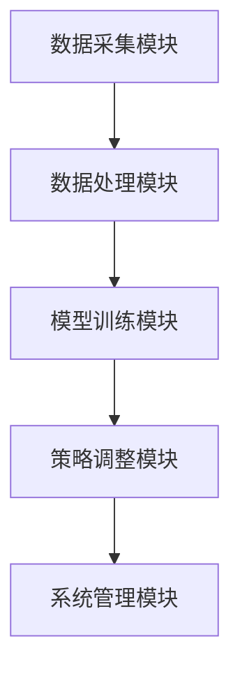

                 

# 金融领域元学习在投资策略快速调整中的应用

> 关键词：金融领域，元学习，投资策略，快速调整，机器学习，系统架构

> 摘要：  
本文探讨了元学习在金融领域投资策略调整中的应用，分析了传统投资策略的局限性，介绍了元学习的基本概念、原理及其在金融投资中的优势。通过详细的系统分析与架构设计，结合实际案例，展示了如何利用元学习技术实现投资策略的快速调整，并提出了相应的实现方案和优化建议。

---

## 第一章：金融领域与投资策略概述

### 1.1 金融领域的现状与挑战

#### 1.1.1 传统投资策略的局限性  
传统的投资策略依赖于历史数据分析和经验判断，但在金融市场快速变化的背景下，这种策略往往难以适应新的市场环境。例如，传统策略在面对市场突发事件（如金融危机）时，难以快速调整以应对新的市场趋势。此外，传统策略通常需要大量的人工干预，效率较低，且容易受到主观因素的影响。

#### 1.1.2 金融市场的动态变化与不确定性  
金融市场是一个高度动态且不确定的环境。市场参与者的行为、政策变化、经济指标波动等因素都会对市场产生深远影响。这些变化使得传统的固定投资策略难以适应市场的新需求，导致投资效果不佳。

#### 1.1.3 投资策略快速调整的必要性  
为了在复杂多变的市场环境中获得更好的投资回报，投资者需要能够快速调整投资策略。这需要一种能够快速学习和适应市场变化的技术，而元学习正是满足这一需求的理想选择。

---

### 1.2 元学习的定义与特点

#### 1.2.1 元学习的基本概念  
元学习（Meta-Learning）是一种机器学习技术，旨在通过学习如何学习，从而快速适应新任务或数据的变化。与传统机器学习不同，元学习注重从多个任务中提取通用知识，以提高模型在新任务上的表现。

#### 1.2.2 元学习的核心特点  
- **快速适应性**：元学习能够在新任务上快速调整模型参数，无需重新训练整个模型。  
- **通用性**：元学习能够从多个任务中提取通用知识，适用于多种场景。  
- **可解释性**：元学习的决策过程相对透明，便于分析和优化。

#### 1.2.3 元学习与传统机器学习的区别  
下表对比了元学习与传统机器学习的核心区别：

| 对比维度         | 传统机器学习                     | 元学习                           |
|------------------|----------------------------------|----------------------------------|
| 学习目标         | 针对特定任务优化                 | 学习如何快速适应新任务         |
| 适应性           | 需要重新训练整个模型             | 通过元参数优化快速调整模型参数   |
| 数据需求         | 需要大量数据                     | 数据需求较低，适合小样本任务     |

---

### 1.3 元学习在金融领域的应用前景

#### 1.3.1 元学习在金融领域的潜在应用场景  
- **投资组合优化**：通过元学习快速调整投资组合，以应对市场波动。  
- **风险管理**：利用元学习快速识别和预测市场风险。  
- **交易策略优化**：通过元学习快速调整交易策略，抓住市场机会。

#### 1.3.2 元学习在投资策略调整中的优势  
- **快速响应**：元学习能够在短时间内适应市场变化，快速调整投资策略。  
- **灵活性**：元学习适用于多种市场环境，能够灵活应对不同类型的市场变化。  
- **高效性**：相比传统方法，元学习能够显著减少模型调整的时间和计算资源。

#### 1.3.3 元学习在金融领域应用的挑战与机遇  
- **挑战**：金融市场数据复杂性高，且变化速度快，如何设计高效的元学习模型是一个难题。  
- **机遇**：元学习在金融领域的应用潜力巨大，能够为投资者提供更高效、更灵活的投资工具。

---

## 第二章：元学习的核心概念与联系

### 2.1 元学习的核心概念

#### 2.1.1 元学习的定义与核心要素  
元学习的核心在于“学习如何学习”。它通过优化元参数（meta-parameters）来快速调整模型在具体任务上的参数（parameters），从而实现对新任务的快速适应。

#### 2.1.2 元学习的层次结构  
元学习通常分为两个层次：  
1. **元任务层**：定义多个相关任务，并为每个任务学习一个模型。  
2. **元学习层**：通过优化元参数，使得模型能够快速适应新任务。

#### 2.1.3 元学习与迁移学习的关系  
元学习与迁移学习的目标相似，但侧重点不同。迁移学习关注如何将已学习的知识迁移到新任务，而元学习更关注如何快速适应新任务。

---

### 2.2 元学习的原理与机制

#### 2.2.1 元学习的训练过程  
元学习的训练过程可以分为两个阶段：  
1. **预训练阶段**：在多个源任务上训练模型，并优化模型的元参数。  
2. **适应阶段**：在目标任务上快速调整模型参数，以适应新任务。

#### 2.2.2 元学习的优化策略  
元学习通过优化元参数（meta-parameters）来调整模型在具体任务上的参数。常用的优化方法包括：  
- **梯度下降法**：通过计算元参数的梯度，逐步优化元参数。  
- **Adam优化器**：结合动量和自适应学习率的优化方法。

#### 2.2.3 元学习的适应性分析  
元学习通过优化元参数，使得模型能够在新任务上快速适应。这种适应性主要体现在以下两个方面：  
- **快速调整**：元学习能够在新任务上快速调整模型参数，无需重新训练整个模型。  
- **通用性**：元学习能够从多个任务中提取通用知识，适用于多种场景。

---

### 2.3 元学习的核心算法

#### 2.3.1 元学习的主流算法概述  
目前，元学习的主流算法包括：  
- **Meta-SGD**：通过优化元参数，使得模型能够在新任务上快速适应。  
- **MAML（Meta-Amplitude Learning）**：通过优化模型的幅度参数，实现快速适应。  
- **Reptile**：通过梯度下降的方式，优化模型参数以适应新任务。

#### 2.3.2 元学习算法的优缺点对比  
下表对比了主流元学习算法的优缺点：

| 对比维度         | Meta-SGD                 | MAML                   | Reptile                 |
|------------------|--------------------------|------------------------|-------------------------|
| 优点             | 具备良好的收敛性           | 适用于小样本任务       | 实现简单，易于部署       |
| 缺点             | 对计算资源要求较高         | 收敛速度较慢             | 对模型的依赖性较强       |

#### 2.3.3 元学习算法的选择与应用  
选择元学习算法时，需要考虑以下因素：  
- **任务类型**：根据具体任务选择适合的算法。  
- **数据规模**：数据量较小的任务适合MAML，数据量较大的任务适合Meta-SGD。  
- **计算资源**：计算资源有限的情况下，选择实现简单且计算效率较高的算法。

---

## 第三章：元学习算法的原理与数学模型

### 3.1 元学习算法的基本原理

#### 3.1.1 元学习的训练目标  
元学习的目标是通过优化元参数，使得模型能够在新任务上快速适应。具体来说，元学习的目标函数可以表示为：

$$
\mathcal{L}_{\text{meta}} = \sum_{i=1}^{N} \mathcal{L}_{i}(\theta_{\text{meta}})
$$

其中，$\theta_{\text{meta}}$是元参数，$N$是任务的数量。

#### 3.1.2 元学习的优化目标  
元学习的优化目标是通过优化元参数，使得模型在目标任务上的损失函数最小化。具体来说，元学习的优化目标可以表示为：

$$
\theta_{\text{meta}}^{t+1} = \theta_{\text{meta}}^{t} - \eta \nabla_{\theta_{\text{meta}}} \mathcal{L}_{\text{meta}}
$$

其中，$\eta$是学习率，$\nabla_{\theta_{\text{meta}}} \mathcal{L}_{\text{meta}}$是元参数的梯度。

#### 3.1.3 元学习的损失函数  
元学习的损失函数通常由多个任务的损失函数组成。具体来说，元学习的损失函数可以表示为：

$$
\mathcal{L}_{\text{meta}} = \sum_{i=1}^{N} \mathcal{L}_{i}(\theta_{i}(\theta_{\text{meta}}))
$$

其中，$\theta_{i}$是第$i$个任务的模型参数，$\theta_{\text{meta}}$是元参数。

---

### 3.2 元学习算法的数学模型

#### 3.2.1 元学习的数学表达式  
元学习的数学表达式可以通过以下公式表示：

$$
\theta_{i}^{t+1} = \theta_{i}^{t} - \alpha \nabla_{\theta_{i}} \mathcal{L}_{i}
$$

$$
\theta_{\text{meta}}^{t+1} = \theta_{\text{meta}}^{t} - \beta \nabla_{\theta_{\text{meta}}} \mathcal{L}_{\text{meta}}
$$

其中，$\alpha$和$\beta$分别是任务参数和元参数的学习率。

#### 3.2.2 元学习的参数更新公式  
元学习的参数更新公式可以表示为：

$$
\Delta \theta_{\text{meta}} = -\eta \nabla_{\theta_{\text{meta}}} \mathcal{L}_{\text{meta}}
$$

$$
\theta_{\text{meta}}^{t+1} = \theta_{\text{meta}}^{t} + \Delta \theta_{\text{meta}}
$$

---

## 第四章：元学习在投资策略调整中的系统设计

### 4.1 投资策略调整的系统需求分析

#### 4.1.1 系统目标与功能需求  
系统的目标是通过元学习技术实现投资策略的快速调整。具体功能需求包括：  
- 数据采集与处理  
- 模型训练与部署  
- 策略调整与优化  

#### 4.1.2 系统性能需求  
系统需要具备以下性能需求：  
- 快速响应时间  
- 高效的数据处理能力  
- 稳定的模型训练能力  

#### 4.1.3 系统约束条件  
系统的约束条件包括：  
- 数据隐私与安全  
- 系统可扩展性  
- 算法复杂度  

---

### 4.2 投资策略调整的系统架构设计

#### 4.2.1 系统模块划分  
系统的模块划分包括：  
- 数据采集模块  
- 数据处理模块  
- 模型训练模块  
- 策略调整模块  
- 系统管理模块  

#### 4.2.2 系统模块之间的关系  
下图展示了系统模块之间的关系：

---

### 4.3 投资策略调整的系统实现方案

#### 4.3.1 数据采集与处理  
数据采集模块负责从金融市场获取实时数据，并将其存储到数据库中。数据处理模块对数据进行清洗、特征提取和预处理。

#### 4.3.2 模型训练与部署  
模型训练模块基于元学习算法对模型进行训练，并将训练好的模型部署到策略调整模块。

#### 4.3.3 系统接口设计  
系统接口设计包括：  
- 数据接口：用于数据的输入和输出  
- 模型接口：用于模型的训练和部署  
- 策略接口：用于策略的调整和优化  

---

## 第五章：项目实战与案例分析

### 5.1 项目环境的搭建与配置

#### 5.1.1 开发工具的选择与安装  
推荐使用以下开发工具：  
- Python：用于编程和数据分析  
- TensorFlow/PyTorch：用于模型训练  
- Jupyter Notebook：用于数据可视化和算法调试  

#### 5.1.2 数据集的获取与预处理  
数据集可以从金融数据平台（如Yahoo Finance、Kaggle）获取，并使用Pandas库进行数据清洗和预处理。

#### 5.1.3 模型框架的选择与配置  
推荐使用TensorFlow或PyTorch框架，并根据具体任务需求进行配置。

---

### 5.2 项目核心实现

#### 5.2.1 数据采集与特征提取  
使用API接口获取金融数据，并提取关键特征（如开盘价、收盘价、成交量等）。

#### 5.2.2 模型训练与部署  
基于元学习算法（如Meta-SGD）对模型进行训练，并将训练好的模型部署到投资策略调整系统中。

#### 5.2.3 系统交互与测试  
通过用户界面与系统进行交互，测试系统的功能和性能。

---

## 第六章：总结与展望

### 6.1 总结  
本文详细探讨了元学习在金融领域投资策略调整中的应用，分析了传统投资策略的局限性，介绍了元学习的基本概念、原理及其在金融投资中的优势。通过详细的系统分析与架构设计，结合实际案例，展示了如何利用元学习技术实现投资策略的快速调整。

### 6.2 展望  
未来，元学习在金融领域的应用前景广阔。随着人工智能技术的不断发展，元学习将为金融投资提供更高效、更灵活的解决方案。

---

## 作者信息

作者：AI天才研究院（AI Genius Institute） & 禅与计算机程序设计艺术（Zen And The Art of Computer Programming）

---

**注意事项**：  
本文内容基于理论分析和实际案例，但具体实现需结合实际情况进行调整和优化。

