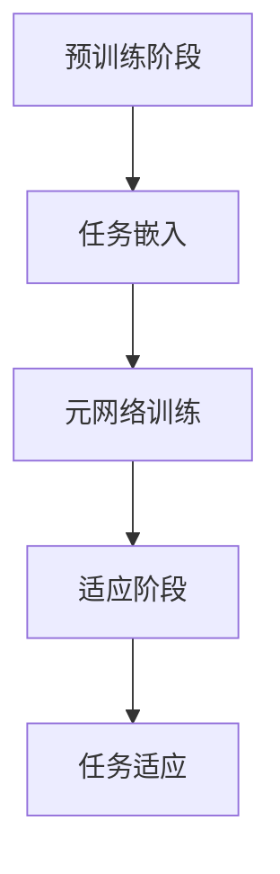

                 


# 《金融领域元学习在投资策略快速迭代中的应用》

**关键词**：元学习，投资策略，快速迭代，金融数据，机器学习

**摘要**：  
本文探讨了元学习在金融投资中的应用，特别是如何利用元学习加速投资策略的迭代过程。通过分析金融数据的特征、设计元学习模型、构建投资策略，并结合实际案例进行实战分析，本文展示了元学习在金融领域的潜力和优势。我们还提供了详细的数学模型、算法流程图和系统架构设计，帮助读者理解并应用这些技术。

---

## 第1章: 元学习与投资策略的背景

### 1.1 元学习的基本概念

#### 1.1.1 元学习的定义与特点  
元学习（Meta-Learning）是一种机器学习方法，旨在通过学习如何学习，从而快速适应新任务。与传统机器学习不同，元学习不仅关注特定任务的解决，还关注如何将所学知识迁移到新任务中。

#### 1.1.2 元学习与传统机器学习的区别  
传统机器学习算法需要大量标注数据，并且针对每个新任务需要重新训练模型。而元学习通过在多个任务上预训练，能够在新任务上线时快速调整模型参数，减少数据依赖和训练时间。

#### 1.1.3 元学习在金融领域的应用潜力  
金融领域数据复杂，市场变化快，传统方法难以快速适应。元学习的快速迭代能力使其成为金融投资策略优化的理想选择。

### 1.2 投资策略的基本概念

#### 1.2.1 投资策略的定义与分类  
投资策略是投资者在不同市场条件下选择资产和配置资金的方式。常见的策略包括均值-方差优化、动量策略和因子投资等。

#### 1.2.2 投资策略的快速迭代需求  
金融市场波动性强，策略的有效性可能迅速变化。快速迭代投资策略可以帮助投资者及时捕捉市场机会，降低风险。

#### 1.2.3 元学习在投资策略迭代中的作用  
元学习能够通过预训练多个金融任务，快速调整策略参数，实现投资策略的高效优化。

### 1.3 本章小结  
本章介绍了元学习的基本概念及其在金融投资中的潜在应用，强调了元学习在投资策略快速迭代中的重要性。

---

## 第2章: 元学习的核心原理

### 2.1 元学习的理论基础

#### 2.1.1 元学习的数学模型  
元学习的目标是最小化新任务的损失函数。常见的损失函数包括交叉熵损失和均方误差损失。

#### 2.1.2 元学习的算法框架  
元学习通常包括两个阶段：预训练阶段和适应阶段。预训练阶段训练元网络，适应阶段根据新任务调整模型。

#### 2.1.3 元学习的优化目标  
元学习优化的目标是使模型在预训练任务上的表现最优，从而在适应阶段快速调整参数。

### 2.2 元学习的关键技术

#### 2.2.1 任务嵌入的表示方法  
任务嵌入通过向量表示任务特征，帮助元网络快速适应新任务。

#### 2.2.2 元网络的设计与训练  
元网络通常采用神经网络结构，通过预训练学习如何调整参数以适应新任务。

#### 2.2.3 适应新任务的策略更新  
策略更新是元学习的关键步骤，通过梯度下降优化模型参数。

### 2.3 本章小结  
本章详细介绍了元学习的理论基础和关键技术，为后续应用奠定了基础。

---

## 第3章: 金融数据的特征与处理

### 3.1 金融数据的特征分析

#### 3.1.1 时间序列数据的特性  
金融数据通常具有时间序列特性，如趋势、周期性和随机性。

#### 3.1.2 市场情绪与新闻数据的影响  
市场情绪和新闻事件对股价有显著影响，需要纳入数据处理中。

#### 3.1.3 多维金融数据的整合  
金融数据包括股价、成交量、财务指标等多种维度，需综合处理。

### 3.2 数据预处理与增强

#### 3.2.1 数据清洗与标准化  
数据清洗包括去除缺失值和异常值，标准化处理保证数据一致性。

#### 3.2.2 数据增强的方法  
数据增强通过变换数据分布，提高模型的泛化能力。

#### 3.2.3 数据集的划分与管理  
数据集通常分为训练集、验证集和测试集，用于模型训练和评估。

### 3.3 本章小结  
本章分析了金融数据的特征，并介绍了数据预处理和增强的方法。

---

## 第4章: 元学习驱动的投资策略构建

### 4.1 投资策略的特征表示

#### 4.1.1 策略的表示方法  
策略表示可以通过特征向量或模型参数来描述。

#### 4.1.2 特征选择与降维  
特征选择减少数据维度，提高模型效率。

#### 4.1.3 策略表示的优化  
优化策略表示以提高模型适应性。

### 4.2 元学习模型的训练与优化

#### 4.2.1 元任务的定义与选择  
元任务定义为预训练任务，选择与目标任务相关的任务。

#### 4.2.2 元网络的训练流程  
预训练阶段训练元网络，适应阶段调整参数。

#### 4.2.3 模型的调优与评估  
模型调优包括超参数优化和模型结构调整，评估指标包括准确率和收益风险比。

### 4.3 投资策略的快速迭代

#### 4.3.1 策略更新的机制  
通过元学习快速更新策略参数。

#### 4.3.2 策略迭代的效率优化  
优化算法和数据处理提高迭代效率。

#### 4.3.3 策略稳定性的保障  
通过正则化和交叉验证保障策略稳定性。

### 4.4 本章小结  
本章详细介绍了元学习驱动的投资策略构建过程，强调了策略快速迭代的重要性。

---

## 第5章: 元学习算法的数学模型

### 5.1 元学习的数学框架

#### 5.1.1 元学习的损失函数  
$$ L = \sum_{i=1}^{N} \sum_{j=1}^{M} \mathbb{I}(y_{ij} \neq f_{\theta}(x_{ij})) $$

#### 5.1.2 元网络的参数更新  
$$ \theta_{new} = \theta_{old} - \eta \nabla_{\theta} L $$

### 5.2 算法流程图



---

## 第6章: 项目实战与系统设计

### 6.1 环境安装与数据获取

#### 6.1.1 环境配置  
安装Python、TensorFlow和Keras等库。

#### 6.1.2 数据获取  
从金融数据API获取股票价格和市场新闻数据。

### 6.2 系统架构设计

#### 6.2.1 领域模型  
使用Mermaid类图展示系统模块关系。

#### 6.2.2 系统架构  
展示系统整体架构，包括数据层、特征层、模型层和策略层。

### 6.3 核心代码实现

#### 6.3.1 数据预处理  
```python
import pandas as pd
import numpy as np

# 数据清洗
def preprocess_data(data):
    data = data.dropna()
    return data
```

#### 6.3.2 元学习模型实现  
```python
import tensorflow as tf
from tensorflow.keras import layers

# 元网络模型
class MetaLearner(tf.keras.Model):
    def __init__(self):
        super(MetaLearner, self).__init__()
        self.meta_layer = layers.Dense(64, activation='relu')
        self.task_layer = layers.Dense(1, activation='sigmoid')
    
    def call(self, inputs):
        features = self.meta_layer(inputs)
        output = self.task_layer(features)
        return output
```

#### 6.3.3 策略制定与回测  
```python
def backtest_strategy(data, model):
    predictions = model.predict(data)
    # 计算收益
    returns = calculate_returns(data, predictions)
    return returns.mean()
```

### 6.4 本章小结  
本章通过实际案例展示了元学习在投资策略中的应用，并提供了详细的代码实现和系统设计。

---

## 第7章: 总结与展望

### 7.1 本章小结  
总结了元学习在投资策略快速迭代中的应用，强调了其优势和潜力。

### 7.2 最佳实践 tips  
- 合理选择元任务和数据预处理方法。
- 定期更新模型以适应市场变化。
- 结合其他技术（如强化学习）进一步优化策略。

### 7.3 未来研究方向  
- 探索元学习与其他机器学习技术的结合。
- 研究更高效的元学习算法。
- 应用元学习于更多金融场景。

### 7.4 作者信息  
作者：AI天才研究院 & 禅与计算机程序设计艺术

---

**摘要**：  
本文详细探讨了元学习在金融投资中的应用，通过理论分析和实战案例展示了元学习如何加速投资策略的快速迭代。我们提供了数学模型、算法流程图和系统架构设计，帮助读者理解并应用这些技术。未来的研究将进一步优化元学习算法，拓展其在金融领域的应用。

**关键词**：元学习，投资策略，快速迭代，金融数据，机器学习

