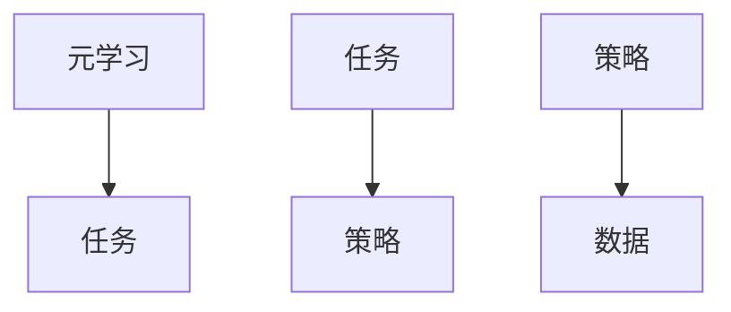
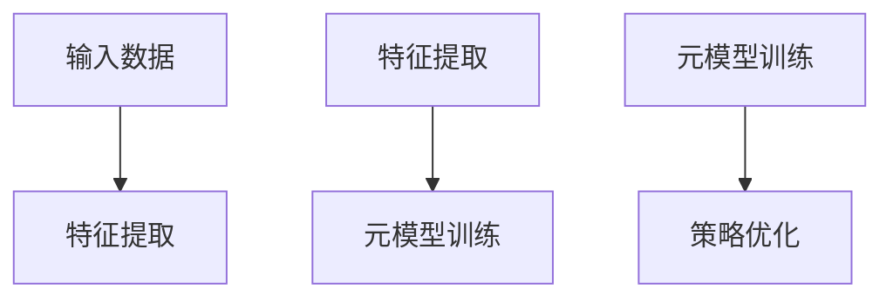
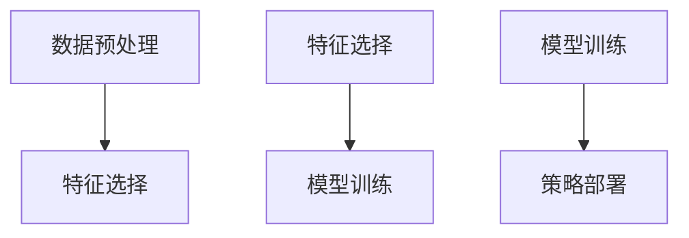
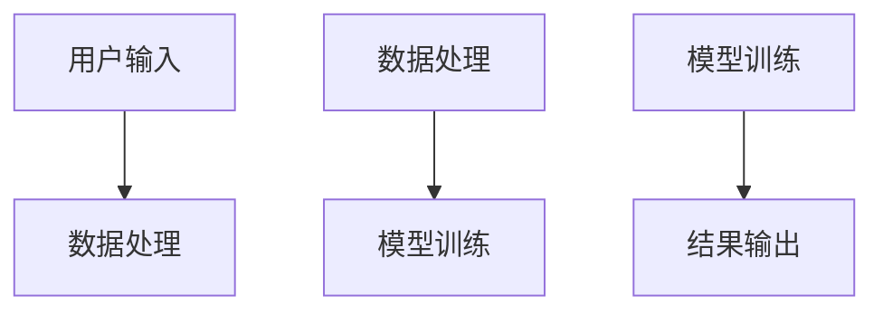
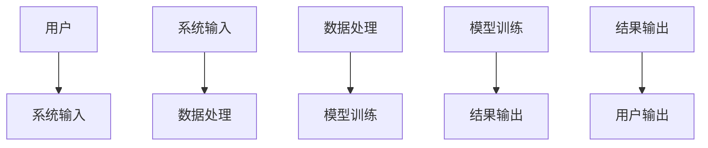

                 


# 《金融领域元学习在投资策略快速适应中的应用》

> 关键词：元学习、投资策略、金融领域、快速适应、机器学习、算法优化

> 摘要：本文深入探讨了元学习在金融领域中的应用，特别是如何通过元学习技术快速优化投资策略。文章从元学习的基本概念、数学模型、算法实现、系统设计、项目实战等多个维度展开，详细分析了元学习在投资策略中的优势和实际应用价值。通过具体案例分析和代码实现，展示了元学习如何帮助投资者在复杂多变的金融市场中快速适应并制定高效的投资策略。

---

## 第1章 元学习与投资策略概述

### 1.1 元学习的基本概念

#### 1.1.1 元学习的定义与核心思想

元学习（Meta-Learning）是一种机器学习技术，旨在通过学习如何学习，来快速适应不同的任务。与传统机器学习不同，元学习不是直接从数据中学习特定任务的模型，而是通过学习通用的学习策略，来提升模型在新任务上的表现。

核心思想在于“学会学习”，即通过在多个任务上进行训练，模型能够快速适应新的未知任务，而无需从头开始训练。这在金融领域尤为重要，因为金融市场具有高度动态性和不确定性，投资策略需要不断调整以适应市场变化。

#### 1.1.2 元学习与传统机器学习的区别

| 特性 | 传统机器学习 | 元学习 |
|------|--------------|--------|
| 数据需求 | 需要大量标注数据 | 利用少量标注数据快速适应新任务 |
| 任务适应性 | 适用于单任务优化 | 适用于多任务和新任务快速适应 |
| 模型复杂度 | 基于特定任务设计 | 基于通用学习策略设计 |

#### 1.1.3 元学习在金融领域的应用潜力

金融市场的动态变化要求投资策略能够快速适应新的市场环境。元学习的优势在于其快速适应能力，能够在有限的数据和时间内，优化投资策略的表现。

### 1.2 投资策略的基本概念

#### 1.2.1 投资策略的定义与分类

投资策略是指投资者在金融市场中进行资产配置和交易决策的具体方法。根据不同的标准，投资策略可以分为多种类型：

- **主动型策略**：积极寻找市场机会，追求超额收益。
- **被动型策略**：跟踪市场指数，追求与市场持平的收益。
- **量化策略**：基于数学模型和算法进行交易决策。
- **对冲策略**：通过做空和做多来对冲市场风险。

#### 1.2.2 投资策略的制定与执行过程

投资策略的制定通常包括以下几个步骤：

1. **目标设定**：明确投资目标，如追求高收益、控制风险等。
2. **市场分析**：分析市场趋势、宏观经济指标、行业动态等。
3. **策略设计**：基于分析结果，设计具体的交易规则和资产配置方案。
4. **策略优化**：通过回测和风险评估，优化策略的参数和逻辑。
5. **策略执行**：将优化后的策略投入实际市场，进行交易操作。
6. **策略调整**：根据市场变化和策略表现，动态调整策略参数。

#### 1.2.3 投资策略的快速适应需求

金融市场环境复杂多变，投资策略需要不断调整以应对新的市场变化。传统的策略优化方法通常需要大量的数据和时间，而元学习通过快速适应能力，能够显著提高策略优化的效率。

### 1.3 元学习在投资策略中的应用背景

#### 1.3.1 金融市场的动态变化与投资策略的适应性需求

金融市场具有高度的不确定性和波动性，市场环境可能在短时间内发生剧烈变化。投资策略需要能够快速适应这些变化，才能在竞争激烈的市场中保持优势。

#### 1.3.2 元学习在策略快速调整中的优势

元学习的核心优势在于其快速适应能力。通过在多个任务上进行训练，元学习模型能够在面对新任务时，快速调整其参数和策略，从而实现高效的策略优化。

#### 1.3.3 当前投资策略优化的主要挑战

传统投资策略优化方法通常面临以下挑战：

1. **数据需求大**：传统机器学习方法需要大量的标注数据进行训练，而在金融市场中，高质量的数据往往难以获取。
2. **适应性差**：策略优化通常针对特定市场环境设计，难以快速适应新的市场变化。
3. **计算成本高**：传统的优化方法通常需要进行多次回测和参数调整，计算成本较高。

---

## 第2章 元学习的核心原理与数学模型

### 2.1 元学习的核心原理

#### 2.1.1 元学习的层次化学习框架

元学习通常采用层次化学习框架，包括元任务和目标任务两个层次。元任务用于训练模型的元参数，目标任务用于具体的应用场景。通过这种层次化结构，模型能够快速适应新的目标任务。

#### 2.1.2 元学习的迁移学习机制

迁移学习的核心思想是将已有的知识迁移到新的任务中。元学习通过学习通用的特征表示和优化策略，能够将已有的经验快速迁移到新的任务中。

#### 2.1.3 元学习的优化目标与策略

元学习的优化目标通常包括以下两个方面：

1. **元损失函数**：用于衡量模型在元任务上的表现。
2. **目标任务损失函数**：用于衡量模型在目标任务上的表现。

通过同时优化这两个目标，元学习能够实现快速适应新任务的能力。

### 2.2 元学习的算法流程

#### 2.2.1 元学习的训练过程

元学习的训练过程通常包括以下几个步骤：

1. **初始化模型参数**：设置模型的初始参数。
2. **训练元任务**：通过训练元任务数据，优化模型的元参数。
3. **适应目标任务**：在目标任务上，利用元参数优化模型的目标参数，以适应具体任务。

#### 2.2.2 元学习的推理过程

在推理阶段，元学习模型能够快速调整其参数，以适应新的目标任务。具体步骤如下：

1. **输入目标任务数据**：将目标任务的数据输入模型。
2. **优化目标参数**：利用元参数优化目标任务的参数。
3. **输出预测结果**：根据优化后的参数，进行预测或决策。

#### 2.2.3 元学习的模型更新策略

元学习的模型更新策略通常包括以下几种：

1. **梯度下降法**：通过计算损失函数的梯度，更新模型参数。
2. **Adam优化器**：结合动量和自适应学习率的优化方法。
3. **其他优化算法**：如SGD、RMSprop等。

### 2.3 元学习的核心概念与联系

#### 2.3.1 实体关系图（ER图）

以下是元学习的核心概念之间的关系图：



#### 2.3.2 算法原理图

以下是元学习的算法原理图：



### 2.4 本章小结

---

## 第3章 元学习的数学模型与算法实现

### 3.1 元学习的数学模型

#### 3.1.1 元学习的损失函数

元学习的损失函数通常包括元损失和目标任务损失两部分：

$$
L_{\text{meta}} = \sum_{i=1}^{n} L_i(\theta, \phi)
$$

其中，$\theta$ 表示元参数，$\phi$ 表示目标任务参数，$L_i$ 表示第 $i$ 个目标任务的损失函数。

#### 3.1.2 元学习的优化目标与策略

元学习的优化目标是同时优化元参数和目标任务参数：

$$
\theta^* = \arg \min_{\theta} \sum_{i=1}^{n} L_i(\theta, \phi)
$$

#### 3.1.3 元学习的更新规则

元学习的更新规则通常基于梯度下降法：

$$
\theta_{t+1} = \theta_t - \eta \nabla_{\theta} L_{\text{meta}}
$$

其中，$\eta$ 表示学习率。

### 3.2 元学习的算法实现

#### 3.2.1 元学习算法的伪代码实现

以下是一个简单的元学习算法的伪代码实现：

```python
def meta_learning_algorithm():
    for each task in tasks:
        compute gradients of loss with respect to parameters
        update parameters using meta optimizer
    return optimized parameters
```

#### 3.2.2 元学习算法的数学推导

元学习的数学推导通常涉及对损失函数的求导和优化。以下是具体的推导过程：

$$
\Delta \theta = \alpha \nabla_{\theta} L_{\text{meta}} + \beta \nabla_{\theta} L_{\text{task}}
$$

其中，$\alpha$ 和 $\beta$ 是超参数，用于平衡元损失和目标任务损失的影响。

### 3.3 本章小结

---

## 第4章 系统设计与实现

### 4.1 系统总体架构

以下是元学习投资策略系统的总体架构图：



### 4.2 数据预处理与特征选择

#### 4.2.1 数据预处理步骤

1. **数据清洗**：去除缺失值和异常值。
2. **数据标准化**：对数据进行标准化处理，使其具有相同的尺度。
3. **数据分割**：将数据划分为训练集、验证集和测试集。

#### 4.2.2 特征选择方法

1. **主成分分析（PCA）**：通过PCA方法降低数据维度。
2. **特征重要性分析**：通过特征重要性评分选择关键特征。

### 4.3 模型训练与部署

#### 4.3.1 模型训练过程

1. **初始化模型参数**：设置模型的初始参数。
2. **训练元任务**：通过训练元任务数据，优化模型的元参数。
3. **适应目标任务**：在目标任务上，利用元参数优化模型的目标参数，以适应具体任务。

#### 4.3.2 模型部署步骤

1. **输入目标任务数据**：将目标任务的数据输入模型。
2. **优化目标参数**：利用元参数优化目标任务的参数。
3. **输出预测结果**：根据优化后的参数，进行预测或决策。

### 4.4 系统接口与交互设计

#### 4.4.1 系统接口设计

以下是元学习系统的接口设计图：



#### 4.4.2 系统交互设计

以下是元学习系统的交互设计图：



### 4.5 本章小结

---

## 第5章 项目实战

### 5.1 项目背景与目标

#### 5.1.1 项目背景

本文将通过一个具体的金融投资策略优化项目，展示元学习在实际应用中的优势。

#### 5.1.2 项目目标

本项目旨在通过元学习技术，优化股票投资策略，实现快速适应市场变化。

### 5.2 环境安装与配置

#### 5.2.1 环境要求

1. **Python 3.8 或更高版本**
2. **TensorFlow 或 PyTorch 深度学习框架**
3. **Jupyter Notebook 或 IDE 开发环境**
4. **金融数据源（如Yahoo Finance API）**

#### 5.2.2 安装依赖

```bash
pip install numpy pandas tensorflow matplotlib requests
```

### 5.3 核心代码实现

#### 5.3.1 数据预处理

```python
import pandas as pd
import numpy as np
import requests

# 获取股票数据
def get_stock_data(ticker, start_date, end_date):
    url = f"https://api.example.com/stock/{ticker}"
    params = {
        "start": start_date,
        "end": end_date
    }
    response = requests.get(url, params=params)
    return pd.DataFrame(response.json())

# 数据清洗
def preprocess_data(df):
    df.dropna(inplace=True)
    return df

# 数据标准化
from sklearn.preprocessing import StandardScaler

def normalize_data(df):
    scaler = StandardScaler()
    df_scaled = scaler.fit_transform(df)
    return df_scaled
```

#### 5.3.2 模型训练

```python
import tensorflow as tf
from tensorflow.keras.layers import Dense, Input
from tensorflow.keras.models import Model

# 元学习模型设计
def meta_learning_model(input_shape):
    inputs = Input(shape=(input_shape,))
    x = Dense(64, activation='relu')(inputs)
    x = Dense(32, activation='relu')(x)
    outputs = Dense(1, activation='sigmoid')(x)
    model = Model(inputs=inputs, outputs=outputs)
    return model

# 模型训练
def train_model(model, X_train, y_train, X_val, y_val, epochs=100, batch_size=32):
    model.compile(optimizer='adam', loss='binary_crossentropy', metrics=['accuracy'])
    model.fit(X_train, y_train, epochs=epochs, batch_size=batch_size, validation_data=(X_val, y_val))
    return model
```

#### 5.3.3 策略部署与测试

```python
# 策略部署
def deploy_strategy(model, new_data):
    normalized_data = preprocess_data(new_data)
    predictions = model.predict(normalized_data)
    return predictions

# 策略测试
def test_strategy(model, test_data):
    normalized_data = preprocess_data(test_data)
    predictions = model.predict(normalized_data)
    return predictions
```

### 5.4 项目小结

---

## 第6章 总结与展望

### 6.1 本章总结

本文深入探讨了元学习在金融领域中的应用，特别是如何通过元学习技术快速优化投资策略。通过系统设计和项目实战，展示了元学习在实际应用中的优势和潜力。

### 6.2 未来展望

随着人工智能技术的不断发展，元学习在金融领域的应用前景广阔。未来的研究可以进一步探索以下方向：

1. **多任务元学习**：研究如何在多个金融任务上进行元学习，进一步提高模型的适应性。
2. **强化学习结合**：将强化学习与元学习结合，探索更高效的策略优化方法。
3. **实时适应**：研究如何实现实时的策略调整，以应对市场的快速变化。

### 6.3 最佳实践 Tips

1. **数据质量**：确保数据的准确性和完整性，这是模型性能的基础。
2. **模型选择**：根据具体任务需求选择合适的模型架构和优化方法。
3. **实时监控**：在实际应用中，实时监控模型的表现，及时进行调整和优化。

### 6.4 作者信息

作者：AI天才研究院/AI Genius Institute & 禅与计算机程序设计艺术/Zen And The Art of Computer Programming

---

**全文完**

