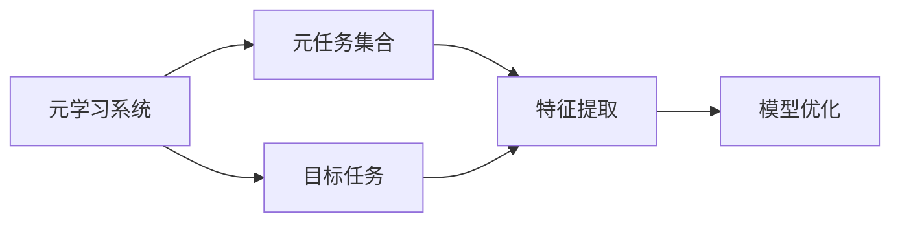
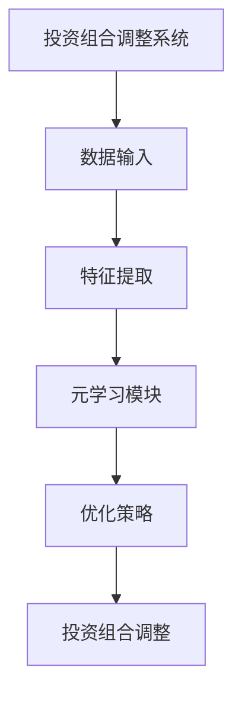
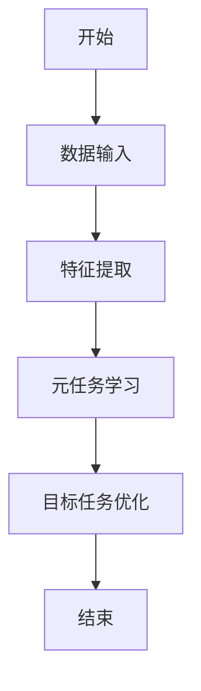
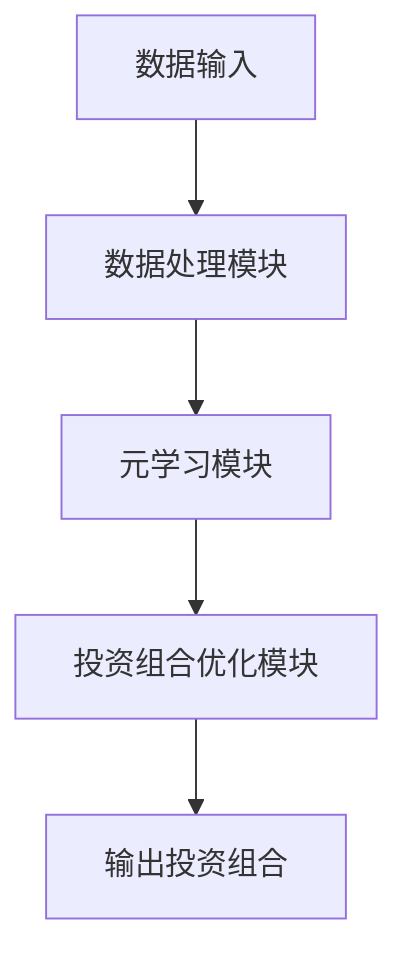

                 


---

# 《金融领域元学习在投资组合动态调整中的应用》

---

## 关键词：元学习、投资组合管理、动态调整、金融建模、机器学习应用

---

## 摘要：  
本文探讨了元学习在金融投资组合动态调整中的应用，详细分析了元学习的核心原理及其在投资组合优化中的优势。通过构建系统架构和实际案例，展示了如何利用元学习技术实现投资组合的高效动态调整。文章还讨论了系统设计、项目实现及未来研究方向，为金融领域的智能化投资决策提供了新的视角和方法。

---

## 正文

### 第一部分：元学习与投资组合管理的背景介绍

#### 第1章：元学习与投资组合管理的背景介绍

##### 1.1 元学习的基本概念与问题背景

###### 1.1.1 元学习的定义与核心概念

元学习是一种机器学习方法，允许模型从多个任务中学习，以提升对新任务的适应能力。在投资组合管理中，元学习能够帮助模型在不同市场条件下快速调整策略，适应动态变化的金融环境。

###### 1.1.2 投资组合管理的动态调整问题背景

传统投资组合管理方法依赖于静态模型，难以应对市场波动和突发事件。动态调整需要实时数据处理和快速决策，这对模型的泛化能力提出了更高要求，而元学习能够提供这种能力。

###### 1.1.3 元学习在投资组合动态调整中的应用价值

元学习通过跨任务学习，提高了模型的适应性和泛化能力，使其能够有效应对金融市场的不确定性，优化投资组合的动态调整。

##### 1.2 元学习与传统机器学习的对比

###### 1.2.1 传统机器学习在投资组合管理中的局限性

传统方法依赖于单任务学习，模型难以适应市场变化，导致动态调整效果不佳。

###### 1.2.2 元学习的优势与特点

元学习能够同时处理多个任务，提高模型的泛化能力，适用于动态变化的金融市场。

###### 1.2.3 元学习在金融领域的独特性

金融数据具有高度的动态性和不确定性，元学习能够有效捕捉这些特征，提供更灵活的投资策略。

##### 1.3 投资组合动态调整的挑战与解决方案

###### 1.3.1 动态市场环境下的投资组合调整需求

市场波动和突发事件要求投资组合能够实时调整，以最大化收益并降低风险。

###### 1.3.2 元学习如何解决动态调整中的泛化问题

元学习通过跨任务学习，提高了模型在不同市场条件下的适应能力。

###### 1.3.3 元学习在投资组合管理中的边界与外延

元学习适用于数据和任务动态变化的场景，但其效果依赖于数据质量和模型设计。

---

### 第二部分：元学习的核心概念与理论基础

#### 第2章：元学习的核心概念与理论基础

##### 2.1 元学习的基本原理

###### 2.1.1 元学习的定义与核心机制

元学习通过元任务和目标任务的学习，提升模型的泛化能力。在投资组合管理中，元任务可以是不同市场条件下的策略优化，目标任务是具体的投资组合调整。

###### 2.1.2 元学习的算法框架

元学习算法通常分为两个阶段：元学习阶段和目标学习阶段。在投资组合管理中，元学习阶段学习市场变化的特征，目标学习阶段优化投资组合。

###### 2.1.3 元学习的数学模型与公式

元学习的目标函数可以表示为：
$$
\min_{\theta} \sum_{i=1}^{N} \mathbb{E}_{(x,y)} [\mathcal{L}(f_\theta(x,y), y)]
$$
其中，$\theta$ 是元学习的参数，$f_\theta$ 是目标任务的模型。

##### 2.2 元学习的核心概念与联系

###### 2.2.1 元学习的核心概念属性对比表格

| 概念       | 定义                                                                 |
|------------|----------------------------------------------------------------------|
| 元任务     | 用于训练的基础任务集合                                             |
| 目标任务   | 需要优化的具体任务                                                 |
| 泛化能力   | 模型在新任务上的表现                                             |

###### 2.2.2 元学习的ER实体关系图架构



###### 2.2.3 元学习的系统架构Mermaid流程图



##### 2.3 元学习的算法原理与流程

###### 2.3.1 元学习的算法步骤分解

1. **数据预处理**：收集和处理多个市场的历史数据。
2. **元任务学习**：在多个市场条件下训练模型。
3. **目标任务优化**：利用元学习结果优化投资组合。

###### 2.3.2 元学习的数学模型与公式

元学习的目标函数：
$$
\min_{\theta} \sum_{i=1}^{N} \mathbb{E}_{(x,y)} [\mathcal{L}(f_\theta(x,y), y)]
$$

###### 2.3.3 元学习的算法实现流程图



##### 2.4 元学习在金融领域的应用挑战

###### 2.4.1 金融数据的复杂性

金融数据具有高度的噪声和不确定性，增加了元学习的难度。

###### 2.4.2 模型的泛化能力

需要确保元学习模型在不同市场条件下的有效性。

---

### 第三部分：投资组合动态调整的系统设计与实现

#### 第3章：投资组合动态调整的系统设计

##### 3.1 系统架构设计

###### 3.1.1 系统功能模块划分

- 数据处理模块：负责数据的采集和预处理。
- 元学习模块：执行元任务和目标任务的学习。
- 投资组合优化模块：基于元学习结果优化投资组合。

###### 3.1.2 系统架构图Mermaid



##### 3.2 投资组合优化算法

###### 3.2.1 均值-方差模型

经典的均值-方差模型用于优化投资组合的收益和风险。

###### 3.2.2 动态调整机制

基于元学习的结果，实时调整投资组合的权重。

##### 3.3 系统实现细节

###### 3.3.1 数据预处理

包括清洗、标准化和特征选择。

###### 3.3.2 模型训练

使用深度学习框架如TensorFlow进行元任务和目标任务的训练。

---

### 第四部分：项目实战与案例分析

#### 第4章：投资组合动态调整的项目实战

##### 4.1 项目环境搭建

###### 4.1.1 数据集准备

收集多市场的历史数据。

###### 4.1.2 环境安装

安装必要的库如NumPy、Pandas、TensorFlow。

##### 4.2 核心代码实现

###### 4.2.1 数据预处理代码

```python
import numpy as np
import pandas as pd

# 数据预处理
def preprocess_data(data):
    # 清洗数据
    data.dropna(inplace=True)
    # 标准化处理
    from sklearn.preprocessing import StandardScaler
    scaler = StandardScaler()
    scaled_data = scaler.fit_transform(data)
    return scaled_data
```

###### 4.2.2 元学习模型训练代码

```python
import tensorflow as tf

# 元学习模型定义
def meta_learning_model(input_shape):
    inputs = tf.keras.Input(shape=input_shape)
    x = tf.keras.layers.Dense(64, activation='relu')(inputs)
    x = tf.keras.layers.Dense(32, activation='relu')(x)
    outputs = tf.keras.layers.Dense(1)(x)
    model = tf.keras.Model(inputs=inputs, outputs=outputs)
    return model

# 训练元模型
model = meta_learning_model((input_dim,))
model.compile(optimizer='adam', loss='mse')
model.fit(X_train, y_train, epochs=100, batch_size=32)
```

##### 4.3 案例分析与结果解读

###### 4.3.1 案例分析

通过具体案例展示元学习在投资组合调整中的应用效果。

###### 4.3.2 结果解读

分析模型的输出，评估其在动态调整中的表现。

---

### 第五部分：高级应用与未来研究方向

#### 第5章：元学习的高级应用与未来研究方向

##### 5.1 多目标优化

将多个优化目标融入元学习框架，提高投资组合的鲁棒性。

##### 5.2 在线学习与实时调整

研究在线学习方法，实现实时的投资组合调整。

##### 5.3 鲁棒性优化

提升模型在异常市场情况下的稳定性。

---

### 第六部分：结论与展望

#### 第6章：结论与展望

##### 6.1 全文总结

总结元学习在投资组合动态调整中的应用及其优势。

##### 6.2 未来研究方向

探讨元学习在金融领域的进一步应用，如与其他AI技术的结合。

---

## 作者：AI天才研究院/AI Genius Institute & 禅与计算机程序设计艺术 /Zen And The Art of Computer Programming

---

**注**：由于篇幅限制，上述内容仅为文章的框架和部分详细内容的概述，完整文章将包含更详细的技术细节、数学推导和代码实现。

