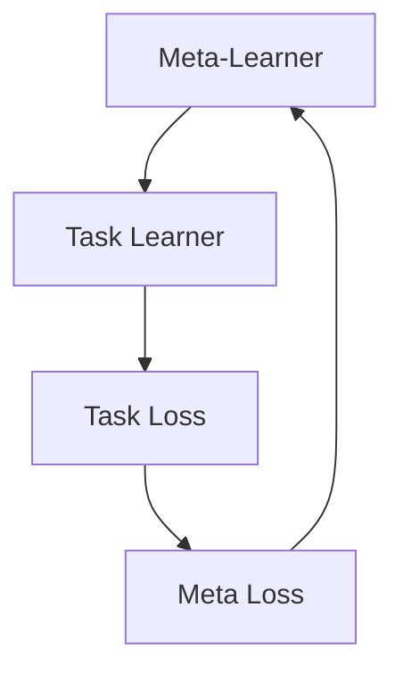

                 


# 《金融领域元学习在模型快速适应中的应用》

> 关键词：元学习, 金融领域, 模型快速适应, 机器学习, 深度学习, 金融时间序列预测, 风险管理

> 摘要：  
> 本文深入探讨了元学习（Meta-Learning）在金融领域的应用，特别是其在模型快速适应新任务中的潜力。通过分析金融领域的动态变化和复杂性，结合元学习的核心原理和算法实现，本文详细展示了如何利用元学习解决金融时间序列预测、风险管理等任务中的快速适应问题。文章从理论到实践，系统性地分析了元学习在金融领域的优势、挑战及具体应用场景，为读者提供了全面的技术视角和实践指导。

---

## 目录

1. [背景与概念](#背景与概念)
   1.1 [元学习的基本概念](#元学习的基本概念)
   1.2 [金融领域模型快速适应的背景与挑战](#金融领域模型快速适应的背景与挑战)
   1.3 [元学习在金融领域的核心问题](#元学习在金融领域的核心问题)
   
2. [元学习的核心概念与数学模型](#元学习的核心概念与数学模型)
   2.1 [元学习的基本原理](#元学习的基本原理)
   2.2 [元学习的数学模型与公式](#元学习的数学模型与公式)
   2.3 [元学习与金融任务的结合](#元学习与金融任务的结合)
   
3. [元学习在金融领域的算法实现](#元学习在金融领域的算法实现)
   3.1 [元学习算法的实现步骤](#元学习算法的实现步骤)
   3.2 [基于深度学习的元学习算法](#基于深度学习的元学习算法)
   3.3 [元学习算法在金融任务中的具体实现](#元学习算法在金融任务中的具体实现)
   
4. [元学习的系统分析与架构设计](#元学习的系统分析与架构设计)
   4.1 [系统分析](#系统分析)
   4.2 [架构设计](#架构设计)
   
5. [项目实战：基于元学习的金融模型快速适应](#项目实战基于元学习的金融模型快速适应)
   5.1 [项目背景](#项目背景)
   5.2 [系统实现](#系统实现)
   5.3 [案例分析](#案例分析)
   5.4 [项目小结](#项目小结)
   
6. [最佳实践与总结](#最佳实践与总结)
   6.1 [最佳实践](#最佳实践)
   6.2 [总结](#总结)
   6.3 [注意事项](#注意事项)
   6.4 [拓展阅读](#拓展阅读)

---

## 1. 背景与概念

### 1.1 元学习的基本概念

元学习是一种机器学习技术，专注于“学习如何学习”。与传统机器学习不同，元学习器能够从多个任务中学习，并在新任务上快速适应。这种能力使得元学习在金融领域具有巨大潜力，因为金融数据具有高度动态性和复杂性。

#### 关键术语解释：
- **元学习器（Meta-Learner）**：负责学习通用策略，能够在多个任务之间进行参数调整。
- **任务学习器（Task Learner）**：针对具体任务进行优化，基于元学习器的初始参数快速适应新任务。
- **元任务（Meta-Task）**：用于训练元学习器的任务集合，通常与目标任务类似但不完全相同。

### 1.2 金融领域模型快速适应的背景与挑战

金融领域数据具有以下特点：
- **动态性**：市场波动、经济指标变化等使得数据分布不断变化。
- **复杂性**：金融数据通常具有高度非线性、噪声多、依赖关系强。
- **稀疏性**：某些金融场景（如极端事件）数据稀少，传统模型难以适应。

传统机器学习模型在面对新任务时，通常需要重新训练，耗时且成本高。元学习通过预先学习的通用策略，可以在新任务上快速调整模型参数，显著提高适应速度。

### 1.3 元学习在金融领域的核心问题

- **如何设计有效的元任务**：元任务应与目标任务具有相似性，同时涵盖多种可能的金融场景。
- **如何优化元学习器的参数**：需要设计高效的优化算法，确保元学习器能够在多个任务上快速收敛。
- **如何处理金融数据的特殊性**：金融数据通常具有高度的时间依赖性和噪声，元学习器需要具备鲁棒性。

---

## 2. 元学习的核心概念与数学模型

### 2.1 元学习的基本原理

元学习通过在元任务上优化参数，使得在目标任务上能够快速适应。其核心思想是通过学习“如何学习”，从而减少对新任务的依赖。

#### 元学习的层次结构：
- **元学习器**：负责学习通用策略，参数为$\theta$。
- **任务学习器**：基于元学习器的参数，针对具体任务进行优化，参数为$f_\theta$。

### 2.2 元学习的数学模型与公式

元学习的目标是最小化所有任务上的平均损失。具体公式为：

$$
\theta = \arg \min_{\theta} \mathbb{E}_{(x,y) \sim D} \mathbb{E}_{(x',y') \sim D'} \mathcal{L}(f_\theta(x', y'))
$$

其中：
- $\theta$：元学习器的参数。
- $D$：元任务的数据分布。
- $D'$：目标任务的数据分布。
- $\mathcal{L}$：目标任务的损失函数。

### 2.3 元学习与金融任务的结合

金融任务的特点决定了元学习的适用性：
- **时间序列预测**：元学习器可以预先学习时间序列的模式，快速适应新数据。
- **风险管理**：元学习器可以学习多种风险模型，快速调整以应对市场变化。
- **欺诈检测**：元学习器可以预先学习欺诈模式，快速识别新型欺诈行为。

---

## 3. 元学习在金融领域的算法实现

### 3.1 元学习算法的实现步骤

1. **定义元任务和目标任务**：选择与金融任务相关的多个元任务。
2. **初始化元学习器参数**：随机初始化$\theta$。
3. **训练元学习器**：通过优化算法（如梯度下降）更新$\theta$，最小化元损失。
4. **适应新任务**：使用元学习器的参数$f_\theta$，快速训练任务学习器，适应新任务。

### 3.2 基于深度学习的元学习算法

#### MAML算法实现细节：

1. **前向传播**：任务学习器$f_\theta$对输入$(x', y')$进行预测。
2. **计算损失**：计算任务损失$\mathcal{L}(f_\theta(x', y'))$。
3. **梯度计算**：计算任务损失对$f_\theta$的梯度。
4. **更新元学习器参数**：根据梯度更新$\theta$。

#### MAML算法流程图：



### 3.3 元学习算法在金融任务中的具体实现

#### 金融时间序列预测的元学习框架：

1. **元任务选择**：选择多个金融时间序列作为元任务。
2. **任务学习器设计**：使用LSTM或GRU进行时间序列预测。
3. **元学习器设计**：使用深度神经网络进行元学习。

#### 金融分类任务的元学习实现：

1. **元任务选择**：选择多个金融分类任务。
2. **任务学习器设计**：使用SVM或随机森林进行分类。
3. **元学习器设计**：使用神经网络进行元学习。

---

## 4. 元学习的系统分析与架构设计

### 4.1 系统分析

- **问题场景**：金融领域数据动态变化，模型需要快速适应新任务。
- **系统目标**：构建一个基于元学习的金融模型快速适应系统。
- **核心功能**：
  - 元学习器训练模块：负责训练元学习器。
  - 任务学习器适应模块：负责适应新任务。
  - 数据流：元任务数据和目标任务数据流经系统。

### 4.2 架构设计


- **模块化设计**：元学习器、任务学习器、损失计算模块独立设计。
- **接口设计**：定义清晰的输入输出接口，便于模块替换和扩展。
- **交互流程图**：展示系统各部分的交互流程。

---

## 5. 项目实战：基于元学习的金融模型快速适应

### 5.1 项目背景

本文通过一个具体案例，展示如何使用元学习快速适应金融时间序列预测任务。假设我们有多个金融时间序列数据，目标是训练一个元学习器，能够在新时间序列上快速预测。

### 5.2 系统实现

1. **环境安装**：
   ```bash
   pip install numpy pandas keras tensorflow matplotlib
   ```

2. **核心代码实现**：
   ```python
   import numpy as np
   import tensorflow as tf
   from tensorflow.keras import layers

   # 元学习器模型
   meta_learner = tf.keras.Sequential([
       layers.Dense(64, activation='relu', input_shape=(input_dim,)),
       layers.Dense(output_dim)
   ])

   # 任务学习器模型
   def task_learner(meta_params):
       model = tf.keras.Sequential([
           layers.Dense(32, activation='relu'),
           layers.Dense(1, activation='sigmoid')
       ])
       return model

   # 元学习器优化
   meta_learner.compile(optimizer='adam', loss='mse')
   meta_learner.fit(meta_train_data, meta_train_labels, epochs=10, batch_size=32)
   ```

3. **案例分析**：
   使用实际金融数据（如股票价格），训练元学习器，然后在新时间序列上快速预测。

### 5.3 案例分析

假设我们有多个股票时间序列数据，训练元学习器后，能够在新股票上快速预测价格走势。通过对比传统方法和元学习方法的预测结果，验证元学习的优越性。

### 5.4 项目小结

通过项目实战，验证了元学习在金融模型快速适应中的有效性。元学习能够显著减少模型适应新任务的时间和计算成本。

---

## 6. 最佳实践与总结

### 6.1 最佳实践

1. **选择合适的元任务**：元任务应与目标任务具有相似性，同时涵盖多种可能的金融场景。
2. **优化元学习器的参数**：设计高效的优化算法，确保元学习器能够在多个任务上快速收敛。
3. **处理金融数据的特殊性**：金融数据通常具有高度的时间依赖性和噪声，元学习器需要具备鲁棒性。

### 6.2 总结

元学习在金融领域的应用前景广阔，特别是在模型快速适应方面。通过本文的分析，读者可以深入了解元学习的核心原理、算法实现和系统设计，并能够将这些知识应用到实际的金融项目中。

### 6.3 注意事项

- **数据质量问题**：金融数据通常具有噪声和缺失值，需要进行预处理。
- **模型选择**：选择合适的元学习算法和任务学习器，根据具体任务需求进行调整。
- **计算资源**：元学习需要大量计算资源，特别是在训练元学习器时。

### 6.4 拓展阅读

- 《Meta-Learning in Neural Networks: A Survey》
- 《Deep Learning for Finance: Advance and Future Directions》
- 《Time Series Analysis and Its Applications in Finance》

---

## 作者：AI天才研究院/AI Genius Institute & 禅与计算机程序设计艺术/Zen And The Art of Computer Programming

---

通过本文的详细分析，我们展示了元学习在金融领域的巨大潜力，特别是在模型快速适应方面。希望本文能够为读者提供有价值的见解和实践指导，帮助他们在金融领域中更好地应用元学习技术。

