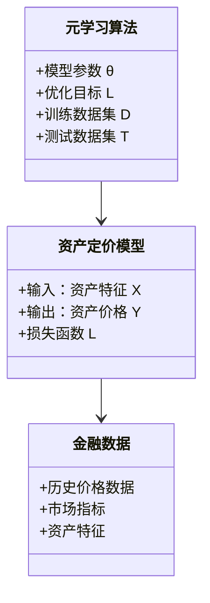
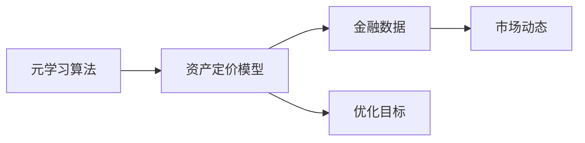
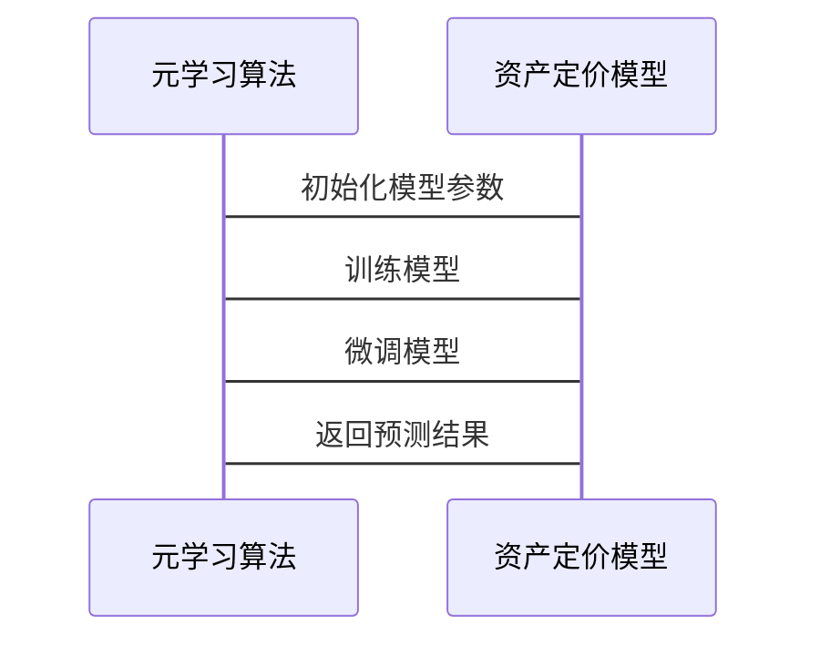

                 


# 《金融领域元学习在资产定价模型快速迭代中的应用》

---

## 关键词：
元学习，资产定价，快速迭代，金融模型，机器学习，MAML算法

---

## 摘要：
本文探讨了元学习在金融领域资产定价模型中的应用，重点分析了如何利用元学习技术快速迭代资产定价模型。通过结合金融数据的特点，本文提出了基于元学习的资产定价模型优化方法，并详细介绍了典型元学习算法（如MAML）的原理及其在资产定价中的实现。文章还通过实际案例分析，展示了元学习在提升资产定价模型性能和适应性方面的优势，并提出了未来研究方向。

---

# 第一部分: 元学习与资产定价模型概述

## 第1章: 元学习与资产定价模型的背景介绍

### 1.1 元学习的基本概念

#### 1.1.1 元学习的定义与核心概念
元学习（Meta-Learning）是一种机器学习范式，旨在通过学习如何快速适应新任务，从而减少对大量数据的依赖。其核心在于“学习如何学习”，通过在多个任务上进行训练，模型能够快速泛化到未见过的任务。

#### 1.1.2 元学习与传统机器学习的区别
- **数据需求**：传统机器学习需要大量标注数据，而元学习通过在多个任务上的训练，能够在少量数据下快速适应新任务。
- **学习目标**：传统机器学习直接优化任务目标函数，而元学习优化的是“如何优化目标函数”的元函数。

#### 1.1.3 元学习在金融领域的应用潜力
金融领域的数据通常具有小样本、高噪声和动态变化的特点，这使得元学习在金融建模中具有巨大潜力。通过元学习，模型可以快速适应市场变化，提高资产定价的准确性和效率。

### 1.2 资产定价模型的现状与挑战

#### 1.2.1 资产定价模型的基本原理
资产定价模型（如CAPM、APT）通过分析资产的风险和收益关系，预测其合理价格。传统模型依赖于统计假设和历史数据，但在面对市场波动和新兴资产时，往往表现出局限性。

#### 1.2.2 传统资产定价模型的局限性
- **数据依赖性**：传统模型需要大量历史数据，难以应对新兴资产或小样本场景。
- **静态性**：传统模型难以快速适应市场变化，如经济危机或政策调整。

#### 1.2.3 快速迭代资产定价模型的需求
金融市场的动态变化要求资产定价模型能够快速迭代和优化，以应对新的市场环境和数据。

### 1.3 元学习在资产定价中的应用前景

#### 1.3.1 元学习如何解决资产定价问题
元学习通过在多个资产定价任务上的训练，能够快速适应不同市场环境，提高模型的泛化能力和适应性。

#### 1.3.2 元学习在资产定价模型快速迭代中的优势
- **快速适应性**：元学习能够在少量数据下快速调整模型参数，适用于新兴资产或小样本场景。
- **高效性**：通过元学习，模型可以在短时间内完成对新资产的定价任务。

#### 1.3.3 元学习与金融领域的结合案例
- **案例1**：利用元学习优化股票定价模型，快速适应市场波动。
- **案例2**：通过元学习实现多资产定价任务的统一建模。

### 1.4 本章小结
本章介绍了元学习的基本概念及其在金融领域的应用潜力，分析了传统资产定价模型的局限性，并探讨了元学习在资产定价中的优势和应用场景。

---

## 第2章: 元学习的核心概念与联系

### 2.1 元学习的核心原理

#### 2.1.1 元学习算法的基本结构
元学习算法通常包含两个阶段：
1. **元训练阶段**：在多个任务上训练元模型，学习如何快速适应新任务。
2. **任务适应阶段**：在新任务上微调模型，快速得到适用于该任务的模型。

#### 2.1.2 元学习的优化目标
元学习的目标是最小化元损失函数，该函数衡量了模型在多个任务上的表现：
$$ L = \sum_{i=1}^{n} \mathbb{I}(f(x_i) \neq y_i) $$

#### 2.1.3 元学习与迁移学习的对比分析
| 对比维度 | 元学习 | 迁移学习 |
|----------|--------|----------|
| 数据需求 | 少量数据 | 大量数据 |
| 任务适应 | 快速适应新任务 | 适应单一任务 |

### 2.2 元学习的数学模型与公式

#### 2.2.1 元学习的优化函数
元学习的优化目标可以表示为：
$$ \min_{\theta} \sum_{i=1}^{N} \mathcal{L}_i(f_\theta(x_i), y_i) $$

其中，$\mathcal{L}_i$ 是第 $i$ 个任务的损失函数。

#### 2.2.2 元学习的损失函数
元学习的损失函数可以表示为：
$$ \mathcal{L}(\theta) = \mathbb{E}_{(x,y)}[\mathcal{L}_{\text{task}}(f_\theta(x), y)] $$

### 2.3 元学习与资产定价模型的关系

#### 2.3.1 元学习在资产定价中的应用场景
- **多资产定价**：利用元学习对多种资产进行统一建模，提高模型的泛化能力。
- **动态调整**：通过元学习快速调整模型参数，适应市场变化。

#### 2.3.2 元学习如何优化资产定价模型
元学习通过在多个资产定价任务上的训练，优化模型的参数，使其能够快速适应新的资产定价任务。

#### 2.3.3 元学习在资产定价中的实体关系图


### 2.4 本章小结
本章详细讲解了元学习的核心原理，并分析了其在资产定价模型中的应用，通过对比分析和实体关系图，进一步明确了元学习与资产定价模型之间的关系。

---

## 第3章: 元学习算法原理与实现

### 3.1 典型元学习算法介绍

#### 3.1.1 MAML算法
MAML（Meta-Algorithm for few-shot Learning）是一种经典的元学习算法，通过在元训练阶段优化模型的初始化参数，使其能够在新任务上快速微调。

#### 3.1.2 Reptile算法
Reptile算法通过在多个任务上交替优化全局参数和局部参数，实现快速任务适应。

#### 3.1.3 其他元学习算法对比
| 算法名称 | 特点 | 适用场景 |
|----------|------|----------|
| MAML | 基于梯度的优化 | 少样本学习 |
| Reptile | 分层优化 | 多任务学习 |

### 3.2 元学习算法的数学模型

#### 3.2.1 MAML算法的优化目标
MAML的优化目标可以表示为：
$$ \min_{\theta} \sum_{i=1}^{N} \mathcal{L}_i(f_\theta(x_i), y_i) $$

其中，$\theta$ 是模型的参数，$\mathcal{L}_i$ 是第 $i$ 个任务的损失函数。

#### 3.2.2 元学习算法的梯度计算
MAML算法的梯度计算如下：
$$ \nabla_\theta \mathcal{L} = \sum_{i=1}^{N} \nabla_\theta \mathcal{L}_i $$

### 3.3 元学习算法的Python实现

#### 3.3.1 MAML算法的Python代码实现
```python
import torch
import torch.nn as nn

class MetaLearner(nn.Module):
    def __init__(self, model):
        super(MetaLearner, self).__init__()
        self.model = model
        self.optimizer = torch.optim.SGD(self.model.parameters(), lr=0.1)
        
    def forward(self, x):
        return self.model(x)
    
    def meta_step(self, loss):
        # 计算梯度并更新参数
        gradients = torch.autograd.grad(loss, self.model.parameters())
        self.optimizer.step(gradients)
```

#### 3.3.2 Reptile算法的Python代码实现
```python
class ReptileLearner:
    def __init__(self, model, inner_lr=0.1, meta_lr=0.01):
        self.model = model
        self.inner_lr = inner_lr
        self.meta_lr = meta_lr
        self.optimizer = torch.optim.SGD(self.model.parameters(), lr=meta_lr)
        
    def inner_step(self, x, y):
        # 内部优化
        outputs = self.model(x)
        loss = nn.CrossEntropyLoss()(outputs, y)
        gradients = torch.autograd.grad(loss, self.model.parameters())
        for p, g in zip(self.model.parameters(), gradients):
            p.grad = g
        self.optimizer.inner_step(self.inner_lr)
        
    def meta_step(self, x, y):
        # 元优化
        self.inner_step(x, y)
        outputs = self.model(x)
        loss = nn.CrossEntropyLoss()(outputs, y)
        gradients = torch.autograd.grad(loss, self.model.parameters())
        self.optimizer.meta_step(self.meta_lr)
```

### 3.4 本章小结
本章详细介绍了几种典型的元学习算法，并通过Python代码实现了MAML和Reptile算法，为后续章节的系统分析和实战应用奠定了基础。

---

## 第4章: 系统分析与架构设计

### 4.1 问题场景介绍
在金融领域，资产定价模型需要快速适应市场变化和新兴资产。传统的资产定价模型难以满足这一需求，因此我们提出了一种基于元学习的资产定价系统。

### 4.2 系统功能设计

#### 4.2.1 领域模型设计


#### 4.2.2 系统架构设计


### 4.3 系统接口设计

#### 4.3.1 输入接口
- **输入数据**：金融数据（如股票价格、市场指标等）
- **输入参数**：模型参数 θ

#### 4.3.2 输出接口
- **输出结果**：资产定价预测结果
- **输出日志**：模型训练日志

### 4.4 系统交互设计

#### 4.4.1 元学习算法与资产定价模型的交互


### 4.5 本章小结
本章通过系统分析和架构设计，明确了基于元学习的资产定价系统的功能模块和交互流程，为后续的项目实施提供了指导。

---

## 第5章: 项目实战

### 5.1 环境安装
- **Python**：3.8+
- **深度学习框架**：PyTorch 1.9+
- **数据集**：金融时间序列数据（如股票价格、市场指标）

### 5.2 系统核心实现

#### 5.2.1 元学习算法实现
```python
import torch
import torch.nn as nn
import torch.optim as optim

class MetaLearner:
    def __init__(self, model, meta_lr=0.01):
        self.model = model
        self.meta_lr = meta_lr
        self.optimizer = optim.SGD(self.model.parameters(), lr=meta_lr)
        
    def step(self, loss):
        # 计算梯度并更新参数
        gradients = torch.autograd.grad(loss, self.model.parameters())
        self.optimizer.step(gradients)
```

#### 5.2.2 资产定价模型实现
```python
class AssetPricingModel(nn.Module):
    def __init__(self, input_dim, hidden_dim, output_dim):
        super(AssetPricingModel, self).__init__()
        self.fc1 = nn.Linear(input_dim, hidden_dim)
        self.fc2 = nn.Linear(hidden_dim, output_dim)
        self.relu = nn.ReLU()
        
    def forward(self, x):
        x = self.fc1(x)
        x = self.relu(x)
        x = self.fc2(x)
        return x
```

### 5.3 实际案例分析

#### 5.3.1 数据预处理
- **数据来源**：股票价格、市场指标（如成交量、波动率等）
- **数据清洗**：去除缺失值、异常值
- **数据归一化**：标准化处理

#### 5.3.2 模型训练
```python
# 初始化模型和优化器
model = AssetPricingModel(input_dim=10, hidden_dim=64, output_dim=1)
metalearner = MetaLearner(model, meta_lr=0.01)

# 元训练
for batch in train_loader:
    x, y = batch
    outputs = model(x)
    loss = nn.MSELoss()(outputs, y)
    metalearner.step(loss)
```

#### 5.3.3 模型预测与评估
```python
# 预测
with torch.no_grad():
    for x, y in test_loader:
        outputs = model(x)
        loss = nn.MSELoss()(outputs, y)
        print(f'预测值: {outputs.squeeze()}, 真实值: {y}')
        print(f'损失: {loss.item()}\n')
```

### 5.4 本章小结
本章通过实际案例分析，详细展示了基于元学习的资产定价模型的实现过程，包括数据预处理、模型训练和预测评估。

---

## 第6章: 最佳实践与小结

### 6.1 最佳实践 tips

#### 6.1.1 数据处理建议
- **数据清洗**：去除噪声数据，确保数据质量。
- **数据增强**：通过数据增强技术提高模型的鲁棒性。

#### 6.1.2 模型优化建议
- **超参数调优**：合理选择学习率、批量大小等超参数。
- **模型结构优化**：根据任务需求设计合理的模型结构。

#### 6.1.3 训练策略建议
- **预训练**：在相关任务上进行预训练，提高模型的初始性能。
- **在线更新**：实时更新模型参数，适应市场变化。

### 6.2 小结

#### 6.2.1 元学习的优势
- **快速适应性**：能够在少量数据下快速适应新任务。
- **高效性**：通过元训练，模型能够在多个任务上同时优化。

#### 6.2.2 元学习的挑战
- **计算复杂度**：元学习通常需要大量的计算资源。
- **数据需求**：虽然元学习对数据的需求较低，但仍然需要一定量的多任务数据支持。

### 6.3 未来研究方向

#### 6.3.1 元学习算法的改进
- **更高效的优化算法**：探索更高效的梯度计算和更新方法。
- **更强大的表示能力**：设计更强大的模型结构，提高模型的表示能力。

#### 6.3.2 元学习在金融领域的扩展应用
- **多资产定价**：利用元学习对多种资产进行统一建模。
- **动态市场预测**：研究元学习在金融市场动态预测中的应用。

---

## 作者：AI天才研究院/AI Genius Institute & 禅与计算机程序设计艺术 /Zen And The Art of Computer Programming

