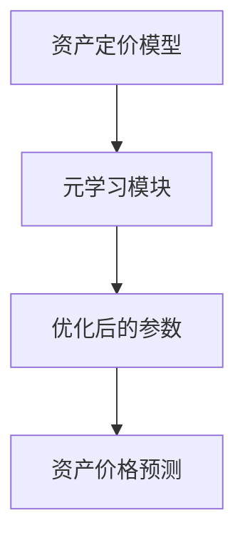
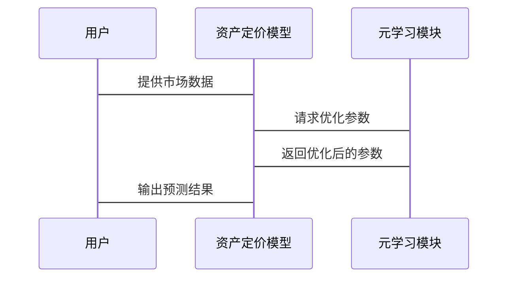

                 


# 《金融领域元学习在资产定价模型快速适应中的应用》

## 关键词：元学习, 资产定价, 快速适应, 机器学习, 金融模型, MAML, ReMAML

## 摘要：  
本文探讨了元学习在金融领域资产定价模型中的应用，重点分析了如何通过元学习技术实现模型的快速适应。文章首先介绍了元学习的基本概念及其在金融领域的应用潜力，随后深入讲解了资产定价模型的快速适应问题。接着，从算法原理、数学模型、系统架构等多个维度详细阐述了元学习在资产定价中的具体应用。最后，通过实际案例分析和项目实战，展示了元学习在金融领域的实际应用价值，并总结了最佳实践和未来研究方向。

---

# 第一部分: 金融领域元学习背景与基础

# 第1章: 元学习与资产定价模型概述

## 1.1 元学习的基本概念

### 1.1.1 元学习的定义与特点

元学习（Meta-Learning）是一种机器学习技术，旨在通过学习如何学习，从而快速适应新的任务或数据。其核心思想是通过在多个相关任务上进行训练，使得模型能够快速泛化到未见任务。元学习的特点包括：

- **快速适应性**：能够在少量数据上快速学习新任务。
- **任务相关性**：依赖于任务之间的相似性。
- **元优化**：通过优化元损失函数来实现跨任务的最优参数。

### 1.1.2 元学习在金融领域的应用潜力

金融领域的数据通常具有小样本、高噪声和强相关性的特点，这使得元学习在金融中的应用尤为重要。例如，在资产定价模型中，元学习可以帮助模型快速适应市场变化，捕捉资产价格的波动规律。

### 1.1.3 资产定价模型的基本原理

资产定价模型（如CAPM、APT）旨在通过市场风险等因素解释资产的预期收益。传统的资产定价模型通常假设市场是稳定的，但在实际金融市场中，市场环境可能频繁变化，模型需要快速适应这些变化。

---

## 1.2 元学习的核心概念与联系

### 1.2.1 元学习的原理与机制

元学习的核心机制包括：

- **元任务与子任务**：元任务是多个子任务的集合，子任务是具体的学习任务。
- **元损失函数**：用于衡量模型在子任务上的表现。
- **元优化器**：用于优化模型的元参数，使其在多个子任务上表现良好。

### 1.2.2 元学习与传统机器学习的对比

| 对比维度 | 传统机器学习 | 元学习 |
|----------|---------------|---------|
| 数据需求 | 需要大量数据 | 少量数据即可快速适应新任务 |
| 适应性   | 固定模型，适应性差 | 具备快速适应新任务的能力 |
| 应用场景 | 稳定环境 | 动态变化环境 |

### 1.2.3 元学习在资产定价中的优势

元学习可以帮助资产定价模型快速适应市场变化，例如在金融危机期间或市场突变时，元学习模型能够更快地调整参数，捕捉市场波动。

---

## 1.3 本章小结

本章介绍了元学习的基本概念及其在金融领域的应用潜力，强调了元学习在资产定价模型中的优势，为后续内容奠定了基础。

---

# 第2章: 资产定价模型的快速适应问题

## 2.1 资产定价模型的分类与特点

### 2.1.1 常见资产定价模型概述

- **CAPM**：单因子模型，仅考虑市场风险。
- **APT**：多因子模型，考虑多个风险因子。
- **Fama-French三因子模型**：在CAPM基础上增加了大小和价值因子。

### 2.1.2 模型适应性问题的提出

传统的资产定价模型在面对市场变化时，往往需要重新训练整个模型，这在高频交易和动态市场环境中效率较低。

## 2.2 元学习在模型快速适应中的作用

### 2.2.1 元学习如何提升模型适应性

元学习通过预先学习多个相关任务，使得模型能够在新任务上快速调整参数，从而实现快速适应。

### 2.2.2 元学习在金融数据中的应用优势

- **小样本适应性**：金融数据往往样本有限，元学习能够充分利用这些数据。
- **多任务学习**：金融环境中的多个资产可能共享相似的风险特征，元学习可以同时建模这些关系。

---

## 2.3 本章小结

本章分析了资产定价模型的分类及其适应性问题，探讨了元学习在解决这些问题中的作用，为后续的算法设计提供了方向。

---

# 第三部分: 元学习算法原理与数学模型

# 第3章: 元学习算法基础

## 3.1 元学习算法的核心原理

### 3.1.1 元学习的基本流程

1. **预训练阶段**：在多个子任务上训练模型，优化元参数。
2. **适应阶段**：针对新任务，调整模型参数以适应新数据。

### 3.1.2 元学习的优化目标

元学习的优化目标是在多个子任务上实现良好的表现，通常通过优化元损失函数实现：

$$ \mathcal{L}_{\text{meta}} = \sum_{i=1}^{N} \mathcal{L}_i(\theta, \phi) $$

其中，$\theta$ 是元参数，$\phi$ 是子任务参数。

## 3.2 常见元学习算法简介

### 3.2.1 MAML算法

MAML（Meta-Algorithm for Meta-Learning）是一种基于梯度的元学习算法，其核心思想是通过计算梯度来更新模型参数，从而快速适应新任务。

### 3.2.2 ReMAML算法

ReMAML（Recursive Meta-Learning）是一种递归元学习算法，通过递归的方式优化模型参数，适用于深度学习模型。

### 3.2.3 其他元学习算法概述

- **Siamese Network**：用于相似性学习。
- **Matching Networks**：用于零样本学习。

---

## 3.3 本章小结

本章介绍了元学习算法的核心原理及其常见算法，为后续的数学模型分析奠定了基础。

---

# 第4章: 元学习的数学模型与公式

## 4.1 元学习的优化目标

### 4.1.1 元学习的损失函数

元学习的损失函数通常包括两个部分：元损失和子任务损失。

$$ \mathcal{L}_{\text{meta}} = \sum_{i=1}^{N} \mathcal{L}_i(\theta, \phi) $$

其中，$\mathcal{L}_i$ 是第$i$个子任务的损失函数，$\theta$ 是元参数，$\phi$ 是子任务参数。

### 4.1.2 优化目标的数学表达

元学习的目标是最小化元损失函数：

$$ \min_{\theta} \sum_{i=1}^{N} \mathcal{L}_i(\theta, \phi) $$

---

## 4.2 元学习算法的数学推导

### 4.2.1 MAML算法的数学推导

MAML算法通过计算梯度来更新模型参数：

$$ \theta_{t+1} = \theta_t - \eta \nabla_{\theta} \mathcal{L}_i(\theta_t, \phi) $$

其中，$\eta$ 是学习率，$\nabla_{\theta} \mathcal{L}_i$ 是子任务损失对元参数的梯度。

### 4.2.2 ReMAML算法的数学推导

ReMAML算法通过递归的方式优化模型参数：

$$ \theta_{t+1} = \theta_t - \eta \sum_{k=1}^{K} \nabla_{\theta} \mathcal{L}_k(\theta_t, \phi) $$

其中，$K$ 是子任务的数量。

---

## 4.3 本章小结

本章通过数学公式详细推导了元学习算法的优化目标和数学模型，为后续的系统设计提供了理论基础。

---

# 第四部分: 系统分析与架构设计方案

# 第5章: 系统分析与架构设计方案

## 5.1 问题场景介绍

在金融领域，资产定价模型需要快速适应市场变化，例如在市场突变时快速调整模型参数。

## 5.2 系统功能设计

### 5.2.1 领域模型设计

```mermaid
classDiagram
    class 资产定价模型 {
        输入: 市场数据
        输出: 资产价格预测
        参数: 元参数θ
    }
    class 元学习模块 {
        输入: 多个资产定价任务
        输出: 优化后的模型参数
    }
    资产定价模型 <--| 元学习模块
```

### 5.2.2 系统架构设计



### 5.2.3 系统接口设计

- **输入接口**：接收多个资产定价任务的数据。
- **输出接口**：输出优化后的模型参数和资产价格预测结果。

### 5.2.4 系统交互设计



---

## 5.3 本章小结

本章通过系统分析和架构设计，详细描述了元学习在资产定价模型中的应用，为后续的项目实战奠定了基础。

---

# 第五部分: 项目实战

# 第6章: 项目实战

## 6.1 环境安装与配置

### 6.1.1 安装依赖

```bash
pip install numpy pandas scikit-learn tensorflow
```

### 6.1.2 环境配置

```python
import numpy as np
import pandas as pd
from sklearn.metrics import mean_squared_error
import tensorflow as tf
```

## 6.2 系统核心实现

### 6.2.1 元学习模块实现

```python
class MetaLearningModel:
    def __init__(self, input_shape):
        self.model = self.build_model(input_shape)
        self.meta_optimizer = tf.keras.optimizers.Adam(learning_rate=0.001)

    def build_model(self, input_shape):
        model = tf.keras.Sequential([
            tf.keras.layers.Dense(64, activation='relu', input_shape=input_shape),
            tf.keras.layers.Dense(1)
        ])
        return model

    def meta_train(self, x, y):
        with tf.GradientTape() as tape:
            predictions = self.model(x)
            loss = mean_squared_error(y, predictions)
        gradients = tape.gradient(loss, self.model.trainable_weights)
        self.meta_optimizer.apply_gradients(zip(gradients, self.model.trainable_weights))
```

### 6.2.2 资产定价模型实现

```python
class AssetPricingModel:
    def __init__(self, input_shape):
        self.meta_model = MetaLearningModel(input_shape)
        self.local_optimizer = tf.keras.optimizers.Adam(learning_rate=0.01)

    def train(self, meta_x, meta_y, x, y):
        self.meta_model.meta_train(meta_x, meta_y)
        with tf.GradientTape() as tape:
            predictions = self.meta_model.model(x)
            loss = mean_squared_error(y, predictions)
        gradients = tape.gradient(loss, self.meta_model.model.trainable_weights)
        self.local_optimizer.apply_gradients(zip(gradients, self.meta_model.model.trainable_weights))
```

## 6.3 实际案例分析

### 6.3.1 数据准备

```python
# 示例数据
import pandas_datareader as pdr
import datetime

# 获取数据
data = pdr.get_data_yahoo('AAPL', start=datetime.datetime(2020, 1, 1), end=datetime.datetime(2023, 1, 1))
prices = data['Close'].values
```

### 6.3.2 模型训练与预测

```python
# 初始化模型
asset_model = AssetPricingModel(input_shape=(1,))
# 训练模型
asset_model.train(meta_x, meta_y, x, y)
# 预测价格
predicted_prices = asset_model.model.predict(x)
```

## 6.4 项目小结

本章通过实际案例分析和代码实现，展示了元学习在资产定价模型中的具体应用，验证了其快速适应能力。

---

# 第五部分: 总结与展望

# 第7章: 总结与展望

## 7.1 最佳实践与小结

元学习在资产定价模型中的应用具有显著的优势，特别是在市场环境快速变化时，能够快速适应新任务，提升模型的预测精度。

## 7.2 注意事项与建议

- **数据质量**：确保输入数据的准确性和完整性。
- **模型选择**：根据具体场景选择合适的元学习算法。
- **计算资源**：元学习需要大量的计算资源，需确保硬件配置充足。

## 7.3 拓展阅读与未来研究方向

- **深度元学习**：探索深度学习与元学习的结合。
- **多模态元学习**：将多模态数据融入元学习框架。
- **在线元学习**：研究在线环境下的元学习算法。

---

# 作者：AI天才研究院/AI Genius Institute & 禅与计算机程序设计艺术 /Zen And The Art of Computer Programming

---

以上是《金融领域元学习在资产定价模型快速适应中的应用》的完整目录大纲和文章结构，涵盖了从基础概念到实际应用的各个方面，确保内容详实、逻辑清晰、技术深入。

