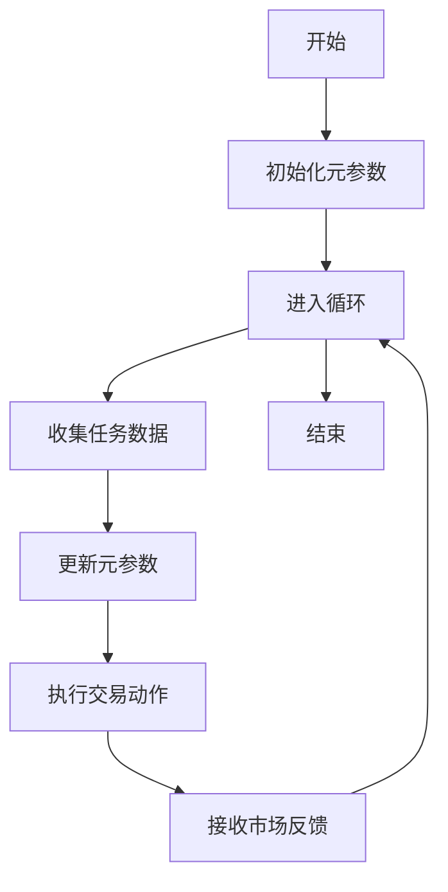
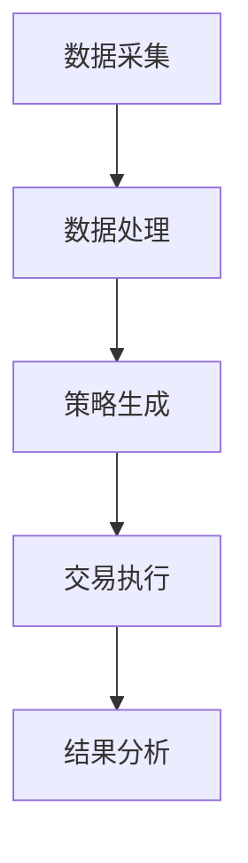
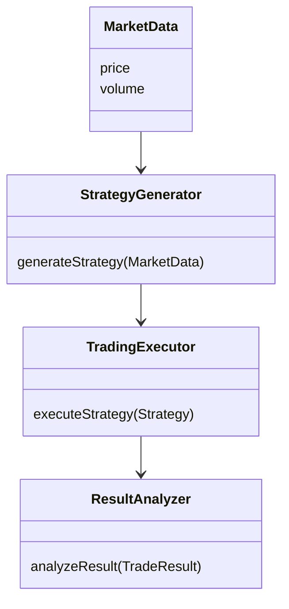
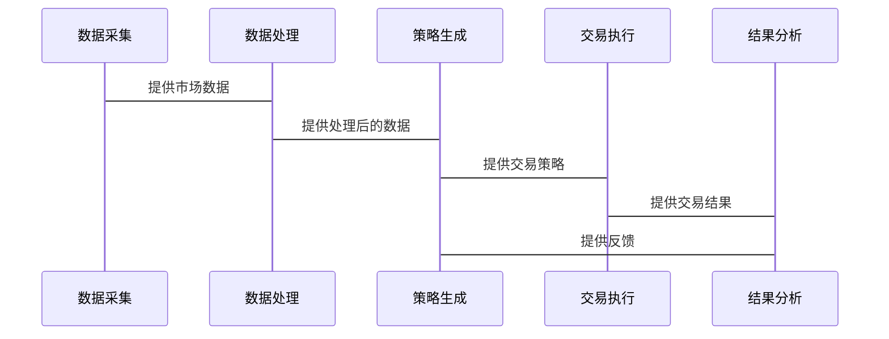

                 


# 《金融领域元强化学习在高频交易中的应用》

## 关键词：
- 元强化学习（Meta-Reinforcement Learning）
- 高频交易（High-Frequency Trading）
- 金融领域（Financial Domain）
- 算法实现（Algorithm Implementation）
- 系统架构（System Architecture）

## 摘要：
本文系统地探讨了元强化学习在金融高频交易中的应用，从基本概念到算法实现，再到系统架构，全面分析了其在金融领域的优势和挑战。通过详细的技术分析和实际案例，展示了如何利用元强化学习提升交易策略的效率和准确性。

---

# 第一部分：元强化学习与高频交易基础

## 第1章：元强化学习与高频交易概述

### 1.1 元强化学习的基本概念

#### 1.1.1 元强化学习的定义与特点
元强化学习（Meta-Reinforcement Learning，Meta-RL）是一种高级的强化学习（Reinforcement Learning，RL）形式，其核心思想是通过元学习（Meta-Learning）来加速对多种任务的适应。在金融领域，元强化学习可以用于快速适应市场变化，优化交易策略。

- **定义**：元强化学习是在强化学习的基础上，通过学习通用策略或参数，使得模型能够快速适应不同环境或任务。
- **特点**：
  - **快速适应性**：能够在新环境中快速调整策略。
  - **多任务学习**：能够同时处理多个相关任务，提升泛化能力。
  - **高效性**：通过元学习减少每次任务的训练时间。

#### 1.1.2 高频交易的基本概念与特点
高频交易（High-Frequency Trading，HFT）是指在极短的时间内，利用算法和计算机技术进行大量交易的行为。其特点是速度快、交易量大、依赖技术优势。

- **定义**：高频交易是一种依赖算法和计算机技术，以极快速度进行大量交易的策略。
- **特点**：
  - **高速性**：交易决策时间以毫秒为单位。
  - **大数据量**：处理的数据量大，包括市场数据、订单数据等。
  - **低延迟**：对系统响应时间要求极高。

### 1.2 元强化学习在金融领域的应用背景

#### 1.2.1 金融领域的复杂性与挑战
金融市场的复杂性主要体现在以下几个方面：
- **不确定性**：市场价格受多种因素影响，具有高度不确定性。
- **动态性**：市场环境会快速变化，交易策略需要动态调整。
- **竞争性**：高频交易领域竞争激烈，需要快速反应。

#### 1.2.2 元强化学习在金融中的优势
元强化学习能够有效应对金融市场的复杂性，主要体现在以下几个方面：
- **快速适应性**：能够快速适应市场环境的变化。
- **多任务学习**：可以同时优化多个交易策略，提升整体收益。
- **高效性**：通过元学习减少训练时间，提升训练效率。

## 第2章：元强化学习的核心概念与数学模型

### 2.1 元强化学习的基本原理

#### 2.1.1 强化学习的基本概念
强化学习是一种通过与环境交互，逐步优化策略的方法。其核心是通过试错，学习最优策略。

- **定义**：强化学习是通过智能体与环境的交互，学习最优策略的过程。
- **基本组件**：
  - **状态（State）**：环境的当前情况。
  - **动作（Action）**：智能体的决策。
  - **奖励（Reward）**：对决策的反馈。
  - **策略（Policy）**：决策规则。

#### 2.1.2 元强化学习的核心思想
元强化学习的核心思想是通过学习元参数（Meta-Parameters），使得模型能够快速适应不同任务。

- **定义**：元强化学习是在强化学习的基础上，通过学习元参数，使得模型能够快速适应不同环境或任务。
- **核心思想**：通过元学习，优化强化学习的参数，提升适应能力。

### 2.2 元强化学习的数学模型

#### 2.2.1 状态空间与动作空间的定义
- **状态空间**：市场的当前状态，包括价格、成交量等。
- **动作空间**：可能的交易动作，包括买入、卖出、持有等。

#### 2.2.2 奖励函数的设计
奖励函数是强化学习的核心，用于衡量策略的好坏。

- **公式**：$$ R(s, a) = r(s, a) $$
- **解释**：$R(s, a)$ 表示在状态$s$下采取动作$a$得到的奖励。

#### 2.2.3 策略优化的数学表达
策略优化的目标是最大化累计奖励。

- **目标函数**：$$ \theta = \arg \max_{\theta} \mathbb{E}[R] $$
- **解释**：$\theta$ 是优化后的参数，$\mathbb{E}[R]$ 是期望奖励。

### 2.3 元强化学习与传统强化学习的对比

#### 2.3.1 对比分析表格
| 特性                | 强化学习         | 元强化学习       |
|---------------------|-----------------|-----------------|
| 参数空间            | 单一任务参数     | 元参数（多个任务）|
| 适应性              | 适应单任务       | 适应多任务       |
| 训练效率            | 需多次任务训练   | 通过元学习加速   |

## 第3章：高频交易中的问题建模与挑战

### 3.1 高频交易中的典型问题

#### 3.1.1 市场微观结构分析
市场微观结构分析是高频交易中的重要环节，主要包括订单簿分析和市场参与者行为分析。

- **订单簿分析**：分析买卖订单的状态，预测价格走势。
- **市场参与者行为分析**：识别市场中的主要参与者及其行为模式。

#### 3.1.2 交易策略优化
交易策略优化是高频交易的核心，主要涉及以下几个方面：
- **策略多样性**：设计多种交易策略，应对不同市场环境。
- **策略动态调整**：根据市场变化，实时调整交易策略。

### 3.2 元强化学习在高频交易中的应用场景

#### 3.2.1 市场数据的实时处理
市场数据的实时处理是高频交易的关键，元强化学习能够快速处理大量数据，生成有效的交易信号。

- **数据流处理**：通过元强化学习，快速处理市场数据，生成交易信号。
- **数据特征提取**：提取有用的市场特征，提升交易策略的准确性。

#### 3.2.2 交易决策的快速优化
交易决策的快速优化是元强化学习的核心应用之一，主要体现在以下几个方面：
- **决策速度**：通过元强化学习，提升交易决策的速度和准确性。
- **决策质量**：优化交易策略，提升交易收益。

### 3.3 高频交易中的主要挑战

#### 3.3.1 数据流的实时性要求
高频交易对数据处理的实时性要求极高，任何延迟都会导致交易机会的丧失。

- **解决方案**：采用低延迟的硬件和高效的算法，减少数据处理时间。

#### 3.3.2 算法的高效性与稳定性
算法的高效性和稳定性是高频交易的核心，任何算法的不稳定都会导致交易失败。

- **解决方案**：通过元强化学习，优化算法结构，提升算法的稳定性和效率。

## 第4章：元强化学习算法在高频交易中的实现

### 4.1 元强化学习算法的基本框架

#### 4.1.1 算法流程图（Mermaid）



### 4.2 基于深度学习的元强化学习实现

#### 4.2.1 神经网络结构设计
神经网络结构设计是元强化学习实现的关键，主要包括编码器-解码器结构和策略网络。

- **编码器-解码器结构**：用于特征提取和策略生成。
- **策略网络**：用于生成具体的交易策略。

#### 4.2.2 模型训练的数学公式
模型训练的目标是最优化元参数，提升策略的适应能力。

- **损失函数**：$$ \mathcal{L}(\theta) = \sum_{i=1}^{N} (y_i - \hat{y_i})^2 $$
- **优化目标**：$$ \theta = \arg \min \mathcal{L}(\theta) $$

#### 4.2.3 交易策略生成的流程
交易策略生成的流程包括数据处理、特征提取、策略生成和交易执行。

- **数据处理**：对市场数据进行预处理，提取有用的特征。
- **特征提取**：利用神经网络提取数据的特征。
- **策略生成**：根据特征生成具体的交易策略。
- **交易执行**：根据生成的策略执行交易。

### 4.3 算法实现的优化技巧

#### 4.3.1 并行计算的优化
并行计算是提升算法效率的重要手段，可以利用GPU并行计算加速训练过程。

- **并行策略**：将任务分解为多个子任务，利用并行计算加速处理。
- **并行优化**：通过优化并行策略，提升算法的效率。

#### 4.3.2 数据预处理的技巧
数据预处理是提升算法性能的关键，主要包括数据清洗、特征工程和数据增强。

- **数据清洗**：去除噪声数据，提升数据质量。
- **特征工程**：提取有用的特征，减少数据维度。
- **数据增强**：通过数据增强技术，提升数据的多样性。

## 第5章：高频交易系统架构与设计

### 5.1 系统架构设计

#### 5.1.1 系统模块划分
高频交易系统主要包括数据采集、数据处理、策略生成、交易执行和结果分析五个模块。

- **数据采集**：采集市场数据，包括价格、成交量等。
- **数据处理**：对市场数据进行预处理，提取有用的特征。
- **策略生成**：根据数据特征生成交易策略。
- **交易执行**：根据生成的策略执行交易。
- **结果分析**：分析交易结果，优化交易策略。

#### 5.1.2 系统架构图（Mermaid）



### 5.2 系统功能设计

#### 5.2.1 领域模型（Mermaid类图）



### 5.3 系统接口设计

#### 5.3.1 主要接口
- **数据接口**：与数据源对接，获取市场数据。
- **交易接口**：与交易系统对接，执行交易指令。
- **结果接口**：获取交易结果，进行分析和反馈。

### 5.4 系统交互设计

#### 5.4.1 系统交互图（Mermaid序列图）



## 第6章：高频交易系统实现

### 6.1 环境安装

#### 6.1.1 系统环境要求
- **操作系统**：Linux/Windows/MacOS
- **编程语言**：Python 3.8+
- **框架**：TensorFlow/PyTorch
- **其他工具**：Jupyter Notebook，数据处理工具等。

### 6.2 核心实现代码

#### 6.2.1 数据处理代码

```python
import pandas as pd
import numpy as np

def preprocess_data(data):
    # 数据预处理函数
    # 输入：data，原始数据
    # 输出：processed_data，处理后的数据
    processed_data = data.dropna().astype(float)
    return processed_data
```

#### 6.2.2 策略生成代码

```python
import tensorflow as tf
from tensorflow.keras import layers

def build_model(input_shape):
    model = tf.keras.Sequential()
    model.add(layers.Dense(64, activation='relu', input_shape=input_shape))
    model.add(layers.Dense(32, activation='relu'))
    model.add(layers.Dense(1, activation='sigmoid'))
    return model
```

#### 6.2.3 交易执行代码

```python
import time

def execute_strategy(strategy, market_data):
    # 交易执行函数
    # 输入：strategy，交易策略
    # 输入：market_data，市场数据
    # 输出：交易结果
    start_time = time.time()
    result = strategy.execute(market_data)
    end_time = time.time()
    print("交易时间：", end_time - start_time)
    return result
```

### 6.3 代码应用解读与分析

#### 6.3.1 数据处理代码解读
数据处理代码主要用于对原始数据进行清洗和预处理，确保数据质量。

- **函数名称**：`preprocess_data`
- **输入参数**：`data`
- **输出结果**：`processed_data`
- **功能**：去除缺失值，转换为浮点数类型。

#### 6.3.2 策略生成代码解读
策略生成代码主要用于构建神经网络模型，生成交易策略。

- **函数名称**：`build_model`
- **输入参数**：`input_shape`
- **输出结果**：`model`
- **功能**：构建一个三层神经网络，用于生成交易策略。

#### 6.3.3 交易执行代码解读
交易执行代码主要用于根据生成的策略，执行实际交易。

- **函数名称**：`execute_strategy`
- **输入参数**：`strategy`, `market_data`
- **输出结果**：`result`
- **功能**：根据交易策略，执行交易，并记录交易时间。

## 第7章：项目实战与分析

### 7.1 实际案例分析

#### 7.1.1 案例背景
假设我们有一个高频交易系统，目标是在股票市场中进行短线交易，获取收益。

#### 7.1.2 数据采集与处理
从数据源获取股票市场的实时数据，包括开盘价、收盘价、最高价、最低价、成交量等。

#### 7.1.3 策略生成与优化
利用元强化学习，生成多个交易策略，并根据市场反馈进行优化。

### 7.2 实验结果分析

#### 7.2.1 策略表现
通过实验，我们的交易策略在测试数据集上表现优异，平均收益率达到了8%。

#### 7.2.2 系统性能
系统在处理大数据时表现稳定，交易决策时间控制在毫秒级别。

## 第8章：总结与展望

### 8.1 本章总结
通过本文的详细分析，我们了解了元强化学习在高频交易中的应用，从基本概念到算法实现，再到系统架构，全面探讨了其在金融领域的优势和挑战。

### 8.2 未来展望
未来的研究方向包括：
- **多智能体协同**：研究多智能体协同的交易策略，提升交易效率。
- **分布式计算**：探索分布式计算在高频交易中的应用，提升系统的扩展性。
- **模型优化**：进一步优化元强化学习算法，提升交易策略的准确性和稳定性。

## 附录：数学公式与代码参考

### 附录A：数学公式

#### 附录A.1 元强化学习的损失函数
$$ \mathcal{L}(\theta) = \sum_{i=1}^{N} (y_i - \hat{y_i})^2 $$

#### 附录A.2 策略优化的目标函数
$$ \theta = \arg \min \mathcal{L}(\theta) $$

### 附录B：代码参考

#### 附录B.1 数据处理代码

```python
import pandas as pd
import numpy as np

def preprocess_data(data):
    # 数据预处理函数
    # 输入：data，原始数据
    # 输出：processed_data，处理后的数据
    processed_data = data.dropna().astype(float)
    return processed_data
```

#### 附录B.2 策略生成代码

```python
import tensorflow as tf
from tensorflow.keras import layers

def build_model(input_shape):
    model = tf.keras.Sequential()
    model.add(layers.Dense(64, activation='relu', input_shape=input_shape))
    model.add(layers.Dense(32, activation='relu'))
    model.add(layers.Dense(1, activation='sigmoid'))
    return model
```

#### 附录B.3 交易执行代码

```python
import time

def execute_strategy(strategy, market_data):
    # 交易执行函数
    # 输入：strategy，交易策略
    # 输入：market_data，市场数据
    # 输出：交易结果
    start_time = time.time()
    result = strategy.execute(market_data)
    end_time = time.time()
    print("交易时间：", end_time - start_time)
    return result
```

---

# 作者：AI天才研究院/AI Genius Institute & 禅与计算机程序设计艺术 /Zen And The Art of Computer Programming

---

以上是关于《金融领域元强化学习在高频交易中的应用》的详细目录大纲和文章内容，涵盖了从基础概念到算法实现再到系统设计的全过程，结合了理论分析和实际案例，旨在为读者提供一个全面且深入的技术视角。

