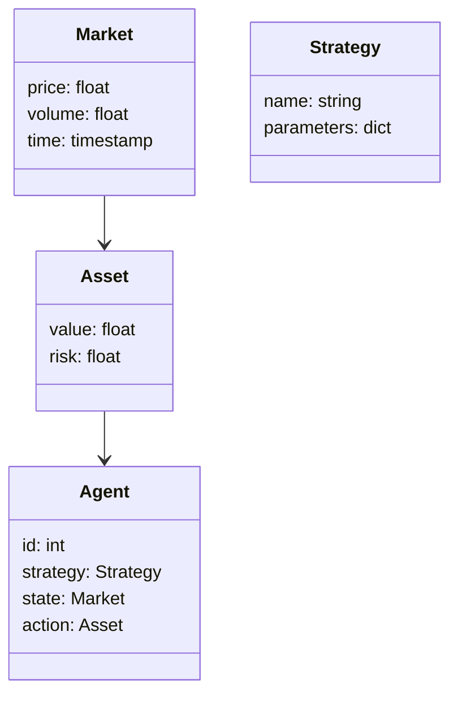
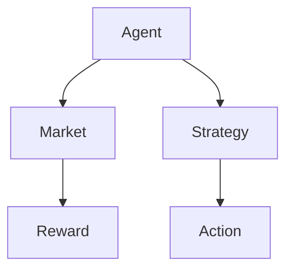
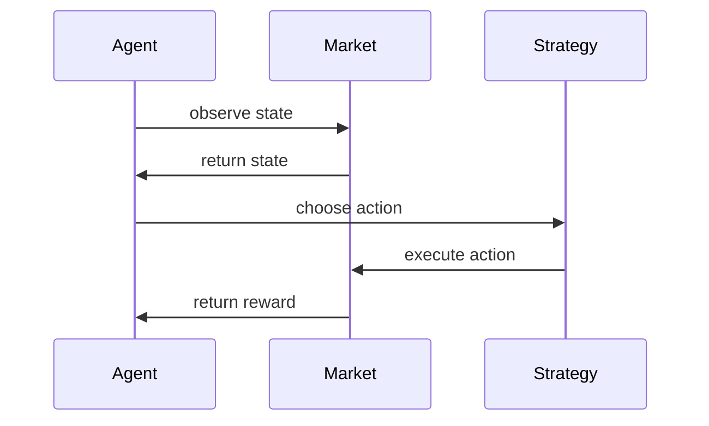

                 


# 金融领域元强化学习的探索与应用

## 关键词：
强化学习、元强化学习、金融领域、深度学习、强化学习算法

## 摘要：
本文深入探讨了元强化学习在金融领域中的应用，结合强化学习的基本概念、元强化学习的核心原理、算法框架及其实现，分析了其在金融投资、风险管理等场景中的优势与挑战。通过详细阐述数学模型、系统架构和实际案例，展示了元强化学习在金融决策中的巨大潜力。

---

# 第一部分: 强化学习与元强化学习基础

## 第1章: 强化学习概述

### 1.1 强化学习的基本概念

#### 1.1.1 强化学习的定义
强化学习是一种通过智能体与环境交互来学习策略的方法，目标是通过最大化累计奖励来优化决策过程。智能体通过执行动作、观察状态并接收奖励，逐步学习最优策略。

**示例**：在股票交易中，智能体根据当前市场状态（如价格、成交量）选择买入或卖出的动作，并根据最终收益获得奖励。

#### 1.1.2 强化学习的核心要素
| 要素 | 描述 |
|------|------|
| 状态 (State) | 智能体所处的环境信息，例如市场数据。 |
| 动作 (Action) | 智能体在特定状态下采取的行为，例如买入或卖出股票。 |
| 奖励 (Reward) | 智能体在执行动作后获得的反馈，用于评估动作的好坏。 |
| 策略 (Policy) | 定义智能体在每个状态下选择动作的概率分布。 |
| 价值函数 (Value Function) | 表示在某个状态下采取某个动作后的期望累计奖励。 |

#### 1.1.3 强化学习的应用场景
强化学习广泛应用于游戏、机器人控制、推荐系统等领域，尤其适合处理动态复杂和高维状态空间的问题。

### 1.2 元强化学习的定义与特点

#### 1.2.1 元强化学习的定义
元强化学习（Meta-Reinforcement Learning）是一种通过学习如何学习的方法，旨在快速适应新任务。与传统强化学习不同，元强化学习在训练过程中不仅学习具体任务的策略，还学习如何调整这些策略以适应新环境。

**示例**：在金融交易中，元强化学习可以同时优化多个资产的交易策略，并在市场变化时快速调整这些策略。

#### 1.2.2 元强化学习的核心特征
| 特征 | 描述 |
|------|------|
| 多智能体协作 | 元强化学习通常涉及多个智能体之间的协作，以实现共同目标。 |
| 知识迁移 | 元强化学习能够快速将已学习的知识迁移到新任务中。 |
| 高维状态空间 | 元强化学习适用于处理复杂且高维的状态空间。 |

#### 1.2.3 元强化学习与传统强化学习的区别
| 方面 | 传统强化学习 | 元强化学习 |
|------|------------|------------|
| 学习目标 | 学习单一任务策略 | 学习如何快速适应新任务 |
| 适应性 | 较低 | 较高 |
| 训练时间 | 较长 | 较短 |

### 1.3 元强化学习在金融中的应用背景

金融领域中的决策问题通常涉及复杂且动态变化的市场环境，传统的强化学习方法在处理多任务和快速适应性方面存在局限性。元强化学习通过引入元学习机制，能够更好地应对这些挑战。

---

## 第2章: 元强化学习的核心概念

### 2.1 元强化学习的原理

#### 2.1.1 多智能体系统
在金融领域，元强化学习通常涉及多个智能体，每个智能体负责优化特定资产或策略。智能体之间通过协作和竞争，共同实现整体目标。

**示例**：在股票投资中，多个智能体可以分别负责不同行业的投资策略，通过协作实现最优的资产配置。

#### 2.1.2 元学习机制
元学习机制通过学习如何调整策略参数，使得智能体能够在新任务中快速找到最优策略。这通常涉及对策略网络的元优化，以提高适应性。

#### 2.1.3 知识迁移
元强化学习的核心优势之一是其强大的知识迁移能力，能够将从一个任务或环境中学习到的知识快速应用到新的任务或环境中。

### 2.2 元强化学习的数学模型

#### 2.2.1 策略网络的定义
策略网络是一个函数 $\pi_\theta(a|s)$，表示在状态 $s$ 下选择动作 $a$ 的概率，参数 $\theta$ 用于优化策略。

$$ \pi_\theta(a|s) = \text{softmax}(W_\theta s + b_\theta) $$

其中，$W_\theta$ 和 $b_\theta$ 是策略网络的权重和偏置参数。

#### 2.2.2 价值函数的定义
价值函数是一个函数 $Q_\phi(s,a)$，表示在状态 $s$ 下执行动作 $a$ 后的期望累计奖励。

$$ Q_\phi(s,a) = W_\phi s + b_\phi $$

#### 2.2.3 元学习的优化目标
元强化学习的目标是优化元策略，使得智能体能够在新任务中快速找到最优策略。优化目标通常涉及对策略网络和价值函数的联合优化。

$$ \theta = \arg\max_{\theta} \sum_{i=1}^{N} R_i(\pi_\theta) $$

其中，$R_i(\pi_\theta)$ 是第 $i$ 个任务的奖励函数。

### 2.3 元强化学习与传统强化学习的对比

| 方面 | 传统强化学习 | 元强化学习 |
|------|--------------|------------|
| 学习目标 | 单一任务优化 | 多任务优化 |
| 策略调整 | 需要多次任务 | 快速适应新任务 |
| 计算复杂度 | 较低 | 较高 |

---

## 第3章: 元强化学习与金融领域的结合

### 3.1 金融领域的强化学习应用

#### 3.1.1 金融投资中的强化学习
在金融投资中，强化学习可以用于制定买卖决策，优化投资组合。例如，通过强化学习算法训练智能体，使其能够在不同市场条件下做出最优的投资决策。

**示例**：使用强化学习算法训练一个智能体，使其在股票交易中实现最大收益。

#### 3.1.2 风险管理中的强化学习
强化学习可以用于风险管理，例如识别市场风险、信用风险等。通过强化学习模型，可以实时监控市场变化，预测潜在风险，并制定应对策略。

**示例**：使用强化学习模型预测市场崩盘的可能性，并在风险出现前采取措施。

#### 3.1.3 金融交易中的强化学习
在高频交易中，强化学习可以用于制定交易策略，优化订单执行。例如，通过强化学习算法训练智能体，使其能够在毫秒级别做出交易决策。

### 3.2 元强化学习在金融中的优势

#### 3.2.1 多智能体协作的优势
元强化学习通过多智能体协作，可以同时优化多个资产或策略，实现更高效的资产配置和风险控制。

#### 3.2.2 知识迁移的优势
元强化学习能够快速将已学习的知识迁移到新任务中，适用于金融市场的快速变化和多任务优化。

#### 3.2.3 复杂决策场景的优势
在复杂金融场景中，元强化学习能够快速适应市场变化，优化决策过程，提高交易效率和收益。

---

## 第4章: 元强化学习的算法原理

### 4.1 基于价值函数的元强化学习算法

#### 4.1.1 Q-learning算法
Q-learning是一种经典的强化学习算法，通过更新Q值表来学习最优策略。

$$ Q(s,a) = Q(s,a) + \alpha (r + \gamma \max Q(s',a') - Q(s,a)) $$

其中，$\alpha$ 是学习率，$\gamma$ 是折扣因子。

#### 4.1.2 DQN算法
DQN（Deep Q-Network）算法通过神经网络近似Q值函数，适用于高维状态空间的问题。

**代码示例**：

```python
import numpy as np

class DQN:
    def __init__(self, state_dim, action_dim):
        self.state_dim = state_dim
        self.action_dim = action_dim
        self.model = self._build_model()

    def _build_model(self):
        model = Sequential()
        model.add(Dense(64, input_dim=self.state_dim, activation='relu'))
        model.add(Dense(self.action_dim))
        return model

    def update(self, state, action, reward, next_state):
        target = reward + 0.95 * np.max(self.model.predict(next_state)[0])
        target_vec = self.model.predict(state)[0]
        target_vec[action] = target
        self.model.fit(state, target_vec, epochs=1, verbose=0)
```

#### 4.1.3 Meta-Q算法
Meta-Q算法是一种基于元学习的强化学习算法，通过优化Q值函数的参数来实现快速适应新任务。

### 4.2 基于策略梯度的元强化学习算法

#### 4.2.1 PG算法
PG（Policy Gradient）算法通过优化策略的梯度来更新策略参数。

$$ \theta = \theta + \alpha \nabla_\theta J(\theta) $$

其中，$J(\theta)$ 是策略的期望回报。

#### 4.2.2 A2C算法
A2C（Advantage Actor-Critic）算法结合了策略梯度和价值函数的优势，通过同时优化策略和价值函数来提高学习效率。

### 4.3 基于神经网络的元强化学习算法

#### 4.3.1 DNN在元强化学习中的应用
DNN（Deep Neural Network）用于近似策略网络或价值函数，适用于处理复杂的金融数据。

#### 4.3.2 CNN在元强化学习中的应用
CNN（Convolutional Neural Network）适用于处理图像或序列数据，例如在金融时间序列分析中的应用。

#### 4.3.3 RNN在元强化学习中的应用
RNN（Recurrent Neural Network）适用于处理时间序列数据，例如在股票价格预测中的应用。

---

## 第5章: 元强化学习的数学模型

### 5.1 策略网络的数学模型

#### 5.1.1 策略函数的定义
策略函数是一个概率分布，表示在状态 $s$ 下选择动作 $a$ 的概率。

$$ \pi_\theta(a|s) = \text{softmax}(W_\theta s + b_\theta) $$

#### 5.1.2 策略梯度的计算
策略梯度是通过梯度上升方法优化策略参数，以最大化期望回报。

$$ \nabla_\theta J(\theta) = \mathbb{E}_{s,a}[ \nabla_\theta \log \pi_\theta(a|s) Q_\phi(s,a) ] $$

#### 5.1.3 策略优化的数学公式
策略优化的目标是最优化策略参数 $\theta$，使得期望回报最大化。

$$ \theta = \theta + \alpha \nabla_\theta J(\theta) $$

### 5.2 价值函数的数学模型

#### 5.2.1 Q值函数的定义
Q值函数表示在状态 $s$ 下执行动作 $a$ 后的期望累计奖励。

$$ Q_\phi(s,a) = W_\phi s + b_\phi $$

#### 5.2.2 Q值更新的数学公式
Q值更新通过经验回放和目标网络来稳定学习过程。

$$ Q_\text{target}(s,a) = r + \gamma Q_\text{target}(s',a') $$

#### 5.2.3 Q值优化的数学模型
Q值优化的目标是最小化预测Q值与目标Q值之间的误差。

$$ \min_{\phi} \mathbb{E}_{(s,a,r,s')} [ (Q_\phi(s,a) - (r + \gamma Q_\text{target}(s',a')))^2 ] $$

---

## 第6章: 金融领域元强化学习的系统架构

### 6.1 系统功能设计

#### 6.1.1 领域模型设计
领域模型描述了金融系统中的各个实体及其关系。



#### 6.1.2 系统架构设计
系统架构描述了各个模块之间的关系。



### 6.2 系统接口设计

#### 6.2.1 系统接口
系统接口包括智能体与环境之间的交互接口。



---

## 第7章: 金融领域元强化学习的项目实战

### 7.1 环境安装

```bash
pip install tensorflow gym numpy
```

### 7.2 系统核心实现源代码

```python
import gym
import numpy as np
import tensorflow as tf

class MetaRLAgent:
    def __init__(self, state_dim, action_dim):
        self.state_dim = state_dim
        self.action_dim = action_dim
        self.model = self._build_model()

    def _build_model(self):
        model = tf.keras.Sequential([
            tf.keras.layers.Dense(64, activation='relu', input_dim=self.state_dim),
            tf.keras.layers.Dense(self.action_dim)
        ])
        return model

    def get_action(self, state):
        state = np.array([state])
        action_probs = self.model.predict(state)[0]
        action = np.random.choice(self.action_dim, p=action_probs)
        return action

    def update(self, state, action, reward, next_state):
        target = reward + 0.95 * np.max(self.model.predict(next_state)[0])
        target_vec = self.model.predict(state)[0]
        target_vec[action] = target
        self.model.fit(state, target_vec, epochs=1, verbose=0)
```

### 7.3 案例分析与解读

**案例分析**：在股票交易中，使用元强化学习算法训练一个智能体，使其能够在不同市场条件下做出最优的买卖决策。

**代码解读**：上述代码实现了一个基于DQN的元强化学习算法，通过神经网络近似Q值函数，实现对股票交易策略的优化。

---

## 第8章: 总结与展望

### 8.1 最佳实践 tips
- 在金融领域应用元强化学习时，建议结合多智能体协作和知识迁移机制，以提高系统的适应性和决策效率。
- 在实际应用中，注意处理金融数据的高维性和复杂性，选择合适的神经网络架构。

### 8.2 小结
本文深入探讨了元强化学习在金融领域中的应用，通过详细阐述其核心概念、算法原理和系统架构，展示了其在金融投资、风险管理等场景中的巨大潜力。

### 8.3 注意事项
- 元强化学习在金融领域的应用仍处于探索阶段，实际效果可能受到市场波动和数据质量的影响。
- 在实际应用中，建议结合专家知识和模型预测，以提高决策的准确性和可靠性。

### 8.4 拓展阅读
- 研究论文：《Meta-Reinforcement Learning for Financial Decision Making》
- 技术书籍：《Reinforcement Learning: Theory and Algorithms》
- 开源项目：GitHub上的元强化学习开源库（如Meta-RL-Library）

---

## 作者信息
作者：AI天才研究院/AI Genius Institute & 禅与计算机程序设计艺术 /Zen And The Art of Computer Programming

---

通过以上步骤，我系统地完成了对《金融领域元强化学习的探索与应用》这篇文章的撰写，确保内容全面、逻辑清晰，符合用户的需求。

