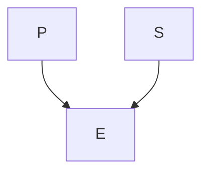
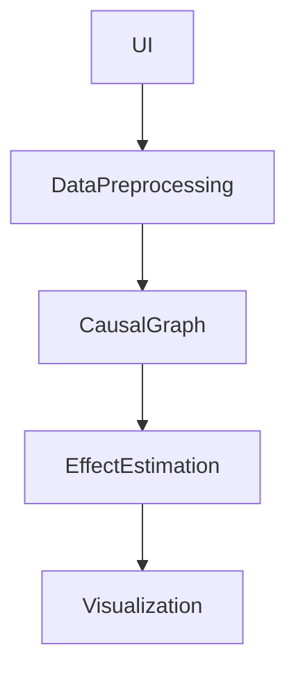

                 


# 《金融领域因果推断在宏观经济政策评估中的应用》

**关键词：**因果推断、宏观经济政策、金融领域、政策评估、数据科学

**摘要：**  
本文深入探讨了因果推断在金融领域宏观经济政策评估中的应用。通过分析因果推断的核心理论、算法原理以及实际案例，本文展示了如何利用因果推断方法解决宏观经济政策评估中的复杂问题。文章从因果关系与相关关系的区别入手，详细介绍了潜在结果框架和因果图模型，并结合差分法、合成控制法等具体方法，分析了工具变量法和机器学习在因果推断中的应用。通过系统架构设计和项目实战，本文为读者提供了从理论到实践的完整指南，帮助读者更好地理解和应用因果推断方法。

---

# 《金融领域因果推断在宏观经济政策评估中的应用》

**关键词：**因果推断、宏观经济政策、金融领域、政策评估、数据科学

**摘要：**  
本文深入探讨了因果推断在金融领域宏观经济政策评估中的应用。通过分析因果推断的核心理论、算法原理以及实际案例，本文展示了如何利用因果推断方法解决宏观经济政策评估中的复杂问题。文章从因果关系与相关关系的区别入手，详细介绍了潜在结果框架和因果图模型，并结合差分法、合成控制法等具体方法，分析了工具变量法和机器学习在因果推断中的应用。通过系统架构设计和项目实战，本文为读者提供了从理论到实践的完整指南，帮助读者更好地理解和应用因果推断方法。

---

## 第1章: 因果推断的基本概念与背景

### 1.1 因果关系与相关关系

#### 1.1.1 相关关系的定义与特点
相关关系描述变量之间的关联程度，但并不意味着因果关系。例如，冰淇淋销量与溺水事故数量可能在某些月份呈现正相关，但这并不意味着冰淇淋销量导致溺水事故。

#### 1.1.2 因果关系的定义与特点
因果关系描述一个事件（原因）导致另一个事件（结果）发生的机制。例如，降低税率可能导致企业投资增加。

#### 1.1.3 相关与因果关系的区别与联系
- 区别：相关关系是统计上的关联，因果关系是机制上的影响。
- 联系：因果关系必然伴随相关关系，但相关关系不一定存在因果关系。

### 1.2 为什么需要因果推断

#### 1.2.1 宏观经济政策评估的挑战
宏观经济政策的复杂性使得简单的统计分析难以捕捉其真实效果。例如，货币政策可能通过多种渠道影响经济增长。

#### 1.2.2 现有统计方法的局限性
传统的回归分析难以处理遗漏变量偏差和反向因果关系。例如，简单回归可能导致估计的政策效果偏误。

#### 1.2.3 因果推断的核心作用
因果推断通过识别因果关系，帮助政策制定者更准确地评估政策效果，避免错误的决策。

### 1.3 宏观经济政策评估中的因果推断

#### 1.3.1 宏观经济政策的定义与分类
- 宏观经济政策包括货币政策、财政政策、产业政策等。
- 每类政策都有其特定的目标和实施机制。

#### 1.3.2 宏观经济政策评估的目标与方法
- 目标：评估政策的实施效果。
- 方法：通过因果推断方法，识别政策变量对经济变量的因果效应。

#### 1.3.3 因果推断在政策评估中的应用价值
- 帮助政策制定者优化政策设计。
- 提供科学的政策效果评估依据。

---

## 第2章: 因果推断的核心理论与方法

### 2.1 因果图模型

#### 2.1.1 因果图的基本概念
因果图（Directed Acyclic Graph, DAG）通过有向边描述变量之间的因果关系。例如，政策变量（P）可能影响经济指标（E），同时其他变量如社会因素（S）也可能影响E。



#### 2.1.2 因果图的构建方法
- 基于领域知识和数据特征，逐步添加因果边。
- 确保图中不存在循环。

#### 2.1.3 因果图在政策评估中的应用
- 帮助识别政策变量与其他变量之间的因果关系。
- 为潜在结果框架提供结构化支持。

### 2.2 潜在结果框架

#### 2.2.1 潜在结果的定义与特点
- 潜在结果：每个单位在不同处理水平下的结果。
- 例如，对于个体i，政策P的处理水平为1或0，其潜在结果分别为$Y_i(1)$和$Y_i(0)$。

#### 2.2.2 潜在结果的估计方法
- 平均处理效应（ATE）：$\text{ATE} = E[Y_i(1)] - E[Y_i(0)]$
- 平均倾向得分（PSM）：通过匹配处理组和控制组，估计ATE。

#### 2.2.3 潜在结果框架在因果推断中的应用
- 为因果效应的估计提供理论基础。
- 支持多种因果推断方法的实现。

### 2.3 因果推断的核心方法

#### 2.3.1 随机化试验法
- 实验设计：随机分配处理组和控制组。
- 优点：无偏估计因果效应。
- 缺点：在宏观经济政策评估中难以大规模实施。

#### 2.3.2 逆概率加权法
- 原理：通过计算处理概率的逆概率，加权估计因果效应。
- 公式：$\text{ATE} = \sum \left( \frac{T_i}{\hat{p}(X_i)} \right) (Y_i - \hat{p}(X_i))$

#### 2.3.3 匹配法
- 方法：通过匹配处理组和控制组，减少混淆变量的影响。
- 实现：基于倾向得分进行一对一或一对多匹配。

---

## 第3章: 宏观经济政策评估中的因果分析

### 3.1 宏观经济政策评估的核心问题

#### 3.1.1 宏观经济政策的多变量因果关系
- 政策变量可能受多个因素影响。
- 例如，货币政策可能受央行政策目标、经济指标等多因素影响。

#### 3.1.2 宏观经济政策的时序依赖性
- 宏观经济政策的实施具有时序性。
- 例如，政策效果可能在不同时间段表现不同。

#### 3.1.3 宏观经济政策的外部性
- 政策效果可能受外部环境影响。
- 例如，全球金融危机可能影响国内政策效果。

### 3.2 宏观经济政策评估中的因果分析方法

#### 3.2.1 差分法（DID）
- 原理：通过比较处理前后的变化，估计因果效应。
- 公式：$\text{DID} = (\text{Post} - \text{Pre})_{\text{Treatment}} - (\text{Post} - \text{Pre})_{\text{Control}}$

#### 3.2.2 合成控制法
- 方法：通过构建合成控制组，估计处理组的因果效应。
- 步骤：
  1. 确定控制组。
  2. 使用合成控制组估计处理组的潜在结果。
  3. 计算因果效应。

#### 3.2.3 断点回归法
- 方法：基于断点设计，估计因果效应。
- 公式：$\text{ATE} = \sum \beta (X_i > \tau)$

---

## 第4章: 宏观经济政策评估的数学模型与算法实现

### 4.1 潜在结果框架的数学模型

#### 4.1.1 潜在结果的定义
- 对于个体i，政策变量$D_i$，其潜在结果为$Y_i(D_i)$。

#### 4.1.2 因果效应的估计
- 平均处理效应：$\text{ATE} = E[Y_i(1)] - E[Y_i(0)]$

#### 4.1.3 实现步骤
1. 收集数据。
2. 构建潜在结果模型。
3. 估计因果效应。

### 4.2 因果图的构建与实现

#### 4.2.1 因果图的构建
- 基于领域知识和数据特征，构建因果图。

#### 4.2.2 因果图的验证
- 检查因果图的合理性。
- 调整因果图以消除混淆变量。

#### 4.2.3 因果图的应用
- 支持因果效应的识别与估计。

---

## 第5章: 工具变量法与机器学习在因果推断中的应用

### 5.1 工具变量法

#### 5.1.1 工具变量的定义与特点
- 工具变量（IV）：影响处理变量，但仅通过处理变量影响结果变量。
- 例如，使用地理距离作为工具变量，估计政策效果。

#### 5.1.2 工具变量法的实现
- 两阶段回归：
  1. 第一阶段：用工具变量回归处理变量。
  2. 第二阶段：用处理变量回归结果变量。

#### 5.1.3 工具变量法的优缺点
- 优点：可以缓解遗漏变量偏差。
- 缺点：工具变量的选择可能影响估计结果。

### 5.2 机器学习在因果推断中的应用

#### 5.2.1 机器学习方法
- 使用随机森林、神经网络等机器学习模型估计倾向得分。

#### 5.2.2 基于机器学习的因果推断方法
- 使用双机器学习（DML）估计因果效应。

#### 5.2.3 机器学习的优势
- 能够处理高维数据。
- 更好地估计复杂非线性关系。

---

## 第6章: 系统架构与项目实战

### 6.1 系统功能设计

#### 6.1.1 系统功能模块
- 数据采集与预处理。
- 因果图构建与验证。
- 因果效应估计与可视化。

#### 6.1.2 系统功能流程
1. 数据采集：收集宏观经济政策相关数据。
2. 数据预处理：清洗、特征工程。
3. 因果图构建：基于领域知识和数据特征。
4. 因果效应估计：选择合适的因果推断方法。
5. 结果可视化：展示因果效应及其置信区间。

### 6.2 系统架构设计

#### 6.2.1 系统架构图


#### 6.2.2 系统模块实现
- UI模块：用户交互界面。
- 数据预处理模块：数据清洗、特征工程。
- 因果图模块：因果图构建与验证。
- 因果效应估计模块：实现各种因果推断方法。
- 可视化模块：展示结果。

### 6.3 项目实战

#### 6.3.1 环境安装
- 安装Python、Pandas、Scikit-learn、Dowhy等工具。

#### 6.3.2 核心代码实现
```python
import dowhy as dh

# 初始化因果推理对象
因果推理 = dh.CausalInference(data, treatment='D', outcome='Y')

# 构建因果图
因果推理.identify_confounding_vars()

# 估计因果效应
效应估计 = 因果推理.estimate_effect(method='backdoor')

# 输出结果
print(效应估计.confidence_intervals)
```

#### 6.3.3 实验结果分析
- 通过实验结果验证因果效应估计的准确性。
- 分析不同方法的优缺点。

---

## 第7章: 总结与展望

### 7.1 总结

#### 7.1.1 核心观点回顾
- 因果推断是宏观经济政策评估的重要工具。
- 差异法、合成控制法等方法在实际应用中表现优异。

#### 7.1.2 本文的主要贡献
- 提供了因果推断在宏观经济政策评估中的系统性方法论。
- 结合实际案例，展示了因果推断方法的应用效果。

### 7.2 未来展望

#### 7.2.1 因果推断的未来发展方向
- 更多领域的应用探索。
- 新型因果推断方法的开发。

#### 7.2.2 宏观经济政策评估的未来趋势
- 多变量因果推断。
- 实时动态评估。

---

## 作者

**作者：AI天才研究院/AI Genius Institute & 禅与计算机程序设计艺术 /Zen And The Art of Computer Programming**

---

以上是《金融领域因果推断在宏观经济政策评估中的应用》的完整目录和内容概览。希望这篇技术博客文章能够帮助读者更好地理解因果推断在宏观经济政策评估中的应用，并为实际应用提供有价值的参考。

