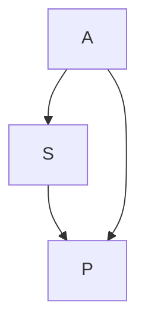
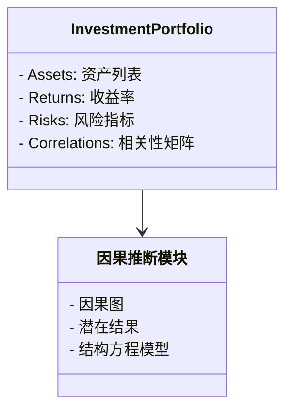

                 


# 《金融领域因果推断在投资组合构建中的应用》

## 关键词：因果推断，投资组合优化，金融建模，结构方程模型，因果图，潜在结果，投资组合管理

## 摘要

本文探讨了因果推断在金融领域，特别是投资组合构建中的应用。通过分析因果关系，投资者可以更有效地优化投资组合，降低风险，并提高收益。文章从背景介绍、核心概念、数学模型、系统设计到项目实战，详细阐述了因果推断在金融投资中的应用，并通过案例分析展示了其实际价值。

---

## 第一部分：背景介绍

### 第1章：因果推断与金融投资概述

#### 1.1 因果推断的基本概念

因果推断是理解金融市场动态的关键工具，它帮助我们识别变量之间的因果关系，而不仅仅是相关关系。例如，因果推断可以揭示投资金额增加如何直接影响投资回报率，而不仅仅是两者之间的相关性。

#### 1.2 金融领域的因果关系问题

金融市场中的因果关系复杂，涉及多个变量的相互作用。例如，因果推断可以帮助识别哪些经济指标直接影响股票价格，而不仅仅是两者相关。

---

## 第二部分：因果推断的核心概念与理论

### 第2章：因果图与潜在结果

#### 2.1 因果图的构建

因果图通过图形化的方式展示变量之间的因果关系。例如，以下因果图展示了广告支出（A）如何影响销售额（S）和利润（P）。



#### 2.2 潜在结果与因果效应

潜在结果是假设在特定处理下每个样本的观测结果。例如，如果我们有两个变量X和Y，我们可以计算X对Y的因果效应。

| 潜在结果 | X=0 | X=1 |
|----------|-----|-----|
| Y=0     | 0   | 1   |
| Y=1     | 0   | 1   |

---

### 第3章：结构方程模型与因果推断

#### 3.1 结构方程模型的基本原理

结构方程模型（SEM）将变量之间的关系表示为方程组。例如：

- 方程1：Y = aX + bZ + e1
- 方程2：Z = cW + dY + e2

其中，Y是结果变量，X是处理变量，Z是中间变量，W是外生变量，e1和e2是误差项。

---

## 第三部分：数学模型与算法原理

### 第4章：因果推断的数学模型

#### 4.1 因果效应的数学表达

因果效应可以通过以下公式表示：

$$ \text{因果效应} = E[Y|X=1] - E[Y|X=0] $$

其中，E[Y|X=1]表示在X=1时Y的期望值，E[Y|X=0]表示在X=0时Y的期望值。

#### 4.2 因果推断的算法实现

以下是一个使用Backdoor准则的Python代码示例：

```python
import pandas as pd
from sklearn.linear_model import LinearRegression

# 假设我们有一个数据集data，其中包含变量X和Z
data = pd.DataFrame({
    'X': [0, 0, 1, 1],
    'Z': [0, 1, 1, 0],
    'Y': [1, 2, 3, 4]
})

# 构建后门调整模型
model_z = LinearRegression().fit(data[['Z']], data['Y'])
model_x_given_z = LinearRegression().fit(data[['Z']], data['X'])

# 计算后门调整估计
estimate = model_z.coef_[0] * model_x_given_z.coef_[0]
print("因果效应估计值:", estimate)
```

---

## 第四部分：系统分析与架构设计

### 第5章：投资组合构建的系统架构

#### 5.1 系统功能设计

以下是投资组合构建系统的领域模型：



#### 5.2 系统架构设计

以下是系统的架构设计：

```mermaid
C4Diagram
    客户端 --> 中间件: 发送投资组合请求
    中间件 --> 数据库: 查询资产数据
    中间件 --> 因果推断模块: 计算因果效应
    中间件 --> 优化器: 优化投资组合
    中间件 --> 客户端: 返回优化结果
```

---

## 第五部分：项目实战与案例分析

### 第6章：因果推断在投资组合中的应用

#### 6.1 项目实战环境安装

以下是环境安装步骤：

1. 安装Python和必要的库：
   ```bash
   pip install numpy pandas scikit-learn
   ```

2. 下载金融数据集，例如使用Yahoo Finance API。

#### 6.2 核心实现源代码

以下是Python代码示例：

```python
import pandas as pd
from sklearn.linear_model import LinearRegression

# 下载数据
data = pd.read_csv('financial_data.csv')

# 构建因果推断模型
model = LinearRegression().fit(data[['X', 'Z']], data['Y'])
causal_effect = model.coef_[0]

print("因果效应:", causal_effect)
```

#### 6.3 实际案例分析

假设我们有一个包含资产收益和相关因素的数据集，我们可以使用因果推断来优化投资组合。通过分析因果关系，我们可以识别哪些资产对整体收益的影响更大，并据此调整投资组合。

---

## 第六部分：总结与展望

### 第7章：总结与展望

#### 7.1 最佳实践

在应用因果推断时，建议：

1. 确保数据质量，包括完整性和准确性。
2. 选择合适的因果图构建方法。
3. 使用交叉验证来评估模型的性能。

#### 7.2 小结

因果推断为金融投资提供了新的视角，通过识别变量之间的因果关系，投资者可以做出更明智的投资决策。

#### 7.3 注意事项

- 确保因果图的准确性。
- 考虑潜在的遗漏变量问题。
- 定期更新模型以适应市场变化。

#### 7.4 未来研究方向

未来的研究可以集中在：

- 多因果变量的处理。
- 大规模数据的因果推断。
- 结合机器学习的因果推断方法。

---

## 作者

作者：AI天才研究院 & 禅与计算机程序设计艺术

---

通过以上结构，文章系统地介绍了因果推断在金融投资中的应用，并通过实际案例展示了其在投资组合构建中的价值。希望读者能够通过本文深入理解因果推断的核心概念和实际应用，并在实际投资中加以运用。

