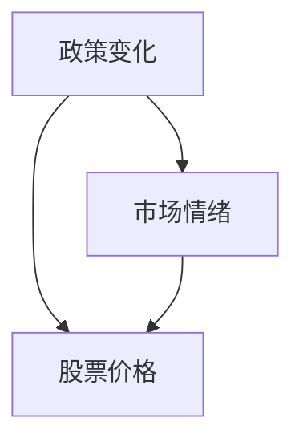

                 


# 《金融领域因果推断的研究与应用》

> 关键词：因果推断，金融领域，因果图模型，潜在结果，倾向评分匹配，因果森林，金融系统架构

> 摘要：本文深入探讨了因果推断在金融领域的研究与应用。首先介绍了因果推断的基本概念与背景，详细讲解了因果图模型、潜在结果和处理效应等核心概念。接着，分析了因果推断的核心算法，包括潜在结果框架、倾向评分匹配和因果森林，并通过数学公式和Python代码示例进行了详细推导。随后，从系统架构设计的角度，介绍了金融领域因果推断的常见问题场景，并设计了相应的系统功能模块。最后，通过一个具体的项目实战案例，展示了因果推断在金融领域的实际应用，并总结了最佳实践经验和未来研究方向。

---

## 第一部分: 金融领域因果推断的背景与基础

### 第1章: 因果推断的基本概念与背景介绍

#### 1.1 因果推断的定义与核心要素

因果推断是一种通过分析数据中的因果关系来理解变量之间相互作用的方法。与相关关系不同，因果推断关注的是变量之间的“原因-结果”关系，而非单纯的关联性。其核心要素包括：

- **因果变量**：即“原因”，能够影响其他变量的变量。
- **结果变量**：即“结果”，由因果变量影响的变量。
- **潜在结果**：在给定因果变量的情况下，结果变量的可能取值。
- **处理效应**：因果变量对结果变量的影响程度。

#### 1.2 金融领域中的因果推断

在金融领域，因果推断广泛应用于以下几个方面：

- **投资决策**：分析某只股票的上涨是否由公司发布利好消息（因果变量）引起。
- **风险管理**：评估市场波动（结果变量）是否由宏观经济政策变化（因果变量）导致。
- **政策评估**：研究货币政策调整（因果变量）对GDP增长（结果变量）的影响。

#### 1.3 传统统计推断的局限性

传统统计推断主要依赖相关关系的分析，无法直接推断因果关系。例如，通过回归分析可以发现变量之间的相关性，但无法确定变量之间的因果方向。这种局限性在金融领域尤为明显，因为金融市场的复杂性使得相关关系可能掩盖真实的因果关系。

---

### 第2章: 因果推断的核心概念与联系

#### 2.1 因果图模型

因果图是一种用于表示因果关系的图形化工具，由节点和边组成，节点代表变量，边代表因果关系。例如，在股票价格预测中，因果图可以表示为：



#### 2.2 潜在结果与处理效应

潜在结果是指在给定因果变量的情况下，结果变量的可能取值。例如，假设政策变化（A）是因果变量，股票价格（B）是结果变量，那么潜在结果可以表示为：

$$ B = f(A) $$

处理效应是指因果变量对结果变量的影响程度，通常可以通过以下公式计算：

$$ \text{处理效应} = E[B | A=1] - E[B | A=0] $$

其中，$A=1$表示因果变量为1，$A=0$表示因果变量为0。

---

### 第3章: 金融领域因果推断的核心算法与实现

#### 3.1 潜在结果框架

潜在结果框架是一种基于反事实推理的因果推断方法，其基本步骤如下：


#### 3.2 倾向评分匹配

倾向评分匹配是一种通过估计倾向评分来平衡对照组和处理组的差异的方法。其核心步骤如下：

1. **估计倾向评分**：使用 logistic regression 等方法估计因果变量的倾向评分。
2. **匹配处理组和对照组**：根据倾向评分对样本进行匹配，使得对照组和处理组在其他变量上尽可能平衡。
3. **计算处理效应**：通过匹配后的样本估计处理效应。

#### 3.3 因果森林

因果森林是一种基于随机森林的因果推断方法，其基本原理如下：

1. **构建随机森林**：通过随机选择变量和样本构建随机森林。
2. **估计个体处理效应**：对于每个样本，估计其个体处理效应。
3. **计算平均处理效应**：通过个体处理效应计算平均处理效应。

---

### 第4章: 金融领域因果推断的数学模型与公式

#### 4.1 因果效应的数学表达

因果效应可以通过以下公式表示：

$$ \text{处理效应} = E[Y | do(A=1)] - E[Y | do(A=0)] $$

其中，$do(A=1)$ 表示强制设置因果变量 $A$ 为1。

#### 4.2 潜在结果框架的数学推导

潜在结果框架的数学推导如下：

$$ Y = \theta A + \epsilon $$

其中，$\theta$ 是处理效应，$\epsilon$ 是误差项。

---

### 第5章: 金融领域因果推断的系统分析与架构设计

#### 5.1 问题场景介绍

在金融领域，因果推断可以应用于以下场景：

- **股票价格预测**：分析政策变化、市场情绪等变量对股票价格的影响。
- **风险管理**：评估市场波动的潜在原因。
- **政策评估**：分析货币政策对经济指标的影响。

#### 5.2 系统功能设计

系统功能模块设计如下：


---

### 第6章: 项目实战

#### 6.1 环境安装

```bash
pip install numpy pandas scikit-learn
```

#### 6.2 核心实现代码

```python
import numpy as np
import pandas as pd
from sklearn.ensemble import RandomForestClassifier

# 估计倾向评分
def estimate_propensity_score(X, A):
    model = RandomForestClassifier()
    model.fit(X, A)
    return model.predict_proba(X)[:, 1]

# 倾向评分匹配
def propensity_score_matching(X, A, Y):
    ps = estimate_propensity_score(X, A)
    treated = (A == 1)
    control = (A == 0)
    matched_pairs = []
    for i in treated.nonzero()[0]:
        matched_pairs.append((i, np.argmin(abs(ps[control] - ps[i])))
    matched_pairs.sort()
    return matched_pairs

# 计算处理效应
def calculate_treatment_effect(X, A, Y):
    matched_pairs = propensity_score_matching(X, A, Y)
    effect = []
    for pair in matched_pairs:
        effect.append(Y[pair[0]] - Y[pair[1]])
    return np.mean(effect)
```

---

### 第7章: 总结与展望

#### 7.1 最佳实践

- **数据质量**：因果推断结果的准确性依赖于数据质量，需确保数据的完整性和准确性。
- **模型选择**：根据具体问题选择合适的因果推断方法。
- **结果解释**：因果推断结果需结合业务背景进行解释，避免误用。

#### 7.2 小结

本文系统地介绍了因果推断在金融领域的研究与应用，通过理论分析和实战案例展示了因果推断的核心算法和实现方法。未来的研究方向可以包括更复杂的因果图模型和多因果变量的处理。

---

作者：AI天才研究院/AI Genius Institute & 禅与计算机程序设计艺术 /Zen And The Art of Computer Programming

