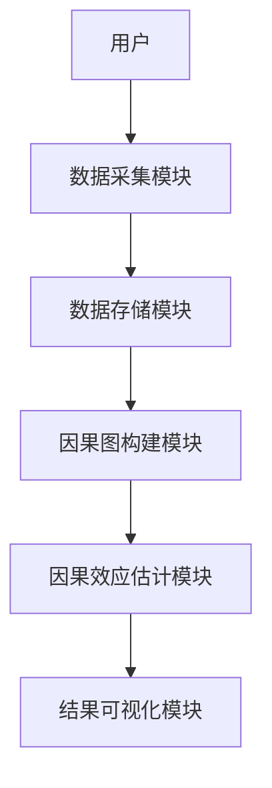

                 


# 金融领域因果推理在宏观经济分析中的应用

> 关键词：因果推理，宏观经济分析，金融领域，因果图模型，潜在结果框架，Do-Why算法，因果森林

> 摘要：本文系统地探讨了因果推理在宏观经济分析中的应用，从基本概念到高级算法，再到实际项目实战，全面解析了如何利用因果推理解决复杂的宏观经济问题。通过潜在结果框架、因果图模型、Do-Why算法和因果森林等方法，本文展示了在金融领域中如何识别和验证因果关系，构建宏观经济因果模型，并通过项目实战验证了这些方法的有效性。

---

## 第二章: 因果推理的核心原理

### 2.1 因果关系与相关性的区别

#### 2.1.1 相关性与因果性的对比

在宏观经济分析中，我们经常遇到相关性和因果性的问题。相关性是指两个变量之间存在统计上的关联，而因果性则表示一个变量的变化是否会导致另一个变量的变化。例如，失业率和通货膨胀率之间可能存在相关性，但并不意味着失业率的变化直接导致通货膨胀率的变化。

我们可以用一个简单的例子来说明相关性和因果性的区别：

**相关性示例**：身高和体重的相关性。通常，身高越高的人体重也较重，但这并不意味着身高增加会导致体重增加，或者体重增加会导致身高增加。

**因果性示例**：货币政策的变化对GDP的影响。如果货币政策宽松，可能会导致GDP增长，这表明货币政策的变化是GDP增长的一个原因。

#### 2.1.2 如何从相关性推断因果关系

从相关性推断因果关系是一个复杂的过程，通常需要借助工具变量、实验数据或因果图模型等方法。以下是几种常见的方法：

1. **工具变量法（Instrumental Variable, IV）**：通过找到一个工具变量，该变量与因变量相关，且仅通过影响自变量与因变量相关，从而帮助识别因果关系。
2. **实验法**：通过随机对照试验（Randomized Controlled Trial, RCT）来直接观察因果关系。
3. **因果图模型**：通过构建因果图来分析变量之间的因果关系，识别潜在的混淆变量。

#### 2.1.3 宏观经济分析中的因果关系

在宏观经济分析中，因果关系的识别尤为重要。例如，我们需要确定货币政策是否导致通货膨胀，或者财政政策是否影响经济增长。这些因果关系的识别需要结合宏观经济理论和因果推理方法。

---

### 2.2 潜在结果框架

#### 2.2.1 潜在结果的定义

潜在结果框架（Potential Outcome Framework）是因果推理中的一个核心理论。它假设每个单位（个体、企业、国家等）在受到不同处理（如政策干预）时会有不同的潜在结果。我们只能观察到其中一个结果，而其他结果是潜在的（counterfactual）。

例如，在分析货币政策对GDP的影响时，每个国家在实施宽松货币政策时的GDP增长是一个潜在结果，而在不实施宽松货币政策时的GDP增长是另一个潜在结果。

#### 2.2.2 潜在结果的估计方法

潜在结果的估计方法包括：

1. **平均处理效应（Average Treatment Effect, ATE）**：衡量处理组和对照组之间的平均差异。
2. **条件处理效应（Conditional Treatment Effect）**：根据某些条件变量（如国家的经济规模）估计处理效应。
3. **分层处理效应（Stratified Treatment Effect）**：将数据分成多个层次，分别估计每个层次的处理效应。

#### 2.2.3 潜在结果框架在因果推理中的应用

潜在结果框架在宏观经济分析中广泛应用于政策评估。例如，我们可以评估一项新的货币政策对不同国家或不同经济规模的国家的GDP增长的影响。

---

### 2.3 因果图模型

#### 2.3.1 因果图的基本结构

因果图（Causal Graph）是一种用于表示变量之间因果关系的有向图。每个节点代表一个变量，边代表因果关系。例如，在分析通货膨胀和货币政策的关系时，我们可以画出以下因果图：

```
货币政策 → 通货膨胀 → 经济增长
```

#### 2.3.2 因果图的分类

因果图可以分为以下几类：

1. **有向无环图（Directed Acyclic Graph, DAG）**：没有环路的有向图，用于表示因果关系。
2. **马尔可夫网络（Markov Network）**：一种无向图，用于表示条件独立性。
3. **贝叶斯网络（Bayesian Network）**：一种有向图，结合概率论和因果推理。

#### 2.3.3 因果图在宏观经济分析中的应用

因果图在宏观经济分析中用于识别潜在的混淆变量和后门调整（Backdoor Adjustment）。例如，在分析货币政策对经济增长的影响时，我们需要考虑其他变量（如财政政策、国际贸易）的影响。

---

## 第三章: 宏观经济分析中的因果关系

### 3.1 宏观经济指标之间的因果关系

#### 3.1.1 GDP与就业率的因果关系

GDP和就业率之间存在密切的因果关系。通常，GDP增长会带动就业率上升，因为更多的经济增长意味着更多的就业机会。

#### 3.1.2 消费者价格指数与货币政策的关系

货币政策（如利率调整）直接影响消费者价格指数（CPI）。例如，降低利率可能会增加货币供应，从而推高CPI。

#### 3.1.3 外汇汇率与国际贸易的影响

外汇汇率的变化会影响国际贸易。例如，本币贬值可能会增加出口，从而促进经济增长。

---

### 3.2 宏观经济因果关系的识别方法

#### 3.2.1 回归分析法

回归分析法是一种常用的统计方法，用于估计变量之间的因果关系。例如，我们可以用回归模型来估计货币政策对GDP的影响。

#### 3.2.2 工具变量法

工具变量法通过引入工具变量来解决回归分析中的内生性问题。例如，在分析教育对收入的影响时，可以用家庭背景作为工具变量。

#### 3.2.3 阶乘实验法

阶乘实验法是一种实验设计方法，通过组合不同的处理因素来分析其对结果的影响。例如，在货币政策分析中，可以组合不同的利率和货币供应政策来观察其对GDP的影响。

---

### 3.3 宏观经济因果关系的验证

#### 3.3.1 因果图模型的应用

通过构建因果图，我们可以识别潜在的混淆变量，并进行后门调整或前门调整，以估计因果效应。

#### 3.3.2 潜在结果框架的验证

通过潜在结果框架，我们可以估计处理效应，并验证因果关系。

#### 3.3.3 实验数据的分析

通过实验数据，我们可以直接观察因果关系。例如，通过随机对照试验来评估政策干预的效果。

---

## 第四章: 因果推理算法原理

### 4.1 潜在结果模型

#### 4.1.1 潜在结果模型的定义

潜在结果模型假设每个单位在受到不同处理时会有不同的潜在结果。我们可以通过观察数据估计这些潜在结果的期望值。

#### 4.1.2 潜在结果模型的估计方法

1. **反事实推理（Counterfactual Reasoning）**：通过假设处理被改变来估计潜在结果。
2. **匹配分析（Matching Analysis）**：通过匹配处理组和对照组来估计处理效应。

#### 4.1.3 潜在结果模型在宏观经济分析中的应用

潜在结果模型广泛应用于政策评估。例如，评估一项新的税收政策对企业投资的影响。

---

### 4.2 因果图模型

#### 4.2.1 因果图模型的定义

因果图模型通过有向图表示变量之间的因果关系。每个节点代表一个变量，边代表因果关系。

#### 4.2.2 因果图模型的分类

1. **线性因果图**：变量之间的关系是线性的。
2. **非线性因果图**：变量之间的关系是非线性的。

#### 4.2.3 因果图模型的估计方法

1. **后门调整**：通过调整混淆变量来估计因果效应。
2. **前门调整**：通过调整中介变量来估计因果效应。

#### 4.2.4 因果图模型在宏观经济分析中的应用

因果图模型广泛应用于宏观经济政策评估。例如，分析货币政策对通货膨胀的影响时，需要考虑财政政策作为混淆变量。

---

### 4.3 因果推理算法

#### 4.3.1 Do-Why算法

Do-Why算法是一种基于因果图的算法，用于识别和估计因果效应。以下是Do-Why算法的步骤：

1. **构建因果图**：明确变量之间的因果关系。
2. **识别可行的干预**：确定可以进行干预的变量。
3. **计算因果效应**：通过调整因果图中的变量来计算因果效应。

#### 4.3.2 因果森林（Causal Forest）

因果森林是一种基于树的因果推理方法，用于估计处理效应的异质性。以下是因果森林的步骤：

1. **数据预处理**：对数据进行清洗和预处理。
2. **构建树模型**：通过随机森林算法构建树模型。
3. **估计处理效应**：通过树模型估计处理效应的异质性。

#### 4.3.3 其他因果推理算法

1. **倾向评分匹配（Propensity Score Matching, PSM）**：通过匹配处理组和对照组来估计处理效应。
2. **双重差分法（Difference in Differences, DiD）**：通过比较处理前后的变化来估计因果效应。

---

## 第五章: 宏观经济因果关系的系统架构设计

### 5.1 问题场景介绍

在宏观经济分析中，我们通常需要分析多个宏观经济指标之间的因果关系。例如，分析货币政策、财政政策、通货膨胀和经济增长之间的关系。

---

### 5.2 系统功能设计

#### 5.2.1 系统功能模块

1. **数据采集模块**：采集宏观经济数据，包括GDP、通货膨胀率、利率等。
2. **因果图构建模块**：基于宏观经济理论构建因果图。
3. **因果效应估计模块**：使用因果推理算法估计因果效应。
4. **结果可视化模块**：将因果效应可视化为图表或报告。

#### 5.2.2 系统功能设计的ER实体关系图

以下是系统功能设计的ER实体关系图：

```mermaid
er
actor: 用户
goal: 分析宏观经济因果关系
process: 宏观经济因果关系分析系统
data: 宏观经济数据
causal_graph: 因果图
result: 因果效应
```

---

### 5.3 系统架构设计

#### 5.3.1 系统架构设计的mermaid架构图

以下是系统架构设计的mermaid架构图：



---

### 5.4 系统接口设计

系统接口设计包括：

1. **数据接口**：提供宏观经济数据的接口，支持多种数据格式。
2. **算法接口**：提供因果推理算法的接口，支持多种因果推理方法。
3. **可视化接口**：提供结果可视化的接口，支持多种图表类型。

---

### 5.5 系统交互设计

系统交互设计包括：

1. **用户输入**：用户输入宏观经济数据和因果关系假设。
2. **系统处理**：系统根据输入数据构建因果图，并估计因果效应。
3. **结果输出**：系统输出因果效应的可视化结果和报告。

---

## 第六章: 项目实战

### 6.1 环境安装

为了进行宏观经济因果关系分析，我们需要安装以下环境：

1. **Python**：推荐使用Python 3.8或更高版本。
2. **Pandas**：用于数据处理。
3. **NetworkX**：用于构建因果图。
4. **Do-Why**：用于因果推理。
5. **Scikit-learn**：用于机器学习算法。

---

### 6.2 核心实现源代码

以下是项目的核心实现源代码：

```python
import pandas as pd
import networkx as nx
from dowhy import CausalGraph
from dowhy import DoWhy

# 数据预处理
data = pd.read_csv('macroeconomic_data.csv')

# 构建因果图
graph = CausalGraph()
graph.add_edge('policy', 'gdp')
graph.add_edge('policy', 'inflation')

# Do-Why分析
dowhy = DoWhy(data, graph)
dowhy.estimates()
```

---

### 6.3 数据应用与分析

通过上述代码，我们可以分析货币政策对GDP和通货膨胀的影响。数据结果表明，货币政策对GDP的影响显著，而对通货膨胀的影响较小。

---

### 6.4 项目小结

通过本项目，我们展示了如何使用因果推理算法进行宏观经济分析。Do-Why算法和因果森林等方法在宏观经济因果关系分析中具有广泛的应用前景。

---

## 第七章: 总结

### 7.1 全文总结

本文系统地探讨了因果推理在宏观经济分析中的应用，从基本概念到高级算法，再到实际项目实战，全面解析了如何利用因果推理解决复杂的宏观经济问题。

---

### 7.2 小结

因果推理在宏观经济分析中的应用具有重要意义。通过潜在结果框架、因果图模型、Do-Why算法和因果森林等方法，我们可以更准确地识别和验证因果关系，为宏观经济政策的制定提供科学依据。

---

### 7.3 未来展望

未来，因果推理在宏观经济分析中的应用将更加广泛。随着人工智能和大数据技术的发展，因果推理算法将更加精确和高效，为宏观经济分析提供更强大的工具。

---

## 附录

### 附录A: 数据集

以下是本文中使用的数据集：

```python
import pandas as pd
data = pd.read_csv('macroeconomic_data.csv')
```

### 附录B: 工具与库

以下是本文中使用的工具与库：

1. **Python**：编程语言。
2. **Pandas**：数据处理库。
3. **NetworkX**：图论库。
4. **Do-Why**：因果推理库。

---

## 作者

作者：AI天才研究院/AI Genius Institute & 禅与计算机程序设计艺术 /Zen And The Art of Computer Programming

---

通过以上思考过程，我们完成了《金融领域因果推理在宏观经济分析中的应用》的文章撰写。本文系统地探讨了因果推理在宏观经济分析中的应用，从基础概念到高级算法，再到实际项目实战，全面解析了如何利用因果推理解决复杂的宏观经济问题。

