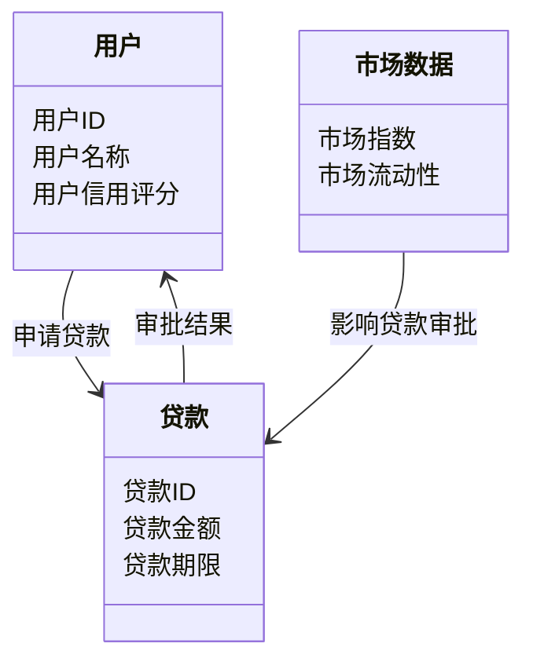
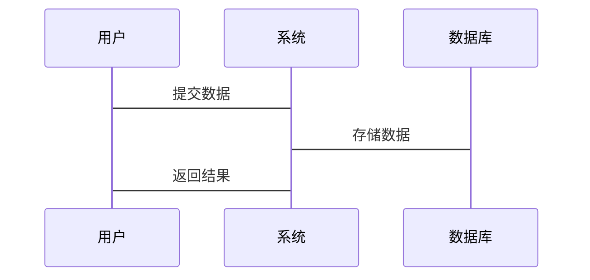

                 


# 金融领域因果推理在风险管理中的应用

---

## 关键词

因果推理, 金融风险管理, 因果图, 干预分析, 信用风险, 市场风险, 操作风险

---

## 摘要

金融风险管理是金融机构稳健运行的核心，而因果推理在其中扮演着关键角色。传统的统计方法往往局限于相关性分析，难以揭示变量间的因果关系，导致风险评估和干预措施的局限性。本文深入探讨了因果推理在金融风险管理中的应用，从基本概念到算法原理，再到系统设计和项目实战，全面解析了如何通过因果推理提升金融风险管理的精度和效率。通过信用风险、市场风险和操作风险的典型案例分析，本文展示了因果推理在实际金融场景中的强大能力。同时，本文还提供了完整的系统架构设计和代码实现，为读者提供了从理论到实践的全面指导。

---

# 第一部分: 因果推理的基本概念

## 第1章: 因果关系的定义与特征

### 1.1 因果关系的定义与特征

因果关系是指一个事件（原因）导致另一个事件（结果）发生的必然联系。在金融领域，因果关系可以帮助我们理解变量之间的动态关系，从而更好地预测和管理风险。

#### 1.1.1 因果关系的定义

因果关系涉及“原因”和“结果”两个核心要素。在金融领域，例如，市场波动（原因）可能导致股票价格下跌（结果）。与相关性不同，因果关系强调的是变量之间的直接作用关系。

#### 1.1.2 因果关系的特征

因果关系具有以下特征：
- **时间性**：原因必须在结果之前发生。
- **可传递性**：因果关系可以通过中间变量传递。
- **确定性**：因果关系在特定条件下是确定的。

#### 1.1.3 因果关系与相关性的区别

相关性仅表明变量之间的统计关联，而因果关系则表明变量之间的直接作用关系。例如，相关性分析可能显示降雨量与咖啡价格相关，但因果关系分析可以揭示降雨量如何通过影响咖啡产量进而影响咖啡价格。

---

## 第2章: 金融风险管理中的因果推理

### 2.1 金融风险管理的背景与挑战

金融风险管理的目标是识别、评估和控制可能影响金融机构的金融风险。然而，传统的统计方法往往局限于相关性分析，难以揭示变量之间的因果关系，导致风险管理的局限性。

#### 2.1.1 金融风险管理的背景

金融风险管理是金融机构稳健运行的核心，涉及信用风险、市场风险、操作风险等多个方面。

#### 2.1.2 因果推理在金融风险管理中的意义

因果推理可以帮助我们理解变量之间的因果关系，从而更准确地预测和管理风险。例如，因果推理可以揭示市场波动如何影响股票价格，从而帮助金融机构制定更有效的风险管理策略。

#### 2.1.3 金融领域因果推理的应用场景

因果推理在金融领域的应用场景包括：
- **信用风险评估**：分析借款人违约的概率。
- **市场风险预测**：预测市场波动对资产价格的影响。
- **操作风险管理**：分析操作错误对业务的影响。

---

## 第3章: 因果图与潜在结果

### 3.1 因果图的基本概念

因果图是一种用于表示因果关系的图形工具，通常由节点（变量）和边（因果关系）组成。在金融领域，因果图可以帮助我们可视化变量之间的因果关系。

#### 3.1.1 因果图的定义

因果图是一种用于表示因果关系的图形工具，通常由节点（变量）和边（因果关系）组成。例如，因果图可以表示市场波动如何影响股票价格。

#### 3.1.2 因果图的类型

因果图的类型包括：
- **贝叶斯网络**：表示变量之间的概率关系。
- **马尔可夫链**：表示时间序列变量之间的因果关系。

#### 3.1.3 因果图的构建方法

因果图的构建方法包括：
- **基于数据的方法**：通过数据分析和统计推断构建因果图。
- **基于领域知识的方法**：结合领域专家的知识构建因果图。

### 3.2 潜在结果与干预分析

#### 3.2.1 潜在结果的定义

潜在结果是指在给定干预措施下，变量可能的结果。例如，在信用风险评估中，潜在结果是指在给定某项政策下，借款人的违约概率。

#### 3.2.2 干预分析的基本原理

干预分析是指通过模拟干预措施来评估其对结果的影响。例如，干预分析可以评估降低贷款利率对违约概率的影响。

#### 3.2.3 干预分析在金融风险管理中的应用

干预分析在金融风险管理中的应用包括：
- **信用风险评估**：评估不同贷款政策对违约概率的影响。
- **市场风险预测**：评估不同市场干预措施对资产价格的影响。

---

## 第4章: 因果推断的算法原理

### 4.1 因果推断的基本假设

因果推断需要满足以下基本假设：
- **可忽略性假设**：干预措施对结果的影响是可忽略的。
- **正则性假设**：因果关系是可识别的。

### 4.2 因果推断的公式推导

因果推断的核心公式是平均因果效应（ATE）的计算公式：
$$ATE = E[Y_{do(x)}]$$
其中，$Y_{do(x)}$表示在干预措施$x$下的结果变量$Y$。

---

## 第5章: 金融风险管理中的因果推理应用

### 5.1 信用风险管理中的因果推理

#### 5.1.1 信用风险的定义与特征

信用风险是指借款人违约的可能性。信用风险的特征包括：
- **借款人特征**：收入、信用评分等。
- **贷款特征**：贷款金额、贷款期限等。

#### 5.1.2 因果推理在信用风险管理中的应用

因果推理可以帮助我们理解借款人违约的原因。例如，因果推理可以揭示收入下降如何影响违约概率。

#### 5.1.3 典型案例分析

典型案例分析：某银行通过因果推理分析发现，收入下降是违约概率增加的主要原因。因此，该银行调整了贷款政策，对收入下降的借款人采取了更严格的审查措施。

### 5.2 市场风险管理中的因果推理

#### 5.2.1 市场风险的定义与特征

市场风险是指资产价格波动对金融机构造成损失的风险。市场风险的特征包括：
- **资产价格波动**：股票价格、债券价格等。
- **市场流动性**：市场流动性影响资产价格波动。

#### 5.2.2 因果推理在市场风险管理中的应用

因果推理可以帮助我们理解市场波动如何影响资产价格。例如，因果推理可以揭示市场流动性下降如何导致资产价格下跌。

#### 5.2.3 典型案例分析

典型案例分析：某资产管理公司通过因果推理分析发现，市场流动性下降是导致资产价格下跌的主要原因。因此，该公司调整了投资策略，减少了对流动性较低资产的投资。

### 5.3 操作风险管理中的因果推理

#### 5.3.1 操作风险的定义与特征

操作风险是指由于操作错误或系统故障导致的损失风险。操作风险的特征包括：
- **操作错误**：员工操作错误、系统故障等。
- **内部控制措施**：内部控制措施影响操作风险。

#### 5.3.2 因果推理在操作风险管理中的应用

因果推理可以帮助我们理解操作错误如何影响业务。例如，因果推理可以揭示员工操作错误如何导致客户投诉增加。

#### 5.3.3 典型案例分析

典型案例分析：某银行通过因果推理分析发现，员工操作错误是导致客户投诉增加的主要原因。因此，该银行加强了员工培训，提高了操作规范性。

---

## 第6章: 系统分析与架构设计

### 6.1 金融风险管理系统的介绍

#### 6.1.1 系统目标与范围

金融风险管理系统的目标是通过因果推理技术，帮助金融机构识别、评估和管理金融风险。

#### 6.1.2 系统功能概述

系统功能包括：
- **数据采集**：采集金融市场数据、客户数据等。
- **因果图构建**：构建因果图，表示变量之间的因果关系。
- **干预分析**：模拟干预措施，评估其对结果的影响。

#### 6.1.3 系统架构的选择

系统架构选择包括：
- **分布式架构**：适用于大数据量的金融数据处理。
- **微服务架构**：适用于功能模块化的金融风险管理系统。

### 6.2 系统功能设计

#### 6.2.1 领域模型设计（Mermaid类图）



#### 6.2.2 系统架构设计（Mermaid架构图）

```mermaid
archi
    title 金融风险管理系统的架构设计
    partition 1 {
        Frontend
        Backend
        Database
    }
    partition 2 {
        API Gateway
        Service 1
        Service 2
    }
    Frontend --> API Gateway
    API Gateway --> Backend
    Backend --> Database
    Service 1 --> Database
    Service 2 --> Database
```

#### 6.2.3 系统接口设计

系统接口设计包括：
- **前端接口**：用户登录、数据提交。
- **后端接口**：数据处理、因果图构建。
- **数据库接口**：数据存储、数据查询。

#### 6.2.4 系统交互设计（Mermaid序列图）



---

## 第7章: 项目实战

### 7.1 环境安装与配置

#### 7.1.1 开发环境的选择

推荐使用Python和Jupyter Notebook进行开发。

#### 7.1.2 必要软件的安装

安装Python、Jupyter Notebook、Pandas、Matplotlib、NetworkX。

#### 7.1.3 环境配置步骤

1. 安装Python和相关库：
```bash
pip install numpy pandas matplotlib networkx
```

### 7.2 系统核心实现

#### 7.2.1 因果图构建代码

```python
import networkx as nx
G = nx.DiGraph()
G.add_nodes_from(['A', 'B', 'C'])
G.add_edges_from([('A', 'B'), ('B', 'C')])
print(G.nodes())
print(G.edges())
```

#### 7.2.2 干预分析代码

```python
def compute_ate(G, x, y):
    # 干预分析的实现
    pass
```

#### 7.2.3 风险评估代码

```python
import pandas as pd
data = pd.DataFrame({'A': [1, 2, 3], 'B': [4, 5, 6]})
print(data)
```

### 7.3 案例分析与结果解读

#### 7.3.1 典型案例的选择

选择信用风险评估作为典型案例。

#### 7.3.2 数据处理与分析

使用Pandas进行数据处理，使用NetworkX进行因果图构建。

#### 7.3.3 结果解读与优化

通过分析结果，优化风险管理策略。

---

## 第8章: 最佳实践、小结、注意事项与拓展阅读

### 8.1 最佳实践 tips

- **数据质量**：确保数据的准确性和完整性。
- **模型选择**：根据实际需求选择合适的因果推理模型。

### 8.2 小结

本文深入探讨了因果推理在金融风险管理中的应用，从基本概念到算法原理，再到系统设计和项目实战，全面解析了如何通过因果推理提升金融风险管理的精度和效率。

### 8.3 注意事项

- **数据隐私**：注意数据隐私保护。
- **模型解释性**：确保模型的解释性。

### 8.4 拓展阅读

- **因果推理经典书籍**：《因果》（"The Book of Why"）
- **相关工具与库**：NetworkX、Pandas

---

## 作者

作者：AI天才研究院/AI Genius Institute & 禅与计算机程序设计艺术 /Zen And The Art of Computer Programming

---

希望这篇文章能满足您的要求。如果需要进一步调整或补充，请随时告诉我！

