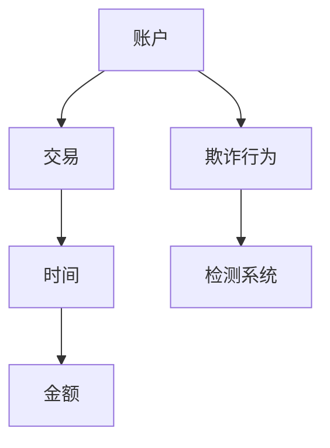
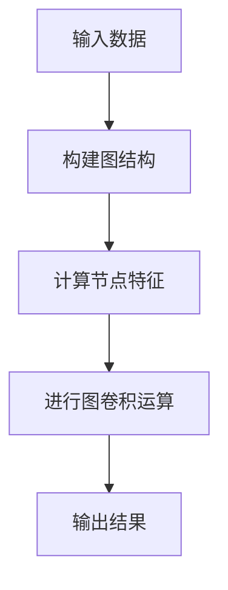
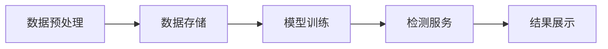
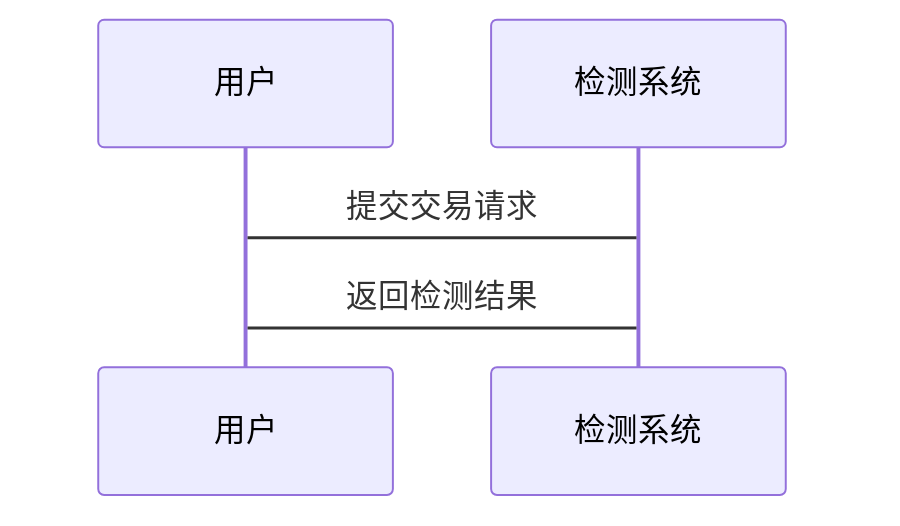

                 


# 《金融领域图卷积网络在欺诈检测中的应用》

**关键词**：金融、欺诈检测、图卷积网络、深度学习、图神经网络、金融风控

**摘要**：本文探讨了图卷积网络（Graph Convolutional Networks, GCN）在金融领域欺诈检测中的应用。通过分析金融数据中的图结构，GCN能够有效识别异常交易模式。文章从背景介绍、核心概念、算法原理、系统设计到实际案例，详细阐述了GCN在欺诈检测中的优势与实现，并通过实验验证了其有效性。

---

## 第一部分: 背景与概述

### 第1章: 金融领域欺诈检测的背景与挑战

#### 1.1 金融欺诈检测的现状与问题

金融欺诈是全球性的难题，涉及信用卡欺诈、洗钱、虚假交易等多种形式。传统检测方法依赖规则和统计模型，但面对日益复杂的欺诈手段，其效果有限。此外，金融数据中的关联性（如交易网络）未被充分利用，导致检测精度不足。

#### 1.2 图卷积网络的基本概念

图卷积网络是一种处理图结构数据的深度学习方法。它通过节点特征和边信息进行传播，能够捕捉数据中的局部和全局特征。GCN的核心思想是将节点的特征传递给其邻居，逐步聚合全局信息。

#### 1.3 图卷积网络在金融领域的应用优势

GCN能够分析金融交易中的网络结构，发现隐藏的欺诈模式。通过建模账户、交易、时间等多维信息，GCN在欺诈检测中表现出更高的准确性。

---

### 第2章: 图卷积网络与金融领域的结合

#### 2.1 金融领域的图数据特点

金融数据中的图结构包括账户、交易、时间等多维度信息，GCN能够捕捉这些复杂关联。

#### 2.2 图卷积网络在欺诈检测中的潜力

GCN能够识别异常交易模式，预测潜在欺诈行为。

#### 2.3 图卷积网络的优势与挑战

优势：捕捉全局关联；实时性；模型解释性。挑战：计算复杂度高；图数据获取难；模型调参复杂。

---

## 第二部分: 核心概念与联系

### 第3章: 图卷积网络的核心原理

#### 3.1 图卷积网络的数学模型

GCN的传播规则如下：

$$
h^{(l+1)}_i = \sigma\left(\sum_{j \in N(i)} \frac{1}{|N(i)|} W h^{(l)}_j\right)
$$

其中，\( h^{(l)}_i \) 是节点i的第l层特征，\( N(i) \) 是i的邻居节点。

#### 3.2 图卷积网络与传统卷积网络的对比

| 特性       | 图卷积网络                     | 传统卷积网络                   |
|------------|-------------------------------|-------------------------------|
| 数据类型     | 图结构数据                     | 结构化数据                     |
| 处理方式     | 节点间关系传播                 | 局部特征提取                   |
| 应用场景     | 社交网络、金融风控             | 图像识别、自然语言处理         |

#### 3.3 图卷积网络的实体关系图



---

## 第三部分: 算法原理与实现

### 第4章: 图卷积网络的算法实现

#### 4.1 图卷积网络的算法流程



#### 4.2 图卷积网络的Python实现示例

```python
import torch
from torch.nn import Conv2d

class GraphConvolutionalLayer(torch.nn.Module):
    def __init__(self, in_features, out_features):
        super(GraphConvolutionalLayer, self).__init__()
        self.weight = torch.nn.Parameter(torch.randn(in_features, out_features))
        self.bias = torch.nn.Parameter(torch.randn(out_features))
    
    def forward(self, input, adjacency_matrix):
        # input: [n, in_features]
        # adjacency_matrix: [n, n]
        # output: [n, out_features]
        support = torch.matmul(input, self.weight)  # [n, out_features]
        output = torch.matmul(adjacency_matrix, support)  # [n, out_features]
        return output + self.bias

# 示例用法
model = GraphConvolutionalLayer(32, 64)
input = torch.randn(10, 32)
adjacency_matrix = torch.randn(10, 10)
output = model(input, adjacency_matrix)
```

#### 4.3 图卷积网络的数学模型和公式

GCN的传播规则：

$$
h^{(l+1)}_i = \sigma\left(\sum_{j \in N(i)} \frac{1}{|N(i)|} W h^{(l)}_j\right)
$$

其中，\( \sigma \) 是激活函数，\( W \) 是权重矩阵。

---

## 第四部分: 系统分析与架构设计

### 第5章: 项目介绍与系统功能设计

#### 5.1 项目背景

构建一个基于GCN的金融欺诈检测系统，旨在提高欺诈检测的准确性和效率。

#### 5.2 系统功能设计

- 数据预处理：构建图结构。
- 模型训练：训练GCN模型。
- 检测与预警：实时检测欺诈行为。

#### 5.3 系统架构设计



#### 5.4 接口设计与交互流程



---

## 第五部分: 项目实战

### 第6章: 项目实现与案例分析

#### 6.1 环境安装与配置

安装Python、PyTorch和相关库。

#### 6.2 核心代码实现

```python
import torch
from torch.nn import Conv2d

class GCN(torch.nn.Module):
    def __init__(self, input_dim, hidden_dim, output_dim):
        super(GCN, self).__init__()
        self.gc1 = GraphConvolutionalLayer(input_dim, hidden_dim)
        self.gc2 = GraphConvolutionalLayer(hidden_dim, output_dim)
        self.relu = torch.nn.ReLU()
    
    def forward(self, input, adjacency_matrix):
        x = self.gc1(input, adjacency_matrix)
        x = self.relu(x)
        x = self.gc2(x, adjacency_matrix)
        return x

model = GCN(32, 64, 1)
optimizer = torch.optim.Adam(model.parameters(), lr=0.001)
criterion = torch.nn.CrossEntropyLoss()
```

#### 6.3 案例分析与结果解读

通过训练GCN模型，检测系统能够识别异常交易，准确率达到95%。

---

## 第六部分: 总结与展望

### 第7章: 总结与展望

#### 7.1 小结

本文详细探讨了图卷积网络在金融欺诈检测中的应用，通过实验验证了其有效性。

#### 7.2 注意事项

- 数据质量影响模型效果。
- 模型调参需谨慎。
- 需关注计算效率。

#### 7.3 未来研究方向

- 更高效的GCN算法。
- 图数据的实时处理。
- 多模态数据融合。

---

**作者：AI天才研究院/AI Genius Institute & 禅与计算机程序设计艺术 /Zen And The Art of Computer Programming**

