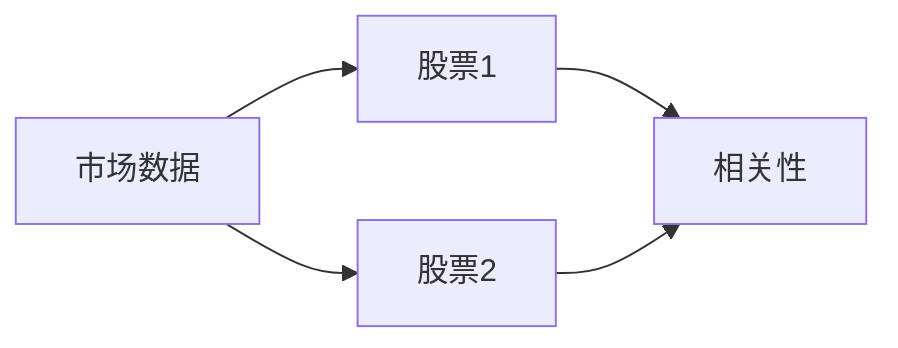
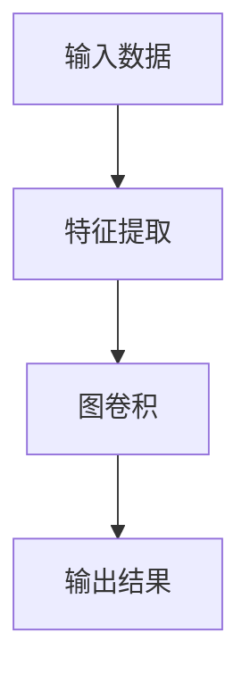
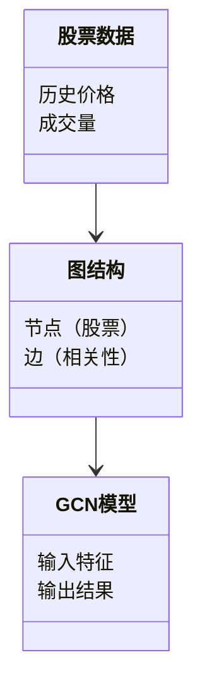
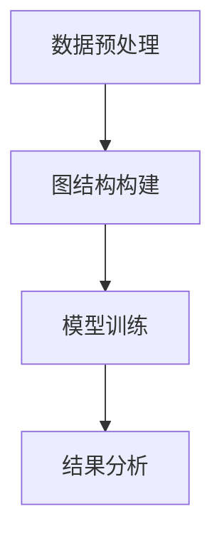

                 


# 《金融领域图卷积网络在股票相关性分析中的应用》

## 关键词：图卷积网络, 股票相关性分析, 金融时间序列数据, 深度学习, 图神经网络

## 摘要：  
本文探讨了图卷积网络（Graph Convolutional Networks, GCN）在股票相关性分析中的应用。传统的方法在处理金融数据时存在局限性，而GCN通过图结构建模，能够有效捕捉股票之间的复杂关系。本文详细介绍了GCN的核心概念、算法原理、系统架构，并通过实际案例展示了如何利用GCN进行股票相关性分析。文章还总结了GCN在金融领域的优势与挑战，并展望了未来的发展方向。

---

## 第1章: 背景介绍与问题背景

### 1.1 金融领域中的相关性分析  
股票市场是一个高度动态和复杂的系统，股票之间的相关性分析是理解市场行为的重要工具。传统的相关性分析方法依赖于统计学方法（如协方差和相关系数），但这些方法难以捕捉复杂的非线性关系和隐含模式。  

#### 1.1.1 传统统计方法的局限性  
- 传统方法假设数据服从正态分布，但在实际金融市场中，数据往往呈现非线性特征。  
- 协方差矩阵计算复杂度高，且难以处理高维数据。  
- 传统方法无法有效捕捉时间序列数据中的动态关系。  

#### 1.1.2 机器学习在金融领域的应用现状  
- 机器学习方法（如随机森林和神经网络）在金融预测中表现出色。  
- 但这些方法通常依赖于特征工程，难以直接建模复杂的金融关系。  

#### 1.1.3 图卷积网络的基本概念与优势  
- 图卷积网络是一种基于图结构的深度学习方法。  
- GCN能够捕捉数据中的局部结构信息，适用于处理金融数据中的复杂关系。  

### 1.2 股票相关性分析的必要性  
股票相关性分析在投资组合管理、风险控制和交易策略中具有重要意义。  

#### 1.2.1 相关性分析的定义与意义  
- 相关性分析是衡量两支股票价格变动相似程度的过程。  
- 高相关性的股票通常在同行业或具有相似的市场行为。  

#### 1.2.2 传统相关性分析方法的不足  
- 传统方法难以捕捉复杂的非线性关系。  
- 数据噪声和市场波动会影响分析结果的准确性。  

#### 1.2.3 图卷积网络在股票相关性分析中的应用前景  
- GCN能够建模股票之间的复杂关系，提供更准确的相关性分析结果。  

### 1.3 图卷积网络的核心概念  
图卷积网络通过图结构建模数据之间的关系，适用于处理金融数据中的复杂依赖关系。  

#### 1.3.1 图的表示与节点特征  
- 股票可以表示为图中的节点，边权重表示股票之间的相关性。  

#### 1.3.2 边权重与图结构  
- 边权重反映了股票之间的相似性或相关性。  
- 图结构可以是静态的（如行业图）或动态的（如实时市场数据）。  

#### 1.3.3 图卷积网络的基本原理  
- GCN通过在图上进行卷积操作，提取节点的局部特征。  
- 模型能够自动学习股票之间的关系，无需手动特征工程。  

### 1.4 本章小结  
本章介绍了金融领域中相关性分析的背景，探讨了传统方法的局限性，并提出了图卷积网络作为一种有效的替代方案。下一章将深入分析GCN的核心概念和原理。

---

## 第2章: 图卷积网络的核心概念与联系

### 2.1 图卷积网络的原理  
GCN通过在图上进行卷积操作，提取节点的局部特征。  

#### 2.1.1 节点表示与特征传播  
- 节点表示反映了股票的特征（如历史价格和成交量）。  
- 特征传播通过边权重将信息传递到相邻节点。  

#### 2.1.2 拉普拉斯矩阵与归一化  
- 拉普拉斯矩阵描述了图的结构信息。  
- 归一化过程确保了卷积操作的稳定性。  

#### 2.1.3 图卷积的数学表达式  
$$H_{new} = A H H^T$$  
其中，$A$是边权重矩阵，$H$是节点特征矩阵。  

### 2.2 图卷积网络与其他图模型的对比  
GCN与其他图模型的对比可以帮助理解其独特优势。  

#### 2.2.1 图模型的对比分析  
| 模型   | 优点                               | 缺点                               |
|--------|------------------------------------|------------------------------------|
| GCN    | 易于实现，适合处理稀疏图            | 对节点度数高的节点处理不够鲁棒      |
| GAT    | 能够处理非均匀边权重                | 计算复杂度较高                      |
| GNN    | 统一框架，适用于多种图结构          | 需要手动设计聚合函数              |

#### 2.2.2 GCN与GAT的对比  
- GCN基于归一化的拉普拉斯矩阵，计算简单。  
- GAT引入注意力机制，能够处理非均匀边权重。  

#### 2.2.3 GCN与传统卷积网络的对比  
- GCN适用于处理图结构数据。  
- 传统卷积网络适用于处理网格结构数据（如图像）。  

### 2.3 实体关系图与算法流程图  
#### 2.3.1 实体关系图（Mermaid图）  


#### 2.3.2 算法流程图（Mermaid图）  


### 2.4 本章小结  
本章详细解释了GCN的核心概念和原理，并通过对比分析和图形展示了其优势。下一章将介绍GCN的算法原理和实现细节。

---

## 第3章: 算法原理讲解

### 3.1 GCN的数学模型  
GCN的数学模型通过图结构建模数据之间的关系。  

#### 3.1.1 拉普拉斯矩阵  
- 拉普拉斯矩阵定义了图的结构信息。  
$$L = D - A$$  
其中，$D$是对角度矩阵，$A$是边权重矩阵。  

#### 3.1.2 归一化过程  
归一化拉普拉斯矩阵定义为：  
$$\tilde{L} = D^{-1/2} L D^{-1/2}$$  

#### 3.1.3 图卷积操作  
GCN的卷积操作定义为：  
$$H_{new} = \tilde{L} H$$  
其中，$H$是输入特征矩阵。  

### 3.2 算法流程  
GCN的训练过程包括以下几个步骤：  

#### 3.2.1 数据预处理  
- 数据清洗：处理缺失值和异常值。  
- 特征提取：提取股票的历史价格、成交量等特征。  

#### 3.2.2 构建图结构  
- 根据股票之间的相似性构建图结构。  
- 边权重可以基于相关系数或相似性分数。  

#### 3.2.3 模型训练  
- 使用GCN进行模型训练。  
- 损失函数可以采用均方误差（MSE）。  

#### 3.2.4 模型预测  
- 输入新的股票数据，进行相关性预测。  

### 3.3 算法实现  
以下是一个简单的GCN实现示例：  

```python
import torch
import torch.nn as nn
import torch.nn.functional as F

class GCN(nn.Module):
    def __init__(self, input_dim, hidden_dim, output_dim):
        super(GCN, self).__init__()
        self.W1 = nn.Parameter(torch.randn(input_dim, hidden_dim))
        self.W2 = nn.Parameter(torch.randn(hidden_dim, output_dim))

    def forward(self, x, A):
        x = torch.mm(x, A)
        x = F.relu(x)
        x = torch.mm(x, self.W1)
        x = F.relu(x)
        x = torch.mm(x, self.W2)
        return x
```

### 3.4 本章小结  
本章详细讲解了GCN的数学模型和算法实现，为后续的系统设计和项目实战奠定了基础。下一章将介绍系统的架构设计和功能模块。

---

## 第4章: 系统分析与架构设计

### 4.1 项目背景  
本项目旨在利用GCN进行股票相关性分析，帮助投资者更好地理解市场行为。  

### 4.2 系统功能设计  
系统功能模块包括：  
1. 数据预处理模块：处理股票数据。  
2. 图结构构建模块：构建股票之间的关系图。  
3. 模型训练模块：训练GCN模型。  
4. 结果分析模块：输出相关性分析结果。  

#### 4.2.1 领域模型（Mermaid类图）  


#### 4.2.2 系统架构图（Mermaid图）  


### 4.3 系统接口设计  
系统接口包括：  
1. 数据输入接口：接收股票数据。  
2. 模型接口：与GCN模型交互。  
3. 结果输出接口：返回相关性分析结果。  

### 4.4 本章小结  
本章介绍了系统的架构设计和功能模块，为项目的实现提供了指导。下一章将详细介绍项目的具体实现过程。

---

## 第5章: 项目实战

### 5.1 环境安装  
项目需要以下环境：  
- Python 3.6+  
- PyTorch 1.8+  
- numpy  
- pandas  
- matplotlib  

### 5.2 数据预处理  
数据预处理步骤包括：  
1. 数据清洗：处理缺失值和异常值。  
2. 特征提取：提取股票的历史价格和成交量。  

### 5.3 模型实现  
以下是一个简单的GCN实现示例：  

```python
import torch
import torch.nn as nn
import torch.nn.functional as F

class GCN(nn.Module):
    def __init__(self, input_dim, hidden_dim, output_dim):
        super(GCN, self).__init__()
        self.W1 = nn.Parameter(torch.randn(input_dim, hidden_dim))
        self.W2 = nn.Parameter(torch.randn(hidden_dim, output_dim))

    def forward(self, x, A):
        x = torch.mm(x, A)
        x = F.relu(x)
        x = torch.mm(x, self.W1)
        x = F.relu(x)
        x = torch.mm(x, self.W2)
        return x
```

### 5.4 模型训练与预测  
模型训练过程包括：  
1. 构建图结构。  
2. 训练GCN模型。  
3. 预测股票相关性。  

### 5.5 实际案例分析  
通过实际案例分析，验证模型的有效性。  

#### 5.5.1 数据分析  
- 数据来源：某时间段内的股票历史数据。  
- 数据特征：历史价格、成交量等。  

#### 5.5.2 模型验证  
- 验证模型的准确性和稳定性。  
- 调整模型参数，优化性能。  

### 5.6 本章小结  
本章通过实际案例展示了GCN在股票相关性分析中的应用，验证了模型的有效性。下一章将总结GCN的优势与挑战，并展望未来的发展方向。

---

## 第6章: 最佳实践与小结

### 6.1 GCN在金融领域的优势  
GCN能够捕捉股票之间的复杂关系，提供更准确的相关性分析结果。  

### 6.2 应用中的挑战  
- 数据质量：需要高质量的股票数据支持。  
- 模型调优：需要精细的超参数调整。  

### 6.3 小结与展望  
GCN在股票相关性分析中表现出巨大潜力，未来可以通过多模态数据融合和模型优化进一步提升性能。  

### 6.4 注意事项  
- 数据预处理是关键，需确保数据质量。  
- 模型调优需要结合实际场景。  

### 6.5 拓展阅读  
推荐阅读以下文献：  
- [1] 知识图谱相关论文。  
- [2] 图神经网络相关书籍。  

---

## 附录  

### 附录A: 术语表  
- 图卷积网络（GCN）：基于图结构的深度学习方法。  
- 边权重（Edge Weight）：衡量节点之间关系的权重。  

### 附录B: 参考文献  
1. 经典GCN论文。  
2. 相关金融领域的研究论文。  

---

## 作者：AI天才研究院/AI Genius Institute & 禅与计算机程序设计艺术 /Zen And The Art of Computer Programming

---

通过以上思考过程，我为您整理了完整的文章大纲和内容，您可以根据需求进一步扩展或调整。

