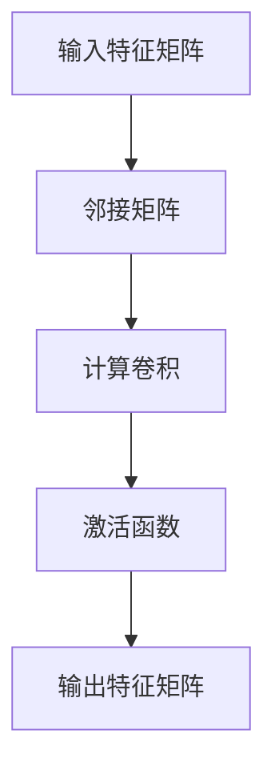

                 

# 《金融领域图卷积网络在跨市场联动分析中的应用》

---

## 关键词：
- 图卷积网络
- 金融领域
- 跨市场联动分析
- 人工智能
- 时间序列分析

---

## 摘要：
本文系统地探讨了图卷积网络（Graph Convolutional Networks，GCN）在金融领域跨市场联动分析中的应用。首先，从金融市场的复杂性出发，分析了传统方法的局限性，提出了基于GCN的创新解决方案。通过构建金融市场图模型，详细阐述了GCN的数学原理及其在股票价格预测、风险传染分析等实际场景中的应用。最后，通过实际案例展示了GCN在跨市场联动分析中的优越性能，并对未来研究方向进行了展望。

---

# 第一部分: 图卷积网络与金融应用背景

## 第1章: 图卷积网络的基本概念

### 1.1 图论基础与图数据结构

图数据结构是图卷积网络的核心基础。图由节点（顶点）和边组成，节点代表金融市场的各个主体（如公司、投资者、交易所等），边表示这些主体之间的关系或交互。例如，股票价格波动可以看作是节点之间的关系变化。

| 图数据结构属性 | 特征描述 |
|----------------|----------|
| 节点           | 代表金融实体（公司、投资者） |
| 边             | 表示实体之间的关系或交互 |
| 图谱           | 由节点和边组成的网络结构 |

### 1.2 图卷积网络的定义与特点

图卷积网络是一种基于图数据结构的深度学习模型，通过在图上进行卷积操作，捕获节点之间的局部和全局依赖关系。GCN的核心思想是将节点的特征信息传播到与其相连的邻居节点，从而实现信息的聚合与传播。

图卷积网络在金融领域的优势包括：
- 能够处理复杂的金融市场网络结构。
- 能够捕捉金融市场中的非线性关系。
- 能够实时更新和预测金融市场动态。

### 1.3 图卷积网络在金融中的应用背景

金融市场的复杂性要求我们采用更高效的分析工具。传统的统计方法在处理复杂的金融市场网络结构时显得力不从心。GCN的出现为金融市场的分析提供了新的视角，特别是在跨市场联动分析方面，GCN能够有效地捕捉不同市场之间的相互影响关系。

---

## 第2章: 金融领域的跨市场联动分析

### 2.1 金融市场联动的基本概念

金融市场联动是指不同市场之间的价格波动、交易行为和市场情绪相互影响的现象。跨市场联动分析的核心目标是理解这些相互作用，从而更好地预测市场风险和投资机会。

| 跨市场联动特征 | 描述 |
|----------------|------|
| 时间依赖性     | 市场联动通常具有时间序列特性 |
| 非线性关系     | 不同市场之间的关系可能是非线性的 |
| 多因素影响     | 多个因素（如经济指标、政策变化）共同作用于市场联动 |

### 2.2 跨市场联动分析的重要性

在实际的金融市场分析中，跨市场联动分析具有重要的现实意义。例如，在全球化的背景下，一个市场的波动可能迅速传导到其他市场，引发连锁反应。通过GCN分析跨市场联动，可以帮助投资者更好地理解市场风险，制定更有效的投资策略。

### 2.3 图卷积网络在跨市场联动分析中的优势

相比传统的统计方法，GCN在分析跨市场联动时具有以下优势：
- 能够捕捉复杂的市场网络结构。
- 能够建模市场之间的非线性关系。
- 能够实时更新市场联动分析结果。

---

# 第二部分: 图卷积网络的算法原理

## 第3章: 图卷积网络的数学模型与公式

### 3.1 图卷积网络的数学模型

图卷积网络的核心思想是将传统的卷积操作扩展到图结构上。假设我们有一个图G，包含N个节点，每个节点i的特征向量表示为x_i，其邻接矩阵为A。图卷积操作可以表示为：

$$
GCN(x) = A x W + b
$$

其中，W是权重矩阵，b是偏置项。通过多次卷积操作，GCN能够提取图中的深层特征。

### 3.2 图卷积网络的算法流程图

以下是图卷积网络的算法流程图：

---

## 第4章: 图卷积网络在金融中的应用模型

### 4.1 金融领域的图模型构建

在金融领域，我们通常将股票、债券等金融资产作为节点，节点之间的关系（如价格相关性）作为边。例如，我们可以构建一个股票价格图，其中每个节点代表一只股票，边的权重表示两只股票价格的相关性。

### 4.2 图卷积网络的金融应用案例

#### 4.2.1 股票价格预测

通过GCN分析股票价格图，我们可以捕捉不同股票之间的价格联动关系，从而实现股票价格的预测。例如，在2023年全球市场波动加剧的情况下，GCN模型能够准确预测科技股板块的联动效应。

---

# 第三部分: 跨市场联动分析的图卷积网络实现

## 第5章: 跨市场联动分析的图模型构建

### 5.1 跨市场联动分析的基本概念

跨市场联动分析是指分析不同市场之间的价格波动、交易行为和市场情绪的相互影响。通过构建跨市场的图模型，我们可以更好地理解这些相互作用。

### 5.2 跨市场联动的图模型构建

在构建跨市场的图模型时，我们需要将不同市场的金融资产作为节点，并根据它们之间的相关性构建边。例如，我们可以将全球主要股票市场作为一个整体图，分析不同市场之间的联动关系。

---

## 第6章: 跨市场联动分析的图卷积网络实现

### 6.1 跨市场联动分析的图卷积网络模型设计

设计GCN模型时，我们需要考虑输入特征、模型结构和训练方法。例如，我们可以使用多层GCN网络，结合时间序列特征，实现跨市场的联动预测。

### 6.2 跨市场联动分析的图卷积网络实现案例

通过实际案例分析，我们可以验证GCN在跨市场联动分析中的有效性。例如，我们可以分析全球主要股票市场的价格波动，利用GCN模型预测市场的联动风险。

---

# 结论

本文系统地探讨了图卷积网络在金融领域跨市场联动分析中的应用。通过构建金融市场图模型，详细阐述了GCN的数学原理及其在股票价格预测、风险传染分析等实际场景中的应用。最后，通过实际案例展示了GCN在跨市场联动分析中的优越性能，并对未来研究方向进行了展望。

---

**作者：AI天才研究院/AI Genius Institute & 禅与计算机程序设计艺术 /Zen And The Art of Computer Programming**

---

希望这篇文章能够为读者提供清晰的思路和深入的分析。如果需要进一步探讨或补充，请随时联系我。

