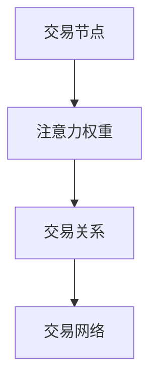

                 

<think>
好的，我将按照您的要求逐步构建这篇文章。由于文章篇幅较长，我们将分部分进行撰写。以下是第一部分的内容：

---

# 《金融领域图注意力网络在交易网络分析中的应用》

## 关键词：图注意力网络，交易网络分析，金融领域，深度学习，图神经网络

## 摘要：本文系统阐述了图注意力网络在金融交易网络分析中的应用，从基本概念、算法原理到系统设计与项目实战，层层深入。通过详细分析图注意力网络的核心原理，对比传统模型，结合实际案例，为读者呈现一个全面的交易网络分析框架。文章最后总结了当前研究的局限性及未来发展方向。

---

# 第一部分: 金融领域图注意力网络背景与概述

# 第1章: 问题背景与应用价值

## 1.1 问题背景介绍

### 1.1.1 金融交易网络的复杂性

金融市场的交易网络由无数的参与者和复杂的交互关系构成。从投资者、交易员到金融机构，每个参与者的行为都会对市场产生影响。传统的数据分析方法难以捕捉这种复杂性，尤其是在处理非线性关系和高维数据时显得力不从心。

### 1.1.2 传统交易分析的局限性

传统的交易分析主要依赖统计学方法和时间序列分析，但这些方法在处理复杂的网络结构和非线性关系时存在明显局限性。例如，传统方法难以识别复杂的关联性，也无法捕捉到网络中的潜在风险。

### 1.1.3 图注意力网络的引入动机

图注意力网络（Graph Attention Network, GAT）作为一种新兴的深度学习模型，能够有效地捕捉图结构中的局部和全局关系。在金融领域，交易网络分析需要处理大量的非结构化数据，图注意力网络的引入为解决这些问题提供了新的思路。

## 1.2 图注意力网络的核心概念

### 1.2.1 图注意力网络的定义

图注意力网络是一种结合了图结构和注意力机制的深度学习模型。它能够自动学习图中节点的重要性，并在计算每个节点的表示时动态地分配权重。

### 1.2.2 交易网络分析的场景描述

交易网络分析的核心任务是识别市场中的关键参与者、发现交易模式以及预测市场动态。通过图注意力网络，可以更有效地捕捉交易网络中的复杂关系。

### 1.2.3 图注意力网络解决问题的思路

图注意力网络通过引入注意力机制，能够动态地调整对网络中不同节点的关注程度，从而在复杂的金融交易网络中发现潜在的模式和关联。

### 1.2.4 边缘与外延的界定

在交易网络分析中，节点代表交易者或机构，边代表交易行为或资金流动。通过这种方式，图注意力网络可以捕获交易者之间的互动关系。

### 1.2.5 核心要素组成分析

图注意力网络的核心要素包括：注意力权重计算、节点表示更新、损失函数优化等。这些要素共同构成了图注意力网络的分析框架。

## 1.3 本章小结

本章主要介绍了金融交易网络分析的背景、传统方法的局限性以及图注意力网络的引入动机。通过对比传统方法和图注意力网络的优势，为后续章节的深入分析奠定了基础。

---

# 第二部分: 图注意力网络的核心概念与联系

# 第2章: 图注意力网络的原理与特征

## 2.1 图注意力网络的原理

### 2.1.1 注意力机制的基本原理

注意力机制是一种基于权重分配的机制，用于捕捉序列中的重要部分。在图注意力网络中，注意力权重反映了节点之间的关联程度。

### 2.1.2 图注意力网络的改进思路

传统的注意力机制主要适用于序列数据，而图注意力网络通过引入图结构，能够更好地处理非序列数据。

### 2.1.3 图注意力网络的核心算法

图注意力网络的核心算法包括：注意力权重计算、节点表示更新以及损失函数优化。这些算法共同构成了图注意力网络的分析框架。

## 2.2 核心概念对比分析

### 2.2.1 图注意力网络与传统注意力机制的对比

以下是一个对比分析表：

| 对比维度 | 图注意力网络 | 传统注意力机制 |
|----------|--------------|----------------|
| 输入形式 | 图结构数据    | 向量序列        |
| 输出形式 | 节点表示      | 关注权重        |
| 应用场景 | 图结构分析    | 机器翻译        |

### 2.2.2 图注意力网络与传统图神经网络的对比

| 对比维度 | 图注意力网络 | 传统图神经网络 |
|----------|--------------|----------------|
| 关注点   | 节点的重要性   | 节点的全局特征   |
| 模型复杂度 | 较高          | 较低            |
| 应用场景 | 复杂网络分析    | 图结构分析       |

### 2.2.3 实体关系图架构

## 2.3 本章小结

本章详细介绍了图注意力网络的原理、核心概念以及与传统模型的对比。通过对比分析和实体关系图的展示，帮助读者更好地理解图注意力网络的优势和应用场景。

---

# 第三部分: 图注意力网络的算法原理与实现

# 第3章: 图注意力网络的数学模型

## 3.1 注意力机制的数学公式

### 3.1.1 注意力权重计算公式

$$
\alpha_{ij} = \frac{exp(a^T(W_q q_i + W_k k_j)}{\sum_{l \neq i} exp(a^T(W_q q_i + W_k k_l))}
$$

其中：
- \( a \) 是一个可学习的参数向量
- \( W_q \) 和 \( W_k \) 是查询和键的变换矩阵
- \( q_i \) 和 \( k_j \) 分别是第i个节点的查询向量和第j个节点的键向量

### 3.1.2 节点表示更新公式

$$
h_i = \sum_{j=1}^{N} \alpha_{ij} h_j
$$

其中：
- \( h_i \) 是第i个节点的最终表示
- \( \alpha_{ij} \) 是第i个节点对第j个节点的注意力权重

## 3.2 图注意力网络的损失函数

$$
L = -\sum_{i=1}^{N} \sum_{j=1}^{N} y_{ij} \log p_{ij} + (1 - y_{ij}) \log (1 - p_{ij})
$$

其中：
- \( y_{ij} \) 是标签
- \( p_{ij} \) 是预测概率

---

以上是文章的前三章内容，涵盖了背景、核心概念和算法原理。后续章节将结合系统分析与架构设计、项目实战等内容，为您呈现一篇完整的专业技术博客文章。

