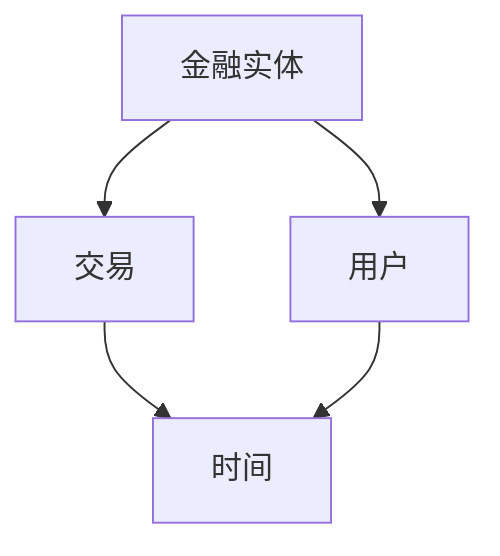
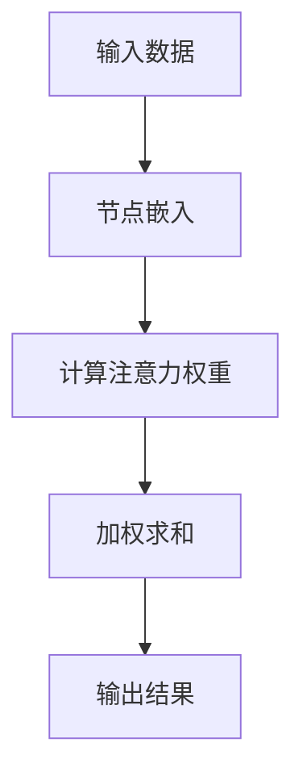
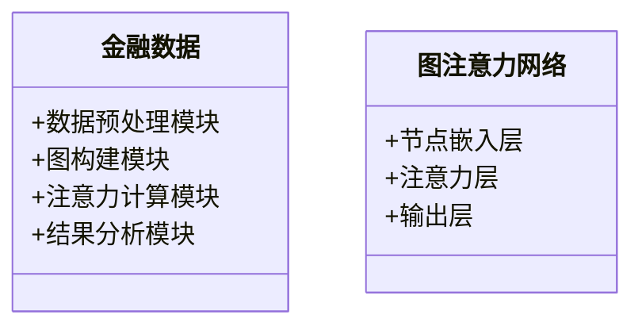
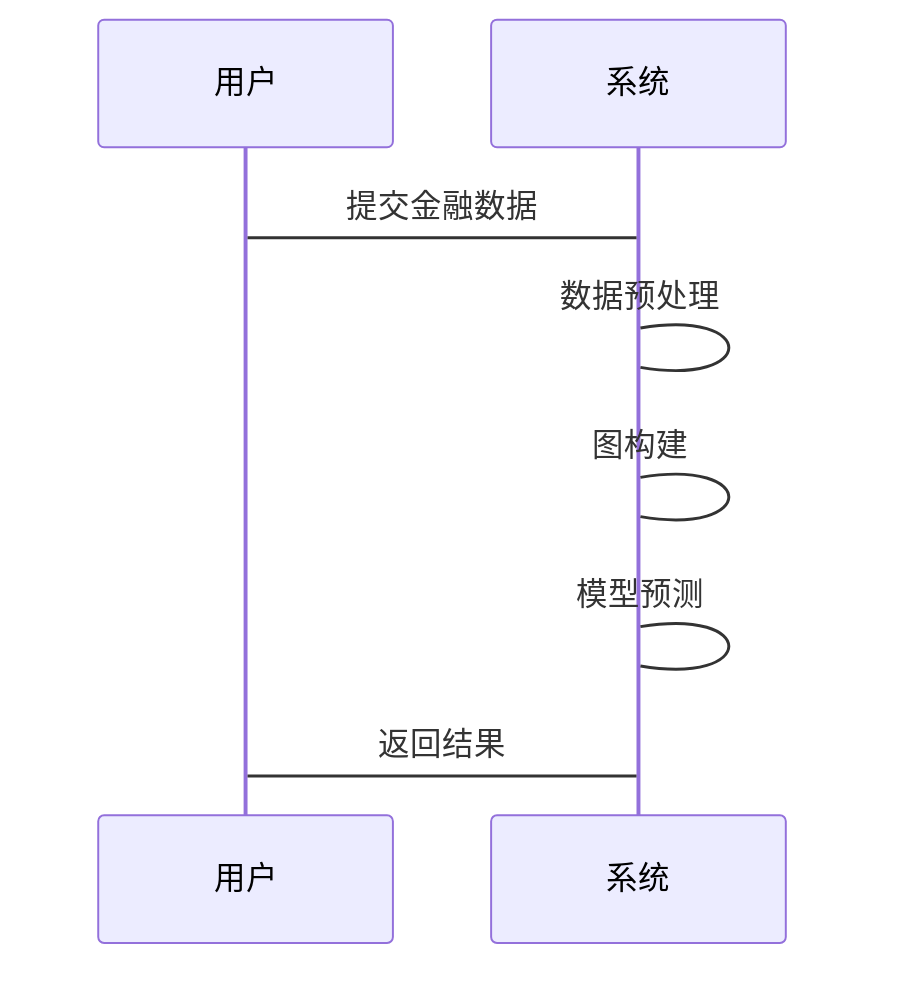

                 


# 金融领域图注意力网络的创新应用

## 关键词
- 图注意力网络
- 金融领域
- 创新应用
- 深度学习
- 金融预测
- 风险评估

## 摘要
本文探讨图注意力网络在金融领域的创新应用，重点分析其在金融预测、风险评估和知识图谱构建中的作用。通过详细讲解图注意力网络的原理、算法、系统设计和项目实战，展示其在金融数据分析中的优势，提供实际案例和代码实现。

## 目录大纲

### 第1章：金融领域与图注意力网络概述

#### 1.1 问题背景
- 金融领域的复杂性与挑战
- 传统金融模型的局限性
- 图注意力网络的引入动机

#### 1.2 问题描述
- 金融数据的多维度关联性
- 需求预测与风险评估的难点
- 知识图谱在金融分析中的应用潜力

#### 1.3 问题解决方法
- 图注意力网络的基本概念
- 图注意力网络的优势
- 图注意力网络在金融中的创新应用

#### 1.4 边界与外延
- 图注意力网络的应用范围
- 与其他技术的区别
- 未来发展的可能性

#### 1.5 核心概念结构与组成
- 图结构与节点关系
- 注意力机制的核心要素
- 金融场景中的具体应用案例

### 第2章：图注意力网络的原理与属性

#### 2.1 图注意力网络的原理
- 图结构数据的表示方法
- 注意力机制的工作原理
- 图注意力网络的计算流程

#### 2.2 核心概念对比表格
- 传统注意力机制与图注意力机制的对比

#### 2.3 ER实体关系图


### 第3章：图注意力网络的数学模型

#### 3.1 节点表示
- 节点嵌入的计算公式
$$e_i = \text{GAT}(x_i, x_j)$$

#### 3.2 注意力机制
- 注意力权重的计算
$$\alpha_{ij} = \frac{e_i}{\sum_{k} e_i}$$

#### 3.3 损失函数
- 损失函数的定义
$$L = -\sum_{i=1}^{n} y_i \log p(y_i)$$

#### 3.4 算法流程图


#### 3.5 Python实现示例
```python
import torch
import torch.nn as nn
import torch.nn.functional as F

class GATLayer(nn.Module):
    def __init__(self, in_features, out_features):
        super(GATLayer, self).__init__()
        self.w = nn.Parameter(torch.randn(in_features, out_features))
        
    def forward(self, x, adj):
        # x: [n, in_features], adj: [n, n]
        x_proj = x @ self.w
        attention = F.softmax((x_proj @ x.T), dim=-1)
        output = (x_proj @ attention).sum(dim=-1)
        return output
```

### 第4章：系统分析与架构设计方案

#### 4.1 系统架构设计
- 问题场景介绍
- 系统功能设计（领域模型）


- 系统架构图


#### 4.2 接口设计
- API接口定义
```python
class FinancialGAT:
    def __init__(self):
        self.model = GATModel()
    
    def predict(self, data):
        return self.model.predict(data)
```

- 交互序列图


### 第5章：项目实战

#### 5.1 环境安装
- 安装PyTorch、NetworkX等库

#### 5.2 核心代码实现
```python
import torch
import networkx as nx

class GATModel(nn.Module):
    def __init__(self, input_dim, hidden_dim):
        super(GATModel, self).__init__()
        self.embed = nn.Linear(input_dim, hidden_dim)
        self.attention = GATLayer(hidden_dim)
        
    def forward(self, x, adj):
        x_embed = self.embed(x)
        output = self.attention(x_embed, adj)
        return output
```

#### 5.3 实际案例分析
- 数据准备：股票价格、交易记录等
- 模型训练与评估
- 结果分析与优化

#### 5.4 项目小结
- 项目总结
- 成果展示
- 经验与教训

### 第6章：最佳实践与注意事项

#### 6.1 小结
- 图注意力网络的优势与适用场景
- 创新点与突破

#### 6.2 注意事项
- 数据质量问题
- 模型调参的重要性
- 计算资源的需求

#### 6.3 拓展阅读
- 推荐书籍与论文
- 进一步学习方向
- 未来研究热点

## 作者
作者：AI天才研究院 & 禅与计算机程序设计艺术

---

**注：由于篇幅限制，上述内容未全部展开，实际撰写时需要对每个部分进行详细阐述，确保文章的深度和可读性。**

