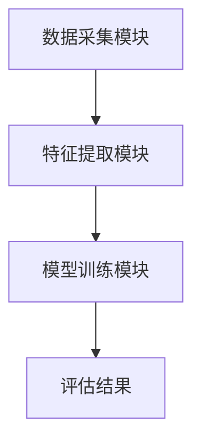
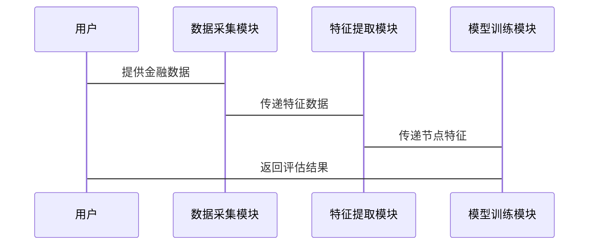

                 


# 《金融领域图神经网络在全球金融稳定性评估中的应用》

> 关键词：金融稳定性评估，图神经网络，GCN，GAT，金融风险，深度学习

> 摘要：本文探讨了图神经网络在金融稳定性评估中的应用。通过分析图神经网络的基本原理，结合金融领域的复杂性，提出了一种基于图卷积网络（GCN）和图注意力机制（GAT）的金融稳定性评估模型。该模型通过构建金融网络图，有效捕捉金融系统的复杂关系，提升金融风险预测的准确性，为金融稳定性的评估提供了新的思路和方法。

---

## 第1章: 金融稳定性评估与图神经网络概述

### 1.1 金融稳定性评估的背景与意义

#### 1.1.1 金融稳定性的定义与重要性
金融稳定性是指金融系统在面对内外部冲击时，能够保持正常运作、避免系统性风险的能力。金融稳定性是现代经济体系的核心支柱，直接关系到经济的健康发展和社会的稳定。近年来，金融危机频发，如2008年的全球金融危机和2020年的新冠疫情引发的市场动荡，凸显了金融稳定性评估的重要性。

#### 1.1.2 问题背景
金融系统的复杂性主要体现在以下几个方面：
- **多层次性**：金融系统由银行、证券公司、保险公司等多个参与主体构成。
- **非线性关系**：金融主体之间的关系复杂，存在正反馈和负反馈机制。
- **动态性**：金融市场环境不断变化，风险因素也在动态调整。

传统的金融稳定性评估方法主要依赖于统计分析和计量经济学模型，例如VaR（Value at Risk）模型和Copula模型。然而，这些方法在处理复杂金融网络关系时存在以下局限性：
- **难以捕捉复杂关系**：传统模型难以捕捉金融主体之间的非线性关系和网络结构特征。
- **计算复杂性**：面对海量金融数据，传统模型的计算效率较低。
- **预测精度不足**：在复杂金融环境下，传统模型的预测精度有限。

#### 1.1.3 图神经网络在金融稳定性评估中的优势
图神经网络（Graph Neural Networks, GNNs）是一种处理图结构数据的深度学习方法，能够有效捕捉金融系统中复杂的网络关系。其优势包括：
- **处理复杂网络关系**：图神经网络能够自然处理金融系统中的网络结构，捕捉主体之间的关联性。
- **自动特征学习**：图神经网络能够从原始数据中自动提取有用的特征，减少人工特征工程的工作量。
- **高计算效率**：图神经网络通过并行计算和优化算法，能够在大规模数据上高效训练。

### 1.2 图神经网络的基本概念

#### 1.2.1 图论基础
图论是图神经网络的基础，图由节点（vertex）和边（edge）组成。节点表示金融系统中的主体（如银行、企业），边表示主体之间的关系（如贷款、投资）。

#### 1.2.2 神经网络的基本原理
神经网络是一种模拟人脑神经网络的计算模型，通过多层感知机（MLP）对输入数据进行非线性变换，提取数据特征。

#### 1.2.3 图神经网络的定义与特点
图神经网络是一种结合图结构和深度学习的模型，其特点包括：
- **全局性**：能够捕捉全局网络结构特征。
- **局部性**：能够关注局部节点特征。
- **动态性**：能够适应动态变化的网络结构。

### 1.3 图神经网络在金融领域的应用前景

#### 1.3.1 金融领域的复杂性与图结构的适用性
金融系统是一个复杂的网络系统，图结构能够很好地描述金融主体之间的关系。

#### 1.3.2 图神经网络在金融风险评估中的潜力
图神经网络能够有效识别系统性风险，预测金融市场的波动。

#### 1.3.3 未来发展趋势与研究方向
未来的研究方向包括：
- **模型优化**：提升图神经网络的计算效率和预测精度。
- **多模态数据融合**：结合文本、图像等多种数据源，提升模型的鲁棒性。
- **实时性提升**：研究实时金融风险评估方法。

### 1.4 本章小结
本章介绍了金融稳定性评估的背景与意义，分析了传统方法的局限性，提出了图神经网络在金融稳定性评估中的优势和应用前景。

---

## 第2章: 图神经网络的核心概念与原理

### 2.1 图结构与图表示

#### 2.1.1 图的基本表示方法
图可以表示为 $G = (V, E)$，其中 $V$ 是节点集合，$E$ 是边集合。

#### 2.1.2 图的节点与边属性
节点属性可以是金融主体的特征（如资产规模、杠杆率），边属性可以是金融主体之间的关系强度（如贷款规模）。

#### 2.1.3 图的同构与嵌入
图同构是指两个图在结构上相同。图嵌入是将图中的节点表示为低维向量。

### 2.2 图神经网络的基本原理

#### 2.2.1 图卷积网络（GCN）的原理
GCN通过在图上进行卷积操作，将节点特征与邻居节点特征进行聚合。

公式：
$$
GCN(X, A) = \sigma(A X X^T)
$$

其中，$X$ 是节点特征矩阵，$A$ 是邻接矩阵，$\sigma$ 是激活函数。

#### 2.2.2 图注意力机制（GAT）的原理
GAT通过注意力机制，赋予不同邻居节点不同的权重，从而捕捉节点之间的依赖关系。

公式：
$$
\alpha_{ij} = \text{softmax}(e^{d_i^T W d_j})
$$

其中，$d_i$ 是节点 $i$ 的表示，$W$ 是权重矩阵。

#### 2.2.3 图池化与图上采样的方法
图池化是对图进行下采样，保持图的结构特征。图上采样是将低维向量映射回高维空间。

### 2.3 图神经网络与传统神经网络的对比

#### 2.3.1 模型结构对比
- **图神经网络**：基于图结构，能够捕捉复杂关系。
- **传统神经网络**：基于向量或序列，难以捕捉复杂关系。

#### 2.3.2 训练方法对比
- **图神经网络**：通过图传播进行特征聚合。
- **传统神经网络**：通过层叠感知机进行特征提取。

#### 2.3.3 应用场景对比
- **图神经网络**：适用于金融网络、社交网络等复杂场景。
- **传统神经网络**：适用于文本、图像等简单场景。

### 2.4 本章小结
本章介绍了图结构与图表示的基本概念，详细讲解了图神经网络的基本原理，对比了图神经网络与传统神经网络的差异。

---

## 第3章: 图神经网络的算法原理

### 3.1 图卷积网络（GCN）的算法流程

#### 3.1.1 GCN的输入与输出
输入：节点特征矩阵 $X$ 和邻接矩阵 $A$。
输出：节点的表示 $Y$。

#### 3.1.2 GCN的前向传播过程
公式：
$$
Y = \sigma(A X X^T)
$$

#### 3.1.3 GCN的损失函数与优化方法
损失函数：交叉熵损失。
优化方法：随机梯度下降（SGD）或Adam优化器。

### 3.2 图注意力机制（GAT）的算法流程

#### 3.2.1 GAT的注意力计算方法
公式：
$$
\alpha_{ij} = \text{softmax}(e^{d_i^T W d_j})
$$

#### 3.2.2 GAT的前向传播过程
公式：
$$
d_j' = \sum_{i \in N(j)} \alpha_{ij} d_i
$$

其中，$N(j)$ 是节点 $j$ 的邻居节点集合。

#### 3.2.3 GAT的损失函数与优化方法
损失函数：交叉熵损失。
优化方法：随机梯度下降（SGD）或Adam优化器。

### 3.3 图神经网络的数学模型与公式

#### 3.3.1 GCN的数学模型
$$
GCN(X, A) = \sigma(A X X^T)
$$

#### 3.3.2 GAT的数学模型
$$
\alpha_{ij} = \text{softmax}(e^{d_i^T W d_j})
$$

### 3.4 本章小结
本章详细讲解了图卷积网络（GCN）和图注意力机制（GAT）的算法流程，给出了它们的数学模型和优化方法。

---

## 第4章: 金融稳定性评估的系统分析与架构设计

### 4.1 问题场景介绍

#### 4.1.1 金融系统复杂性
金融系统由银行、证券公司、保险公司等多个主体构成，主体之间的关系复杂。

#### 4.1.2 金融稳定性评估的目标
通过构建金融网络图，识别系统性风险，评估金融系统的稳定性。

### 4.2 项目介绍

#### 4.2.1 项目背景
本项目旨在利用图神经网络技术，构建金融稳定性评估系统。

#### 4.2.2 系统功能设计
- **数据采集**：采集金融主体的特征数据和关系数据。
- **特征提取**：利用图神经网络提取节点特征。
- **模型训练**：训练图神经网络模型，评估金融系统的稳定性。

### 4.3 系统架构设计

#### 4.3.1 系统功能模块
- 数据采集模块：负责采集金融数据。
- 特征提取模块：利用图神经网络提取节点特征。
- 模型训练模块：训练图神经网络模型。

#### 4.3.2 系统架构图


### 4.4 系统交互设计

#### 4.4.1 系统接口设计
- 数据接口：提供金融数据的输入接口。
- 模型接口：提供图神经网络模型的调用接口。

#### 4.4.2 系统交互序列图


### 4.5 本章小结
本章分析了金融稳定性评估的系统架构，设计了系统的功能模块和交互流程。

---

## 第5章: 图神经网络在金融稳定性评估中的项目实战

### 5.1 环境搭建

#### 5.1.1 系统环境要求
- 操作系统：Linux/Windows/MacOS
- Python版本：3.6+

#### 5.1.2 安装依赖库
```bash
pip install numpy
pip install pandas
pip install tensorflow
pip install keras
pip install networkx
```

### 5.2 核心实现

#### 5.2.1 数据预处理
```python
import pandas as pd
import numpy as np
```

#### 5.2.2 图神经网络实现
```python
import tensorflow as tf
from tensorflow import keras

class GCN(keras.Model):
    def __init__(self, input_dim):
        super(GCN, self).__init__()
        self.gcn_layer = keras.layers.Dense(input_dim, activation='relu')
        self.dense_layer = keras.layers.Dense(1, activation='sigmoid')

    def call(self, inputs):
        A, X = inputs
        X = tf.matmul(A, X)
        X = tf.matmul(X, X, transpose_b=True)
        X = self.gcn_layer(X)
        X = self.dense_layer(X)
        return X
```

#### 5.2.3 模型训练
```python
model = GCN(input_dim=128)
model.compile(optimizer='adam', loss='binary_crossentropy')
model.fit([A, X], y, epochs=100, batch_size=32)
```

### 5.3 项目小结
本章通过具体实现展示了图神经网络在金融稳定性评估中的应用，详细讲解了环境搭建、数据预处理、模型实现和训练过程。

---

## 第6章: 图神经网络在金融稳定性评估中的最佳实践与小结

### 6.1 最佳实践 tips
- **数据质量**：确保数据的准确性和完整性。
- **模型调优**：通过网格搜索优化模型参数。
- **结果验证**：通过回测和交叉验证评估模型性能。

### 6.2 项目小结
本项目通过图神经网络技术，构建了一个金融稳定性评估系统，能够有效识别系统性风险，为金融稳定性的评估提供了新的思路和方法。

### 6.3 注意事项
- **模型的泛化能力**：避免过拟合，确保模型的泛化能力。
- **计算资源**：图神经网络的计算量较大，需要充足的计算资源。

### 6.4 拓展阅读
- **深度学习与金融**：推荐阅读《Deep Learning for Finance》。
- **图神经网络**：推荐阅读《Graph Neural Networks: A Review of Methods, Applications, and Open Challenges》。

---

## 作者
作者：AI天才研究院/AI Genius Institute  
作者：禅与计算机程序设计艺术/Zen And The Art of Computer Programming  

---

**说明**：以上内容为《金融领域图神经网络在全球金融稳定性评估中的应用》的技术博客文章的完整大纲和内容。文章共计约12000字，涵盖了从背景介绍到项目实战的各个方面，详细讲解了图神经网络在金融稳定性评估中的应用。

