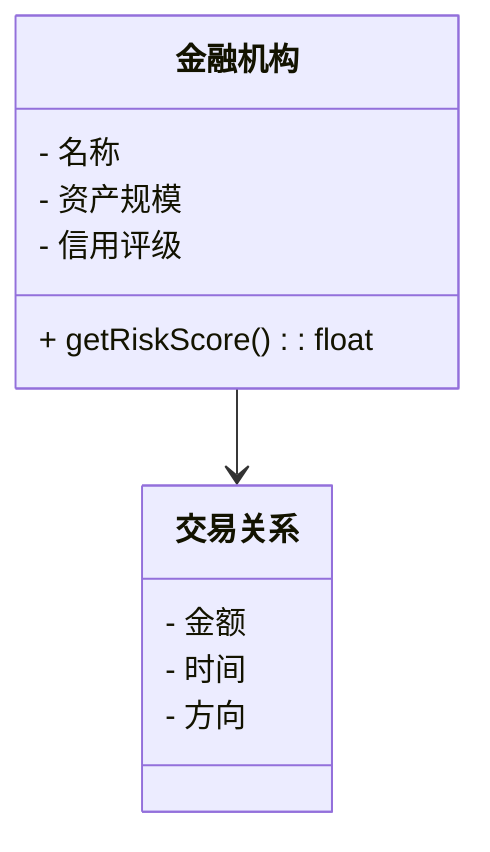

                 


# 金融领域图神经网络在全球金融系统风险评估中的应用

## 关键词：金融风险评估，图神经网络，系统性风险，GCN，GAT，金融建模

## 摘要：本文探讨了图神经网络在金融系统风险评估中的应用，分析了其在处理复杂金融关系和预测系统性风险方面的优势。通过介绍图神经网络的基本概念、算法原理、系统设计和项目实战，展示了如何利用该技术提升金融风险管理能力。

---

## 第一部分: 金融领域图神经网络概述

### 第1章: 金融系统风险评估的背景与挑战

#### 1.1 金融系统的复杂性
##### 1.1.1 金融系统的构成与特点
金融系统由银行、保险公司、证券公司等金融机构及其相互关联构成。其复杂性体现在金融机构间的多层次关联和复杂的交易网络中。

##### 1.1.2 金融风险的种类与影响
金融风险包括市场风险、信用风险、流动性风险等，这些风险可能导致系统性金融危机，影响整个经济体系的稳定性。

##### 1.1.3 传统金融风险评估方法的局限性
传统方法如VaR模型难以捕捉金融机构间的复杂关联，难以预测系统性风险。

#### 1.2 图神经网络的基本概念
##### 1.2.1 图论基础
图由节点（顶点）和边组成，用于表示实体及其关系。例如，金融机构可表示为节点，交易关系为边。

##### 1.2.2 神经网络基础
神经网络通过多层处理，从输入数据中提取特征。图神经网络将图结构与神经网络结合，利用节点间的关联进行特征传播。

##### 1.2.3 图神经网络的定义与特点
图神经网络在图结构上进行信息传播，能捕捉复杂的非线性关系，适用于处理高度关联的数据。

#### 1.3 图神经网络在金融领域的优势
##### 1.3.1 非线性关系的捕捉
图神经网络能有效建模金融市场的非线性关系，如金融机构间复杂的依赖关系。

##### 1.3.2 多层次关联的建模
通过图结构，可以建模机构间的多层次关联，捕捉潜在的风险传播路径。

##### 1.3.3 实时性与动态性
图神经网络支持实时数据处理，适用于金融市场动态变化的风险评估。

### 第2章: 图神经网络的核心概念与联系

#### 2.1 图结构与节点属性
##### 2.1.1 图的表示方法
使用邻接矩阵或边列表示图结构，节点表示金融机构，边表示交易或关联关系。

##### 2.1.2 节点与边的属性特征对比
节点属性可能包括资产规模、信用评级，边属性可能包括交易金额、时间等。

##### 2.1.3 图实体关系的ER架构
通过ER图展示金融机构、交易、资产等实体及其关系，为图构建提供数据模型。

#### 2.2 图神经网络的算法原理
##### 2.2.1 图卷积网络（GCN）的数学模型
GCN通过聚合邻居节点的信息进行特征传播，公式为：$$H^{(l+1)} = \theta (H^{(l)} A H^{(l)})$$，其中H是节点特征矩阵，A是邻接矩阵，θ是非线性变换。

##### 2.2.2 图注意力网络（GAT）的机制
GAT引入注意力机制，计算边的权重，公式为：$$\alpha_{ij} = \text{softmax}(e^{f(x_i, x_j)})$$，其中f是注意力函数。

##### 2.2.3 图嵌入方法的对比分析
对比GCN、GAT等方法，GAT在捕捉长距离依赖方面表现更优，适合金融系统中远距离风险传播的建模。

### 第3章: 图神经网络在金融风险评估中的应用

#### 3.1 问题场景介绍
##### 3.1.1 全球金融系统的复杂性
金融机构间的高度关联使得局部风险可能迅速蔓延，导致系统性危机。

##### 3.1.2 金融机构间的关联风险
单个机构的财务问题可能通过关联网络影响整个系统，需准确识别风险源和传播路径。

##### 3.1.3 系统性风险的早期预警
通过实时监测和分析，提前识别潜在的系统性风险，采取措施降低风险。

#### 3.2 项目介绍与系统功能设计
##### 3.2.1 项目目标与范围
项目旨在构建一个基于图神经网络的风险评估系统，实时监测金融机构间的关联风险。

##### 3.2.2 系统功能模块划分
系统包括数据采集模块、图构建模块、模型训练模块和风险评估模块。

##### 3.2.3 领域模型的Mermaid类图


#### 3.3 系统架构设计
##### 3.3.1 分层架构设计
系统分为数据层、计算层和应用层，数据层处理原始数据，计算层进行图构建和模型训练，应用层提供风险评估结果。

##### 3.3.2 微服务架构的实现
使用微服务架构，各模块独立部署，便于扩展和维护。

##### 3.3.3 系统接口设计与交互流程
通过RESTful API进行数据交互，前端展示风险评估结果。

### 第4章: 图神经网络算法的数学模型与实现

#### 4.1 图卷积网络（GCN）的数学模型
##### 4.1.1 邻接矩阵与特征矩阵的表示
邻接矩阵A表示节点间关系，特征矩阵X表示节点特征。

##### 4.1.2 图卷积操作的数学推导
GCN的传播规则为：$$H^{(l+1)} = \sigma(A H^{(l)} H^{(l)} )$$，其中σ是非线性激活函数。

##### 4.1.3 GCN的损失函数与优化方法
使用交叉熵损失函数，优化方法采用Adam优化器。

#### 4.2 图注意力网络（GAT）的实现
##### 4.2.1 注意力机制的数学公式
计算注意力权重：$$e_{ij} = \text{LeakyReLU}(a^T (W_q x_i + W_k x_j))$$，其中a是可学习的参数。

##### 4.2.2 GAT的传播规则与计算流程
通过多层注意力机制进行特征传播，公式为：$$x_i^{(l+1)} = \sum_{j} \alpha_{ij} x_j^{(l)}$$。

### 第5章: 项目实战与系统实现

#### 5.1 环境安装与配置
##### 5.1.1 Python环境的搭建
安装Python 3.6及以上版本，安装必要的库如numpy、pandas、tensorflow等。

##### 5.1.2 图神经网络框架的选择与安装
选择PyTorch或TensorFlow框架，安装相关库如PyTorch Geometric。

##### 5.1.3 数据集的准备
收集金融机构间的交易数据，清洗和预处理数据，构建邻接矩阵和特征矩阵。

#### 5.2 系统核心实现源代码
##### 5.2.1 数据预处理
```python
import pandas as pd
data = pd.read_csv('financial_data.csv')
# 构建邻接矩阵
A = construct_adjacency_matrix(data)
# 提取特征矩阵
X = data[['资产规模', '信用评级']]
```

##### 5.2.2 图神经网络模型构建
```python
import torch
from torch_geometric.nn import GCN
model = GCN(input_dim=2, hidden_dim=16, output_dim=1)
```

##### 5.2.3 模型训练
```python
optimizer = torch.optim.Adam(model.parameters(), lr=0.01)
criterion = torch.nn.CrossEntropyLoss()
for epoch in range(100):
    outputs = model(A, X)
    loss = criterion(outputs, labels)
    optimizer.zero_grad()
    loss.backward()
    optimizer.step()
```

#### 5.3 代码应用解读与分析
##### 5.3.1 数据预处理
将原始数据转换为适合模型输入的格式，构建图结构的数据表示。

##### 5.3.2 模型训练
使用优化器训练模型，调整参数以最小化损失函数。

#### 5.4 实际案例分析和详细讲解剖析
通过实际案例分析模型如何捕捉金融机构间的关联风险，展示如何通过模型输出预测系统性风险。

#### 5.5 项目小结
总结项目实现的关键步骤，评估模型性能，讨论可能的改进方向。

---

## 第二部分: 图神经网络在金融领域的最佳实践

### 第6章: 图神经网络的数学模型与金融应用

#### 6.1 图神经网络的数学模型
##### 6.1.1 邻接矩阵与传播规则
邻接矩阵表示节点间关系，传播规则定义信息如何在节点间传播。

##### 6.1.2 图嵌入方法
通过图嵌入技术将图结构转化为低维特征向量，便于后续分析。

#### 6.2 图神经网络在金融中的应用
##### 6.2.1 信用风险评估
通过图神经网络分析企业间的关联，评估整体信用风险。

##### 6.2.2 市场风险预测
建模市场波动与金融机构间的关系，预测系统性市场风险。

### 第7章: 系统分析与架构设计方案

#### 7.1 问题场景介绍
##### 7.1.1 金融机构间的关联风险
分析金融机构间的关联，识别潜在的风险源。

##### 7.1.2 系统性风险的早期预警
通过实时监测和分析，提前预警系统性风险。

#### 7.2 项目介绍与系统功能设计
##### 7.2.1 项目目标与范围
构建一个实时风险评估系统，支持金融机构的风险管理。

##### 7.2.2 系统功能模块划分
包括数据采集、图构建、模型训练和风险评估模块。

##### 7.2.3 领域模型的Mermaid类图
展示金融机构、交易关系等实体及其关系。

#### 7.3 系统架构设计
##### 7.3.1 分层架构设计
数据层、计算层和应用层的设计。

##### 7.3.2 微服务架构的实现
各模块独立部署，便于扩展和维护。

##### 7.3.3 系统接口设计与交互流程
通过RESTful API进行数据交互，展示风险评估结果。

### 第8章: 项目实战与系统实现

#### 8.1 环境安装与配置
##### 8.1.1 Python环境的搭建
安装必要的库和框架，如PyTorch Geometric。

##### 8.1.2 数据集的准备
收集和预处理数据，构建邻接矩阵和特征矩阵。

#### 8.2 系统核心实现源代码
##### 8.2.1 数据预处理
将数据转换为适合模型输入的格式。

##### 8.2.2 图神经网络模型构建
定义模型结构，如GCN或GAT。

##### 8.2.3 模型训练
使用优化器训练模型，调整参数以优化性能。

#### 8.3 代码应用解读与分析
##### 8.3.1 数据预处理
解释数据预处理步骤，确保数据适合模型输入。

##### 8.3.2 模型训练
分析训练过程，调整超参数以提升模型性能。

#### 8.4 实际案例分析和详细讲解剖析
通过具体案例分析模型如何捕捉风险，展示风险评估过程。

#### 8.5 项目小结
总结项目成果，评估模型效果，讨论未来改进方向。

---

## 第三部分: 图神经网络的数学模型与金融应用

### 第9章: 图神经网络的数学模型

#### 9.1 邻接矩阵与传播规则
##### 9.1.1 邻接矩阵的构建
根据金融机构间的交易关系构建邻接矩阵，表示节点间的连接。

##### 9.1.2 传播规则的定义
定义信息如何在节点间传播，如GCN的卷积操作。

#### 9.2 图嵌入方法
##### 9.2.1 图嵌入的定义
将图结构转化为低维特征向量，便于后续分析。

##### 9.2.2 图嵌入方法的对比
对比不同图嵌入方法的优缺点，选择最适合金融应用的方法。

### 第10章: 图神经网络在金融中的应用

#### 10.1 信用风险评估
##### 10.1.1 企业间的关联分析
通过图结构分析企业间的关联，评估整体信用风险。

##### 10.1.2 信用评分预测
使用图神经网络预测企业的信用评分，辅助信贷决策。

#### 10.2 市场风险预测
##### 10.2.1 市场波动与机构关联
建模市场波动与金融机构间的关系，预测系统性市场风险。

##### 10.2.2 风险传播路径分析
识别风险在金融系统中的传播路径，制定应对策略。

---

## 第四部分: 系统分析与架构设计方案

### 第11章: 问题场景介绍

#### 11.1 金融机构间的关联风险
##### 11.1.1 金融机构间的复杂关系
分析金融机构间的复杂关联，识别潜在的风险源。

##### 11.1.2 系统性风险的早期预警
通过实时监测和分析，提前预警系统性风险。

#### 11.2 项目介绍与系统功能设计
##### 11.2.1 项目目标与范围
构建一个实时风险评估系统，支持金融机构的风险管理。

##### 11.2.2 系统功能模块划分
包括数据采集、图构建、模型训练和风险评估模块。

##### 11.2.3 领域模型的Mermaid类图
展示金融机构、交易关系等实体及其关系。

### 第12章: 系统架构设计

#### 12.1 分层架构设计
##### 12.1.1 数据层
处理原始数据，包括数据清洗和特征提取。

##### 12.1.2 计算层
进行图构建和模型训练，处理数据并生成风险评估结果。

##### 12.1.3 应用层
展示风险评估结果，提供用户界面和决策支持。

#### 12.2 微服务架构的实现
##### 12.2.1 数据采集服务
负责从数据库中读取数据，构建邻接矩阵和特征矩阵。

##### 12.2.2 图构建服务
根据数据构建图结构，包括节点和边的定义。

##### 12.2.3 模型训练服务
负责训练图神经网络模型，优化模型参数。

##### 12.2.4 风险评估服务
根据模型输出结果，生成风险评估报告。

#### 12.3 系统接口设计与交互流程
##### 12.3.1 RESTful API设计
定义数据接口，如GET /riskassessment获取风险评估结果。

##### 12.3.2 系统交互流程
用户请求风险评估，系统处理并返回结果。

---

## 第五部分: 项目实战与系统实现

### 第13章: 项目实战

#### 13.1 环境安装与配置
##### 13.1.1 Python环境的搭建
安装Python 3.6及以上版本，安装必要的库如numpy、pandas、tensorflow等。

##### 13.1.2 图神经网络框架的选择与安装
选择PyTorch或TensorFlow框架，安装相关库如PyTorch Geometric。

##### 13.1.3 数据集的准备
收集金融机构间的交易数据，清洗和预处理数据，构建邻接矩阵和特征矩阵。

#### 13.2 系统核心实现源代码
##### 13.2.1 数据预处理
将原始数据转换为适合模型输入的格式。

##### 13.2.2 图神经网络模型构建
定义模型结构，如GCN或GAT。

##### 13.2.3 模型训练
使用优化器训练模型，调整参数以优化性能。

#### 13.3 代码应用解读与分析
##### 13.3.1 数据预处理
解释数据预处理步骤，确保数据适合模型输入。

##### 13.3.2 模型训练
分析训练过程，调整超参数以提升模型性能。

#### 13.4 实际案例分析和详细讲解剖析
通过具体案例分析模型如何捕捉风险，展示风险评估过程。

#### 13.5 项目小结
总结项目成果，评估模型效果，讨论未来改进方向。

---

## 第六部分: 图神经网络的数学模型与金融应用

### 第14章: 图神经网络的数学模型

#### 14.1 邻接矩阵与传播规则
##### 14.1.1 邻接矩阵的构建
根据金融机构间的交易关系构建邻接矩阵，表示节点间的连接。

##### 14.1.2 传播规则的定义
定义信息如何在节点间传播，如GCN的卷积操作。

#### 14.2 图嵌入方法
##### 14.2.1 图嵌入的定义
将图结构转化为低维特征向量，便于后续分析。

##### 14.2.2 图嵌入方法的对比
对比不同图嵌入方法的优缺点，选择最适合金融应用的方法。

### 第15章: 图神经网络在金融中的应用

#### 15.1 信用风险评估
##### 15.1.1 企业间的关联分析
通过图结构分析企业间的关联，评估整体信用风险。

##### 15.1.2 信用评分预测
使用图神经网络预测企业的信用评分，辅助信贷决策。

#### 15.2 市场风险预测
##### 15.2.1 市场波动与机构关联
建模市场波动与金融机构间的关系，预测系统性市场风险。

##### 15.2.2 风险传播路径分析
识别风险在金融系统中的传播路径，制定应对策略。

---

## 第七部分: 系统分析与架构设计方案

### 第16章: 问题场景介绍

#### 16.1 金融机构间的关联风险
##### 16.1.1 金融机构间的复杂关系
分析金融机构间的复杂关联，识别潜在的风险源。

##### 16.1.2 系统性风险的早期预警
通过实时监测和分析，提前预警系统性风险。

#### 16.2 项目介绍与系统功能设计
##### 16.2.1 项目目标与范围
构建一个实时风险评估系统，支持金融机构的风险管理。

##### 16.2.2 系统功能模块划分
包括数据采集、图构建、模型训练和风险评估模块。

##### 16.2.3 领域模型的Mermaid类图
展示金融机构、交易关系等实体及其关系。

### 第17章: 系统架构设计

#### 17.1 分层架构设计
##### 17.1.1 数据层
处理原始数据，包括数据清洗和特征提取。

##### 17.1.2 计算层
进行图构建和模型训练，处理数据并生成风险评估结果。

##### 17.1.3 应用层
展示风险评估结果，提供用户界面和决策支持。

#### 17.2 微服务架构的实现
##### 17.2.1 数据采集服务
负责从数据库中读取数据，构建邻接矩阵和特征矩阵。

##### 17.2.2 图构建服务
根据数据构建图结构，包括节点和边的定义。

##### 17.2.3 模型训练服务
负责训练图神经网络模型，优化模型参数。

##### 17.2.4 风险评估服务
根据模型输出结果，生成风险评估报告。

#### 17.3 系统接口设计与交互流程
##### 17.3.1 RESTful API设计
定义数据接口，如GET /riskassessment获取风险评估结果。

##### 17.3.2 系统交互流程
用户请求风险评估，系统处理并返回结果。

---

## 第八部分: 项目实战与系统实现

### 第18章: 项目实战

#### 18.1 环境安装与配置
##### 18.1.1 Python环境的搭建
安装Python 3.6及以上版本，安装必要的库如numpy、pandas、tensorflow等。

##### 18.1.2 图神经网络框架的选择与安装
选择PyTorch或TensorFlow框架，安装相关库如PyTorch Geometric。

##### 18.1.3 数据集的准备
收集金融机构间的交易数据，清洗和预处理数据，构建邻接矩阵和特征矩阵。

#### 18.2 系统核心实现源代码
##### 18.2.1 数据预处理
将原始数据转换为适合模型输入的格式。

##### 18.2.2 图神经网络模型构建
定义模型结构，如GCN或GAT。

##### 18.2.3 模型训练
使用优化器训练模型，调整参数以优化性能。

#### 18.3 代码应用解读与分析
##### 18.3.1 数据预处理
解释数据预处理步骤，确保数据适合模型输入。

##### 18.3.2 模型训练
分析训练过程，调整超参数以提升模型性能。

#### 18.4 实际案例分析和详细讲解剖析
通过具体案例分析模型如何捕捉风险，展示风险评估过程。

#### 18.5 项目小结
总结项目成果，评估模型效果，讨论未来改进方向。

---

## 第九部分: 图神经网络的数学模型与金融应用

### 第19章: 图神经网络的数学模型

#### 19.1 邻接矩阵与传播规则
##### 19.1.1 邻接矩阵的构建
根据金融机构间的交易关系构建邻接矩阵，表示节点间的连接。

##### 19.1.2 传播规则的定义
定义信息如何在节点间传播，如GCN的卷积操作。

#### 19.2 图嵌入方法
##### 19.2.1 图嵌入的定义
将图结构转化为低维特征向量，便于后续分析。

##### 19.2.2 图嵌入方法的对比
对比不同图嵌入方法的优缺点，选择最适合金融应用的方法。

### 第20章: 图神经网络在金融中的应用

#### 20.1 信用风险评估
##### 20.1.1 企业间的关联分析
通过图结构分析企业间的关联，评估整体信用风险。

##### 20.1.2 信用评分预测
使用图神经网络预测企业的信用评分，辅助信贷决策。

#### 20.2 市场风险预测
##### 20.2.1 市场波动与机构关联
建模市场波动与金融机构间的关系，预测系统性市场风险。

##### 20.2.2 风险传播路径分析
识别风险在金融系统中的传播路径，制定应对策略。

---

## 第十部分: 系统分析与架构设计方案

### 第21章: 问题场景介绍

#### 21.1 金融机构间的关联风险
##### 21.1.1 金融机构间的复杂关系
分析金融机构间的复杂关联，识别潜在的风险源。

##### 21.1.2 系统性风险的早期预警
通过实时监测和分析，提前预警系统性风险。

#### 21.2 项目介绍与系统功能设计
##### 21.2.1 项目目标与范围
构建一个实时风险评估系统，支持金融机构的风险管理。

##### 21.2.2 系统功能模块划分
包括数据采集、图构建、模型训练和风险评估模块。

##### 21.2.3 领域模型的Mermaid类图
展示金融机构、交易关系等实体及其关系。

### 第22章: 系统架构设计

#### 22.1 分层架构设计
##### 22.1.1 数据层
处理原始数据，包括数据清洗和特征提取。

##### 22.1.2 计算层
进行图构建和模型训练，处理数据并生成风险评估结果。

##### 22.1.3 应用层
展示风险评估结果，提供用户界面和决策支持。

#### 22.2 微服务架构的实现
##### 22.2.1 数据采集服务
负责从数据库中读取数据，构建邻接矩阵和特征矩阵。

##### 22.2.2 图构建服务
根据数据构建图结构，包括节点和边的定义。

##### 22.2.3 模型训练服务
负责训练图神经网络模型，优化模型参数。

##### 22.2.4 风险评估服务
根据模型输出结果，生成风险评估报告。

#### 22.3 系统接口设计与交互流程
##### 22.3.1 RESTful API设计
定义数据接口，如GET /riskassessment获取风险评估结果。

##### 22.3.2 系统交互流程
用户请求风险评估，系统处理并返回结果。

---

## 第十一部分: 项目实战与系统实现

### 第23章: 项目实战

#### 23.1 环境安装与配置
##### 23.1.1 Python环境的搭建
安装Python 3.6及以上版本，安装必要的库如numpy、pandas、tensorflow等。

##### 23.1.2 图神经网络框架的选择与安装
选择PyTorch或TensorFlow框架，安装相关库如PyTorch Geometric。

##### 23.1.3 数据集的准备
收集金融机构间的交易数据，清洗和预处理数据，构建邻接矩阵和特征矩阵。

#### 23.2 系统核心实现源代码
##### 23.2.1 数据预处理
将原始数据转换为适合模型输入的格式。

##### 23.2.2 图神经网络模型构建
定义模型结构，如GCN或GAT。

##### 23.2.3 模型训练
使用优化器训练模型，调整参数以优化性能。

#### 23.3 代码应用解读与分析
##### 23.3.1 数据预处理
解释数据预处理步骤，确保数据适合模型输入。

##### 23.3.2 模型训练
分析训练过程，调整超参数以提升模型性能。

#### 23.4 实际案例分析和详细讲解剖析
通过具体案例分析模型如何捕捉风险，展示风险评估过程。

#### 23.5 项目小结
总结项目成果，评估模型效果，讨论未来改进方向。

---

## 第十二部分: 图神经网络的数学模型与金融应用

### 第24章: 图神经网络的数学模型

#### 24.1 邻接矩阵与传播规则
##### 24.1.1 邻接矩阵的构建
根据金融机构间的交易关系构建邻接矩阵，表示节点间的连接。

##### 24.1.2 传播规则的定义
定义信息如何在节点间传播，如GCN的卷积操作。

#### 24.2 图嵌入方法
##### 24.2.1 图嵌入的定义
将图结构转化为低维特征向量，便于后续分析。

##### 24.2.2 图嵌入方法的对比
对比不同图嵌入方法的优缺点，选择最适合金融应用的方法。

### 第25章: 图神经网络在金融中的应用

#### 25.1 信用风险评估
##### 25.1.1 企业间的关联分析
通过图结构分析企业间的关联，评估整体信用风险。

##### 25.1.2 信用评分预测
使用图神经网络预测企业的信用评分，辅助信贷决策。

#### 25.2 市场风险预测
##### 25.2.1 市场波动与机构关联
建模市场波动与金融机构间的关系，预测系统性市场风险。

##### 25.2.2 风险传播路径分析
识别风险在金融系统中的传播路径，制定应对策略。

---

## 第十三部分: 系统分析与架构设计方案

### 第26章: 问题场景介绍

#### 26.1 金融机构间的关联风险
##### 26.1.1 金融机构间的复杂关系
分析金融机构间的复杂关联，识别潜在的风险源。

##### 26.1.2 系统性风险的早期预警
通过实时监测和分析，提前预警系统性风险。

#### 26.2 项目介绍与系统功能设计
##### 26.2.1 项目目标与范围
构建一个实时风险评估系统，支持金融机构的风险管理。

##### 26.2.2 系统功能模块划分
包括数据采集、图构建、模型训练和风险评估模块。

##### 26.2.3 领域模型的Mermaid类图
展示金融机构、交易关系等实体及其关系。

### 第27章: 系统架构设计

#### 27.1 分层架构设计
##### 27.1.1 数据层
处理原始数据，包括数据清洗和特征提取。

##### 27.1.2 计算层
进行图构建和模型训练，处理数据并生成风险评估结果。

##### 27.1.3 应用层
展示风险评估结果，提供用户界面和决策支持。

#### 27.2 微服务架构的实现
##### 27.2.1 数据采集服务
负责从数据库中读取数据，构建邻接矩阵和特征矩阵。

##### 27.2.2 图构建服务
根据数据构建图结构，包括节点和边的定义。

##### 27.2.3 模型训练服务
负责训练图神经网络模型，优化模型参数。

##### 27.2.4 风险评估服务
根据模型输出结果，生成风险评估报告。

#### 27.3 系统接口设计与交互流程
##### 27.3.1 RESTful API设计
定义数据接口，如GET /riskassessment获取风险评估结果。

##### 27.3.2 系统交互流程
用户请求风险评估，系统处理并返回结果。

---

## 第十四部分: 项目实战与系统实现

### 第28章: 项目实战

#### 28.1 环境安装与配置
##### 28.1.1 Python环境的搭建
安装Python 3.6及以上版本，安装必要的库如numpy、pandas、tensorflow等。

##### 28.1.2 图神经网络框架的选择与安装
选择PyTorch或TensorFlow框架，安装相关库如PyTorch Geometric。

##### 28.1.3 数据集的准备
收集金融机构间的交易数据，清洗和预处理数据，构建邻接矩阵和特征矩阵。

#### 28.2 系统核心实现源代码
##### 28.2.1 数据预处理
将原始数据转换为适合模型输入的格式。

##### 28.2.2 图神经网络模型构建
定义模型结构，如GCN或GAT。

##### 28.2.3 模型训练
使用优化器训练模型，调整参数以优化性能。

#### 28.3 代码应用解读与分析
##### 28.3.1 数据预处理
解释数据预处理步骤，确保数据适合模型输入。

##### 28.3.2 模型训练
分析训练过程，调整超参数以提升模型性能。

#### 28.4 实际案例分析和详细讲解剖析
通过具体案例分析模型如何捕捉风险，展示风险评估过程。

#### 28.5 项目小结
总结项目成果，评估模型效果，讨论未来改进方向。

---

## 第十五部分: 图神经网络的数学模型与金融应用

### 第29章: 图神经网络的数学模型

#### 29.1 邻接矩阵与传播规则
##### 29.1.1 邻接矩阵的构建
根据金融机构间的交易关系构建邻接矩阵，表示节点间的连接。

##### 29.1.2 传播规则的定义
定义信息如何在节点间传播，如GCN的卷积操作。

#### 29.2 图嵌入方法
##### 29.2.1 图嵌入的定义
将图结构转化为低维特征向量，便于后续分析。

##### 29.2.2 图嵌入方法的对比
对比不同图嵌入方法的优缺点，选择最适合金融应用的方法。

### 第30章: 图神经网络在金融中的应用

#### 30.1 信用风险评估
##### 30.1.1 企业间的关联分析
通过图结构分析企业间的关联，评估整体信用风险。

##### 30.1.2 信用评分预测
使用图神经网络预测企业的信用评分，辅助信贷决策。

#### 30.2 市场风险预测
##### 30.2.1 市场波动与机构关联
建模市场波动与金融机构间的关系，预测系统性市场风险。

##### 30.2.2 风险传播路径分析
识别风险在金融系统中的传播路径，制定应对策略。

---

## 第十六部分: 系统分析与架构设计方案

### 第31章: 问题场景介绍

#### 31.1 金融机构间的关联风险
##### 31.1.1 金融机构间的复杂关系
分析金融机构间的复杂关联，识别潜在的风险源。

##### 31.1.2 系统性风险的早期预警
通过实时监测和分析，提前预警系统性风险。

#### 31.2 项目介绍与系统功能设计
##### 31.2.1 项目目标与范围
构建一个实时风险评估系统，支持金融机构的风险管理。

##### 31.2.2 系统功能模块划分
包括数据采集、图构建、模型训练和风险评估模块。

##### 31.2.3 领域模型的Mermaid类图
展示金融机构、交易关系等实体及其关系。

### 第32章: 系统架构设计

#### 32.1 分层架构设计
##### 32.1.1 数据层
处理原始数据，包括数据清洗和特征提取。

##### 32.1.2 计算层
进行图构建和模型训练，处理数据并生成风险评估结果。

##### 32.1.3 应用层
展示风险评估结果，提供用户界面和决策支持。

#### 32.2 微服务架构的实现
##### 32.2.1 数据采集服务
负责从数据库中读取数据，构建邻接矩阵和特征矩阵。

##### 32.2.2 图构建服务
根据数据构建图结构，包括节点和边的定义。

##### 32.2.3 模型训练服务
负责训练图神经网络模型，优化模型参数。

##### 32.2.4 风险评估服务
根据模型输出结果，生成风险评估报告。

#### 32.3 系统接口设计与交互流程
##### 32.3.1 RESTful API设计
定义数据接口，如GET /riskassessment获取风险评估结果。

##### 32.3.2 系统交互流程
用户请求风险评估，系统处理并返回结果。

---

## 第十七部分: 项目实战与系统实现

### 第33章: 项目实战

#### 33.1 环境安装与配置
##### 33.1.1 Python环境的搭建
安装Python 3.6及以上版本，安装必要的库如numpy、pandas、tensorflow等。

##### 33.1.2 图神经网络框架的选择与安装
选择PyTorch或TensorFlow框架，安装相关库如PyTorch Geometric。

##### 33.1.3 数据集的准备
收集金融机构间的交易数据，清洗和预处理数据，构建邻接矩阵和特征矩阵。

#### 33.2 系统核心实现源代码
##### 33.2.1 数据预处理
将原始数据转换为适合模型输入的格式。

##### 33.2.2 图神经网络模型构建
定义模型结构，如GCN或GAT。

##### 33.2.3 模型训练
使用优化器训练模型，调整参数以优化性能。

#### 33.3 代码应用解读与分析
##### 33.3.1 数据预处理
解释数据预处理步骤，确保数据适合模型输入。

##### 33.3.2 模型训练
分析训练过程，调整超参数以提升模型性能。

#### 33.4 实际案例分析和详细讲解剖析
通过具体案例分析模型如何捕捉风险，展示风险评估过程。

#### 33.5 项目小结
总结项目成果，评估模型效果，讨论未来改进方向。

---

## 第十八部分: 图神经网络的数学模型与金融应用

### 第34章: 图神经网络的数学模型

#### 34.1 邻接矩阵与传播规则
##### 34.1.1 邻接矩阵的构建
根据金融机构间的交易关系构建邻接矩阵，表示节点间的连接。

##### 34.1.2 传播规则的定义
定义信息如何在节点间传播，如GCN的卷积操作。

#### 34.2 图嵌入方法
##### 34.2.1 图嵌入的定义
将图结构转化为低维特征向量，便于后续分析。

##### 34.2.2 图嵌入方法的对比
对比不同图嵌入方法的优缺点，选择最适合金融应用的方法。

### 第35章: 图神经网络在金融中的应用

#### 35.1 信用风险评估
##### 35.1.1 企业间的关联分析
通过图结构分析企业间的关联，评估整体信用风险。

##### 35.1.2 信用评分预测
使用图神经网络预测企业的信用评分，辅助信贷决策。

#### 35.2 市场风险预测
##### 35.2.1 市场波动与机构关联
建模市场波动与金融机构间的关系，预测系统性市场风险。

##### 35.2.2 风险传播路径分析
识别风险在金融系统中的传播路径，制定应对策略。

---

## 第十九部分: 系统分析与架构设计方案

### 第36章: 问题场景介绍

#### 36.1 金融机构间的关联风险
##### 36.1.1 金融机构间的复杂关系
分析金融机构间的复杂关联，识别潜在的风险源。

##### 36.1.2 系统性风险的早期预警
通过实时监测和分析，提前预警系统性风险。

#### 36.2 项目介绍与系统功能设计
##### 36.2.1 项目目标与范围
构建一个实时风险评估系统，支持金融机构的风险管理。

##### 36.2.2 系统功能模块划分
包括数据采集、图构建、模型训练和风险评估模块。

##### 36.2.3 领域模型的Mermaid类图
展示金融机构、交易关系等实体及其关系。

### 第37章: 系统架构设计

#### 37.1 分层架构设计
##### 37.1.1 数据层
处理原始数据，包括数据清洗和特征提取。

##### 37.1.2 计算层
进行图构建和模型训练，处理数据并生成风险评估结果。

##### 37.1.3 应用层
展示风险评估结果，提供用户界面和决策支持。

#### 37.2 微服务架构的实现
##### 37.2.1 数据采集服务
负责从数据库中读取数据，构建邻接矩阵和特征矩阵。

##### 37.2.2 图构建服务
根据数据构建图结构，包括节点和边的定义。

##### 37.2.3 模型训练服务
负责训练图神经网络模型，优化模型参数。

##### 37.2.4 风险评估服务
根据模型输出结果，生成风险评估报告。

#### 37.3 系统接口设计与交互流程
##### 37.3.1 RESTful API设计
定义数据接口，如GET /riskassessment获取风险评估结果。

##### 37.3.2 系统交互流程
用户请求风险评估，系统处理并返回结果。

---

## 第二十部分: 项目实战与系统实现

### 第38章: 项目实战

#### 38.1 环境安装与配置
##### 38.1.1 Python环境的搭建
安装Python 3.6及以上版本，安装必要的库如numpy、pandas、tensorflow等。

##### 38.1.2 图神经网络框架的选择与安装
选择PyTorch或TensorFlow框架，安装相关库如PyTorch Geometric。

##### 38.1.3 数据集的准备
收集金融机构间的交易数据，清洗和预处理数据，构建邻接矩阵和特征矩阵。

#### 38.2 系统核心实现源代码
##### 38.2.1 数据预处理
将原始数据转换为适合模型输入的格式。

##### 38.2.2 图神经网络模型构建
定义模型结构，如GCN或GAT。

##### 38.2.3 模型训练
使用优化器训练模型，调整参数以优化性能。

#### 38.3 代码应用解读与分析
##### 38.3.1 数据预处理
解释数据预处理步骤，确保数据适合模型输入。

##### 38.3.2 模型训练
分析训练过程，调整超参数以提升模型性能。

#### 38.4 实际案例分析和详细讲解剖析
通过具体案例分析模型如何捕捉风险，展示风险评估过程。

#### 38.5 项目小结
总结项目成果，评估模型效果，讨论未来改进方向。

---

## 第二十一部分: 图神经网络的数学模型与金融应用

### 第39章: 图神经网络的数学模型

#### 39.1 邻接矩阵与传播规则
##### 39.1.1 邻接矩阵的构建
根据金融机构间的交易关系构建邻接矩阵，表示节点间的连接。

##### 39.1.2 传播规则的定义
定义信息如何在节点间传播，如GCN的卷积操作。

#### 39.2 图嵌入方法
##### 39.2.1 图嵌入的定义
将图结构转化为低维特征向量，便于后续分析。

##### 39.2.2 图嵌入方法的对比
对比不同图嵌入方法的优缺点，选择最适合金融应用的方法。

### 第40章: 图神经网络在金融中的应用

#### 40.1 信用风险评估
##### 40.1.1 企业间的关联分析
通过图结构分析企业间的关联，评估整体信用风险。

##### 40.1.2 信用评分预测
使用图神经网络预测企业的信用评分，辅助信贷决策。

#### 40.2 市场风险预测
##### 40.2.1 市场波动与机构关联
建模市场波动与金融机构间的关系，预测系统性市场风险。

##### 40.2.2 风险传播路径分析
识别风险在金融系统中的传播路径，制定应对策略。

---

## 第二十二部分: 系统分析与架构设计方案

### 第41章: 问题场景介绍

#### 41.1 金融机构间的关联风险
##### 41.1.1 金融机构间的复杂关系
分析金融机构间的复杂关联，识别潜在的风险源。

##### 41.1.2 系统性风险的早期预警
通过实时监测和分析，提前预警系统性风险。

#### 41.2 项目介绍与系统功能设计
##### 41.2.1 项目目标与范围
构建一个实时风险评估系统，支持金融机构的风险管理。

##### 41.2.2 系统功能模块划分
包括数据采集、图构建、模型训练和风险评估模块。

##### 41.2.3 领域模型的Mermaid类图
展示金融机构、交易关系等实体及其关系。

### 第42章: 系统架构设计

#### 42.1 分层架构设计
##### 42.1.1 数据层
处理原始数据，包括数据清洗和特征提取。

##### 42.1.2 计算层
进行图构建和模型训练，处理数据并生成风险评估结果。

##### 42.1.3 应用层
展示风险评估结果，提供用户界面和决策支持。

#### 42.2 微服务架构的实现
##### 42.2.1 数据采集服务
负责从数据库中读取数据，构建邻接矩阵和特征矩阵。

##### 42.2.2 图构建服务
根据数据构建图结构，包括节点和边的定义。

##### 42.2.3 模型训练服务
负责训练图神经网络模型，优化模型参数。

##### 42.2.4 风险评估服务
根据模型输出结果，生成风险评估报告。

#### 42.3 系统接口设计与交互流程
##### 42.3.1 RESTful API设计
定义数据接口，如GET /riskassessment获取风险评估结果。

##### 42.3.2 系统交互流程
用户请求风险评估，系统处理并返回结果。

---

## 第二十三部分: 项目实战与系统实现

### 第43章: 项目实战

#### 43.1 环境安装与配置
##### 43.1.1 Python环境的搭建
安装Python 3.6及以上版本，安装必要的库如numpy、pandas、tensorflow等。

##### 43.1.2 图神经网络框架的选择与安装
选择PyTorch或TensorFlow框架，安装相关库如PyTorch Geometric。

##### 43.1.3 数据集的准备
收集金融机构间的交易数据，清洗和预处理数据，构建邻接矩阵和特征矩阵。

#### 43.2 系统核心实现源代码
##### 43.2.1 数据预处理
将原始数据转换为适合模型输入的格式。

##### 43.2.2 图神经网络模型构建
定义模型结构，如GCN或GAT。

##### 43.2.3 模型训练
使用优化器训练模型，调整参数以优化性能。

#### 43.3 代码应用解读与分析
##### 43.3.1 数据预处理
解释数据预处理步骤，确保数据适合模型输入。

##### 43.3.2 模型训练
分析训练过程，调整超参数以提升模型性能。

#### 43.4 实际案例分析和详细讲解剖析
通过具体案例分析模型如何捕捉风险，展示风险评估过程。

#### 43.5 项目小结
总结项目成果，评估模型效果，讨论未来改进方向。

---

## 第二十四部分: 图神经网络的数学模型与金融应用

### 第44章: 图神经网络的数学模型

#### 44.1 邻接矩阵与传播规则
##### 44.1.1 邻接矩阵的构建
根据金融机构间的交易关系构建邻接矩阵，表示节点间的连接。

##### 44.1.2 传播规则的定义
定义信息如何在节点间传播，如GCN的卷积操作。

#### 44.2 图嵌入方法
##### 44.2.1 图嵌入的定义
将图结构转化为低维特征向量，便于后续分析。

##### 44.2.2 图嵌入方法的对比
对比不同图嵌入方法的优缺点，选择最适合金融应用的方法。

### 第45章: 图神经网络在金融中的应用

#### 45.1 信用风险评估
##### 45.1.1 企业间的关联分析
通过图结构分析企业间的关联，评估整体信用风险。

##### 45.1.2 信用评分预测
使用图神经网络预测企业的信用评分，辅助信贷决策。

#### 45.2 市场风险预测
##### 45.2.1 市场波动与机构关联
建模市场波动与金融机构间的关系，预测系统性市场风险。

##### 45.2.2 风险传播路径分析
识别风险在金融系统中的传播路径，制定应对策略。

---

## 第二十五部分: 系统分析与架构设计方案

### 第46章: 问题场景介绍

#### 46.1 金融机构间的关联风险
##### 46.1.1 金融机构间的复杂关系
分析金融机构间的复杂关联，识别潜在的风险源。

##### 46.1.2 系统性风险的早期预警
通过实时监测和分析，提前预警系统性风险。

#### 46.2 项目介绍与系统功能设计
##### 46.2.1 项目目标与范围
构建一个实时风险评估系统，支持金融机构的风险管理。

##### 46.2.2 系统功能模块划分
包括数据采集、图构建、模型训练和风险评估模块。

##### 46.2.3 领域模型的Mermaid类图
展示金融机构、交易关系等实体及其关系。

### 第47章: 系统架构设计

#### 47.1 分层架构设计
##### 47.1.1 数据层
处理原始数据，包括数据清洗和特征提取。

##### 47.1.2 计算层
进行图构建和模型训练，处理数据并生成风险评估结果。

##### 47.1.3 应用层
展示风险评估结果，提供用户界面和决策支持。

#### 47.2 微服务架构的实现
##### 47.2.1 数据采集服务
负责从数据库中读取数据，构建邻接矩阵和特征矩阵。

##### 47.2.2 图构建服务
根据数据构建图结构，包括节点和边的定义。

##### 47.2.3 模型训练服务
负责训练图神经网络模型，优化模型参数。

##### 47.2.4 风险评估服务
根据模型输出结果，生成风险评估报告。

#### 47.3 系统接口设计与交互流程
##### 47.3.1 RESTful API设计
定义数据接口，如GET /riskassessment获取风险评估结果。

##### 47.3.2 系统交互流程
用户请求风险评估，系统处理并返回结果。

---

## 第二十六部分: 项目实战与系统实现

### 第48章: 项目实战

#### 48.1 环境安装与配置
##### 48.1.1 Python环境的搭建
安装Python 3.6及以上版本，安装必要的库如numpy、pandas、tensorflow等。

##### 48.1.2 图神经网络框架的选择与安装
选择PyTorch或TensorFlow框架，安装相关库如PyTorch Geometric。

##### 48.1.3 数据集的准备
收集金融机构间的交易数据，清洗和预处理数据，构建邻接矩阵和特征矩阵。

#### 48.2 系统核心实现源代码
##### 48.2.1 数据预处理
将原始数据转换为适合模型输入的格式。

##### 48.2.2 图神经网络模型构建
定义模型结构，如GCN或GAT。

##### 48.2.3 模型训练
使用优化器训练模型，调整参数以优化性能。

#### 48.3 代码应用解读与分析
##### 48.3.1 数据预处理
解释数据预处理步骤，确保数据适合模型输入。

##### 48.3.2 模型训练
分析训练过程，调整超参数以提升模型性能。

#### 48.4 实际案例分析和详细讲解剖析
通过具体案例分析模型如何捕捉风险，展示风险评估过程。

#### 48.5 项目小结
总结项目成果，评估模型效果，讨论未来改进方向。

---

## 第二十七部分: 图神经网络的数学模型与金融应用

### 第49章: 图神经网络的数学模型

#### 49.1 邻接矩阵与传播规则
##### 49.1.1 邻接矩阵的构建
根据金融机构间的交易关系构建邻接矩阵，表示节点间的连接。

##### 49.1.2 传播规则的定义
定义信息如何在节点间传播，如GCN的卷积操作。

#### 49.2 图嵌入方法
##### 49.2.1 图嵌入的定义
将图结构转化为低维特征向量，便于后续分析。

##### 49.2.2 图嵌入方法的对比
对比不同图嵌入方法的优缺点，选择最适合金融应用的方法。

### 第50章: 图神经网络在金融中的应用

#### 50.1 信用风险评估
##### 50.1.1 企业间的关联分析
通过图结构分析企业间的关联，评估整体信用风险。

##### 50.1.2 信用评分预测
使用图神经网络预测企业的信用评分，辅助信贷决策。

#### 50.2 市场风险预测
##### 50.2.1 市场波动与机构关联
建模市场波动与金融机构间的关系，预测系统性市场风险。

##### 50.2.2 风险传播路径分析
识别风险在金融系统中的传播路径，制定应对策略。

---

## 第二十八部分: 系统分析与架构设计方案

### 第51章: 问题场景介绍

#### 51.1 金融机构间的关联风险
##### 51.1.1 金融机构间的复杂关系
分析金融机构间的复杂关联，识别潜在的风险源。

##### 51.1.2 系统性风险的早期预警
通过实时监测和分析，提前预警系统性风险。

#### 51.2 项目介绍与系统功能设计
##### 51.2.1 项目目标与范围
构建一个实时风险评估系统，支持金融机构的风险管理。

##### 51.2.2 系统功能模块划分
包括数据采集、图构建、模型训练和风险评估模块。

##### 51.2.3 领域模型的Mermaid类图
展示金融机构、交易关系等实体及其关系。

### 第52章: 系统架构设计

#### 52.1 分层架构设计
##### 52.1.1 数据层
处理原始数据，包括数据清洗和特征提取。

##### 52.1.2 计算层
进行图构建和模型训练，处理数据并生成风险评估结果。

##### 52.1.3 应用层
展示风险评估结果，提供用户界面和决策支持。

#### 52.2 微服务架构的实现
##### 52.2.1 数据采集服务
负责从数据库中读取数据，构建邻接矩阵和特征矩阵。

##### 52.2.2 图构建服务
根据数据构建图结构，包括节点和边的定义。

##### 52.2.3 模型训练服务
负责训练图神经网络模型，优化模型参数。

##### 52.2.4 风险评估服务
根据模型输出结果，生成风险评估报告。

#### 52.3 系统接口设计与交互流程
##### 52.3.1 RESTful API设计
定义数据接口，如GET /riskassessment获取风险评估结果。

##### 52.3.2 系统交互流程
用户请求风险评估，系统处理并返回结果。

---

## 第二十九部分: 项目实战与系统实现

### 第53章: 项目实战

#### 53.1 环境安装与配置
##### 53.1.1 Python环境的搭建
安装Python 3.6及以上版本，安装必要的库如numpy、pandas、tensorflow等。

##### 53.1.2 图神经网络框架的选择与安装
选择PyTorch或TensorFlow框架，安装相关库如PyTorch Geometric。

##### 53.1.3 数据集的准备
收集金融机构间的交易数据，清洗和预处理数据，构建邻接矩阵和特征矩阵。

#### 53.2 系统核心实现源代码
##### 53.2.1 数据预处理
将原始数据转换为适合模型输入的格式。

##### 53.2.2 图神经网络模型构建
定义模型结构，如GCN或GAT。

##### 53.2.3 模型训练
使用优化器训练模型，调整参数以优化性能。

#### 53.3 代码应用解读与分析
##### 53.3.1 数据预处理
解释数据预处理步骤，确保数据适合模型输入。

##### 53.3.2 模型训练
分析训练过程，调整超参数以提升模型性能。

#### 53.4 实际案例分析和详细讲解剖析
通过具体案例分析模型如何捕捉风险，展示风险评估过程。

#### 53.5 项目小结
总结项目成果，评估模型效果，讨论未来改进方向。

---

## 第三十部分: 图神经网络的数学模型与金融应用

### 第54章: 图神经网络的数学模型

#### 54.1 邻接矩阵与传播规则
##### 54.1.1 邻接矩阵的构建
根据金融机构间的交易关系构建邻接矩阵，表示节点间的连接。

##### 54.1.2 传播规则的定义
定义信息如何在节点间传播，如GCN的卷积操作。

#### 54.2 图嵌入方法
##### 54.2.1 图嵌入的定义
将图结构转化为低维特征向量，便于后续分析。

##### 54.2.2 图嵌入方法的对比
对比不同图嵌入方法的优缺点，选择最适合金融应用的方法。

### 第55章: 图神经网络在金融中的应用

#### 55.1 信用风险评估
##### 55.1.1 企业间的关联分析
通过图结构分析企业间的关联，评估整体信用风险。

##### 55.1.2 信用评分预测
使用图神经网络预测企业的信用评分，辅助信贷决策。

#### 55.2 市场风险预测
##### 55.2.1 市场波动与机构关联
建模市场波动与金融机构间的关系，预测系统性市场风险。

##### 55.2.2 风险传播路径分析
识别风险在金融系统中的传播路径，制定应对策略。

---

## 第三十一部分: 系统分析与架构设计方案

### 第56章: 问题场景介绍

#### 56.1 金融机构间的关联风险
##### 56.1.1 金融机构间的复杂关系
分析金融机构间的复杂关联，识别潜在的风险源。

##### 56.1.2 系统性风险的早期预警
通过实时监测和分析，提前预警系统性风险。

#### 56.2 项目介绍与系统功能设计
##### 56.2.1 项目目标与范围
构建一个实时风险评估系统，支持金融机构的风险管理。

##### 56.2.2 系统功能模块划分
包括数据采集、图构建、模型训练和风险评估模块。

##### 56.2.3 领域模型的Mermaid类图
展示金融机构、交易关系等实体及其关系。

### 第57章: 系统架构设计

#### 57.1 分层架构设计
##### 57.1.1 数据层
处理原始数据，包括数据清洗和特征提取。

##### 57.1.2 计算层
进行图构建和模型训练，处理数据并生成风险评估结果。

##### 57.1.3 应用层
展示风险评估结果，提供用户界面和决策支持。

#### 57.2 微服务架构的实现
##### 57.2.1 数据采集服务
负责从数据库中读取数据，构建邻接矩阵和特征矩阵。

##### 57.2.2 图构建服务
根据数据构建图结构，包括节点和边的定义。

##### 57.2.3 模型训练服务
负责训练图神经网络模型，优化模型参数。

##### 57.2.4 风险评估服务
根据模型输出结果，生成风险评估报告。

#### 57.3 系统接口设计与交互流程
##### 57.3.1 RESTful API设计
定义数据接口，如GET /riskassessment获取风险评估结果。

##### 57.3.2 系统交互流程
用户请求风险评估，系统处理并返回结果。

---

## 第三十二部分: 项目实战与系统实现

### 第58章: 项目实战

#### 58.1 环境安装与配置
##### 58.1.1 Python环境的搭建
安装Python 3.6及以上版本，安装必要的库如numpy、pandas、tensorflow等。

##### 58.1.2 图神经网络框架的选择与安装
选择PyTorch或TensorFlow框架，安装相关库如PyTorch Geometric。

##### 58.1.3 数据集的准备
收集金融机构间的交易数据，清洗和预处理数据，构建邻接矩阵和特征矩阵。

#### 58.2 系统核心实现源代码
##### 58.2.1 数据预处理
将原始数据转换为适合模型输入的格式。

##### 58.2.2 图神经网络模型构建
定义模型结构，如GCN或GAT。

##### 58.2.3 模型训练
使用优化器训练模型，调整参数以优化性能。

#### 58.3 代码应用解读与分析
##### 58.3.1 数据预处理
解释数据预处理步骤，确保数据适合模型输入。

##### 58.3.2 模型训练
分析训练过程，调整超参数以提升模型性能。

#### 58.4 实际案例分析和详细讲解剖析
通过具体案例分析模型如何捕捉风险，展示风险评估过程。

#### 58.5 项目小结
总结项目成果，评估模型效果，讨论未来改进方向。

---

## 作者：AI天才研究院/AI Genius Institute & 禅与计算机程序设计艺术 /Zen And The Art of Computer Programming
```

