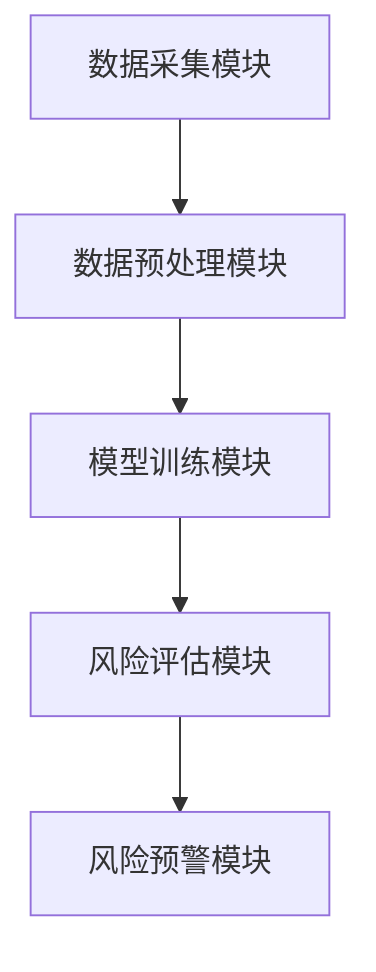
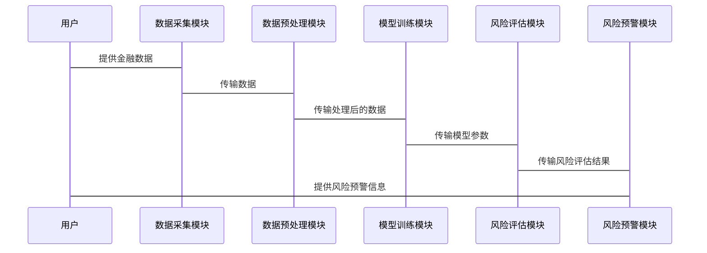

                 


```markdown
# 《金融领域图神经网络在系统性风险评估中的应用》

> 关键词：系统性风险，图神经网络，金融网络，风险传播，深度学习

> 摘要：  
随着金融市场的日益复杂化，系统性风险的评估和管理成为保障金融稳定的核心挑战。传统的方法在捕捉复杂金融网络中的风险传播机制方面存在局限性。本文深入探讨了图神经网络（Graph Neural Network, GNN）在系统性风险评估中的应用，从基本概念到算法实现，再到实际案例分析，系统地展示了如何利用图神经网络建模复杂的金融网络结构，评估系统性风险，并实现风险的实时监测与预警。通过理论与实践相结合，本文为金融领域的风险管理提供了新的思路和解决方案。

---

# 第一部分：金融领域系统性风险评估背景

# 第1章：系统性风险的基本概念

## 1.1 系统性风险的定义与特征

### 1.1.1 系统性风险的定义  
系统性风险是指由于整个金融系统的不稳定或外部冲击，导致多个金融机构或市场同时发生重大损失的风险。这种风险不同于个体风险，它影响的是整个金融体系的稳定性。

### 1.1.2 系统性风险的核心特征  
- **广泛性**：影响整个金融系统，而非单一机构或市场。
- **传染性**：风险可能通过金融机构之间的关联性迅速传播。
- **不可预测性**：系统性风险通常由复杂因素引发，难以通过传统模型完全捕捉。

### 1.1.3 系统性风险的传播机制  
系统性风险的传播机制主要包括直接传染和间接传染两种形式。直接传染是指金融机构之间直接的债务关系或交易关系导致的风险传播；间接传染则是通过市场、客户或资产的共享渠道进行传播。

---

## 1.2 传统系统性风险评估方法

### 1.2.1 VaR模型  
VaR（Value at Risk）是一种常用的风险度量方法，用于衡量资产在一定置信水平下的最大损失。然而，VaR模型仅关注单个资产或组合的风险，无法捕捉系统性风险的网络特征。

### 1.2.2 CVA模型  
CVA（Credit Value Adjustment）是一种用于评估信用风险的方法，考虑了交易对手违约的可能性。然而，CVA模型也难以全面捕捉系统性风险的复杂性。

### 1.2.3 传统方法的局限性  
- 传统模型通常基于假设条件，难以应对复杂的金融市场环境。
- 无法有效建模金融机构之间的复杂关联性。
- 缺乏对风险传播路径的动态捕捉能力。

---

## 1.3 图神经网络的优势

### 1.3.1 图神经网络的基本原理  
图神经网络是一种基于图结构的深度学习方法，能够有效处理节点之间的关系信息。它通过聚合邻居节点的信息，逐步传播特征，从而捕捉复杂的网络结构。

### 1.3.2 图神经网络在金融领域的应用前景  
- 能够建模金融机构之间的复杂关系，捕捉系统性风险的传播路径。
- 通过图嵌入技术，将复杂的金融网络转化为低维特征，便于分析和计算。
- 可以实现系统性风险的实时监测和预警。

### 1.3.3 图神经网络在系统性风险评估中的独特价值  
- 通过图结构建模，捕捉金融机构之间的关联性。
- 通过深度学习技术，自动提取风险传播的关键特征。
- 实现系统性风险的实时评估和动态监控。

---

## 1.4 本章小结  
本章介绍了系统性风险的基本概念、传统评估方法及其局限性，并重点阐述了图神经网络在系统性风险评估中的优势。图神经网络的独特价值在于其能够建模复杂的金融网络结构，并通过深度学习技术捕捉风险传播的关键特征。

---

# 第二部分：图神经网络的核心概念与原理

# 第2章：图神经网络的基本原理

## 2.1 图结构与节点表示

### 2.1.1 图的基本概念  
- **节点（Nodes）**：代表金融机构或其他金融实体。
- **边（Edges）**：代表金融机构之间的关联关系，通常带有权重。
- **图结构（Graph Structure）**：由节点和边组成，用于建模复杂的金融网络。

### 2.1.2 节点表示方法  
- **邻接矩阵（Adjacency Matrix）**：直接表示节点之间的连接关系。
- **嵌入向量（Embedding Vector）**：通过降维技术将节点表示为低维向量。
- **图嵌入（Graph Embedding）**：将整个图结构嵌入到低维空间中。

### 2.1.3 图嵌入技术  
- **节点嵌入**：通过算法生成每个节点的低维向量表示。
- **边嵌入**：通过边的权重信息生成边的向量表示。
- **图嵌入**：将整个图的结构信息嵌入到低维空间中，用于后续分析。

---

## 2.2 图神经网络的算法框架

### 2.2.1 GCN（Graph Convolutional Network）  
GCN是一种基于图卷积的网络结构，通过聚合邻居节点的信息，逐步传播特征。

### 2.2.2 GAT（Graph Attention Network）  
GAT通过注意力机制，动态调整邻居节点的权重，捕捉重要的关联关系。

### 2.2.3 GNN（Graph Neural Network）的通用框架  
GNN的通用框架结合了GCN和GAT的优点，支持多种图结构和特征传播方式。

---

## 2.3 图神经网络的训练与优化

### 2.3.1 图数据的预处理  
- 构建图结构：定义节点和边的关系。
- 数据清洗：处理缺失值和异常值。
- 数据归一化：对特征进行标准化处理。

### 2.3.2 模型训练策略  
- 使用深度学习框架（如TensorFlow或PyTorch）训练模型。
- 采用分层训练策略，逐步优化模型参数。

### 2.3.3 模型调优方法  
- 调整模型超参数，如学习率、层数等。
- 使用交叉验证评估模型性能。

---

## 2.4 本章小结  
本章详细介绍了图神经网络的基本原理，包括图结构、节点表示和算法框架。图神经网络通过建模复杂的金融网络结构，为系统性风险评估提供了强大的工具。

---

# 第三部分：图神经网络在金融系统性风险评估中的应用

# 第3章：金融系统的网络结构分析

## 3.1 金融机构之间的关系网络

### 3.1.1 金融机构的网络构建  
- 将金融机构作为节点，交易关系作为边，构建金融网络。
- 边的权重可以表示交易金额或关联强度。

### 3.1.2 金融机构之间的关联性分析  
- 使用图神经网络分析节点之间的关联性。
- 识别关键节点，评估网络的脆弱性。

### 3.1.3 金融网络的脆弱性评估  
- 通过图神经网络，评估网络的脆弱性。
- 识别易受攻击的关键节点。

---

## 3.2 金融市场中的系统性风险传播

### 3.2.1 系统性风险的传播路径  
- 通过图结构分析风险的传播路径。
- 使用图神经网络模拟风险传播过程。

### 3.2.2 系统性风险的节点影响分析  
- 评估每个节点对整个网络的影响。
- 识别风险传播的关键节点。

### 3.2.3 系统性风险的网络扩散模型  
- 建立数学模型描述风险传播过程。
- 使用图神经网络模拟风险的扩散路径。

---

## 3.3 图神经网络在金融网络中的应用案例

### 3.3.1 金融机构之间的关系建模  
- 使用图神经网络建模金融机构之间的关系。
- 通过图嵌入技术，提取节点特征。

### 3.3.2 金融市场中的风险传播模拟  
- 使用图神经网络模拟风险传播。
- 通过可视化工具展示风险传播路径。

### 3.3.3 系统性风险的实时监测与预警  
- 实时监控金融网络中的风险。
- 提供风险预警机制，及时采取应对措施。

---

## 3.4 本章小结  
本章通过图神经网络分析金融系统的网络结构，展示了如何建模金融机构之间的关系，并评估系统性风险的传播路径。图神经网络在金融系统性风险评估中的应用前景广阔。

---

# 第四部分：图神经网络的算法实现与系统设计

# 第4章：图神经网络的算法实现

---

## 4.1 算法实现

### 4.1.1 数据预处理  
- 使用Python构建图结构。
- 数据清洗和归一化处理。

### 4.1.2 模型训练  
- 使用深度学习框架训练GCN模型。
- 采用反向传播优化模型参数。

### 4.1.3 模型调优  
- 调整超参数，如学习率、层数等。
- 使用交叉验证评估模型性能。

---

## 4.2 系统架构设计

### 4.2.1 问题场景介绍  
- 构建金融网络，分析系统性风险。
- 实现实时风险评估与预警。

### 4.2.2 系统功能设计  
- 数据采集模块：采集金融机构之间的关系数据。
- 模型训练模块：训练图神经网络模型。
- 风险评估模块：评估系统性风险。
- 风险预警模块：提供风险预警信息。

### 4.2.3 系统架构图  


### 4.2.4 系统接口设计  
- 数据接口：定义数据输入格式。
- 模型接口：定义模型调用接口。
- 预警接口：定义预警信息输出接口。

### 4.2.5 系统交互流程  


---

## 4.3 项目实战

### 4.3.1 环境安装  
- 安装Python和必要的库（如TensorFlow、PyTorch、NetworkX等）。
- 安装图神经网络框架（如GCN、GAT等）。

### 4.3.2 核心实现  
```python
import tensorflow as tf
from tensorflow.keras import layers

class GCN(layers.Layer):
    def __init__(self, input_dim, hidden_dim, output_dim):
        super(GCN, self).__init__()
        self.embedding = layers.Dense(input_dim, activation='relu')
        self.conv = layers.Dense(hidden_dim, activation='relu')
        self.output = layers.Dense(output_dim)

    def call(self, inputs):
        x = self.embedding(inputs)
        x = self.conv(x)
        output = self.output(x)
        return output
```

### 4.3.3 代码应用解读与分析  
- 数据预处理：构建图结构，处理数据。
- 模型训练：训练GCN模型，优化模型参数。
- 实际案例分析：使用具体数据进行分析，展示风险评估结果。

---

## 4.4 本章小结  
本章详细讲解了图神经网络的算法实现和系统设计，展示了如何将理论应用于实际问题。通过具体的代码实现和系统架构设计，读者可以更好地理解图神经网络在金融系统性风险评估中的应用。

---

# 第五部分：最佳实践与小结

# 第5章：最佳实践与小结

## 5.1 最佳实践

### 5.1.1 数据质量管理  
- 确保数据的准确性和完整性。
- 处理缺失值和异常值。

### 5.1.2 模型选择  
- 根据具体场景选择合适的图神经网络模型。
- 结合实际情况调整模型参数。

### 5.1.3 模型调优  
- 优化模型性能，提高评估准确性。
- 使用交叉验证评估模型效果。

---

## 5.2 小结与展望

### 5.2.1 小结  
本文系统地介绍了图神经网络在金融系统性风险评估中的应用，从基本概念到算法实现，再到实际案例分析，全面展示了图神经网络的优势和价值。

### 5.2.2 展望  
未来的研究可以进一步探索多模态数据的融合、实时性优化等问题，为金融系统的风险管理提供更全面的解决方案。

---

# 作者信息

作者：AI天才研究院/AI Genius Institute & 禅与计算机程序设计艺术 /Zen And The Art of Computer Programming

---

感谢您的阅读！希望本文能为金融领域的系统性风险评估提供新的思路和解决方案。
```

