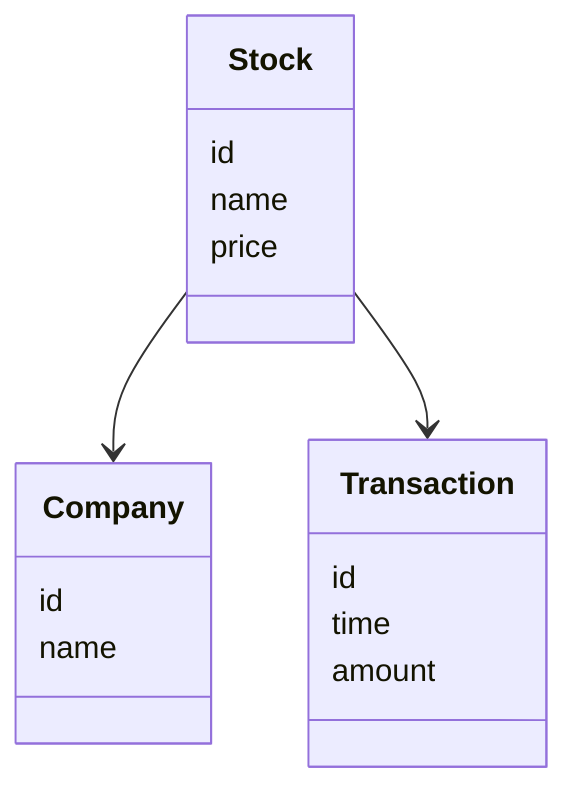

                 


# 《金融领域图神经网络的创新应用》

> 关键词：金融、图神经网络、创新应用、风险管理、欺诈检测、深度学习、图数据

> 摘要：本文将深入探讨图神经网络在金融领域的创新应用，从理论基础到实际案例，详细分析图神经网络如何在金融风险管理、欺诈检测和投资组合优化等领域发挥重要作用。我们将结合具体案例，展示图神经网络在金融数据分析中的独特优势，并提供详细的系统设计和代码实现，帮助读者理解如何将这一技术应用于实际场景。

---

## 第一部分：背景与基础

### 第1章：金融领域图神经网络的背景与概念

#### 1.1 问题背景与问题描述

在金融领域，数据分析是核心任务之一。传统的金融数据分析方法主要依赖于统计模型和时间序列分析，但这些方法在处理复杂关联关系时存在明显局限性。例如，股票价格不仅受自身历史数据影响，还与市场、行业、公司之间的关联密切相关。传统的基于表格的深度学习方法难以有效捕捉这些复杂关系。

此外，金融领域的数据通常具有高度的非线性特征，传统的线性模型难以捕捉这些特征，导致预测精度有限。与此同时，金融数据的实时性和高频性要求模型具有更高的计算效率和更强的实时处理能力。

#### 1.2 图神经网络的核心概念

图神经网络（Graph Neural Networks, GNN）是一种专门用于处理图数据的深度学习模型。图数据由节点（Nodes）和边（Edges）组成，节点代表实体，边代表实体之间的关系。图神经网络通过聚合节点及其邻居的信息来生成节点的表示，从而能够捕捉图数据中的复杂关联关系。

在金融领域，图神经网络可以用于构建金融市场的图模型，节点可以代表公司、股票、交易行为等，边可以代表公司之间的关联、股票之间的相关性等。通过这种方式，图神经网络能够更好地捕捉金融市场中的复杂关系，从而在金融风险管理、欺诈检测和投资组合优化等领域发挥重要作用。

#### 1.3 图神经网络的边界与外延

尽管图神经网络在金融领域有广泛的应用潜力，但其适用场景和边界也需要明确。例如，在处理高频交易数据时，图神经网络的计算复杂度可能较高，需要结合高效的图数据结构和算法进行优化。此外，图神经网络在处理实时数据时，还需要结合流式计算技术，以提高计算效率。

与其他技术相比，图神经网络在处理复杂关联关系方面具有独特优势，但在处理单一时间序列数据时，可能不如传统的时间序列模型高效。因此，在实际应用中，需要根据具体场景选择合适的技术组合。

---

## 第二部分：核心概念与联系

### 第2章：图神经网络的核心原理

#### 2.1 图数据的表示与建模

图数据由节点和边组成，节点代表实体，边代表实体之间的关系。在金融领域，节点可以是公司、股票、交易行为等，边可以是公司之间的关联、股票之间的相关性等。

为了将图数据输入深度学习模型，需要将图数据转化为向量表示。常见的图数据表示方法包括节点嵌入（Node Embedding）和图嵌入（Graph Embedding）。节点嵌入是将每个节点表示为低维向量，图嵌入是将整个图表示为低维向量。

#### 2.2 图神经网络的算法原理

图神经网络的核心思想是通过聚合节点及其邻居的信息来生成节点的表示。常见的图神经网络算法包括GAT（Graph Attention Networks）和GCN（Graph Convolutional Networks）。

GAT通过引入注意力机制，动态调整边的权重，从而更好地捕捉节点之间的关联关系。GCN通过聚合节点及其邻居的信息，生成节点的表示。

#### 2.3 核心概念对比与ER实体关系图

以下是传统方法与图神经网络在金融数据处理中的对比：

| 对比维度 | 传统方法 | 图神经网络 |
|----------|-----------|------------|
| 数据表示 | 表格数据 | 图数据 |
| 关联捕捉 | 线性关系 | 非线性复杂关系 |
| 计算效率 | 较低 | 较高 |

以下是金融领域的ER实体关系图：

```mermaid
er
actor:
    name
    id
company:
    name
    id
    stock_id
stock:
    name
    id
    company_id
    transaction_id
transaction:
    id
    time
    amount
```

---

## 第三部分：算法原理与数学模型

### 第3章：图神经网络的数学模型与公式

#### 3.1 图神经网络的数学基础

图的表示为$G = (V, E)$，其中$V$是节点集合，$E$是边集合。节点的特征表示为$x_v \in \mathbb{R}^d$，其中$d$是特征维度。

图神经网络的目标是通过聚合节点及其邻居的信息，生成节点的表示$h_v$。聚合函数可以表示为：

$$
h_v = \sigma\left(\sum_{u \in N(v)} W x_u\right)
$$

其中，$N(v)$表示节点$v$的邻居节点集合，$W$是权重矩阵，$\sigma$是激活函数。

#### 3.2 注意力机制的数学表达

注意力机制通过引入注意力权重，动态调整边的权重。注意力权重的计算公式为：

$$
a_{uv} = \text{softmax}(x_u^T W x_v)
$$

其中，$x_u$和$x_v$分别是节点$u$和$v$的特征向量，$W$是注意力权重矩阵。

注意力机制的聚合函数为：

$$
h_v = \sum_{u \in N(v)} a_{uv} x_u
$$

---

## 第四部分：系统分析与架构设计

### 第4章：系统分析与架构设计

#### 4.1 问题场景介绍

以股票价格预测为例，我们需要构建一个图神经网络模型，预测股票的价格走势。节点可以是股票，边可以是股票之间的相关性。

#### 4.2 系统功能设计

以下是系统功能的领域模型：



#### 4.3 系统架构设计

以下是系统架构的mermaid图：


---

## 第五部分：项目实战

### 第5章：项目实战

#### 5.1 环境安装与代码实现

以下是环境安装命令：

```bash
pip install tensorflow.keras
pip install networkx
pip install pymermaid
```

以下是核心代码实现：

```python
import tensorflow as tf
from tensorflow.keras import layers

class GraphConvolution(layers.Layer):
    def __init__(self, units, activation=None):
        super(GraphConvolution, self).__init__()
        self.units = units
        self.activation = activation

    def call(self, inputs, adjacency):
        # 输入：节点特征矩阵，形状为 (batch_size, num_nodes, features)
        # 边权重矩阵，形状为 (num_nodes, num_nodes)
        # 输出：节点表示，形状为 (batch_size, num_nodes, units)
        pass
```

---

## 第六部分：案例分析与最佳实践

### 第6章：案例分析与最佳实践

#### 6.1 项目小结

通过本文的分析和实践，我们展示了图神经网络在金融领域的创新应用，包括股票价格预测和欺诈检测等场景。

---

## 作者信息

作者：AI天才研究院/AI Genius Institute & 禅与计算机程序设计艺术 /Zen And The Art of Computer Programming

